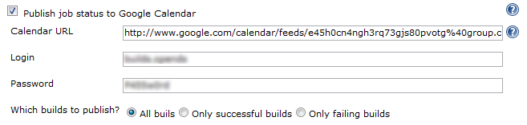

[.conf-macro .output-inline]# #

[.aui-icon .aui-icon-small .aui-iconfont-error .confluence-information-macro-icon]##

The current version of this plugin may not be safe to use. Please review
the following warnings before use:

* https://jenkins.io/security/advisory/2019-09-25/#SECURITY-1572[Credentials
stored in plain text]

[[GoogleCalendarPlugin-What'sthis?]]
== What's this?

This plugin publishes build records over to
http://www.google.com/calendar/[Google Calendar].

 +
[.confluence-embedded-file-wrapper .image-center-wrapper]## +

This plugin needs to know your calendar XML feed address to push data to
Google calendar. You can find this URL through the following steps:

. Go to Google Calendar
. Click the triangle icon on the right of the calendar you would like to
use
. Select "Calendar Settings"
. Click on either of the two XML buttons and copy the link

[[GoogleCalendarPlugin-Changelog]]
== Changelog

[[GoogleCalendarPlugin-Version0.4(2011/11/04)]]
=== Version 0.4 (2011/11/04)

* JENKINS-11617

[[GoogleCalendarPlugin-Version0.3(2009/12/28)]]
=== Version 0.3 (2009/12/28)

* Use password form field so password isn't visible
* Update uses of deprecated APIs

[[GoogleCalendarPlugin-Version0.2(2008/07/21)]]
=== Version 0.2 (2008/07/21)

* Metadata update only release to fix update center
(http://www.nabble.com/How-to-install-Locale-plugin--Google-calendar-plugin-is-installed-instead.-tt18564660.html[report])
