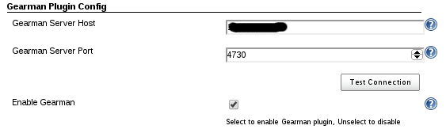
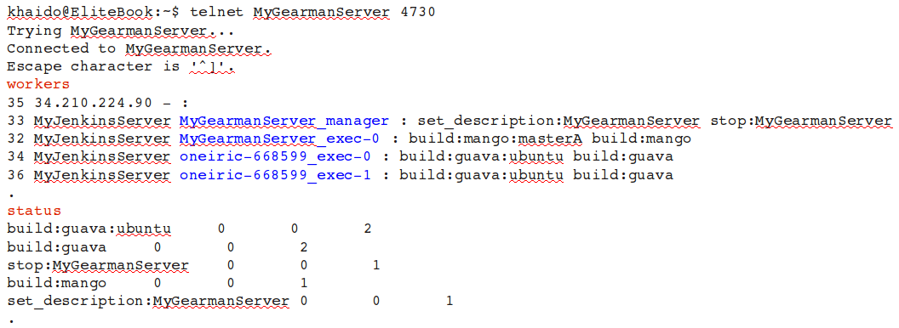
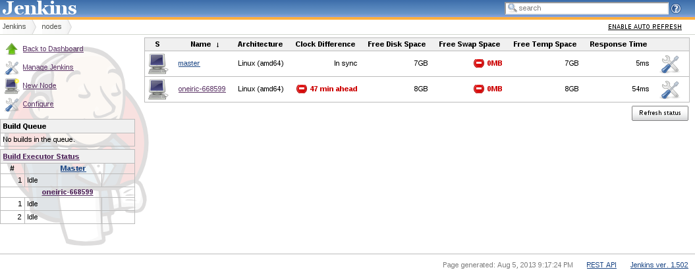
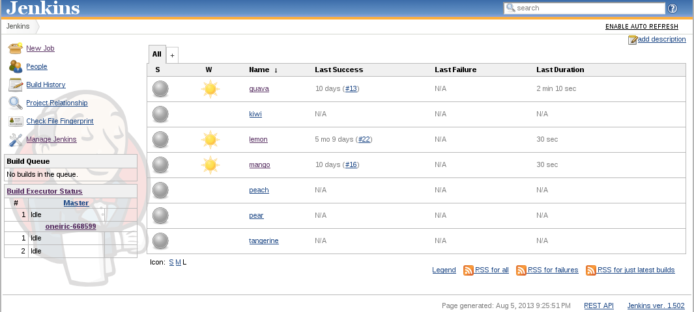
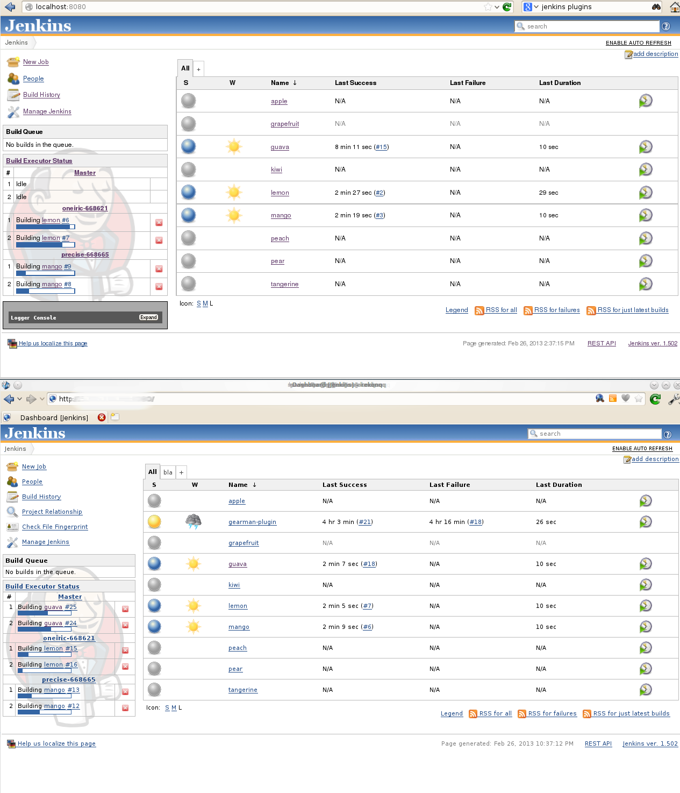

[.conf-macro .output-inline]##This plugin uses
http://www.gearman.org/[Gearman] to support multiple Jenkins
masters. ##[.conf-macro .output-inline]####

[cols="",options="header",]
|===
|Plugin Information
|View Gearman https://plugins.jenkins.io/gearman-plugin[on the plugin
site] for more information.
|===

[.aui-icon .aui-icon-small .aui-iconfont-error .confluence-information-macro-icon]##

The current version of this plugin may not be safe to use. Please review
the following warnings before use:

* https://jenkins.io/security/advisory/2019-04-03/#SECURITY-991[CSRF
vulnerability and missing permission check]

[[GearmanPlugin-**Thisprojectishostedongit.openstack.org**]]
== ***** This project is hosted on* *https://git.openstack.org/cgit/openstack-infra/gearman-plugin[git.openstack.org]* ******

[[GearmanPlugin-Summary]]
== *Summary*

We on Openstack infrastructure team use Jenkins extensively. Our jenkins
servers, at peak load, runs 20,000+ jobs per day.   At that load we
require many jenkins slaves (900+) to process all of those build jobs.
 We have found that our requirement was pushing Jenkins beyond it's
limits therefore we've decided to create the Gearman Plugin to support
multiple Jenkins masters.  The gearman plugin was designed to support
extra slaves, allow load balancing of build jobs, and provide
redundancy.  

Jenkins core does not support multiple masters.  You can setup multiple
Jenkins masters but there is no coordination between them.  One problem
with scheduling builds on Jenkins master (“MasterA”) server is that
MasterA only knows about its connected slaves.  If all slaves on MasterA
are busy then MasterA will just put the next scheduled build on the
jenkin server queue.  Now MasterA needs to wait for an available slave
to run the build.  This will be very in-efficient if your builds take a
long time to run.  So.. what if there is another Jenkins master
(“MasterB”) that has free slaves to service the next scheduled build on
the server's queue?  Your probably saying.. “Then slaves on MasterB
should run the build instead of waiting for slaves on MasterA to run
them”, then I would say "good thought!".  However MasterB will never
service the builds on MasterA's queue.  The client that schedules the
builds must know about MasterB and then schedule builds on MasterB. This
is what we mean by lack of coordination between masters. This 
gearman-plugin attempts to fill the gap.

This plugin integrates Gearman with Jenkins and will make it so that any
Jenkins slave on any Jenkins master can service a job in the queue.  
This plugin will essentially replace the Jenkins (master) build queue
with the Gearman job queue.  The job will stay in the Gearman queue
until there is a Jenkins node (master or slave) that can run that job.
 The gearman job queue is shared by multiple jenkins masters therefore
gearman can hand out jobs to the next available slave on any jenkins
master.

[[GearmanPlugin-Features]]
== *Features*

* High availability(ish).  When one master goes down the other master(s)
will continue to execute builds however the in flight jobs on the downed
master will be lost.
* Slaves are (by default) always shared between masters.  The only way
to un-share is to offline or disconnect a slave.
* Horizontal scalability.  Just continue to add more jenkins masters to
distribute the job load between masters.
* Gearman jobs can start a jenkins build
* Gearman jobs can stop or abort a jenkins build
* Gearman jobs can change a build description
* Gearman jobs can pass in parameters to jenkins builds
* Gearman jobs can automatically set a slave to offline after running a
build
* Gearman is aware of Jenkins project status: meaning that the gearman
plugin will register/unregister projects when the project is enabled or
disabled. 
* Gearman is aware of slave status: meaning thatthe  gearman will
register/unregister slaves when a slave is set online/offline and
connected/disconnected.
* Plugin reloads on jenkins restart: meaning that when jenkins restarts
the gearman worker threads are automatically restarted and reconnect to
a gearman server. 

[[GearmanPlugin-KnownIssues]]
== Known Issues

* Adding or removing executors on nodes will require restarting the
gearman plugin.  This is because Jenkins does NOT provide provide a way
to listen for changes to executors therefore the gearman plugin does not
know that it needs to re-register functions due to executor updates.
* The gearman plugin does NOT support Jenkins Matrix Projects.  The
gearman plugin relies on project and node labels to register functions
correctly.  Matrix projects use labels much differently than the
freestyle and maven projects.
* Since Jenkins 1.651.2, build parameters must explicitly defined in the
Jenkins job or whitelisted using system parameters, else they are strip
by Jenkins. See
https://wiki.jenkins-ci.org/display/SECURITY/Jenkins+Security+Advisory+2016-05-11
and this plugin issue:
https://issues.jenkins-ci.org/browse/JENKINS-34885

[[GearmanPlugin-GettingStarted]]
== *Getting Started*

This assumes some familiarity with Jenkins and
http://www.gearman.org/[Gearman]

[[GearmanPlugin-Install]]
== Install

* If you don't already have a Gearman server up and running somewhere
you should install one.  Theoretically the plugin should work with any
gearman server, but we've only used and tested it with the
https://pypi.python.org/pypi/gear[the python gear package].  Install
this gearman implementation and run the server.  NOTE: the python gear
implementation is only supported on Linux.  Specifically we run on
Ubuntu. 
* Install the Gearman plugin like any other Jenkins plugin, refer to the
Jenkins documentation.  You can also get the plugin directly from
the http://updates.jenkins-ci.org/download/plugins/gearman-plugin/[Jenkins
CI Repository]
* After installation the Gearman plugin the configuration should appear
in the Jenkins global configuration page.  Click on the help bubbles if
you need additional help with the configuration.  You should test the
connection to your Gearman Server before saving your configuration.
 Select the 'Enable Gearman' checkbox and click save button will
immediately start the gearman workers on the Jenkins server.  

[[GearmanPlugin-Configuration]]
== Configuration

[.confluence-embedded-file-wrapper]##

[[GearmanPlugin-Workflow]]
== Workflow

[[GearmanPlugin-StartingtheGearmanworkers:]]
=== *Starting the Gearman workers:*

. When the gearman plugin is enabled a gearman worker threads are
spawned for each executor on the master and slave nodes.  We'll call
these "executor worker threads". Each executor worker thread is
associated 1:1 with an executor on a jenkins node.
. We spawn one more  Gearman worker thread to handle job management
(i.e. abort job/update description/etc..).  We'll call it the
"management worker thread" and it will register a "stop:$hostname" and
"set_description:$hostname" function with the gearman server.  We use
these functions to manage jenkins builds.  
. The gearman plugin will register gearman a function for each Gearman
executor depending on the projects, labels and nodes that have been
setup on the Jenkins master. You can check the registered gearman
functions using the administration protocol.  It should look something
like this..

[.confluence-embedded-file-wrapper .image-center-wrapper]##

*Notes:*

. Red text denotes gearman admin commands
. Blue text denotes gearman workers.  There is a default manager worker
for the master and an executor worker for a jenkins executor on master.
 There are two gearman executor workers for oneiric-668599 slave (exec-0
& exec-1).  These executor workers map to two jenkins executors on the
oneiric-668599 slave.  
. Functions like "build:guava:ubuntu" map to
build:$projectName:$nodeLabel"

*Here's the corresponding Jenkins master UI:*

[.confluence-embedded-file-wrapper .image-center-wrapper]##

[.confluence-embedded-file-wrapper .image-center-wrapper]##

[[GearmanPlugin-SampleClients]]
=== *Sample Clients*

A gearman client can be written in any language.  Here are a few sample
clients that work with this plugin

* https://github.com/zaro0508/gearman-plugin-client[gearman-plugin-client] is
a simple test client (below examples use this client)

* http://git.openstack.org/cgit/openstack-infra/zuul[Zuul client] is the
smart client we use in
production. http://ci.openstack.org/zuul/zuul.html[Documentation] is
available as well.

* https://www.github.com/openstack-infra/gearman-plugin/tree/master/src/main/java/hudson/plugins/gearman/example[java
client] is a simple client included with jenkins-plugin.hpi

[[GearmanPlugin-RunningaJenkinsbuild]]
=== *Running a Jenkins build*

To  execute a Jenkins job the gearman client just needs to provide the
Gearman hostname, port, function, and UUID to start a jenkins build.   

Example:  

[source,syntaxhighlighter-pre]
----
python gear_client.py -s MyGearmanServer --function=build:myProject \
    --params='{"OFFLINE_NODE_WHEN_COMPLETE":"false","param1":"moon","param1":"sun"}'
----

[[GearmanPlugin-Stopping/abortingajenkinsbuild]]
=== *Stopping/aborting a jenkins build*

A Gearman request can stop/abort a jenkins build.  

Example: 

[source,syntaxhighlighter-pre]
----
python gear_client.py -s MyGearmanServer --function=stop:MyGearmanSever \
    --params='{"name":"myProject","number":"130"}'
----

The job is stopped differently depending on the current state of the
job.  The table below explains the state, transitions and when
cancellations happen.

[cols=",,",options="header",]
|===
|State |Transitions |Cancellation
|Gearman queue |Sending a job request to gearman puts it on the gearman
queue |the job is removed from the gearman queue

|Jenkins queue |jobs on the gearman queue will transition to the jenkins
queue |the job is removed from the Jenkins queue

|Jenkins executor |job on the jenkins queue transition to the jenkins
executor to run |the build is aborted while on the jenkins executor
|===

[[GearmanPlugin-Updatingabuilddescription]]
=== *Updating a build description*

You can send a gearman request to update a build's description.  To do
this you pass in the following parameters: name of project, build
number, description.  

Example:  

[source,syntaxhighlighter-pre]
----
python gear_client.py -s MyGearmanSever --function=set_description:MyGearmanSever \
    --params='{"name":"myProject","number":"105","html_description":"<h1>My New Description</h1>"}'
----

[[GearmanPlugin-Setslavetoofflineafterabuildcompletes]]
=== *Set slave to offline after a build completes*

Our infrastructure employees many 'single use slaves' so what we like to
do is run a job and then immediately set the slave offline.  You can do
this by passing in the parameter `+OFFLINE_NODE_WHEN_COMPLETE+`.

Example:  

[source,syntaxhighlighter-pre]
----
python gear_client.py -s MyGearmanSever --function=build:myProject \
    --params='{"OFFLINE_NODE_WHEN_COMPLETE":"true"}'
----

[[GearmanPlugin-ConfiguringMultipleJenkinsMasters]]
== Configuring Multiple Jenkins Masters

To configure the gearman plugin to work with multiple Jenkins masters
you will need to do following:

* Install the gearman plugin on each Jenkins Master and configure it to
connect to the Gearman server (steps above).
* Create the exact same jobs on each Jenkins master.  The
https://pypi.python.org/pypi/jenkins-job-builder[Jenkins Job Builder]
application is very handy for this purpose and it's what we use.

Now multiple Jenkins masters will be able to service the same jobs.

The typical workflow for this configuration is something like this:

. The Gearman workers, running on the Jenkins Masters, are waiting to
service the configured jenkins jobs 
. A Gearman client submits a request to the Gearman server to run a job.
. The Gearman server tells the Gearman worker(s) (on a Jenkins Master)
to execute the job(s).  
. The first Gearman worker that can service that request will execute
the job.  If all workers are busy then the request is placed on the
gearman queue to be processed when a gearman worker is available.
. The Gearman worker(s) continuously pull jobs off of the Gearman queue
and execute each job.  
. The Gearman worker reports the job result to the Gearman server when
complete.
. The Gearman server reports the job result back to the Gearman client.
. Loop back to step 1.

[[GearmanPlugin-Configurelogging]]
== *Configure logging*

Instructions to make the gearman plugin send log messages to the Jenkins
logger:

. goto http://host:8080/log/levels
. add "org.gearman.session.logger" with level "WARNING"
. goto http://host:8080/log/all

Now you should see logs from gearman plugin.

[[GearmanPlugin-PluginInAction]]
== *Plugin In Action*

[[GearmanPlugin-]]
== [.confluence-embedded-file-wrapper]##

[[GearmanPlugin-PluginInProduction]]
== Plugin In Production

The above images just show how the plugin might work in a simple case.
 To see the plugin used in production check out openstack jenkins
servers, yes that's servers with an s:

* http://jenkins01.openstack.org/[jenkins01] - we use this master to run
operational jobs
* http://jenkins02.openstack.org/[jenkins02] - we use this master to run
openstack project builds
* http://jenkins03.openstack.org/[jenkins03] - this is essentially a
mirror of jenkins01.

All of the above masters use this plugin which means all of them can run
any jobs that are sent to gearman server. We have lots of
http://ci.openstack.org/[documentation] on how we run the system in
production.  

[[GearmanPlugin-References]]
== References

* http://www.cloudbees.com/jenkins/juc2013/juc2013-palo-alto-abstracts.cb#KhaiDo[Presentation
and Slides @ JUC 2013]
* http://amo-probos.org/post/15[Scaling the opesntack environment]
* https://wiki.openstack.org/wiki/InfraTeam[Openstack infra wiki]

[[GearmanPlugin-Versions]]
== *Versions*

* 0.2.0
** Update for Jenkins 1.625.3 LTS and fix function registration.
** When function changes, only register the delta instead of registering
all functions for every node. This cut down the amount of CAN_DO update.
New connection reset the state via RESET_ABILITIES to ensure a proper
starting state.
* 0.1.3
** Send node labels back on build completion
* 0.1.2
** Fix race between adding job and registering
(https://issues.jenkins-ci.org/browse/JENKINS-25867)
** Fix deadlock from a WORK_FAIL event
(https://issues.jenkins-ci.org/browse/JENKINS-28891)
** Use TextParameterValue instead of String
(https://review.openstack.org/#/c/104386/)
** Stop sending status updates
(https://review.openstack.org/#/c/180249/)
** Protect against partially initialized executor workers
(https://review.openstack.org/#/c/145828/)
* 0.1.1
** Fix job result not being sent back to gearman client, check
http://git.openstack.org/cgit/openstack-infra/gearman-plugin/commit/?id=fa5f0834ff991e13a85cea6624a144432a328fea[commit
message] for more info. 
* 0.1.0
** Update to work with
http://mirrors.jenkins-ci.org/war-stable/1.565.3/[Jenkins LTS ver
1.565.3], check
http://git.openstack.org/cgit/openstack-infra/gearman-plugin/commit/?id=6307ba2225bbc9e8d4f41062bd6b944e40d7fa7a[commit
message] for more info.
* 0.0.7
** Fix project-node registration. If a node matches any project label,
register the generalized job and then also register it for each label in
the intersection of project labels and node labels.
** Supports Jenkins 1.502 to
http://mirrors.jenkins-ci.org/war-stable/1.532.2/[LTS 1.532.2]
* 0.0.6
** Fix function
registration https://bugs.launchpad.net/gearman-plugin/+bug/1253429[bug
1253429]
* 0.0.5
** Set a node offline even if there is an exception
** Always return WORK_COMPLETE when a build finishes regardless of the
result
* 0.0.4
** Don't wait for the worker thread to join
** remove restriction on slave to run single job at a time
** Use more fine-grained synchronization in GearmanProxy
** Rework starting/stopping executors
** moved python examples to jenkins wiki
** Add OFFLINE_NODE_WHEN_COMPLETE option
* 0.0.3
** ignore non-deterministic build failure and log it
* 0.0.2
** Bunch of fixes
** ability to cancel gearman jobs from it's queue
** ability to set jenkins job descriptions
* 0.0.1 - initial release.
