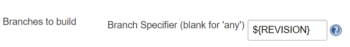
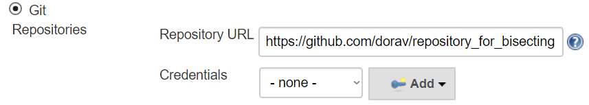
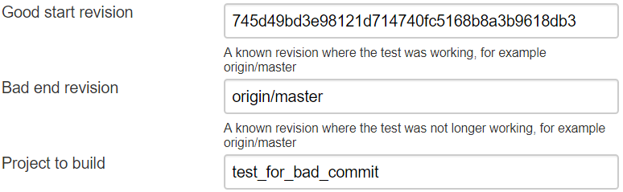
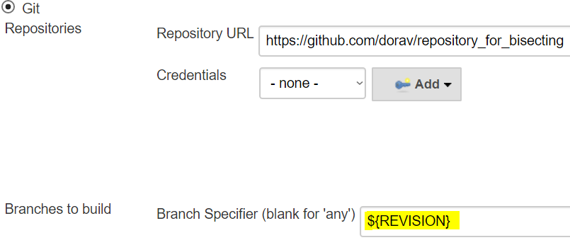
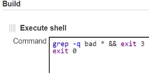

Git  bisect is a tool for running binary searches over a git repository.
If you want to read more about git bisect, you can
https://git-scm.com/docs/git-bisect[do it here].

This plugin helps with running git-bisect automatically in Jenkins.

[[GitBisect-TableOfContents]]
== Table Of Contents

[[GitBisect-Pre-Requirements]]
== Pre-Requirements

You need to:

* Be able to determine for each commit whether it's broken or not - in a
*single jenkins* job
** If your build is separated to two projects - build & test, you can
use a pipeline  +
and use that pipeline as a single build
* Use Git SCM, or be able to run arbitrary git commands in the workspace

[[GitBisect-Howtousethisplugin]]
== How to use this plugin

You need to have 2 Projects, let's call them *"Tester Project"* and
*"Bisect Project"*

[width="100%",cols="^17%,38%,45%",options="header",]
|===
|  |*Bisect Project* |*Tester Project*
|GitSCM a|
* Define it using the same git repository
* Must not be a shallow copy

a|
be able to checkout a revision using a parameter:

[.confluence-embedded-file-wrapper .confluence-embedded-manual-size]##

|Parameterized Build a|
* Any parameters defined will bubble down to the Tester Project

a|
* Must support a parameter for the choosing the revision, the default
name is 'REVISION'. It's configurable in the "Git Bisect" Build Step in
the Bisect Project

|Job Type a|
Can be either FreeStyleProject or a Pipeline Project

 

Use gitbisect in Pipeline projects.

|Can be either FreeStyleProject or a Pipeline Project
|===

[[GitBisect-ExampleConfiguration]]
== Example Configuration

[[GitBisect-BisectProject]]
=== Bisect Project

[.confluence-embedded-file-wrapper]##

[.confluence-embedded-file-wrapper .confluence-embedded-manual-size]##

[.confluence-embedded-file-wrapper .confluence-embedded-manual-size]##

 

[[GitBisect-TesterProject]]
=== Tester Project

[.confluence-embedded-file-wrapper .confluence-embedded-manual-size]##

[.confluence-embedded-file-wrapper .confluence-embedded-manual-size]##

[[GitBisect-Parameters]]
== Parameters

[[GitBisect-Goodstartrevision:]]
====== Good start revision: 

Used to specify a known good commit where the thing you are testing was
working properly. 

[[GitBisect-Badendrevision:]]
====== Bad end revision: 

Used to specify a revision where you know the thing you are testing
stopped working.

[[GitBisect-Projecttobuild:]]
====== Project to build: 

The project that is used to test each commit. If this project fails, the
revision will be marked as "bad". If this project succeeds, the revision
will be marked "good".

[[GitBisect-RevisionParameterName:]]
====== Revision Parameter Name: 

The parameter name used to pass the revision to the Tester Project.
Defaults to "REVISION", other common usage might be "COMMIT" or
"VERSION". 

[[GitBisect-SearchIdentifier:]]
====== Search Identifier:

This parameter is used to distinguish between two different bisections.
If the bisection stopped it can be resumed based on this identifier. 

[.underline]##*Note:*##** ** This is used as a file name inside the
jenkins master. You can interfere with the decisions this job makes, or
add revisions to ignore by editing this file. It can be found under the
project directory in jenkins, for example - 

[source,syntaxhighlighter-pre]
----
/var/jenkins/jobs/PROJECT_NAME/SEARCH_IDENTIFIER_1
----

[[GitBisect-RetryNumber:]]
====== Retry Number:

This parameter can be used if you have a flaky test or a flaky build
system. The revision won't be defined as 'bad' until it had failed this
number of times. Defaults to 0.

[[GitBisect-MinSuccessfulruns:]]
====== Min Successful runs:

This parameter can be used if you are looking for a flaky test. For
example, you are looking for a commit that causes your build to fail 1
out of 5 times. So you want to increase this number accordingly.
Defaults to 1.

[[GitBisect-Runasasinglecontinuesbuild]]
====== Run as a single continues build

If this is unchecked, the test job will only run once every build. This
gives you time to investigate between each run. Defaults to true.

[[GitBisect-OverrideGitCommand]]
====== Override Git Command

On some systems, git might not be defined in PATH or it's aliased to a
different command. You can tell the job where to find it.

[[GitBisect-Runninginapipeline]]
== Running in a pipeline

Running in a pipeline currently works, but it's harder to configure.

Make sure that before the gitbisect command is used, a "checkout" or
"git" command is present to set the repository.
