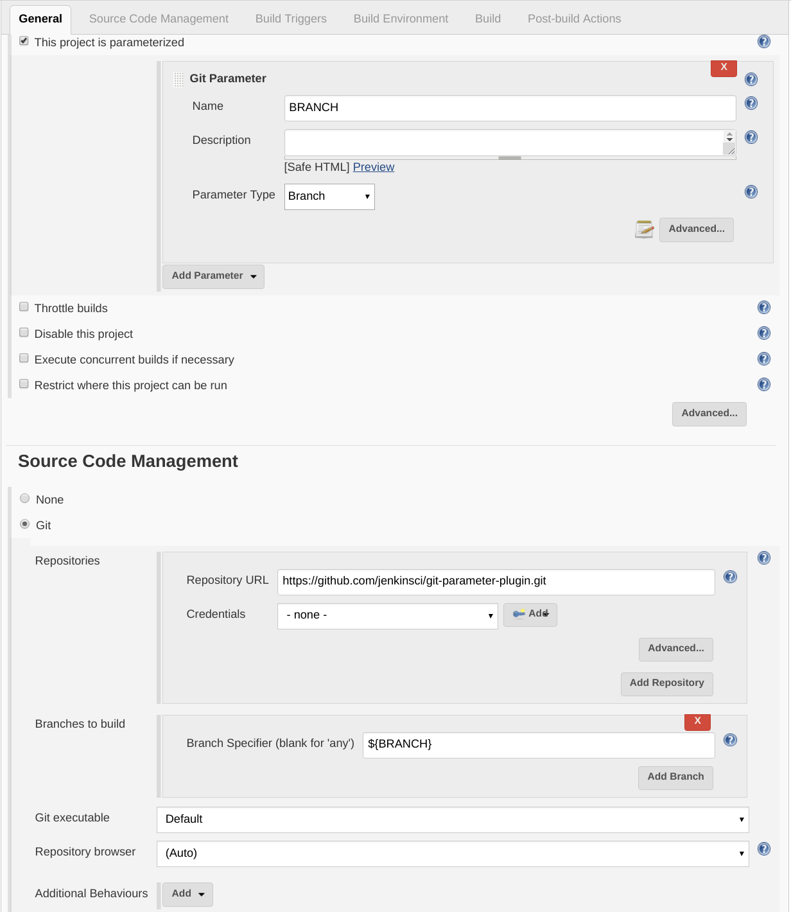
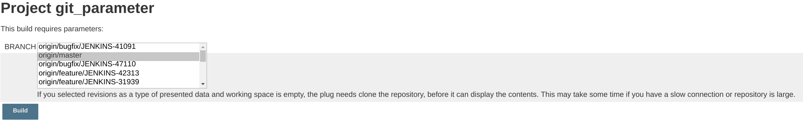
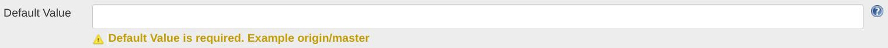
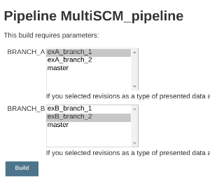
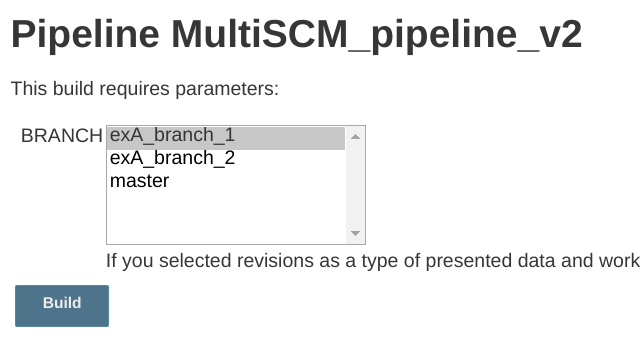
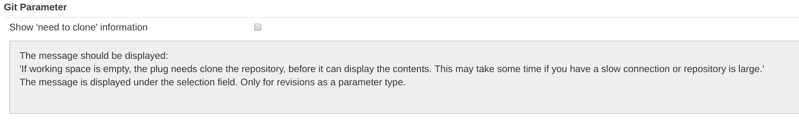
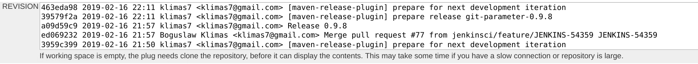
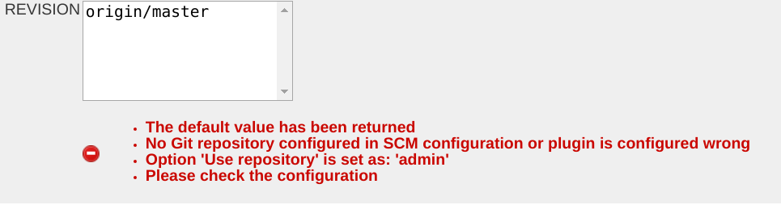
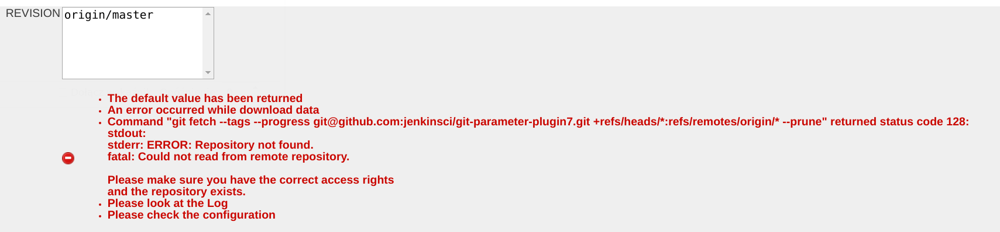
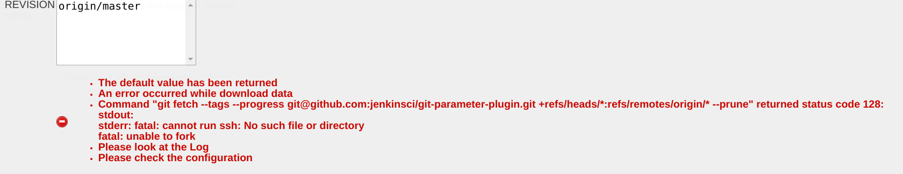

[[GitParameterPlugin-Addsabilitytochoosebranches,tagsorrevisionsfromgitrepositoryconfiguredinproject.]]
== Adds ability to choose branches, tags or revisions from git repository configured in project.

 +

[[GitParameterPlugin-PluginInfo]]
== Plugin Info

This plugin allows you to assign git branch, tag, pull request or
revision number as parameter in your  builds.

*Important!*  +
There is no need to set up anything special in plugin settings. +
_This plugin will read GIT SCM configuration from your projects._ +
This plugin used directly the
https://wiki.jenkins.io/display/JENKINS/Git+Plugin[Git Plugin] and
https://wiki.jenkins.io/display/JENKINS/Git+Client+Plugin[Git Client
Plugin].

[[GitParameterPlugin-Basicconfiguration]]
== Basic configuration

[[GitParameterPlugin-Projectconfiguration]]
=== Project configuration

[.confluence-embedded-file-wrapper .confluence-embedded-manual-size]##

[[GitParameterPlugin-BuildwithParametersform]]
=== http://xps15:8083/job/git_parameter/build?delay=0sec[Build with Parameters] form

[.confluence-embedded-file-wrapper .confluence-embedded-manual-size]##

[[GitParameterPlugin-Examplepipelinescript]]
== Example pipeline script

[[GitParameterPlugin-Important!version0.9.4orlater]]
=== Important! version 0.9.4 or later

[[GitParameterPlugin-Branchtype-Basicusage]]
=== Branch type - Basic usage +

*Pipeline: Branch type - Basic usage (Declarative Pipeline)*

[source,syntaxhighlighter-pre]
----
// Using git without checkout 
pipeline {
  agent any
  parameters {
    gitParameter branchFilter: 'origin/(.*)', defaultValue: 'master', name: 'BRANCH', type: 'PT_BRANCH'
  }
  stages {
    stage('Example') {
      steps {
        git branch: "${params.BRANCH}", url: 'https://github.com/jenkinsci/git-parameter-plugin.git'
      }
    }
  }
}
----

*Pipeline: Branch type - Basic usage (Scripted Pipeline)*

[source,syntaxhighlighter-pre]
----
properties([
    parameters([
        gitParameter(branch: '',
                     branchFilter: 'origin/(.*)',
                     defaultValue: 'master',
                     description: '',
                     name: 'BRANCH',
                     quickFilterEnabled: false,
                     selectedValue: 'NONE',
                     sortMode: 'NONE',
                     tagFilter: '*',
                     type: 'PT_BRANCH')
    ])
])
node {
    git branch: "${params.BRANCH}", url: 'https://github.com/jenkinsci/git-parameter-plugin.git'
}
----

 +

Important settings:

* It should be set a *default* value because initial build must get this
information
* Using *git* should be set a *branchFilter* as '_origin/(.*)_' (origin
is a remote server name)

[[GitParameterPlugin-Parametertype]]
==== Parameter type

* PT_TAG
* PT_BRANCH
* PT_BRANCH_TAG
* PT_REVISION
* PT_PULL_REQUEST

[[GitParameterPlugin-Important:Ifyouneeduseothertype(otherthenbranch)parameter,youmustusegitwithincheckout]]
==== Important: If you need use other type (other then branch) parameter, you must use git within _checkout_ 

[[GitParameterPlugin-Tagtype]]
=== Tag type

*Pipeline: Tag type*

[source,syntaxhighlighter-pre]
----
// Using git within checkout 
pipeline {
    agent any
    parameters {
        gitParameter name: 'TAG', 
                     type: 'PT_TAG',
                     defaultValue: 'master'
    }
    stages {
        stage('Example') {
            steps {
                checkout([$class: 'GitSCM', 
                          branches: [[name: "${params.TAG}"]], 
                          doGenerateSubmoduleConfigurations: false, 
                          extensions: [], 
                          gitTool: 'Default', 
                          submoduleCfg: [], 
                          userRemoteConfigs: [[url: 'https://github.com/jenkinsci/git-parameter-plugin.git']]
                        ])
            }
        }
    }
}
----

[[GitParameterPlugin-BranchTagtype]]
=== Branch Tag type

*Pipeline: Branch Tag type*

[source,syntaxhighlighter-pre]
----
pipeline {
    agent any
    parameters {
        gitParameter name: 'BRANCH_TAG', 
                     type: 'PT_BRANCH_TAG',
                     defaultValue: 'master'
    }
    stages {
        stage('Example') {
            steps {
                checkout([$class: 'GitSCM', 
                          branches: [[name: "${params.BRANCH_TAG}"]], 
                          doGenerateSubmoduleConfigurations: false, 
                          extensions: [], 
                          gitTool: 'Default', 
                          submoduleCfg: [], 
                          userRemoteConfigs: [[url: 'https://github.com/jenkinsci/git-parameter-plugin.git']]
                        ])
            }
        }
    }
}
----

[[GitParameterPlugin-Revisiontype]]
=== Revision type

*Pipeline: Revision type*

[source,syntaxhighlighter-pre]
----
pipeline {
    agent any
    parameters {
        gitParameter name: 'REVISION', 
                     type: 'PT_REVISION',
                     defaultValue: 'master'
    }
    stages {
        stage('Example') {
            steps {
                checkout([$class: 'GitSCM', 
                          branches: [[name: "${params.REVISION}"]], 
                          doGenerateSubmoduleConfigurations: false, 
                          extensions: [], 
                          gitTool: 'Default', 
                          submoduleCfg: [], 
                          userRemoteConfigs: [[url: 'https://github.com/jenkinsci/git-parameter-plugin.git']]
                        ])
            }
        }
    }
}
----

[[GitParameterPlugin-PullRequsttype]]
=== Pull Requst type

*Pipeline: Pull Requst type*

[source,syntaxhighlighter-pre]
----
pipeline {
    agent any
    parameters {
        gitParameter name: 'PULL_REQUESTS', 
                     type: 'PT_PULL_REQUEST',
                     defaultValue: '1',
                     sortMode: 'DESCENDING_SMART'
    }
    stages {
        stage('Example') {
            steps {
                checkout([$class: 'GitSCM', 
                branches: [[name: "pr/${params.PULL_REQUESTS}/head"]], 
                doGenerateSubmoduleConfigurations: false, 
                extensions: [], 
                gitTool: 'Default', 
                submoduleCfg: [], 
                userRemoteConfigs: [[refspec: '+refs/pull/*:refs/remotes/origin/pr/*', url: 'https://github.com/jenkinsci/git-parameter-plugin.git']]])
            }
        }
    }
}
----

[[GitParameterPlugin-Options:]]
== Options:

[[GitParameterPlugin-ParameterType]]
=== Parameter Type

*Name using in pipeline*

[source,syntaxhighlighter-pre]
----
type: 'PT_TAG' or 'PT_BRANCH' or 'PT_BRANCH_TAG' or 'PT_REVISION' or 'PT_PULL_REQUEST'
----

Explains about PT_TAG or PT_BRANCH or PT_BRANCH_TAG:

Plugin using https://git-scm.com/docs/git-ls-remote.html[git ls-remote]
command to get remote tags or branches, this solution was implemented
in  [.jira-issue .conf-macro .output-block]#
https://issues.jenkins-ci.org/browse/JENKINS-40232[[.aui-icon .aui-icon-wait .issue-placeholder]##
##JENKINS-40232] - [.summary]#Getting issue details...#
[.aui-lozenge .aui-lozenge-subtle .aui-lozenge-default .issue-placeholder]#STATUS#
# .  This has been done for performance reasons. The plugin does not
have to featch the repository before getting information

 +

In code plugin
https://github.com/jenkinsci/git-client-plugin/blob/9f2a3ec48e699222ce3034dfe14cdb319e563ed5/src/main/java/org/jenkinsci/plugins/gitclient/GitClient.java#L631[use]ing 
getRemoteReferences from GitClient, look implementation
in https://github.com/jenkinsci/git-client-plugin/blob/master/src/main/java/org/jenkinsci/plugins/gitclient/CliGitAPIImpl.java[CliGitAPIImpl] 

 +

[source,syntaxhighlighter-pre]
----
package org.jenkinsci.plugins.gitclient
//...

public interface GitClient {
//...
    Map<String, ObjectId> getRemoteReferences(String remoteRepoUrl, String pattern, boolean headsOnly, boolean tagsOnly) throws GitException, InterruptedException;
//...
}
----

 +

[[GitParameterPlugin-Branch]]
=== Branch

*Name using in pipeline*

[source,syntaxhighlighter-pre]
----
branch
----

 +

[[GitParameterPlugin-BranchFilter]]
=== Branch Filter

*Name using in pipeline*

[source,syntaxhighlighter-pre]
----
branchFilter
----

 +

[[GitParameterPlugin-TagFilter]]
=== Tag Filter

*Name using in pipeline*

[source,syntaxhighlighter-pre]
----
tagFilter
----

 +

[[GitParameterPlugin-SortMode]]
=== Sort Mode

*Name using in pipeline*

[source,syntaxhighlighter-pre]
----
sortMode: 'NONE' or 'ASCENDING_SMART' or 'DESCENDING_SMART' or 'ASCENDING' or 'DESCENDING'
----

 +

You can select the following sorting options for
tags/revision/branches/branches_or_tags/pull requests

* none
* descending
* ascending
* ascending smart
* descending smart

For the smart variants the compare treats a sequence of digits as a
single character. Contributed by Graeme Hill.

[[GitParameterPlugin-DefaultValue]]
=== Default Value

*Name using in pipeline*

[source,syntaxhighlighter-pre]
----
defaultValue
----

In release 0.9.9 or later good to set a default value, because this
value is using in the initial build (in Pipeline). +
Default value is returned when some error occurred on getting data.

[.confluence-embedded-file-wrapper .confluence-embedded-manual-size]##

[[GitParameterPlugin-SelectedValue]]
=== Selected Value

*Name using in pipeline*

[source,syntaxhighlighter-pre]
----
selectedValue: 'NONE' or 'TOP' or 'DEFAULT'
----

 +

[[GitParameterPlugin-Userepository]]
=== Use repository

*Name using in pipeline*

[source,syntaxhighlighter-pre]
----
useRepository
----

 +

*Remember: You don't set a git repository into the plugin, this plugin
using git repositories which are defined in project in SCM section!*

If in the task are defined multiple repositories, this option specifies
which the repository is taken into account on getting data. +
_If the option is not defined, is taken a first defined repository._ +
This option is a regular expression, which is compared to the
'Repository URL'.

You can define the multiple SCM for few way, you can use
https://wiki.jenkins-ci.org/display/JENKINS/Multiple+SCMs+Plugin[Multiple
SCMs Plugin], specified many 'Repository URL' in one SCM  or define them
in pipeline.

Consider an example based on two repositories:

* https://github.com/klimas7/exampleA.git
* https://github.com/klimas7/exampleB.git

 +

*Pipeline: Complex example*

[source,syntaxhighlighter-pre]
----
pipeline {
    agent any
    parameters {
        gitParameter branchFilter: 'origin.*/(.*)', defaultValue: 'master', name: 'BRANCH_A', type: 'PT_BRANCH', useRepository: '.*exampleA.git'
        gitParameter branchFilter: 'origin.*/(.*)', defaultValue: 'master', name: 'BRANCH_B', type: 'PT_BRANCH', useRepository: '.*exampleB.git'
        
    }
    stages {
        stage('Example') {
            steps {
                git branch: "${params.BRANCH_A}", url: 'https://github.com/klimas7/exampleA.git'
                git branch: "${params.BRANCH_B}", url: 'https://github.com/klimas7/exampleB.git'
            }
        }
    }
}
----

After initial run you get 

[.confluence-embedded-file-wrapper .confluence-embedded-manual-size]##

Example when 'Use repository' is not set:

*Pipeline: Use repository is not set*

[source,syntaxhighlighter-pre]
----
pipeline {
    agent any
    parameters {
        gitParameter branchFilter: 'origin.*/(.*)', defaultValue: 'master', name: 'BRANCH', type: 'PT_BRANCH'
    }
    stages {
        stage('Example') {
            steps {
                git url: 'https://github.com/klimas7/exampleA.git'
                git url: 'https://github.com/klimas7/exampleB.git'
            }
        }
    }
}
----

 After initial run you get 

[.confluence-embedded-file-wrapper .confluence-embedded-manual-size]##

[[GitParameterPlugin-QuickFilter]]
=== Quick Filter

*Name using in pipeline*

[source,syntaxhighlighter-pre]
----
quickFilterEnabled
----

 +

[[GitParameterPlugin-ListSize]]
=== List Size

*Name using in pipeline*

[source,syntaxhighlighter-pre]
----
listSize
----

 +

[[GitParameterPlugin-Globalconfiguration]]
== Global configuration

Release 0.9.9 or later

[.confluence-embedded-file-wrapper .confluence-embedded-manual-size]##

[.confluence-embedded-file-wrapper .confluence-embedded-manual-size]## +

[[GitParameterPlugin-Errorhandling]]
== Error handling

Release 0.9.9 or later

If an error occurred while retrieving data, the default value is
returned. +
Additional information is provided below, along with the cause of the
error.

Examples:

[.confluence-embedded-file-wrapper .confluence-embedded-manual-size]##

This error will occurred when repository is not configured or 'Use
repository' option no match with any repository.

[.confluence-embedded-file-wrapper .confluence-embedded-manual-size]##

This error will occurred when repository not exists or URL is wrong.

[.confluence-embedded-file-wrapper .confluence-embedded-manual-size]##

This error will occurred when is no ssh command on Jenkins master.

[[GitParameterPlugin-Releasesschedule]]
== Releases schedule

?

[[GitParameterPlugin-Changelog]]
== Changelog

[[GitParameterPlugin-17/06/2019Version0.9.11]]
=== 17/06/2019 Version 0.9.11

*  [.jira-issue .conf-macro .output-block]#
https://issues.jenkins-ci.org/browse/JENKINS-57879[[.aui-icon .aui-icon-wait .issue-placeholder]##
##JENKINS-57879] - [.summary]#Getting issue details...#
[.aui-lozenge .aui-lozenge-subtle .aui-lozenge-default .issue-placeholder]#STATUS#
#
*  [.jira-issue .conf-macro .output-block]#
https://issues.jenkins-ci.org/browse/JENKINS-51512[[.aui-icon .aui-icon-wait .issue-placeholder]##
##JENKINS-51512] - [.summary]#Getting issue details...#
[.aui-lozenge .aui-lozenge-subtle .aui-lozenge-default .issue-placeholder]#STATUS#
#  
*  [.jira-issue .conf-macro .output-block]#
https://issues.jenkins-ci.org/browse/JENKINS-50711[[.aui-icon .aui-icon-wait .issue-placeholder]##
##JENKINS-50711] - [.summary]#Getting issue details...#
[.aui-lozenge .aui-lozenge-subtle .aui-lozenge-default .issue-placeholder]#STATUS#
#
*  [.jira-issue .conf-macro .output-block]#
https://issues.jenkins-ci.org/browse/JENKINS-52051[[.aui-icon .aui-icon-wait .issue-placeholder]##
##JENKINS-52051] - [.summary]#Getting issue details...#
[.aui-lozenge .aui-lozenge-subtle .aui-lozenge-default .issue-placeholder]#STATUS#
#

[[GitParameterPlugin-16/02/2019Version0.9.9]]
=== 16/02/2019 Version 0.9.9

* https://issues.jenkins-ci.org/browse/JENKINS-55769[JENKINS-55769]: Tag
match filter shows more entries than direct command (git tag -l
"$tagFilter")
* https://issues.jenkins-ci.org/browse/JENKINS-55770[JENKINS-55770]: Intrusive
and misleading warning text from the parameter selection display
* https://issues.jenkins-ci.org/browse/JENKINS-54359[JENKINS-54359]: Change
error handling

[[GitParameterPlugin-09/10/2018Version0.9.6]]
=== 09/10/2018 Version 0.9.6

* https://issues.jenkins-ci.org/browse/JENKINS-53911[JENKINS-53911]: Duplicate
entries in list, if git repo is checked out twice.
* https://issues.jenkins-ci.org/browse/JENKINS-52533[JENKINS-52533]: Display
commit message on the build action
* https://issues.jenkins-ci.org/browse/JENKINS-45925[JENKINS-45925]: Show
git commit message when building with parameter "revision"

[[GitParameterPlugin-17/09/2018Version0.9.5]]
=== 17/09/2018 Version 0.9.5

* https://issues.jenkins-ci.org/browse/JENKINS-51041[JENKINS-51041], https://issues.jenkins-ci.org/browse/JENKINS-50510[JENKINS-50510], https://issues.jenkins-ci.org/browse/JENKINS-45419[JENKINS-45419]: Fixed
use repository option

[[GitParameterPlugin-16/08/2018Version0.9.4]]
=== 16/08/2018 Version 0.9.4

* https://issues.jenkins-ci.org/browse/JENKINS-52273[JENKINS-52273]: Support
git-parameter-plugin in declarative pipeline
* https://issues.jenkins-ci.org/browse/JENKINS-52132[JENKINS-52132]:
Description with HTML support +

[[GitParameterPlugin-20/06/2018Version0.9.3]]
=== 20/06/2018 Version 0.9.3

* https://issues.jenkins-ci.org/browse/JENKINS-51521[JENKINS-51521]: Git
parameter does not show branch list in case deleteDir() is present in
pipeline
* https://issues.jenkins-ci.org/browse/JENKINS-51476[JENKINS-51476]: Git
parameter plugin is not retrieving revision number +

[[GitParameterPlugin-16/04/2018Version0.9.2]]
=== 16/04/2018 Version 0.9.2

* https://issues.jenkins-ci.org/browse/JENKINS-50776[JENKINS-50776]:
Default selected item doesn’t always honor exactly Default Value
* https://issues.jenkins-ci.org/browse/JENKINS-49727[JENKINS-49727]: Add
optional parameter to specify the number of items the list will display 

[[GitParameterPlugin-18/02/2018Version0.9.1]]
=== 18/02/2018 Version 0.9.1

* https://issues.jenkins-ci.org/browse/JENKINS-45419[JENKINS-45419]: 'Use
Repository' setting does not find other remote urls if multiple repos
are added to job
* https://github.com/jenkinsci/git-parameter-plugin/pull/55[PR #55]: Add
complete French support

[[GitParameterPlugin-02/11/2017Version0.9.0]]
=== 02/11/2017 Version 0.9.0

* https://issues.jenkins-ci.org/browse/JENKINS-47110[JENKINS-47110]: Retrieving
Git references do not work with variable in Repository URL
* https://github.com/jenkinsci/git-parameter-plugin/pull/54[PR
#54]: Help improvement: complete English translation, and reorder items
* https://issues.jenkins-ci.org/browse/JENKINS-47078[JENKINS-47078]: IndexOutOfBoundsException
for pipeline job
* https://issues.jenkins-ci.org/browse/JENKINS-39530[JENKINS-39530]: Add
support to Pipeline projects

[[GitParameterPlugin-04/09/2017Version0.8.1]]
=== 04/09/2017 Version 0.8.1

* https://issues.jenkins-ci.org/browse/JENKINS-46216[JENKINS-46216]: Null
Pointer exception when no default parameter provided
* https://issues.jenkins-ci.org/browse/JENKINS-45577[JENKINS-45577]: [Git
Parameter Plugin] Parameter does not support the definition from CLI
* https://issues.jenkins-ci.org/browse/JENKINS-46624[JENKINS-46624]: fix
remote name
* https://issues.jenkins-ci.org/browse/JENKINS-46185[JENKINS-46185]: Set
browser focus to filter after the QuickFilter has been filled
* https://issues.jenkins-ci.org/browse/JENKINS-46038[JENKINS-46038]: Extend
list of supported type with pull request
* https://issues.jenkins-ci.org/browse/JENKINS-26799[JENKINS-26799]:
Multiple SCMs plugin support part 3 (Work fine when selected revisions)
* https://issues.jenkins-ci.org/browse/JENKINS-42313[JENKINS-42313]: Default
Value not honoured

[[GitParameterPlugin-02/06/2017Version0.8.0]]
=== 02/06/2017 Version 0.8.0

* https://issues.jenkins-ci.org/browse/JENKINS-26799[JENKINS-26799]:
Multiple SCMs plugin support part 2
* https://issues.jenkins-ci.org/browse/JENKINS-40523[JENKINS-40523]:
Include Jenkins Project Name in Log message
* https://issues.jenkins-ci.org/browse/JENKINS-40232[JENKINS-40232]: Git
Parameter Plugin doesn't need to clone

[[GitParameterPlugin-23/01/2017Version0.7.2]]
=== 23/01/2017 Version 0.7.2

* https://issues.jenkins-ci.org/browse/JENKINS-41091[JENKINS-41091]:
git-parameter:0.7.1 breaks the multi-line parameters in rebuild

[[GitParameterPlugin-11/27/2016Version0.7.1]]
=== 11/27/2016 Version 0.7.1

* https://issues.jenkins-ci.org/browse/JENKINS-39366[JENKINS-39366]: Add
support for a rebuild-plugin
* https://issues.jenkins-ci.org/browse/JENKINS-26799[JENKINS-26799]:
Multiple SCMs plugin support

[[GitParameterPlugin-09/12/2016Version0.7.0]]
=== 09/12/2016 Version 0.7.0

* https://issues.jenkins-ci.org/browse/JENKINS-37555[JENKINS-37555]:
Better support for internationalization
* https://issues.jenkins-ci.org/browse/JENKINS-37595[JENKINS-37595]: Add
support for polish localization
* https://issues.jenkins-ci.org/browse/JENKINS-37370[JENKINS-37370]:
Retrieving Git references do not work with variable in "Repository URL"
* https://issues.jenkins-ci.org/browse/JENKINS-37953[JENKINS-37953]: Add
support to ProxySCM
* https://issues.jenkins-ci.org/browse/JENKINS-37738[JENKINS-37738]:
Update dependency in plugin and cleanup in pom
* https://issues.jenkins-ci.org/browse/JENKINS-34876[JENKINS-34876]: Git
Parameters not working for Pipeline projects and Jenkinsfile from SCM

[[GitParameterPlugin-08/06/2016Version0.6.2]]
=== 08/06/2016 Version 0.6.2

* https://issues.jenkins-ci.org/browse/JENKINS-36833[JENKINS-36833]:
Race Condition Populating Multiple Tag Parameters
* https://issues.jenkins-ci.org/browse/JENKINS-36934[JENKINS-36934]: No
return value passed to the url
* https://issues.jenkins-ci.org/browse/JENKINS-31939[JENKINS-31939]: The
top value is better to be chosen by default of to have such option (part
3)

[[GitParameterPlugin-07/19/2016Version0.6.1]]
=== 07/19/2016 Version 0.6.1

* https://issues.jenkins-ci.org/browse/JENKINS-31939[JENKINS-31939]: The
top value is better to be chosen by default of to have such option (part
2)

[[GitParameterPlugin-07/06/2016Version0.6.0]]
=== 07/06/2016 Version 0.6.0

* https://issues.jenkins-ci.org/browse/JENKINS-36104[JENKINS-36104]: Add
Repo SCM support (Derron Hu)
* https://issues.jenkins-ci.org/browse/JENKINS-16290[JENKINS-16290]: git
parameter plugin doesn't support Jenkins slave setup with git repos
checked out only on slaves
* https://issues.jenkins-ci.org/browse/JENKINS-35363[JENKINS-35363]: Git
parameter filter doesn't work

[[GitParameterPlugin-05/03/2016Version0.5.1]]
=== 05/03/2016 Version 0.5.1

* https://issues.jenkins-ci.org/browse/JENKINS-34425[JENKINS-34425]: Git
parameter plugin skips one build number while populating tags
* https://issues.jenkins-ci.org/browse/JENKINS-34544[JENKINS-34544]: NPE
After update to 0.5.0
* https://issues.jenkins-ci.org/browse/JENKINS-34574[JENKINS-34574]:
After cleaned workspace doesn't show branches

[[GitParameterPlugin-04/02/2016Version0.5.0]]
=== 04/02/2016 Version 0.5.0

{empty}1. User interface

* https://issues.jenkins-ci.org/browse/JENKINS-27435[JENKINS-27435]:
Quick branch filter (Thank Bruno P. Kinoshita for inspiration)
* https://issues.jenkins-ci.org/browse/JENKINS-33963[JENKINS-33963]:
Branch filter does not save the value (part of the work Joe Hansche)

{empty}2. Refactor/fix/feature

* https://issues.jenkins-ci.org/browse/JENKINS-33361[JENKINS-33361]:
Long release number in branch, tag or revision name
* https://issues.jenkins-ci.org/browse/JENKINS-33084[JENKINS-33084]: Git
Parameter plugin should prune stale remote branches (@darashenka)
* https://issues.jenkins-ci.org/browse/JENKINS-31939[JENKINS-31939]: The
top value is better to be chosed by default of to have such option
* https://issues.jenkins-ci.org/browse/JENKINS-33831[JENKINS-33831]:
Revision Parameter Type: ArrayIndexOutOfBoundsException
* https://issues.jenkins-ci.org/browse/JENKINS-33912[JENKINS-33912]:
Refactoring Test Case

[[GitParameterPlugin-01/16/2015Version0.4.0]]
=== 01/16/2015 Version 0.4.0

* Possibility to select branch, tag or branch (Alban Dericbourg)
* Keep complex logics in jelly as less as possible (Yestin Sun)
* support folders (Nicolas De Loof)
* Minimized pom.xml as suggested by Jesse Glick
* Removed LICENSE.txt as suggested by Jesse Glick

[[GitParameterPlugin-05/14/14Version0.3.2]]
=== 05/14/14 Version 0.3.2

User visible changes are:

* Updated help texts for configuration and when selecting your
tag/revision
* Runs a fetch each time the user enters the "Build with parameter".
* Run clone when fetch fails on workspace empty (Gabor Liptak)
* Merging SortMode from graeme-hill
* With an empty workspace the tags are calculated after we made a
checkout. This may take a long time.

Changes relevant to developer

* Added MIT-LICENSE.txt to use the same license as Jenkins-CI.
* Added Contributors.textile
* Display month not minutes in date. Add HH.mm. Display only first 8
chars of SHA1 (Niklaus Giger)
* Add backup pluginRepository (Gabor Liptak)
* Use GitTool to query configured location of the git executable
(gliptak)
* Upgrade to git 2.2.0. (christ66)
* Build against latest stable Jenkins-CI version 1.554.1
* New co-maintainer/developer Niklaus Giger (id ngiger)
* Version 0.3 and 0.3.1 never made it to the distribution, because of
problems with the release mechanism.

[[GitParameterPlugin-02/21/12Version0.2]]
=== 02/21/12 Version 0.2

* Corrected error - plugin wasn't showing anything after change of main
Git Plugin
* Corrected major dis-functionality - plugin now it showing revisions
only from correct job/project.
* Adding support for choosing branch from which revisions/tags are
returned

[[GitParameterPlugin-11/01/11Version0.1]]
=== 11/01/11 Version 0.1

* Initial Release

 +

 +

Adds ability to choose branches, tags or revisions from git repositories
configured in project.
