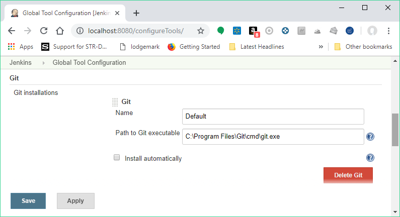
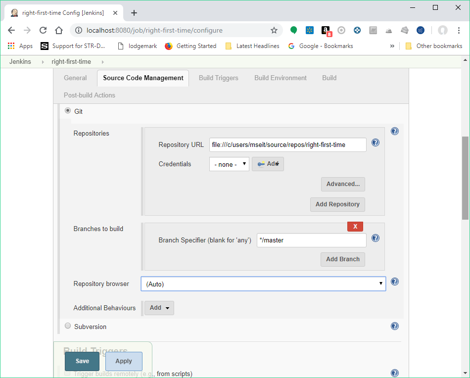

[.conf-macro .output-inline]# #

[.aui-icon .aui-icon-small .aui-iconfont-info .confluence-information-macro-icon]##

Older versions of this plugin may not be safe to use. Please review the
following warnings before using an older version:

* https://jenkins.io/security/advisory/2017-07-10/[CSRF vulnerability in
Git plugin allows capturing credentials]
* https://jenkins.io/security/advisory/2019-01-28/#SECURITY-1095[CSRF
vulnerability]
* https://jenkins.io/security/advisory/2018-06-04/#SECURITY-810[Server-side
request forgery]
* https://jenkins.io/security/advisory/2018-02-26/#SECURITY-723[Users
without Overall/Read are able to access lists of user names and node
names]

[.conf-macro .output-inline]#This plugin allows use of
http://git-scm.com/[Git] as a build SCM, including repository browsers
for several providers. A recent Git runtime is required (1.7.9 minimum,
1.8.x recommended). Interaction with the Git runtime is performed by the
use of the
https://wiki.jenkins-ci.org/display/JENKINS/Git+Client+Plugin[Git Client
Plugin], which is only tested on official http://git-scm.com/[git
client]. Use exotic installations at your own risk.#

[[GitPlugin-Configuration]]
== Configuration

[[GitPlugin-GlobalSettings]]
=== Global Settings

In the `+Configure System+` page, the Git Plugin provides the following
options

* *Global Config* `+user.name+` *Value*: if provided
`+git config user.name <value>+` is called before builds. This can be
overridden by individual projects.
* *Global Config* `+user.email+` *Value*: if provided
`+git config user.email <value>+` is called before builds. This can be
overridden by individual projects.
* *Create new accounts base on author/committer's email*: if checked,
upon parsing of git change logs, new user accounts are created on demand
for the identified committers / authors in the internal Jenkins
database. The e-mail address is used as the id of the account.

Pipeline Scripts

[.aui-icon .aui-icon-small .aui-iconfont-error .confluence-information-macro-icon]#
#

Please note that these config variables are not passed through to
Pipeline jobs [.jira-issue .conf-macro .output-block]#
https://issues.jenkins-ci.org/browse/JENKINS-43563[[.aui-icon .aui-icon-wait .issue-placeholder]##
##JENKINS-43563] - [.summary]#Getting issue details...#
[.aui-lozenge .aui-lozenge-subtle .aui-lozenge-default .issue-placeholder]#STATUS#
# So this configuration will need to be added in the job if you wish to
make git commits

 +

[[GitPlugin-ProjectConfiguration]]
=== Project Configuration

At the project level the Git Plugin is configured by selecting the *Git*
option at the *Source Code Management* section.

The main section is *Repositories* where several can be configured. The
information to provide include:

* The *Repository URL*, which is mandatory. The URL uses the same syntax
as the git clone command. This can be a URL or a local file path. Note
that for super-projects (repositories with submodules), only a local
file path or a complete URL is valid.
** The following are examples of valid git URLs.
*** `+ssh://git@github.com/org-name/project-name.git+`
*** `+git@github.com:org-name/project.git+` (short notation for ssh
protocol)
*** `+ssh://user@other.host.com/~/repos/R.git+` (to access the
\{`+repos/R.git+` repository in the user's home directory)
*** `+https://github.com/github/git.git+`
*** `+git://github.com/org-name/project.git+`
** If the repository is a super-project, the location from which to
clone submodules is dependent on whether the repository is bare or
non-bare (i.e. has a working directory).
*** If the super-project is bare, the location of the submodules will be
taken from `+.gitmodules+`.
*** If the super-project is *not* bare, it is assumed that the
repository has each of its submodules cloned and checked out
appropriately. Thus, the submodules will be taken directly from a path
like `+${SUPER_PROJECT_URL}/${SUBMODULE+`}, rather than relying on
information from `+.gitmodules+`.
** For a local URL/path to a super-project,
`+git rev-parse --is-bare-repository+` is used to detect whether the
super-project is bare or not.
** For a remote URL to a super-project, the ending of the URL determines
whether a bare or non-bare repository is assumed:
*** If the remote URL ends with `+/.git+`, a non-bare repository is
assumed.
*** If the remote URL does NOT end with `+/.git+`, a bare repository is
assumed.
* *Credentials*: Credentials to use to connect to the repository (unless
anonymous access is allowed), using the Jenkins Credentials Management
functionality. The type of credentials used depends on the underlying
protocol. For SSH connections only private key authentication is
supported.

The next section is *Branches to Build* in which several branch
specifiers can be provided. For each of these specs, leaving it blank
means that all branches will be examined for changes and built. The
safest way is to use the refs/heads/<branchName> syntax. This way the
expected branch is unambiguous. See the online help for more options.

A *Repository Browser* can also be configured, which adds links in
"changes" views within Jenkins to an external system for browsing the
details of those changes. The "Auto" selection attempts to infer the
repository browser from other jobs, if supported by the SCM and a job
with matching SCM details can be found, though it can also be selected
manually.

Finally, the Git Plugin is extensible and the plugin itself as well as
external plugins can provide *Additional Behaviours* to tweak the SCM
configuration inside each particular project. Please refer to the online
help of each of the additional options for further information.

[[GitPlugin-Bugs]]
== Bugs

* Check the
http://issues.jenkins-ci.org/secure/IssueNavigator.jspa?mode=hide&reset=true&jqlQuery=project+%3D+JENKINS+AND+status+in+(Open%2C+%22In+Progress%22%2C+Reopened)+AND+component+%3D+%27git-plugin%27[open
issues] carefully to see if the issue has already been reported
* http://issues.jenkins-ci.org/secure/CreateIssueDetails.jspa?pid=10172&issuetype=1&components=15543&priority=3[Create
an issue] if needed, and make sure to choose the *git-plugin*
sub-component.  Make sure to mention the plugin version number in the
issue description.

*Note*: Source code can be found at
https://github.com/jenkinsci/git-plugin.

[[GitPlugin-Gotchas]]
== Gotchas

* If you are seeing output indicating Git could not clone, something
like the output below, go to to the Jenkins configuration settings (not
the project settings, the global ones) and change the Git path to a
fully qualified path (eg. not "git" but "/usr/bin/git" or wherever your
Git binary is installed). You should also verify that the permissions
are correct if you are doing a file system based clone.

[source,syntaxhighlighter-pre]
----
Started by user anonymous
Checkout:workspace / C:\Documents and Settings\Administrator\.hudson\jobs\watir\workspace - hudson.remoting.LocalChannel@1a1f370
Last Build : #4
Checkout:workspace / C:\Documents and Settings\Administrator\.hudson\jobs\watir\workspace - hudson.remoting.LocalChannel@1a1f370
Cloning the remote Git repository
Cloning repository origin
$ git clone -o origin git://github.com/bret/watir.git "C:\Documents and Settings\Administrator\.hudson\jobs\watir\workspace"
Trying next repository
ERROR: Could not clone from a repository
FATAL: Could not clone
hudson.plugins.git.GitException: Could not clone
    at hudson.plugins.git.GitSCM$2.invoke(GitSCM.java:400)
    at hudson.plugins.git.GitSCM$2.invoke(GitSCM.java:358)
    at hudson.FilePath.act(FilePath.java:676)
    at hudson.FilePath.act(FilePath.java:660)
    at hudson.plugins.git.GitSCM.checkout(GitSCM.java:358)
    at hudson.model.AbstractProject.checkout(AbstractProject.java:833)
    at hudson.model.AbstractBuild$AbstractRunner.checkout(AbstractBuild.java:314)
    at hudson.model.AbstractBuild$AbstractRunner.run(AbstractBuild.java:266)
    at hudson.model.Run.run(Run.java:948)
    at hudson.model.Build.run(Build.java:112)
    at hudson.model.ResourceController.execute(ResourceController.java:93)
    at hudson.model.Executor.run(Executor.java:118)
----

* You may need to tell Git the user Jenkins is running as. Such user is
probably tomcat6, but you can easily find out by creating an empty job
and entering "whoami" in an "execute shell" build step, then running the
job and looking at the console output for the username. Once you have
the name, on a Linux/Unix system switch to that user by using either of
the following, which works even if the user doesn't have shell access.
+
[source,syntaxhighlighter-pre]
----
$ su - -s /bin/bash tomcat6
$ sudo su - -s /bin/bash tomcat6
----
+
Now cd to the directory containing the clone Jenkins created, and use
git config user.name and git config user.email to set the values.
+
[source,syntaxhighlighter-pre]
----
$ cd /srv/jenkins/jobs/project/workspace
$ git config user.email "some@email.com"
$ git config user.name "jenkins"
----
+
*Don't setup a https://git-scm.com/docs/gitcredentials[credential
helper], or if one is defined, delete that section from the
`+~/.gitconfig+` file. It can cause weird authentication issues.* +
 +
When you are done, log off as the Jenkins user.

[[GitPlugin-Jenkins,GITpluginandWindows]]
== Jenkins, GIT plugin and Windows

Installing the plugin itself works like a charm but configuring the
system to work properly under Windows can be a bit tricky. Let´s see the
problems you may run into.

[[GitPlugin-GitforWindowsexecutablepath]]
=== Git for Windows executable path

Note:
https://docs.microsoft.com/en-us/azure/devops/repos/git/share-your-code-in-git-cmdline?view=azure-devops[Microsoft
recommends] using "https://git-scm.com/download/win[Git for Windows]" as
the git CLI client for Visual Studio 2017

The "Path to executable" for "Git for Windows" is C:\Program
Files\Git\cmd\git.exe

[.confluence-embedded-file-wrapper .confluence-embedded-manual-size]##

[[GitPlugin-ConfiguringJenkinstouseOpenSSHbundledwithmsysgitWindowsinstaller]]
=== Configuring Jenkins to use OpenSSH bundled with msysgit Windows installer

By default, the Jenkins Windows installer sets up Jenkins to run as a
service on Windows, which runs as the “Local System account”, NOT your
user account. Since the “Local System account” does not have SSH keys or
known_hosts set up, “git clone” will hang during the build.  It's
possible to keep Jenkins running as the “Local System account” and clone
repositories via SSH by making sure that the “Local System account” is
set up with a properly configured .ssh directory (i.e. id_rsa,
id_rsa.pub, AND known_hosts).  On my Windows 7 x64 box, this directory
is C:\Windows\SysWOW64\config\systemprofile\.ssh and in Windows Server
2012 R2 is C:\Windows\system32\config\systemprofile

The first time you connect via SSH to a remote server, you would
normally get prompted with the question "Are you sure you want to
continue connecting (yes/no)?", which would populate the remote server
info in your ~/.ssh/known_hosts.  Even with proper SSH keys set up for
the Jenkins user, if you don't have a properly configured
~/.ssh/known_hosts, the build will still hang. 

A quick way to generate this known_hosts file is to copy your Jenkins
build SSH keys into C:\Program Files (x86)\Git\.ssh (so that ssh.exe can
find them), and run

[source,syntaxhighlighter-pre]
----
 c:\>"C:\Program Files (x86)\Git\bin\ssh.exe" -T git@your.git.server
----

This will populate C:\Program Files (x86)\Git\.ssh\known_hosts and then
you can just copy C:\Program Files (x86)\Git\.ssh to
C:\Windows\SysWOW64\config\systemprofile\.ssh (the “Local System
account” home).

For a more detailed tutorial, see
http://computercamp-cdwilson-us.tumblr.com/post/48589650930/jenkins-git-clone-via-ssh-on-windows-7-x64

[[GitPlugin-Addingtheservertoyourtrustedlist]]
=== Adding the server to your trusted list

First of all, if your system/user never connected to the git server, you
will have to add the server to your list of trusted servers. +
If you get something like this:

[source,syntaxhighlighter-pre]
----
The authenticity of host 'GIT SERVER (127.0.0.1)' can't be established.
RSA key fingerprint is 41:d2:d9:31:76:7d:bd:0d:5e:3f:19:db:5d:34:4d:9d.
Are you sure you want to continue connecting (yes/no)? yes
----

or

[source,syntaxhighlighter-pre]
----
The server's host key is not cached in the registry...
----

Find plink.exe on your system and run:

[source,syntaxhighlighter-pre]
----
plink.exe yourgitserver.com
----

Answer Yes when prompt. You ignore the login part with CTRL+C. +
Beware, this is user specific. SO if you run jenkins as user 'John',
make sure you login as 'John' before running the previous command.

An alternative option is to add some entries in the registry to
HKEY_USERS\.DEFAULT. You will typically run into this problem is you let
Jenkins runn as "Local System" but try to add the key to your list while
logged in with your user. The registry entries added for a specific user
can be found here:

[source,syntaxhighlighter-pre]
----
HKEY_CURRENT_USER\Software\SimonTatham\PuTTY\SshHostKeys
----

[[GitPlugin-Setupyourenvironmentvariables]]
==== Setup your environment variables

General hint: Avoid spaces in environment paths

Mainly, you will need:

* GIT_HOME => Folder where your git.exe is located
* HOME => The parent folder of the folder containing your SSH Keys (e.g
If your keys are in C:\SSHKeys, set HOME to C:)
* PATH => Add the folder where your plink.exe is located

Once this is done, make sure you restart your consoles and the jenkins
service.

[[GitPlugin-SSHKeys]]
==== SSH Keys

You will need to generate your SSH keys. The public key will have to be
added/installed on the server. Systems like Gitorious, Gitosis or Github
make it easy: you will have to simply copy/paste your key. If you need
to setup the authentication with a 'simple' server, look for
'authorized_keys' in this
document http://www.eng.cam.ac.uk/help/jpmg/ssh/authorized_keys_howto.html

You can read this: http://help.github.com/win-set-up-git/ to see how to
generate the keys.

One solution to avoid entering your password (the one you defined in the
ssh key in the process above) is to use Pageant.exe. Visit the link
below for more
details: http://www.ualberta.ca/CNS/RESEARCH/LinuxClusters/pka-putty.html

*Note:** future *integration with
https://wiki.jenkins-ci.org/display/JENKINS/SSH+Credentials+Plugin[ssh-credentials-plugin]
could help

[[GitPlugin-Somewindowsfun]]
=== Some windows fun

If you did everything, you should now have a ~/.ssh folder
(c:\Users\Bob\.ssh for instance) and this folder contains your keys. +
At that point, you may even be able to manually (from the console),
clone your repository but Jenkins keeps failing with something like
this:

[source,syntaxhighlighter-pre]
----
code 128: Cloning into C:\Program Files\Jenkins\jobs\PG3\workspace...
fatal: The remote end hung up unexpectedly
----

If you run into this issue, you may need to copy the id_rsa* files from
your ~./.ssh to another folder. +
Find your git.exe and check if there is an .ssh folder there. If so,
copy ~./ssh/id_rsa* to this folder and try again.

[[GitPlugin-GitforWindowsInstallationandWindowsCertificateStores]]
=== Git for Windows Installation and Windows Certificate Stores

A simpler approach with handling certificates in Windows is to configure
Git to "Use the native Windows Secure Channel library" during its
installation. This configures Git to use the Windows certificate stores
to find certificates it needs to connect to remote repositories. Most
typical Windows users use the Windows certificate stores to store web
server certificates and personal certificates (e.g. pkcs #12) so using
this setting makes sense. If you find that you are unable to clone a
repository that uses https or requires a personal certificate for
authentication, reinstall the Git client with this setting.  One such
error that relates to an authentication failure when connecting to a
remote git repository is the following:

[source,syntaxhighlighter-pre]
----
ERROR: Couldn't find any revision to build. Verify the repository and branch configuration for this job. 
----

[[GitPlugin-VisualStudio2017localsourcerepositories]]
=== Visual Studio 2017 local source repositories

The Git repository URL for local Visual Studio 2017 repositories is
"[.nolink]#file:///c/users/<user>/source/repos/<solution/project>"#

[.nolink]#Example:#

[.nolink]#[.confluence-embedded-file-wrapper .confluence-embedded-manual-size]## +
#

[[GitPlugin-Pushnotificationfromrepository]]
== Push notification from repository

To minimize the delay between a push and a build, it is recommended to
set up the post-receive hook in the repository to poke Jenkins when a
new push occurs. To do this, add the following line in your
`+hooks/post-receive+` file, where `+<URL of the Git repository>+` is
the fully qualified URL you use when cloning this repository.

....
curl http://yourserver/git/notifyCommit?url=<URL of the Git repository>[&branches=branch1[,branch2]*][&sha1=<commit ID>]
....

This will scan all the jobs that:

* Have _Build Triggers > Poll SCM_ enabled.  No polling _Schedule_ is
required.
* Are configured to build the repository at the specified URL
* Are configured to build the optionally specified branches or commit ID

For jobs that meet these conditions, polling will be immediately
triggered.  If polling finds a change worthy of a build, a build will in
turn be triggered.

This allows a script to remain the same when jobs come and go in
Jenkins. Or if you have multiple repositories under a single repository
host application (such as Gitosis), you can share a single post-receive
hook script with all the repositories. Finally, this URL doesn't require
authentication even for secured Jenkins, because the server doesn't
directly use anything that the client is sending. It runs polling to
verify that there is a change, before it actually starts a build.

When successful, the list of projects that were triggered is returned.

`+<commit ID+` is optional. If set, it will trigger a build immediately,
without polling for changes. The advantage of this is that you then can
have all pushes tested by jenkins, even when developers push at the same
time.

[[GitPlugin-EnablingJGit]]
== Enabling JGit

The git client plugin provides multiple git implementations.  The
default git implementation relies on command line git.  Command line git
must be installed on each agent.

Administrators can enable a pure java implementation of the git protocol
from the "*Git*" button in "*Manage Jenkins*" > "*Global Tool
Configuration*".  Implementations are added with the "Add" button.  Once
JGit (or JGit apache) has been added, jobs will include a picklist "Git
executable" in the git configuration section of the job.

[[GitPlugin-WhyNotJGit]]
== Why Not JGit

As of 1.2.0, the Git plugin uses
https://wiki.jenkins-ci.org/display/JENKINS/Git+Client+Plugin[git-client-plugin]
for all Git low-level operation. git-client was extracted from git
plugin 1.1.x code base, to ensure
_http://en.wikipedia.org/wiki/Separation_of_concerns[SoC]_ and allow
other plugins (gerrit, git-parameters...) to directly use and contribute
to this one when needed.

The git-client plugin 1.0.4 used JGit by default, while still including
the command line Git implementation as an alternate implementation.
 Initial deployments of the JGit based plugin exposed a number of gaps
in the JGit implementation.  Those gaps need to be resolved in the JGit
implementation before it can be used as the default implementation.
Beginning with git-client-plugin 1.0.5, the command line implementation
is the default implementation.

The git-client-plugin provides both command line and JGit
implementations for the GitClient interface. Using command line
demonstrated (based on large git plugin issue list) to be fragile :
running an external process any time some git repository interaction is
required introduces file and process leaks, filesystem locks, etc. It's
highly system dependent and require user to install and configure
adequate tools on all build slaves. It's based on parsing command
output, and as such can be broken by any git cli update - legacy code
already check git-cli version to detect which option can be used. Once
the JGit functionality gaps are closed, we consider JGit will be the way
to go. If you want to experiment with the JGit implementation, either
configure JGit as an available git installation from the "Manage
Jenkins" page, or run Jenkins with
-Dorg.jenkinsci.plugins.gitclient.Git.useCLI=false (same for slaves).

[[GitPlugin-FastRemotePolling]]
== Fast Remote Polling

Fast Remote Polling is a feature that uses a speedy _'git ls-remote
...'_ command to perform the SCM polling action rather than having to a
clone and fetch a local repository.

*This feature is enabled by default as of versions 2.2+.*

In the event that Fast Remote Polling is detected as being not possible
(branches to build contains wildcards, etc), polling will fallback to
requiring a workspace.

However, it is possible in some environments that Fast Remote Polling
will not work due to the fact that it executes on the master and the
master may not have a working Git installation.

A workaround for this is to add an additional behavior of *Force polling
using workspace* to all jobs where you want to use SCM polling.

[[GitPlugin-AdvancedFeatures]]
== Advanced Features

[[GitPlugin-UsingGit,Jenkinsandpre-buildbranchmerging]]
=== Using Git, Jenkins and pre-build branch merging

Continuous Integration tools such as Jenkins are useful on projects as
they give users early indication that a particular codebase is
'unstable' - and that if a developer checks it out, there will be
trouble ahead (they won't be able to work on their own code, because
someone else has broken something).

Unfortunately, by the time the build completes, this is often too late
(particularly if the build cycle time is very long), as a developer has
updated their working copy to the latest, unstable code in the
repository and has begun work.

This can lead to the code base remaining unstable as developers tread on
each others toes steadily fixing one thing, but breaking something else.

Some environments (e.g. TeamCity) attempt to fix this by making commits
into SVN only 'really' happen once they have been tested. These kinds of
'delayed-commits' are problematic, because local SCM tools assume that
commits will be immediately available, which can confuse them. In many
ways this mechanism is a hack to get around the fact that branch
management in SVN is very heavyweight.

Fortunately, with GIT and Jenkins, you can achieve the same 'stable
branches' with minimal effort.

Set up your Jenkins project, and leave the 'branch' field in the Git SCM
blank. This will cause Jenkins to consider any change on any branch for
building.

Next, pick a particular branch name as the integration target in the
'Advanced' section - (e.g. 'master', or 'stable'), and select 'Merge
before build'.

Select 'Push GIT tags back to origin repository' from the post-build
actions (this is required to update your centralised git repo with the
results of the build).

Now, developers should never commit directly to your integration branch
(the 'master' or 'stable'). Instead, they should either use feature
branches, or create new remote branches on commit (e.g : "git push
origin HEAD:refs/heads/myNewFeature"). You could also set up your GIT
repository to only accept commits onto the integration branch from
Jenkins.

You're done. Commits should now be automatically merged with the
integration branch (they will fail if they do not merge cleanly), and
built. If the build succeeds, the result of the merge will be pushed
back to the remote git repository.

[[GitPlugin-UsingExtraRepositories]]
=== Using Extra Repositories

Since GIT is a Distributed SCM, it is possible in the Advanced section
to specify multiple repositories. You may wish to do this to, for
example, pull all in-progress work from individual developers machines,
and pre-test them before they are committed to a centralised repository
- this way developers may get an early warning that a branch in progress
may not be stable.

The GIT plugin will make reasonable attempts to try and pull submodule
states from distributed repositories, with the proviso that this feature
is not currently well supported within GIT itself.

[[GitPlugin-Autogeneratesubmoduleconfigurations]]
=== Autogenerate submodule configurations

A common development pattern for many users is the use of a
'superproject' that aggregates a number of submodules. For example,
ProjectA may have ComponentA, ComponentB and ComponentC. ComponentA is a
shared library, and is set to use a particular revision (maybe on a
branch called 'ProjectA' in case there are any changes). Usually, any
changes to the project configuration require a commit to the ProjectA
superproject.

However - there could be other changes happening on other branches of
ComponentA (say to the development of the next version). Without someone
generating commits into ProjectA to test these, any regressions or
incompatibilities may be missed.

The autogenerate submodule configurations feature will create commits
into ProjectA for all possible combinations of the branches present in
the submodules that the project uses.

[[GitPlugin-Recursivesubmodules]]
=== Recursive submodules

The GIT plugin supports repositories with submodules which in turn have
submodules themselves. This must be turned on though: in _Job
Configuration_ -> Section _Source Code Management_, _Git_ -> _Advanced_
Button (under _Branches to build_) -> _Recursively update submodules_.

[[GitPlugin-Environmentvariables]]
=== Environment variables

The git plugin sets several environment variables you can use in your
scripts:

* `+GIT_COMMIT+` - SHA of the current
* `+GIT_BRANCH+` - Name of the remote repository (defaults to
`+origin+`), followed by name of the branch currently being used, e.g.
"`+origin/master+`" or "`+origin/foo+`"
* `+GIT_LOCAL_BRANCH+` - Name of the branch on Jenkins. When the
"checkout to specific local branch" behavior is configured, the variable
is published.  If the behavior is configured as null or **, the property
will contain the resulting local branch name sans the remote name. 
* `+GIT_PREVIOUS_COMMIT+` - SHA of the previous built commit from the
same branch (not set on first build on a branch)
* `+GIT_PREVIOUS_SUCCESSFUL_COMMIT+` - SHA of the previous
*_successfully_* built commit from the same branch (not set on first
build on a branch)
* `+GIT_URL+` - Repository remote URL
* `+GIT_URL_+``+N+` - Repository remote URLs when there are more than 1
remotes, e.g. GIT_URL_1, GIT_URL_2
* `+GIT_AUTHOR_NAME+` and `+GIT_COMMITTER_NAME+` - The name entered if
the "Custom user name/e-mail address" behaviour is enabled; falls back
to the value entered in the Jenkins system config under "Global Config
user.name Value" (if any)
* `+GIT_AUTHOR_EMAIL+` and `+GIT_COMMITTER_EMAIL+` - The email entered
if the "Custom user name/e-mail address" behaviour is enabled; falls
back to the value entered in the Jenkins system config under "Global
Config user.email Value" (if any)

[[GitPlugin-ChangeLog-MovedtoGitHub]]
== Change Log - https://github.com/jenkinsci/git-plugin/releases[Moved to GitHub]

[[GitPlugin-Version3.11.0(July27,2019)-MovedtoGitHub]]
=== Version 3.11.0 (July 27, 2019) - https://github.com/jenkinsci/git-plugin/releases/tag/git-3.11.0[Moved to GitHub]

[[GitPlugin-Version3.10.1(July5,2019)-MovedtoGitHub]]
=== Version 3.10.1 (July 5, 2019) - https://github.com/jenkinsci/git-plugin/releases/tag/git-3.10.1[Moved to GitHub]

[[GitPlugin-Version3.10.0(May2,2019)]]
=== Version 3.10.0 (May 2, 2019)

* image:docs/images/information.svg[(info)] 
 Require Java 8
* image:docs/images/information.svg[(info)] 
 Require Jenkins 2.121.1 or newer
* image:docs/images/error.svg[(error)] 
 Fix upgrade compatibility error for mergeStrategy 'default' of
pre-build merge in pipeline jobs
(https://issues.jenkins-ci.org/browse/JENKINS-51638[JENKINS-51638])

[[GitPlugin-Version3.9.4(April24,2019)]]
=== Version 3.9.4 (April 24, 2019)

* https://jenkins.io/security/advisory/2019-01-28/[image:docs/images/error.svg[(error)]  ]
Fix object not found exception scanning multibranch pipeline
repo (https://issues.jenkins-ci.org/browse/JENKINS-50394[JENKINS-50394])

[[GitPlugin-Version4.0.0-rc(January30,2019)]]
=== Version 4.0.0-rc (January 30, 2019)

* image:docs/images/information.svg[(info)] 
 Require Java 8
* image:docs/images/information.svg[(info)] 
 Require Jenkins 2.60
* image:docs/images/information.svg[(info)] 
 Make matrix project dependency optional
* image:docs/images/information.svg[(info)] 
 Add shallow cloning for submodules
(https://issues.jenkins-ci.org/browse/JENKINS-21248[JENKINS-21248])
* image:docs/images/information.svg[(info)] 
 Add option to search for users by e-mail address
(https://issues.jenkins-ci.org/browse/JENKINS-9016[JENKINS-9016])
* image:docs/images/information.svg[(info)] 
 Add parallel update for submodules
(https://issues.jenkins-ci.org/browse/JENKINS-44720[JENKINS-44720])
* image:docs/images/error.svg[(error)] 
 Stop bloating build.xml files with BuildData
(https://issues.jenkins-ci.org/browse/JENKINS-19022[JENKINS-19022])
* image:docs/images/error.svg[(error)] 
 Fix notifyCommit for branch names that contain '/' characters
(https://issues.jenkins-ci.org/browse/JENKINS-29603[JENKINS-29603], https://issues.jenkins-ci.org/browse/JENKINS-32174[JENKINS-32174])
* image:docs/images/error.svg[(error)] 
 Fix empty "depth" parameter handling for shallow cloning
(https://issues.jenkins-ci.org/browse/JENKINS-53050[JENKINS-53050])
* image:docs/images/error.svg[(error)] 
 Ignore exceptions when generating commit message as informational
message in build log
(https://issues.jenkins-ci.org/browse/JENKINS-53725[JENKINS-53725])
* image:docs/images/error.svg[(error)] 
 Fix snippet generator gitlab version class cast exception
(https://issues.jenkins-ci.org/browse/JENKINS-46650[JENKINS-46650])
* image:docs/images/error.svg[(error)] 
 Fix git tool references on agent
(https://issues.jenkins-ci.org/browse/JENKINS-55827[JENKINS-55827])

[[GitPlugin-Version3.9.3(January30,2019)]]
=== Version 3.9.3 (January 30, 2019)

* https://jenkins.io/security/advisory/2019-01-28/[image:docs/images/error.svg[(error)]  
Fix l]ocal tool reference was ignored
(https://issues.jenkins-ci.org/browse/JENKINS-55827[JENKINS-55827]),
regression in 3.9.2

[[GitPlugin-Version3.9.2(January28,2019)]]
=== Version 3.9.2 (January 28, 2019)

* https://jenkins.io/security/advisory/2019-01-28/[image:docs/images/error.svg[(error)]  
Fix security issue]

[[GitPlugin-Version3.9.1(June4,2018)]]
=== Version 3.9.1 (June 4, 2018)

* image:docs/images/error.svg[(error)]  
Fix security issue
(https://jenkins.io/security/advisory/2018-06-04/[security advisory])

[[GitPlugin-Version3.9.0(May12,2018)]]
=== Version 3.9.0 (May 12, 2018)

* image:docs/images/information.svg[(info)] 
 Require Jenkins 1.642.3 instead of 1.625.3 (workflow dependency update)
* image:docs/images/information.svg[(info)] 
 Test automation improvements
(https://issues.jenkins-ci.org/browse/JENKINS-50621[JENKINS-50621],
https://issues.jenkins-ci.org/browse/JENKINS-50540[JENKINS-50540],
https://issues.jenkins-ci.org/browse/JENKINS-50777[JENKINS-50777])
* image:docs/images/error.svg[(error)] 
 Support SHA1 references in Pipeline shared libraries
(https://issues.jenkins-ci.org/browse/JENKINS-48061[JENKINS-48061])
* image:docs/images/error.svg[(error)] 
 Added a new trait enabling discovery of custom refs
(https://issues.jenkins-ci.org/browse/JENKINS-48061[JENKINS-48061])
* image:docs/images/error.svg[(error)] 
 Don't require a workspace for polling in Freestyle projects that use
ChangeLogToBranch extension
* image:docs/images/error.svg[(error)] 
 Don't require a workspace for polling in Freestyle projects that use
author in changelog extension
(https://issues.jenkins-ci.org/browse/JENKINS-50683[JENKINS-50683] and
https://groups.google.com/d/msg/jenkinsci-dev/irft9lJIYVk/xnhNnrWcjJgJ[google
groups discussion])
* image:docs/images/error.svg[(error)] 
 Correct the Pipeline data binding for merge strategy in
UserMergeOptions
(https://issues.jenkins-ci.org/browse/JENKINS-34070[JENKINS-34070])
* image:docs/images/error.svg[(error)] 
 Retain repository browser URL when saved from Pipeline job definition
page (https://issues.jenkins-ci.org/browse/JENKINS-36451[JENKINS-36451])

[[GitPlugin-Version3.8.0(February26,2018)]]
=== Version 3.8.0 (*February* 26, 2018)

* image:docs/images/error.svg[(error)] 
 Fix security issue
(https://jenkins.io/security/advisory/2018-02-26/[security advisory])

[[GitPlugin-Version3.7.0(December21,2017)]]
=== Version 3.7.0 (*December* 21, 2017)

* image:docs/images/error.svg[(error)] 
 Fix checkout performance regression due to many rev-parse calls
(https://issues.jenkins-ci.org/browse/JENKINS-45447[JENKINS-45447])
* image:docs/images/information.svg[(info)] 
 Add Bitbucket and Gitlab browser guessing (in addition to existing
GitHub browser guessing)
(https://github.com/jenkinsci/git-plugin/pull/562[PR#562])
* image:docs/images/error.svg[(error)] 
 Validate Fisheye git browser URL during input
(https://issues.jenkins-ci.org/browse/JENKINS-48064[JENKINS-48064])
* image:docs/images/error.svg[(error)] 
 Allow retry by throwing IOException if submodule update fails
(https://issues.jenkins-ci.org/browse/JENKINS-32481[JENKINS-32481])
* image:docs/images/error.svg[(error)] 
 Don't pass empty username to User.get()
(https://issues.jenkins-ci.org/browse/JENKINS-48589[JENKINS-48589])

[[GitPlugin-Version3.6.4(November5,2017)]]
=== Version 3.6.4 (November 5, 2017)

* image:docs/images/error.svg[(error)] 
 Add support for tagged pipeline shared libraries lost in 3.6.3
(https://issues.jenkins-ci.org/browse/JENKINS-47824[JENKINS-47824])

[[GitPlugin-Version3.6.3(October26,2017)]]
=== Version 3.6.3 (October 26, 2017)

* image:docs/images/error.svg[(error)] 
 Fix ssh based branch indexing failure with default credentials
(https://issues.jenkins-ci.org/browse/JENKINS-47659[JENKINS-47629],
https://issues.jenkins-ci.org/browse/JENKINS-47680[JENKINS-47659, ]https://issues.jenkins-ci.org/browse/JENKINS-47659[JENKINS-47680])

[[GitPlugin-Version3.6.2(October23,2017)]]
=== https://issues.jenkins-ci.org/browse/JENKINS-47659[Version 3.6.2 (October 23, 2017)]

* https://issues.jenkins-ci.org/browse/JENKINS-47659[image:docs/images/error.svg[(error)] 
 Fix visibility of enum required to implement new API for]
https://issues.jenkins-ci.org/browse/JENKINS-47526[JENKINS-47526]

[[GitPlugin-Version3.6.1(October23,2017)]]
=== Version 3.6.1 (October 23, 2017)

* image:docs/images/error.svg[(error)] 
 A merge conflict in PreBuildMerge will corrupt BuildData history in
previous builds
(https://issues.jenkins-ci.org/browse/JENKINS-44037[JENKINS-44037])
* image:docs/images/error.svg[(error)] 
 Allow up to 4 second time offset in Windows file systems
(https://github.com/jenkinsci/git-plugin/pull/536[PR#536])
* image:docs/images/information.svg[(info)] 
 Improve test coverage
(https://github.com/jenkinsci/git-plugin/pull/537[PR#537],
https://github.com/jenkinsci/git-plugin/pull/539[PR#539],
https://github.com/jenkinsci/git-plugin/pull/540[PR#540])
* image:docs/images/error.svg[(error)] 
 Fix incorrect activation of tag categories (the tag category was
enabled in all the right situations but as a result of the wrong test)
(https://github.com/jenkinsci/git-plugin/pull/541[PR#541])
* image:docs/images/information.svg[(info)] 
 Remove duplicate code in AbstractGitSCMSource
(https://github.com/jenkinsci/git-plugin/pull/542[PR#542])
* image:docs/images/information.svg[(info)] 
 Optimize operations that do not require a local repository cache
(https://github.com/jenkinsci/git-plugin/pull/544[PR#544])
* image:docs/images/error.svg[(error)] 
 Resolve parameters in UserMergeOptions
(https://github.com/jenkinsci/git-plugin/pull/522[PR#522])
* image:docs/images/information.svg[(info)] 
 Provide an API to allow avoiding local repository cache for
GitSCMSource
(https://issues.jenkins-ci.org/browse/JENKINS-47526[JENKINS-47526])
* image:docs/images/error.svg[(error)] 
 Change the UI for Advaced Clone Behaviours to avoid confusing
"negative" fetch tags label
(https://issues.jenkins-ci.org/browse/JENKINS-45822[JENKINS-45822])

[[GitPlugin-Version3.6.0(October2,2017)]]
=== Version 3.6.0 (October 2, 2017)

* image:docs/images/information.svg[(info)] 
 Allow traits to support tag discovery
(https://issues.jenkins-ci.org/browse/JENKINS-46207[JENKINS-46207])
* image:docs/images/error.svg[(error)] 
 Don't exceed response header length
(https://issues.jenkins-ci.org/browse/JENKINS-46929[JENKINS-46929])
* image:docs/images/error.svg[(error)] 
 Don't fail build if diagnostic print of commit message fails
(https://issues.jenkins-ci.org/browse/JENKINS-45729[JENKINS-45729])

[[GitPlugin-Version3.5.1(August5,2017)]]
=== Version 3.5.1 (August 5, 2017)

* image:docs/images/information.svg[(info)] 
 Extend API for Blue Ocean pipeline editing support in git
* image:docs/images/information.svg[(info)] 
 Extend API to allow PreBuildMerge trait through a new plugin
* image:docs/images/error.svg[(error)] 
 Don't ignore branches with '/' in GitSCMFileSystem
(https://issues.jenkins-ci.org/browse/JENKINS-42817[JENKINS-42817])
* image:docs/images/error.svg[(error)] 
 Show folder scoped credentials in modern SCM
(https://issues.jenkins-ci.org/browse/JENKINS-44271[JENKINS-44271])

[[GitPlugin-Version3.5.0(July28,2017)]]
=== Version 3.5.0 (July 28, 2017)

* image:docs/images/information.svg[(info)] 
 Upgrade
to https://wiki.jenkins-ci.org/display/JENKINS/Git+Client+Plugin[Git
Client Plugin] version 2.5.0
* image:docs/images/error.svg[(error)] 
 Switch GitSCMSource indexing based on ls-remote to correctly determine
orphaned branches
(https://issues.jenkins-ci.org/browse/JENKINS-44751[JENKINS-44751])
* image:docs/images/error.svg[(error)] 
 (Internal, not user visible) Provide an extension for downstream
SCMSource plugins to use for PR merging that disables shallow clones
when doing a PR-merge
(https://issues.jenkins-ci.org/browse/JENKINS-45771[JENKINS-45771])

[[GitPlugin-Version3.4.1(July18,2017)]]
=== Version 3.4.1 (July 18, 2017)

* image:docs/images/error.svg[(error)] 
 Fix credentials field being incorrectly marked as transient
(https://issues.jenkins-ci.org/browse/JENKINS-45598[JENKINS-45598])

[[GitPlugin-Version3.4.0(July17,2017)]]
=== Version 3.4.0 (July 17, 2017)

* image:docs/images/information.svg[(info)] 
 Refactor the Git Branch Source UI / UX to simplify configuration and
enable configuration options to be shared with dependent plugins such as
GitHub Branch Source and Bitbucket Branch Source
(https://issues.jenkins-ci.org/browse/JENKINS-43507[JENKINS-43507]).
Please consult the linked ticket for full details. The high-level
changes are: +
** There were a number of behaviours that are valid when used from a
standalone job but are not valid in the context of a branch source and a
multibranch project. These behaviours did not (and could not) work when
configured against a branch source. These behaviours have been removed
as configuration options for a Git Branch Source.
** In the context of a multibranch project, the checkout to local branch
behaviour will now just check out to the branch name that matches the
name of the branch. The ability to specify a fixed custom branch name
does not make sense in the context of a multibranch project.
** Because each branch job in a multibranch project will only ever build
the one specific branch, the default behaviour for a Git Branch Source
is now to use a minimal refspec corresponding to just the required
branch. Tags will not be checked out by default. If you have a
multibranch project that requires the full set of ref-specs (for
example, you might have a pipeline that will use some analysis tool on
the diff with some other branch) you can restore the previous behaviour
by adding the "Advanced Clone Behaviours". Note: In some cases you may
also need to add the "Specify ref specs" behaviour.

[[GitPlugin-Version3.3.2(July10,2017)]]
=== Version 3.3.2 (July 10, 2017)

* image:docs/images/error.svg[(error)] 
 Fix security issue
(https://jenkins.io/security/advisory/2017-07-10/[security advisory])

[[GitPlugin-Version3.3.1(June23,2017)]]
=== Version 3.3.1 (June 23, 2017)

* image:docs/images/information.svg[(info)]  
Print first line of commit message in console log
(https://issues.jenkins-ci.org/browse/JENKINS-38241[JENKINS-38241]https://issues.jenkins-ci.org/browse/JENKINS-38827[)]
* image:docs/images/information.svg[(info)]  
Allow scm steps to return revision
(https://issues.jenkins-ci.org/browse/JENKINS-26100[JENKINS-26100]https://issues.jenkins-ci.org/browse/JENKINS-38827[)]
* image:docs/images/error.svg[(error)] 
 Don't require crumb for POST to /git/notifyCommit even when CSRF is
enabled
(https://issues.jenkins-ci.org/browse/JENKINS-34350[JENKINS-34350])
* image:docs/images/error.svg[(error)] 
 Fix credentials tracking null pointer exception in pipeline library use
(https://issues.jenkins-ci.org/browse/JENKINS-44640[JENKINS-44640])
* image:docs/images/error.svg[(error)] 
 Fix credentials tracking null pointer exception in git parameters use
(https://issues.jenkins-ci.org/browse/JENKINS-44087[JENKINS-44087])

[[GitPlugin-Version3.3.0(April21,2017)]]
=== Version 3.3.0 (April 21, 2017)

* image:docs/images/information.svg[(info)]  
Track credentials use so that credentials show the jobs which use them
(https://issues.jenkins-ci.org/browse/JENKINS-38827[JENKINS-38827])
* image:docs/images/information.svg[(info)] 
 Add a "Branches" list view column
(https://issues.jenkins-ci.org/browse/JENKINS-37331[JENKINS-37331])
* image:docs/images/information.svg[(info)] 
 Add some Italian localization
* image:docs/images/error.svg[(error)] 
 Fix null pointer exception when pipeline definition includes a branch
with no repository
(https://issues.jenkins-ci.org/browse/JENKINS-43630[JENKINS-43630])

[[GitPlugin-Version3.2.0(March28,2017)]]
=== Version 3.2.0 (March 28, 2017)

* image:docs/images/information.svg[(info)]
  Add reporting API for default remote branch
(https://issues.jenkins-ci.org/browse/JENKINS-40834[JENKINS-40834])
* image:docs/images/error.svg[(error)]
  Remove extra git tag actions from build results sidebar
(https://issues.jenkins-ci.org/browse/JENKINS-35475[JENKINS-35475])

[[GitPlugin-Version3.1.0(March4,2017)]]
=== Version 3.1.0 (March 4, 2017)

* image:docs/images/information.svg[(info)]
  Add command line git https://git-lfs.github.com/[large file support
(LFS)]
(https://issues.jenkins-ci.org/browse/JENKINS-30318[JENKINS-30318],
https://issues.jenkins-ci.org/browse/JENKINS-35687[JENKINS-35687],
https://issues.jenkins-ci.org/browse/JENKINS-38708[JENKINS-38708],
https://issues.jenkins-ci.org/browse/JENKINS-40174[JENKINS-40174])
* image:docs/images/information.svg[(info)]
  Allow custom remote and refspec for GitSCMSource
(https://issues.jenkins-ci.org/browse/JENKINS-40908[JENKINS-40908])
* image:docs/images/information.svg[(info)]
  Add help for GitSCMSource
(https://issues.jenkins-ci.org/browse/JENKINS-42204[JENKINS-42204])
* image:docs/images/information.svg[(info)]
  Add help for multiple refspecs
(https://issues.jenkins-ci.org/browse/JENKINS-42050[JENKINS-42050])
* image:docs/images/information.svg[(info)]
  Log a warning if buildsByBranchName is too large
(https://issues.jenkins-ci.org/browse/JENKINS-19022[JENKINS-19022])
* image:docs/images/error.svg[(error)]
  Avoid incorrect triggers when processing events
(https://issues.jenkins-ci.org/browse/JENKINS-42236[JENKINS-42236])

[[GitPlugin-Version3.0.5(February9,2017)]]
=== Version 3.0.5 (February 9, 2017)

* image:docs/images/warning.svg[(warning)] 
 Please read https://jenkins.io/blog/2017/01/17/scm-api-2/[this Blog
Post] before upgrading
* image:docs/images/information.svg[(info)] 
 Upgrade SCM API dependency to 2.0.3
* image:docs/images/information.svg[(info)] 
 Expose event origin to listeners
(https://issues.jenkins-ci.org/browse/JENKINS-41812[JENKINS-41812])

[[GitPlugin-Version2.6.5(February9,2017)]]
=== Version 2.6.5 (February 9, 2017)

* image:docs/images/warning.svg[(warning)] 
 Please read https://jenkins.io/blog/2017/01/17/scm-api-2/[this Blog
Post] before upgrading
* image:docs/images/information.svg[(info)] 
 Upgrade SCM API dependency to 2.0.3
* image:docs/images/information.svg[(info)] 
 Expose event origin to listeners
(https://issues.jenkins-ci.org/browse/JENKINS-41812[JENKINS-41812])

[[GitPlugin-Version3.0.4(February2,2017)]]
=== Version 3.0.4 (February 2, 2017)

* image:docs/images/warning.svg[(warning)] 
 Please read https://jenkins.io/blog/2017/01/17/scm-api-2/[this Blog
Post] before upgrading
* image:docs/images/information.svg[(info)] 
 Upgrade to latest SCM API dependency

[[GitPlugin-Version2.6.4(February2,2017)]]
=== Version 2.6.4 (February 2, 2017)

* image:docs/images/warning.svg[(warning)] 
 Please read https://jenkins.io/blog/2017/01/17/scm-api-2/[this Blog
Post] before upgrading
* image:docs/images/information.svg[(info)] 
 Upgrade to latest SCM API dependency
* image:docs/images/error.svg[(error)] 
 Remove beta dependency that was left by mistake in the 2.6.2 release
(this is what 2.6.2 should have been)

[[GitPlugin-Version3.0.3(January16,2017)]]
=== Version 3.0.3 (January 16, 2017)

* image:docs/images/warning.svg[(warning)]
  Please read https://jenkins.io/blog/2017/01/17/scm-api-2/[this Blog
Post] before upgrading
* image:docs/images/error.svg[(error)] 
 Remove beta dependency that was left by mistake in the 3.0.2 release
(this is what 3.0.2 should have been)

[[GitPlugin-Version2.6.3(SKIPPED)]]
=== Version 2.6.3 (SKIPPED)

* image:docs/images/information.svg[(info)] 
 This version number has been skipped to keep alignment of the patch
version with the 3.0.x line until the SCM API coordinated releases have
been published to the update center

[[GitPlugin-Version3.0.2(January16,2017)]]
=== Version 3.0.2 (January 16, 2017)

* image:docs/images/warning.svg[(warning)] 
 Please read https://jenkins.io/blog/2017/01/17/scm-api-2/[this Blog
Post] before upgrading
* image:docs/images/error.svg[(error)] 
 Fix potential NPE in matching credentials
(https://github.com/jenkinsci/git-plugin/pull/467[PR #467])
* image:docs/images/information.svg[(info)] 
 Add API to allow plugins to configure the SCM browser after
instantiation
(https://issues.jenkins-ci.org/browse/JENKINS-39837[JENKINS-39837])
* image:docs/images/error.svg[(error)] 
 Updated Japanese translations
* image:docs/images/information.svg[(info)] 
 Upgrade to SCM API 2.0.x APIs
(https://issues.jenkins-ci.org/browse/JENKINS-39355[JENKINS-39355])
* image:docs/images/error.svg[(error)] 
 Fix help text (https://github.com/jenkinsci/git-plugin/pull/451[PR
#451])

[[GitPlugin-Version2.6.2(January16,2017)]]
=== Version 2.6.2 (January 16, 2017)

* image:docs/images/warning.svg[(warning)] 
 Please read https://jenkins.io/blog/2017/01/17/scm-api-2/[this Blog
Post] before upgrading
* image:docs/images/information.svg[(info)] 
 Allow the SCM browser to be configured after SCM instance created
(https://issues.jenkins-ci.org/browse/JENKINS-39837[JENKINS-39837])
* image:docs/images/error.svg[(error)] 
 Fixed translations
* image:docs/images/error.svg[(error)] 
 Fixed copyright
* image:docs/images/error.svg[(error)] 
 Updated Japanese translation
* image:docs/images/information.svg[(info)] 
 Upgrade to SCM API 2.0.x APIs
(https://issues.jenkins-ci.org/browse/JENKINS-39355[JENKINS-39355])
* image:docs/images/information.svg[(info)] 
 API to get author or committer email without having to call getAuthor()

[[GitPlugin-Version3.0.2-beta-1(December16,2016)]]
=== Version 3.0.2-beta-1 (December 16, 2016)

* image:docs/images/information.svg[(info)] 
 Update to SCM-API 2.0.1 APIs
(https://issues.jenkins-ci.org/browse/JENKINS-39355[JENKINS-39355])
* image:docs/images/information.svg[(info)] 
 Add implementation of SCMFileSystem
(https://issues.jenkins-ci.org/browse/JENKINS-40382[JENKINS-40382])
* image:docs/images/error.svg[(error)] 
 Fix help text for excluded regions regex
(https://github.com/jenkinsci/git-plugin/pull/451[PR#451])

[[GitPlugin-Version2.6.2-beta-1(December16,2016)]]
=== Version 2.6.2-beta-1 (December 16, 2016)

* image:docs/images/information.svg[(info)] 
 Update to SCM-API 2.0.1 APIs
(https://issues.jenkins-ci.org/browse/JENKINS-39355[JENKINS-39355])
* image:docs/images/information.svg[(info)] 
 Add implementation of SCMFileSystem
(https://issues.jenkins-ci.org/browse/JENKINS-40382[JENKINS-40382])

[[GitPlugin-Version3.0.1(November18,2016)]]
=== Version 3.0.1 (November 18, 2016)

* image:docs/images/information.svg[(info)]
  Allow retrieval of a single revision (for improved pipeline support)
(https://issues.jenkins-ci.org/browse/JENKINS-31155[JENKINS-31155])
* image:docs/images/error.svg[(error)]
  Avoid null pointer exception in prebuild use of build data
(https://issues.jenkins-ci.org/browse/JENKINS-34369[JENKINS-34369])
* image:docs/images/error.svg[(error)]
  Allow git credentials references from global configuration screens
(https://issues.jenkins-ci.org/browse/JENKINS-38048[JENKINS-38048])
* image:docs/images/error.svg[(error)]
  Use correct specific version in workflow pipeline on subsequent builds
(https://github.com/jenkinsci/git-plugin/commit/e15a431a62781c6081c57354a33a7e148a4452a1[e15a43])

[[GitPlugin-Version2.6.1(November9,2016)]]
=== Version 2.6.1 (November 9, 2016)

* image:docs/images/information.svg[(info)]
  Allow retrieval of a single revision (for improved pipeline support)
(https://issues.jenkins-ci.org/browse/JENKINS-31155[JENKINS-31155])
* image:docs/images/error.svg[(error)]
  Avoid null pointer exception in prebuild use of build data
(https://issues.jenkins-ci.org/browse/JENKINS-34369[JENKINS-34369])
* image:docs/images/error.svg[(error)]
  Allow git credentials references from global configuration screens
(https://issues.jenkins-ci.org/browse/JENKINS-38048[JENKINS-38048])
* image:docs/images/error.svg[(error)]
  Use correct specific version in workflow pipeline on subsequent builds
(https://github.com/jenkinsci/git-plugin/commit/e15a431a62781c6081c57354a33a7e148a4452a1[e15a43])

[[GitPlugin-Version3.0.0(September10,2016)]]
=== Version 3.0.0 (September 10, 2016)

* image:docs/images/information.svg[(info)]
  Add submodule authentication using same credentials as parent
repository
(https://issues.jenkins-ci.org/browse/JENKINS-20941[JENKINS-20941])
* image:docs/images/information.svg[(info)]
  Require JDK 7 and Jenkins 1.625 as minimum Jenkins version

[[GitPlugin-Version2.6.0(September2,2016)]]
=== Version 2.6.0 (September 2, 2016)

* image:docs/images/information.svg[(info)]
  Add command line git support to multi-branch pipeline jobs
(https://issues.jenkins-ci.org/browse/JENKINS-33983[JENKINS-33983],
https://issues.jenkins-ci.org/browse/JENKINS-35565[JENKINS-35565]
https://issues.jenkins-ci.org/browse/JENKINS-35567[JENKINS-35567],
https://issues.jenkins-ci.org/browse/JENKINS-36958[JENKINS-36958],
https://issues.jenkins-ci.org/browse/JENKINS-37297[JENKINS-37297])
* image:docs/images/error.svg[(error)]
  Remove deleted branches from multi-branch cache when using command
line git
(https://issues.jenkins-ci.org/browse/JENKINS-37727[JENKINS-37727])
* image:docs/images/error.svg[(error)]
  Create multi-branch cache parent directories if needed
(https://issues.jenkins-ci.org/browse/JENKINS-37482[JENKINS-37482])
* image:docs/images/information.svg[(info)]
  Use credentials API 2.1
(https://issues.jenkins-ci.org/browse/JENKINS-35525[JENKINS-35525])

[[GitPlugin-Version2.5.3(July30,2016)]]
=== Version 2.5.3 (July 30, 2016)

* image:docs/images/information.svg[(info)]
  Prepare to coexist with git client plugin 2.0 when it changes from
JGit 3 to JGit 4
(https://github.com/jenkinsci/git-plugin/commit/71946a2896d3adcd1171ac59b7c45bacaf7a9c56[commit])
* image:docs/images/error.svg[(error)]
  Fix gogs repository browser configuration
(https://issues.jenkins-ci.org/browse/JENKINS-37066[JENKINS-37066])
* image:docs/images/error.svg[(error)]
  Optionally "honor refspec on initial clone" rather than always
honoring refspec on initial clone
(https://issues.jenkins-ci.org/browse/JENKINS-36507[JENKINS-36507])
* image:docs/images/error.svg[(error)]
  Don't ignore the checkout timeout value
(https://issues.jenkins-ci.org/browse/JENKINS-22547[JENKINS-22547])

[[GitPlugin-Version3.0.0-beta2(July6,2016)]]
=== Version 3.0.0-beta2 (July 6, 2016)

* image:docs/images/error.svg[(error)]
  Fix compatibility break introduced by git plugin 2.5.1 release
(https://issues.jenkins-ci.org/browse/JENKINS-36419[JENKINS-36419])
* image:docs/images/information.svg[(info)]
  Add many more git options to multi-branch project plugin and literate
plugin (plugins which use GitSCMSource)
* image:docs/images/information.svg[(info)]
  Improved help for regex branch specifiers and branch name matching
* image:docs/images/information.svg[(info)]
  Improve github browser guesser for more forms of GitHub URL
* image:docs/images/information.svg[(info)]
  Use Jenkins common controls for numeric entry in fields which are
limited to numbers (like shallow clone depth). Blocks the user from
inserting alphabetic characters into a field which should take numbers
* image:docs/images/error.svg[(error)]
  Honor refspec on initial fetch
(https://issues.jenkins-ci.org/browse/JENKINS-31393[JENKINS-31393])
(note, some users may depend on the old, poor behavior that the plugin
fetched all refspecs even though the user had specified a narrower
refspec. Those users can delete their refspec or modify it to be as wide
as they need)
* image:docs/images/error.svg[(error)]
  Disallow deletion of the last repository entry in git configuration
(https://issues.jenkins-ci.org/browse/JENKINS-33956[JENKINS-33956])

[[GitPlugin-Version2.5.2(July4,2016)]]
=== Version 2.5.2 (July 4, 2016)

* image:docs/images/error.svg[(error)]
  Fix compatibility break introduced by git plugin 2.5.1 release
(https://issues.jenkins-ci.org/browse/JENKINS-36419[JENKINS-36419])

[[GitPlugin-Version2.5.1(July2,2016)]]
=== Version 2.5.1 (July 2, 2016)

* image:docs/images/information.svg[(info)]
  Add many more git options to multi-branch project plugin and literate
plugin (plugins which use GitSCMSource)
* image:docs/images/information.svg[(info)]
  Improved help for regex branch specifiers and branch name matching
* image:docs/images/information.svg[(info)]
  Improve github browser guesser for more forms of GitHub URL
* image:docs/images/information.svg[(info)]
  Use Jenkins common controls for numeric entry in fields which are
limited to numbers (like shallow clone depth). Blocks the user from
inserting alphabetic characters into a field which should take numbers
* image:docs/images/error.svg[(error)]
  Honor refspec on initial fetch
(https://issues.jenkins-ci.org/browse/JENKINS-31393[JENKINS-31393])
(note, some users may depend on the old, poor behavior that the plugin
fetched all refspecs even though the user had specified a narrower
refspec. Those users can delete their refspec or modify it to be as wide
as they need)
* image:docs/images/error.svg[(error)]
  Disallow deletion of the last repository entry in git configuration
(https://issues.jenkins-ci.org/browse/JENKINS-33956[JENKINS-33956])

[[GitPlugin-Version2.5.0(June19,2016)-Submoduleauthenticationhasmovedintogit3.0.0-beta]]
=== Version 2.5.0 (June 19, 2016) - Submodule authentication has moved into git 3.0.0-beta

* image:docs/images/error.svg[(error)]
  Reject parameters passed through unauthenticated notifyCommit calls
(SECURITY-275)
* image:docs/images/error.svg[(error)]
  Don't generate error when two repos defined and specific SHA1 is built
(https://issues.jenkins-ci.org/browse/JENKINS-26268[JENKINS-26268])
* image:docs/images/error.svg[(error)]
  Fix stack trace generated when AssemblaWeb used as git hosting service
* image:docs/images/error.svg[(error)]
  Fix array index violation when e-mail address is single character "@"
* image:docs/images/information.svg[(info)]
  Add support for gogs self-hosted git service
* image:docs/images/information.svg[(info)]
  Use environment from executing node rather than using environment from
master
* image:docs/images/information.svg[(info)]
  Move pipeline GitStep from pipeline plugin to git plugin
(https://issues.jenkins-ci.org/browse/JENKINS-35247[JENKINS-35247]);
*note* that if you have the _Pipeline: SCM Step_ plugin installed, you
must update it as well

[[GitPlugin-Version3.0.0-beta1(June15,2016)]]
=== Version 3.0.0-beta1 (June 15, 2016)

* image:docs/images/information.svg[(info)]
  Continuation of git plugin 2.5.0-beta series (2.5.0 release number
used for SECURITY-275 fix)
* image:docs/images/error.svg[(error)]
  Don't generate error when two repos defined and specific SHA1 is built
(https://issues.jenkins-ci.org/browse/JENKINS-26268[JENKINS-26268])
* image:docs/images/error.svg[(error)]
  Fix stack trace generated when AssemblaWeb used as git hosting service
* image:docs/images/error.svg[(error)]
  Fix array index violation when e-mail address is single character "@"
* image:docs/images/information.svg[(info)]
  Add support for gogs self-hosted git service
* image:docs/images/information.svg[(info)]
  Use environment from executing node rather than using environment from
master
* image:docs/images/information.svg[(info)]
  Move pipeline GitStep from pipeline plugin to git plugin
(https://issues.jenkins-ci.org/browse/JENKINS-35247[JENKINS-35247])

[[GitPlugin-Version2.5.0-beta5(April19,2016)]]
=== Version 2.5.0-beta5 (April 19, 2016)

* image:docs/images/error.svg[(error)]
  Fix botched merge that was included in 2.5.0-beta4
* image:docs/images/information.svg[(info)]
  Include latest changes from master branch (git plugin 2.4.4)

[[GitPlugin-Version2.4.4(March24,2016)]]
=== Version 2.4.4 (March 24, 2016)

* image:docs/images/error.svg[(error)]
  Fix git plugin 2.4.3 data loss when saving job definition
(https://issues.jenkins-ci.org/browse/JENKINS-33695[JENKINS-33695] and
https://issues.jenkins-ci.org/browse/JENKINS-33564[JENKINS-33564])
* image:docs/images/error.svg[(error)]
  Restore BuildData.equals lost in git plugin 2.4.2 revert mistake
(https://issues.jenkins-ci.org/browse/JENKINS-29326[JENKINS-29326])

[[GitPlugin-Version2.4.3(March19,2016)]]
=== Version 2.4.3 (March 19, 2016)

* image:docs/images/information.svg[(info)]
  Optionally derive local branch name from remote branch name
(https://issues.jenkins-ci.org/browse/JENKINS-33202[JENKINS-33202])
* image:docs/images/information.svg[(info)]
  Allow shallow clone depth to be specified
(https://issues.jenkins-ci.org/browse/JENKINS-24728[JENKINS-24728])
* image:docs/images/information.svg[(info)]
  Allow publishing from shallow clone if git version supports it
(https://issues.jenkins-ci.org/browse/JENKINS-31108[JENKINS-31108])
* image:docs/images/error.svg[(error)]
  Allow GitHub browser guesser to work even if multiple refspecs defined
for same URL
(https://issues.jenkins-ci.org/browse/JENKINS-33409[JENKINS-33409])
* image:docs/images/error.svg[(error)]
  Clarify Team Foundation Server browser name (remove 2013 specific
string)
* image:docs/images/error.svg[(error)]
  Reduce memory use in difference calculation
(https://issues.jenkins-ci.org/browse/JENKINS-31326[JENKINS-31326])
* image:docs/images/error.svg[(error)]
  Resolve several findbugs warnings

[[GitPlugin-Version2.4.2(February1,2016)]]
=== Version 2.4.2 (February 1, 2016)

* image:docs/images/error.svg[(error)]
  Show changelog even if prune stale branches is enabled
(https://issues.jenkins-ci.org/browse/JENKINS-29482[JENKINS-29482])
* image:docs/images/error.svg[(error)]
  Set GIT_PREVIOUS_SUCCESSFUL_COMMIT even if prune stale branches is
enabled
(https://issues.jenkins-ci.org/browse/JENKINS-32218[JENKINS-32218])

[[GitPlugin-Version2.4.1(December26,2015)]]
=== Version 2.4.1 (December 26, 2015)

* image:docs/images/information.svg[(info)]
  Allow clone to optionally not fetch tags
(https://issues.jenkins-ci.org/browse/JENKINS-14572[JENKINS-14572])
* image:docs/images/information.svg[(info)]
  Allow submodules to use a reference repo
(https://issues.jenkins-ci.org/browse/JENKINS-18666[JENKINS-18666])
* image:docs/images/error.svg[(error)]
  Use OR instead of AND when combining multiple refspecs
(https://issues.jenkins-ci.org/browse/JENKINS-29796[JENKINS-29796])
* image:docs/images/error.svg[(error)]
  Remove dead branches from BuildData
(https://issues.jenkins-ci.org/browse/JENKINS-29482[JENKINS-29482])
* image:docs/images/error.svg[(error)]
  Fix Java 6 date parsing error
(https://issues.jenkins-ci.org/browse/JENKINS-29857[JENKINS-29857])
* image:docs/images/error.svg[(error)]
  Set changeset time correctly
(https://issues.jenkins-ci.org/browse/JENKINS-30073[JENKINS-30073])
* image:docs/images/error.svg[(error)]
  Include parent SHA1 in RhodeCode diff URL
(https://issues.jenkins-ci.org/browse/JENKINS-17117[JENKINS-17117])
* image:docs/images/error.svg[(error)]
  Don't set GIT_COMMIT to an empty value
(https://issues.jenkins-ci.org/browse/JENKINS-27180[JENKINS-27180])
* image:docs/images/error.svg[(error)]
  Fix AssemblaWeb diff link
(https://issues.jenkins-ci.org/browse/JENKINS-29731[JENKINS-29731])
* image:docs/images/error.svg[(error)]
  Attempt fix for multi-scm sporadic failures
(https://issues.jenkins-ci.org/browse/JENKINS-26587[JENKINS-26587])

[[GitPlugin-Version2.5.0-beta3(November12,2015)]]
=== Version 2.5.0-beta3 (November 12, 2015)

* image:docs/images/information.svg[(info)]
  Still more work on submodule authentication support by allowing
submodules to use parent credentials
(https://issues.jenkins-ci.org/browse/JENKINS-20941[JENKINS-20941])

[[GitPlugin-Version2.5.0-beta2(November8,2015)]]
=== Version 2.5.0-beta2 (November 8, 2015)

* image:docs/images/information.svg[(info)]
  More work on submodule authentication support by allowing submodules
to use parent credentials
(https://issues.jenkins-ci.org/browse/JENKINS-20941[JENKINS-20941])

[[GitPlugin-Version2.5.0-beta1(November4,2015)]]
=== Version 2.5.0-beta1 (November 4, 2015)

* image:docs/images/information.svg[(info)]
  Submodule authentication support by allowing submodules to use parent
credentials
(https://issues.jenkins-ci.org/browse/JENKINS-20941[JENKINS-20941])

[[GitPlugin-Version2.4.0(July18,2015)]]
=== Version 2.4.0 (July 18, 2015)

* image:docs/images/information.svg[(info)]
  Branch spec help text improved
(https://issues.jenkins-ci.org/browse/JENKINS-27115[JENKINS-27115])
* image:docs/images/information.svg[(info)]
  Allow additional notifyCommit arguments
(https://issues.jenkins-ci.org/browse/JENKINS-27902[JENKINS-27902])
* image:docs/images/information.svg[(info)]
  Parameterized branch name handling improvements (Pull requests 226,
308, 309,
https://issues.jenkins-ci.org/browse/JENKINS-27327[JENKINS-27327],
https://issues.jenkins-ci.org/browse/JENKINS-27351[JENKINS-27351],
https://issues.jenkins-ci.org/browse/JENKINS-27352[JENKINS-27352])
* image:docs/images/error.svg[(error)]
  Display error message in log when fetch fails (regression fix)
(https://issues.jenkins-ci.org/browse/JENKINS-26225[JENKINS-26225],
https://issues.jenkins-ci.org/browse/JENKINS-27567[JENKINS-27567],
https://issues.jenkins-ci.org/browse/JENKINS-27886[JENKINS-27886],
https://issues.jenkins-ci.org/browse/JENKINS-28134[JENKINS-28134])
* image:docs/images/error.svg[(error)]
  Fix IllegalStateException when using notifyCommit URL
(https://issues.jenkins-ci.org/browse/JENKINS-26582[JENKINS-26582])
* image:docs/images/error.svg[(error)]
  Allow branch specification regex which does not include '*'
(https://issues.jenkins-ci.org/browse/JENKINS-26842[JENKINS-26842])
* image:docs/images/error.svg[(error)]
  Detect changes correctly when polling
(https://issues.jenkins-ci.org/browse/JENKINS-27093[JENKINS-27093],
https://issues.jenkins-ci.org/browse/JENKINS-27332[JENKINS-27332],
https://issues.jenkins-ci.org/browse/JENKINS-27769[JENKINS-27769])
* image:docs/images/error.svg[(error)]
  Fix GitHub Webhook handling
(https://issues.jenkins-ci.org/browse/JENKINS-27282[JENKINS-27282])
* image:docs/images/error.svg[(error)]
  Fix polling with a parameterized branch name
(https://issues.jenkins-ci.org/browse/JENKINS-27349[JENKINS-27349])
* image:docs/images/error.svg[(error)]
  Don't throw exception when changelog entry is missing parent
(https://issues.jenkins-ci.org/browse/JENKINS-28260[JENKINS-28260],
https://issues.jenkins-ci.org/browse/JENKINS-28290[JENKINS-28290],
https://issues.jenkins-ci.org/browse/JENKINS-28291[JENKINS-28291])
* image:docs/images/error.svg[(error)]
  Don't throw exception when saving GitLab browser config
(https://issues.jenkins-ci.org/browse/JENKINS-28792[JENKINS-28792])
* image:docs/images/error.svg[(error)]
  Rebuild happened on each poll, even with no changes
(https://issues.jenkins-ci.org/browse/JENKINS-29066[JENKINS-29066])
* image:docs/images/error.svg[(error)]
  Remote class loading issue work-around
(https://issues.jenkins-ci.org/browse/JENKINS-21520[JENKINS-21520])

[[GitPlugin-Version2.3.5(February18,2015)]]
=== Version 2.3.5 (February 18, 2015)

* image:docs/images/information.svg[(info)]
  Support Microsoft Team Foundation Server 2013 as a git repository
browser
* image:docs/images/information.svg[(info)]
  Support more merge modes (fast forward, no fast forward, fast forward
only (https://issues.jenkins-ci.org/browse/JENKINS-12402[JENKINS-12402])
* image:docs/images/error.svg[(error)]
  Handle regular expression branch name correctly even if it does not
contain asterisk
(https://issues.jenkins-ci.org/browse/JENKINS-26842[JENKINS-26842])
* image:docs/images/error.svg[(error)]
  Log the error stack trace if fetch fails (temporary diagnostic aid)

[[GitPlugin-Version2.3.4(January8,2015)]]
=== Version 2.3.4 (January 8, 2015)

* image:docs/images/error.svg[(error)]
  Fix jelly page escape bug (which was visible in the GitHub plugin)

[[GitPlugin-Version2.2.12(January8,2015)]]
=== Version 2.2.12 (January 8, 2015)

* image:docs/images/error.svg[(error)]
  Fix jelly page escape bug (which was visible in the GitHub plugin)

[[GitPlugin-Version2.3.3(January6,2015)]]
=== Version 2.3.3 (January 6, 2015)

* image:docs/images/error.svg[(error)]
  Use git client plugin 1.15.0
* image:docs/images/error.svg[(error)]
  Escape HTML generated into jelly pages with escape="true"
* image:docs/images/error.svg[(error)]
  Expand environment variables in GitPublisher again
(https://issues.jenkins-ci.org/browse/JENKINS-24786[JENKINS-24786])

[[GitPlugin-Version2.2.11(January6,2015)]]
=== Version 2.2.11 (January 6, 2015)

* image:docs/images/information.svg[(info)]
  Update to JGit 3.6.1
* image:docs/images/error.svg[(error)]
  Use git client plugin 1.15.0
* image:docs/images/error.svg[(error)]
  Escape HTML generated into jelly pages with escape="true"
* image:docs/images/error.svg[(error)]
  Fix multiple builds can be triggered for same commit
(https://issues.jenkins-ci.org/browse/JENKINS-25639[JENKINS-25639])

[[GitPlugin-Version2.3.2(December19,2014)]]
=== Version 2.3.2 (December 19, 2014)

* image:docs/images/error.svg[(error)]
  Use git client plugin 1.13.0
(http://git-blame.blogspot.com.es/2014/12/git-1856-195-205-214-and-221-and.html[CVE-2014-9390])

[[GitPlugin-Version2.2.10(December19,2014)]]
=== Version 2.2.10 (December 19, 2014)

* image:docs/images/error.svg[(error)]
  Use git client plugin 1.13.0
(http://git-blame.blogspot.com.es/2014/12/git-1856-195-205-214-and-221-and.html[CVE-2014-9390])
* image:docs/images/error.svg[(error)] 
 Do not continuously build when polling multiple repositories
(https://issues.jenkins-ci.org/browse/JENKINS-25639[JENKINS-25639])

[[GitPlugin-Version2.3.1(November29,2014)]]
=== Version 2.3.1 (November 29, 2014)

* image:docs/images/information.svg[(info)]  
Add a build chooser to limit branches to be built based on age or
ancestor SHA1
* image:docs/images/information.svg[(info)] 
 Update to git-client-plugin 1.12.0 (includes JGit 3.5.2)
* image:docs/images/information.svg[(info)] 
 Allow polling to ignore detected changes based on commit content
* image:docs/images/error.svg[(error)] 
 Do not continuously build when polling multiple repositories
(https://issues.jenkins-ci.org/browse/JENKINS-25639[JENKINS-25639])
* image:docs/images/error.svg[(error)] 
 Expand parameters on repository url before associate one url to one
credential
(https://issues.jenkins-ci.org/browse/JENKINS-23675[JENKINS-23675])
* image:docs/images/error.svg[(error)] 
 Expand parameters on branch spec for remote polling
(https://issues.jenkins-ci.org/browse/JENKINS-20427[JENKINS-20427],
https://issues.jenkins-ci.org/browse/JENKINS-14276[JENKINS-14276])
* image:docs/images/error.svg[(error)] 
 Fix Gitiles file link for various Gitiles versions
(https://issues.jenkins-ci.org/browse/JENKINS-25568[JENKINS-25568])
* image:docs/images/error.svg[(error)] 
 Fixed notifyCommit builddata
(https://issues.jenkins-ci.org/browse/JENKINS-24133[JENKINS-24133])
* image:docs/images/error.svg[(error)] 
 Improve notifyCommit message to reduce user confusion

[[GitPlugin-Version2.2.9(November23,2014)]]
=== Version 2.2.9 (November 23, 2014)

* image:docs/images/information.svg[(info)]
  Added behavior: "Polling ignores commits with certain messages"
* image:docs/images/error.svg[(error)]
  GIT_BRANCH set to detached when sha1 parameter set in notifyCommit URL
(https://issues.jenkins-ci.org/browse/JENKINS-24133[JENKINS-24133])

[[GitPlugin-Version2.2.8(November12,2014)]]
=== Version 2.2.8 (November 12, 2014)

* image:docs/images/information.svg[(info)]
  Add submodule update timeout as an option
(https://issues.jenkins-ci.org/browse/JENKINS-22400[JENKINS-22400])
* image:docs/images/information.svg[(info)]
  Update Gitlab support for newer Gitlab versions
(https://issues.jenkins-ci.org/browse/JENKINS-25568[JENKINS-25568])
* image:docs/images/error.svg[(error)]
  No exception if changeset author can't be found
(https://issues.jenkins-ci.org/browse/JENKINS-16737[JENKINS-16737] and
https://issues.jenkins-ci.org/browse/JENKINS-10434[JENKINS-10434])
* image:docs/images/error.svg[(error)]
  Annotate builddata earlier to reduce race conditions
(https://issues.jenkins-ci.org/browse/JENKINS-23641[JENKINS-23641])
* image:docs/images/error.svg[(error)]
  Pass marked revision to decorate revision
(https://issues.jenkins-ci.org/browse/JENKINS-25191[JENKINS-25191])
* image:docs/images/error.svg[(error)]
  Avoid null pointer exception when last repo or branch deleted
(https://issues.jenkins-ci.org/browse/JENKINS-25313[JENKINS-25313])
* image:docs/images/error.svg[(error)]
  Allow retry by throwing a different exception during certain fetch
failures
(https://issues.jenkins-ci.org/browse/JENKINS-20531[JENKINS-20531])
* image:docs/images/error.svg[(error)]
  Do not require a workspace when polling multiple repositories
(https://issues.jenkins-ci.org/browse/JENKINS-25414[JENKINS-25414])

[[GitPlugin-Version2.3(November10,2014)]]
=== Version 2.3 (November 10, 2014)

* image:docs/images/information.svg[(info)]
  Released for Jenkins 1.568 and later, update center will exclude from
earlier Jenkins versions
* image:docs/images/error.svg[(error)]
  Do not require a workspace when polling multiple repositories
(https://issues.jenkins-ci.org/browse/JENKINS-25414[JENKINS-25414])

[[GitPlugin-Version2.3-beta-4(October29,2014)]]
=== Version 2.3-beta-4 (October 29, 2014)

* image:docs/images/information.svg[(info)]
  Update to JGit 3.5.1
* image:docs/images/error.svg[(error)]
  Allow retry if fetch fails
(https://issues.jenkins-ci.org/browse/JENKINS-20531[JENKINS-20531])
* image:docs/images/error.svg[(error)]
  Don't NPE if all repos and all branches removed from job definition
(https://issues.jenkins-ci.org/browse/JENKINS-25313[JENKINS-25313])
* image:docs/images/error.svg[(error)]
  Correctly record built revision even on failed merge
(https://issues.jenkins-ci.org/browse/JENKINS-25191[JENKINS-25191])
* image:docs/images/error.svg[(error)]
  Record build data sooner for better concurrency and safety
(https://issues.jenkins-ci.org/browse/JENKINS-23641[JENKINS-23641])
* image:docs/images/error.svg[(error)]
  Do not throw exception if author can't be found in change set
(https://issues.jenkins-ci.org/browse/JENKINS-16737[JENKINS-16737],
https://issues.jenkins-ci.org/browse/JENKINS-10434[JENKINS-10434])

[[GitPlugin-Version2.2.7(October8,2014)]]
=== Version 2.2.7 (October 8, 2014)

* image:docs/images/error.svg[(error)]
  Honor project specific Item/CONFIGURE permission even if overall
Item/CONFIGURE has not been granted (SECURITY-158)
* image:docs/images/error.svg[(error)]
  Save current build in BuildData prior to rescheduling
(https://issues.jenkins-ci.org/browse/JENKINS-21464[JENKINS-21464])
* image:docs/images/error.svg[(error)]
  Fix GitPublisher null pointer exception when previous slave is missing
* image:docs/images/error.svg[(error)]
  Expand variables in branch spec for remote polling
(https://issues.jenkins-ci.org/browse/JENKINS-20427[JENKINS-20427],
https://issues.jenkins-ci.org/browse/JENKINS-14276[JENKINS-14276])
* image:docs/images/information.svg[(info)]
  Add GIT_PREVIOUS_SUCCESSFUL_COMMIT environment variable

[[GitPlugin-Version2.3-beta-3(October8,2014)]]
=== Version 2.3-beta-3 (October 8, 2014)

* image:docs/images/error.svg[(error)]
  Honor project specific Item/CONFIGURE permission even if overall
Item/CONFIGURE has not been granted (SECURITY-158)
* image:docs/images/error.svg[(error)]
  Save current build in BuildData prior to rescheduling
(https://issues.jenkins-ci.org/browse/JENKINS-21464[JENKINS-21464])
* image:docs/images/error.svg[(error)]
  Fix GitPublisher null pointer exception when previous slave is missing
* image:docs/images/error.svg[(error)]
  Expand variables in branch spec for remote polling
(https://issues.jenkins-ci.org/browse/JENKINS-20427[JENKINS-20427],
https://issues.jenkins-ci.org/browse/JENKINS-14276[JENKINS-14276])
* image:docs/images/information.svg[(info)]
  Add GIT_PREVIOUS_SUCCESSFUL_COMMIT environment variable

[[GitPlugin-Version2.2.6(September20,2014)]]
=== Version 2.2.6 (September 20, 2014)

* image:docs/images/information.svg[(info)]
  Add optional "force" to push from publisher
(https://issues.jenkins-ci.org/browse/JENKINS-24082[JENKINS-24082])
* image:docs/images/information.svg[(info)]
  Support gitlist as a repository browser
(https://issues.jenkins-ci.org/browse/JENKINS-19029[JENKINS-19029])
* image:docs/images/information.svg[(info)]
  Print the remote HEAD SHA1 in poll results to ease diagnostics
* image:docs/images/information.svg[(info)]
  Add help describing the regex syntax allowed for "Branches to build"
* image:docs/images/error.svg[(error)]
  Improve environment support which caused git polling to fail with "ssh
not found"
(https://issues.jenkins-ci.org/browse/JENKINS-24516[JENKINS-24516],
https://issues.jenkins-ci.org/browse/JENKINS-24467[JENKINS-24467])
* image:docs/images/error.svg[(error)]
  Pass a listener to calls to getEnvironment
(https://issues.jenkins-ci.org/browse/JENKINS-24772[JENKINS-24772])

[[GitPlugin-Version2.3-beta-2(September3,2014)]]
=== Version 2.3-beta-2 (September 3, 2014)

* image:docs/images/information.svg[(info)] 
 Print remote head when fetching a SHA1
* image:docs/images/error.svg[(error)]
  Assembla browser breaks config page
(https://issues.jenkins-ci.org/browse/JENKINS-24261[JENKINS-24261])
* image:docs/images/error.svg[(error)]
  Recent changes is always empty in merge job
(https://issues.jenkins-ci.org/browse/JENKINS-20392[JENKINS-20392])
* image:docs/images/error.svg[(error)]
  Polling incorrectly detects changes when refspec contains variable
(https://issues.jenkins-ci.org/browse/JENKINS-22009[JENKINS-22009])
* image:docs/images/error.svg[(error)]
  Matrix project fails pre-merge
(https://issues.jenkins-ci.org/browse/JENKINS-23179[JENKINS-23179])
* image:docs/images/information.svg[(info)]
  Add "Change log compare to branch" option to improve "Recent changes"
for certain use cases
* image:docs/images/information.svg[(info)]
  Add Assembla as supported source code and change browser support
* image:docs/images/information.svg[(info)]
  Add Gitiles as supported source code and change browser support
(android project git browser)
* image:docs/images/error.svg[(error)]
  Return correct date/time to REST query of build date
(https://issues.jenkins-ci.org/browse/JENKINS-23791[JENKINS-23791])
* image:docs/images/error.svg[(error)]
  Add timeout option to checkout (for slow file systems and large repos)
(https://issues.jenkins-ci.org/browse/JENKINS-22400[JENKINS-22400])
* image:docs/images/error.svg[(error)]
  Expand parameters on repository url before evaluating credentials
(https://issues.jenkins-ci.org/browse/JENKINS-23675[JENKINS-23675])
* image:docs/images/information.svg[(info)]
  Update to git-client-plugin 1.10.1.0 and JGit 3.4.1
* image:docs/images/information.svg[(info)]
  Update other dependencies (ssh-credentials, credentials,
httpcomponents, joda-time)

[[GitPlugin-Version2.2.5(August15,2014)]]
=== Version 2.2.5 (August 15, 2014)

* image:docs/images/error.svg[(error)] 
 Assembla browser breaks config page
(https://issues.jenkins-ci.org/browse/JENKINS-24261[JENKINS-24261])
* image:docs/images/error.svg[(error)] 
 Recent changes is always empty in merge job
(https://issues.jenkins-ci.org/browse/JENKINS-20392[JENKINS-20392])
* image:docs/images/error.svg[(error)] 
 Polling incorrectly detects changes when refspec contains variable
(https://issues.jenkins-ci.org/browse/JENKINS-22009[JENKINS-22009])
* image:docs/images/error.svg[(error)] 
 Matrix project fails pre-merge
(https://issues.jenkins-ci.org/browse/JENKINS-23179[JENKINS-23179])

[[GitPlugin-Version2.2.4(August2,2014)]]
=== Version 2.2.4 (August 2, 2014)

* image:docs/images/information.svg[(info)] 
 Add "Change log compare to branch" option to improve "Recent changes"
for certain use cases
* image:docs/images/information.svg[(info)] 
 Add Assembla as supported source code and change browser support
* image:docs/images/information.svg[(info)] 
 Add Gitiles as supported source code and change browser support
(android project git browser)
* image:docs/images/error.svg[(error)] 
 Return correct date/time to REST query of build date
(https://issues.jenkins-ci.org/browse/JENKINS-23791[JENKINS-23791])

[[GitPlugin-Version2.2.3(July31,2014)]]
=== Version 2.2.3 (July 31, 2014)

* image:docs/images/error.svg[(error)] 
 Add timeout option to checkout (for slow file systems and large repos)
(https://issues.jenkins-ci.org/browse/JENKINS-22400[JENKINS-22400])
* image:docs/images/error.svg[(error)] 
 Expand parameters on repository url before evaluating credentials
(https://issues.jenkins-ci.org/browse/JENKINS-23675[JENKINS-23675])
* image:docs/images/information.svg[(info)] 
 Update to git-client-plugin 1.10.1.0 and JGit 3.4.1
* image:docs/images/information.svg[(info)] 
 Update other dependencies (ssh-credentials, credentials,
httpcomponents, joda-time)

[[GitPlugin-Version2.3-beta-1(June16,2014)]]
=== Version 2.3-beta-1 (June 16, 2014)

* image:docs/images/information.svg[(info)] 
 Adapting to SCM API changes in Jenkins 1.568+.
(https://issues.jenkins-ci.org/browse/JENKINS-23365[JENKINS-23365])
* image:docs/images/error.svg[(error)] 
 Fixed advanced branch spec behaviour in getCandidateRevisions
* image:docs/images/error.svg[(error)] 
 includes/excludes branches specified using wildcard, and separated by
white spaces.
* image:docs/images/information.svg[(info)] 
 Update to git-client-plugin 1.9.0 and JGit 3.4.0
* image:docs/images/information.svg[(info)] 
 Option to set submodules update timeout
(https://issues.jenkins-ci.org/browse/JENKINS-22400[JENKINS-22400])

[[GitPlugin-Version2.2.2(June24,2014)]]
=== Version 2.2.2 (June 24, 2014)

* image:docs/images/error.svg[(error)] 
 Remote API export problem finally fixed
(https://issues.jenkins-ci.org/browse/JENKINS-9843[JENKINS-9843])

[[GitPlugin-Version2.2.1(April12,2014)]]
=== Version 2.2.1 (April 12, 2014)

* image:docs/images/information.svg[(info)]
  Allow clean before checkout
(https://issues.jenkins-ci.org/browse/JENKINS-22510[JENKINS-22510])
* image:docs/images/error.svg[(error)]
  Do not append trailing slash to most repository browser URL's
(https://issues.jenkins-ci.org/browse/JENKINS-22342[JENKINS-22342])
* image:docs/images/error.svg[(error)]
  Fix null pointer exception in git polling with inverse build chooser
(https://issues.jenkins-ci.org/browse/JENKINS-22053[JENKINS-22053])

[[GitPlugin-Version2.2.0(April4,2014)]]
=== Version 2.2.0 (April 4, 2014)

* image:docs/images/information.svg[(info)]
  Add optional submodule remote tracking if git version newer than 1.8.2
(https://issues.jenkins-ci.org/browse/JENKINS-19468[JENKINS-19468])
* image:docs/images/information.svg[(info)]
  Update to JGit 3.3.1
* image:docs/images/error.svg[(error)]
  Fix javadoc warnings

[[GitPlugin-Version2.1.0(March31,2014)]]
=== Version 2.1.0 (March 31, 2014)

* image:docs/images/information.svg[(info)] 
 Support sparse checkout if git version newer than 1.8.2
(https://issues.jenkins-ci.org/browse/JENKINS-21809[JENKINS-21809])
* image:docs/images/information.svg[(info)] 
 Improve performance when many branches are in the repository
(https://issues.jenkins-ci.org/browse/JENKINS-5724[JENKINS-5724])
* image:docs/images/error.svg[(error)] 
 Retain git browser URL when saving job configuration
(https://issues.jenkins-ci.org/browse/JENKINS-22064[JENKINS-22064])
* image:docs/images/error.svg[(error)] 
 Resolve tags which contain slashes
(https://issues.jenkins-ci.org/browse/JENKINS-21952[JENKINS-21952])

[[GitPlugin-Version2.0.4(March6,2014)]]
=== Version 2.0.4 (March 6, 2014)

* image:docs/images/error.svg[(error)] 
 Allow extension to require workspace for polling
(https://issues.jenkins-ci.org/browse/JENKINS-21952[JENKINS-19001])
* image:docs/images/help_16.svg[(question)]
  ??? (tbd)

[[GitPlugin-Version2.0.3(February21,2014)]]
=== Version 2.0.3 (February 21, 2014)

* image:docs/images/information.svg[(info)] 
 Fix the post-commit hook notification logic (according
to http://javadoc.jenkins-ci.org/hudson/triggers/SCMTrigger.html#isIgnorePostCommitHooks()[SCMTrigger.html#isIgnorePostCommitHooks])

[[GitPlugin-Version2.0.2(February20,2014)]]
=== Version 2.0.2 (February 20, 2014)

* image:docs/images/information.svg[(info)] 
 Option to configure timeout on major git operations (clone, fetch)
* image:docs/images/information.svg[(info)] 
 Locks are considered a retryable failure
* image:docs/images/information.svg[(info)]
  notifyCommit now accept a sha1 - make commit hook design simpler and
more efficient (no poll required)
* image:docs/images/error.svg[(error)] 
 Extend branch specifier
(https://issues.jenkins-ci.org/browse/JENKINS-17417[JENKINS-17417]) and
git repository URL
* image:docs/images/error.svg[(error)] 
 Better support for branches with "/" in name
(https://issues.jenkins-ci.org/browse/JENKINS-14026[JENKINS-14026])
* image:docs/images/error.svg[(error)] 
 Improve backward compatibility
(https://issues.jenkins-ci.org/browse/JENKINS-20861[JENKINS-20861])

[[GitPlugin-Version2.0.1(January8,2014)]]
=== Version 2.0.1 (January 8, 2014)

* image:docs/images/error.svg[(error)] 
 Use git-credentials-store so http credentials don't appear in workspace
(https://issues.jenkins-ci.org/browse/JENKINS-20318[JENKINS-20318])
* image:docs/images/error.svg[(error)] 
 Prune branch during fetch
(https://issues.jenkins-ci.org/browse/JENKINS-20258[JENKINS-20258])
* image:docs/images/error.svg[(error)] 
 Fix migration for 1.x skiptag option
(https://issues.jenkins-ci.org/browse/JENKINS-20561[JENKINS-20561])
* image:docs/images/error.svg[(error)] 
 Enforce Refsepc configuration after clone
(https://issues.jenkins-ci.org/browse/JENKINS-20502[JENKINS-20502])

[[GitPlugin-Version2.0(October22,2013)-justintimeforJUC:P]]
=== Version 2.0 (October 22, 2013) - just in time for JUC :P

* image:docs/images/information.svg[(info)] 
 Refactored git plugin for UI to keep clean. Most exotic features now
are isolated in Extensions, that is the recommended way to introduce new
features
* image:docs/images/information.svg[(info)] 
 Introduce support for credentials (both ssh and username/password)
based on credentials plugin

[[GitPlugin-Version1.5.0(August28,2013)]]
=== Version 1.5.0 (August 28, 2013)

* image:docs/images/information.svg[(info)]  
Additional environmental values available to git notes
* image:docs/images/information.svg[(info)] 
 Extension point for other plugin to receive commit notifications
* image:docs/images/information.svg[(info)] 
 Support promoted builds plugin (passing GitRevisionParameter)
* image:docs/images/error.svg[(error)] 
 Do not re-use last build's environment for remote polling
(https://issues.jenkins-ci.org/browse/JENKINS-14321[JENKINS-14321])
* image:docs/images/error.svg[(error)] 
 Fixed variable expansion during polling
(https://issues.jenkins-ci.org/browse/JENKINS-7411[JENKINS-7411])
* image:docs/images/error.svg[(error)] 
 Added Phabricator and Kiln Harmony repository browsers, fixed GitLab
URLs

[[GitPlugin-Version1.4.0(May13,2013)]]
=== Version 1.4.0 (May 13, 2013)

* image:docs/images/error.svg[(error)] 
 Avoid spaces in tag name, rejected by JGit
(https://issues.jenkins-ci.org/browse/JENKINS-17195[JENKINS-17195])
* image:docs/images/error.svg[(error)] 
 Force UTF-8 encoding to read changelog file
(https://issues.jenkins-ci.org/browse/JENKINS-6203[JENKINS-6203])
* image:docs/images/error.svg[(error)] 
 Retry build if SCM retry is configured
(https://issues.jenkins-ci.org/browse/JENKINS-14575[issue #14575])
* image:docs/images/error.svg[(error)] 
 Allow merge results to push from slave nodes, not just from master node
(https://issues.jenkins-ci.org/browse/JENKINS-16941[issue #16941])

[[GitPlugin-Version1.3.0(March12,2013)]]
=== Version 1.3.0 (March 12, 2013)

* image:docs/images/error.svg[(error)] 
 Fix a regression fetching from multiple remote repositories
(https://issues.jenkins-ci.org/browse/JENKINS-16914[JENKINS-16914])
* image:docs/images/error.svg[(error)] 
 Fix stackoverflow recursive invocation error caused by
MailAddressResolver
(https://issues.jenkins-ci.org/browse/JENKINS-16849[JENKINS-16849])
* image:docs/images/error.svg[(error)] 
 Fix invalid id computing merge changelog
(https://issues.jenkins-ci.org/browse/JENKINS-16888[JENKINS-16888])
* image:docs/images/error.svg[(error)] 
 Fix lock on repository files
(https://issues.jenkins-ci.org/browse/JENKINS-12188[JENKINS-12188])
* image:docs/images/error.svg[(error)] 
 Use default git installation if none matches
(https://issues.jenkins-ci.org/browse/JENKINS-17013[JENKINS-17013]).
* image:docs/images/information.svg[(info)] 
 Expand _reference_ parameter when set with variables
* image:docs/images/information.svg[(info)] 
 Expose GIT_URL environment variable
(https://issues.jenkins-ci.org/browse/JENKINS-16684[JENKINS-16684])
* image:docs/images/information.svg[(info)] 
 Branch can be set by a regexp, starting with a colon (pull request
#138)

[[GitPlugin-Version1.2.0(February20,2013)]]
=== Version 1.2.0 (February 20, 2013)

* move git client related stuff into
https://wiki.jenkins-ci.org/display/JENKINS/Git+Client+Plugin[Git Client
plugin]
* double checked backward compatibility with gerrit, git-parameter and
cloudbees validated-merge plugins.

[[GitPlugin-Version1.1.29(February17,2013)]]
=== Version 1.1.29 (February 17, 2013)

* fix a regression that breaks jenkins remoting
* restore BuildChooser API signature, that
introduced https://issues.jenkins-ci.org/browse/JENKINS-16851[JENKINS-16851]

[[GitPlugin-Version1.1.27(February17,2013)]]
=== *Version 1.1.27 (February 17, 2013)*

* add version field to support new GitLab URL-scheme
* Trim branch name - a valid branch name does not begin or end with
whitespace.
(https://issues.jenkins-ci.org/browse/JENKINS-15235[JENKINS-15235])
* set changeSet.kind to "git"
* Avoid some calls to "git show"
* Fix checking for an email address
(https://issues.jenkins-ci.org/browse/JENKINS-16453[JENKINS-16453])
* update Git logo icon
* Pass combineCommits to action
(https://issues.jenkins-ci.org/browse/JENKINS-15160[JENKINS-15160])
* expose previous built commit from same branch as GIT_PREVIOUS_COMMIT
* re-schedule project when multiple candidate revisions are left
* expand parameters in the remote branch name of merge options

[[GitPlugin-GitAPIcleanup]]
==== GitAPI cleanup

Long term plan is to replace GitAPI cli-based implementation with a pure
java (JGit) one, so that plugin is not system dependent.

* move git-plugin specific logic in GitSCM, have GitAPI implementation
handle git client stuff only
* removed unused methods
* create unit test suite for GitAPI
* create alternate GitAPI implementation based on JGit

[[GitPlugin-Version1.1.26(November13,2012)]]
=== Version 1.1.26 (November 13, 2012)

* git polling mechanism can have build in infinite loop
(https://issues.jenkins-ci.org/browse/JENKINS-15803[JENKINS-15803])

[[GitPlugin-Version1.1.25(October13,2012)]]
=== Version 1.1.25 (October 13, 2012)

* Do "git reset" when we do "git clean" on git submodules
(https://github.com/jenkinsci/git-plugin/pull/100[pull #100])
* NullPointerException during tag publishing
(https://issues.jenkins-ci.org/browse/JENKINS-15391[JENKINS-15391])
* Adds http://rhodecode.org/[RhodeCode] support
(https://issues.jenkins-ci.org/browse/JENKINS-15420[JENKINS-15420])
* Improved the `+BuildChooser+` extension point for other plugins.

[[GitPlugin-Version1.1.24(September27,2012)]]
=== Version 1.1.24 (September 27, 2012)

* Shorten build data display name
https://issues.jenkins-ci.org/browse/JENKINS-15048[issue #15048]
* Use correct refspec when fetching submodules
https://issues.jenkins-ci.org/browse/JENKINS-8149[issue #8149]
* Allow a message to be associated with a tag created by the plugin

[[GitPlugin-Version1.1.23(September3,2012)]]
=== Version 1.1.23 (September 3, 2012)

* Improve changelog parsing for merge targets
* prevent process to hang when git waits for user to interactively
provide credentials
* option to create a shallow clone to reduce network usage cloning large
git repositories
* option to use committer/author email as ID in jenkins user database
when parsing changelog (needed for openID / SSO integration)
* validate repository URL on job configuration

[[GitPlugin-Version1.1.22(August8,2012)]]
=== Version 1.1.22 (August 8, 2012)

* Fix regression for fully qualified branch name (REPOSITORY/BRANCH)
https://issues.jenkins-ci.org/browse/JENKINS-14480[JENKINS-14480]
* Add support for variable expansion on branch spec (not just job
parameters)
https://issues.jenkins-ci.org/browse/JENKINS-8563[JENKINS-8563]
* Use master environment, not last build node, for fast remote polling
https://issues.jenkins-ci.org/browse/JENKINS-14321[JENKINS-14321]
* run reset --hard on clean to take care of any local artifact
* normalize maven repository ID
https://issues.jenkins-ci.org/browse/JENKINS-14443[JENKINS-14443]

[[GitPlugin-Version1.1.21(July10,2012)]]
=== Version 1.1.21 (July 10, 2012)

* Fixed support for "/" in branches names
(https://issues.jenkins-ci.org/browse/JENKINS-14026[JENKINS-14026])
* Fixed issue on windows+msysgit to escape "^" on git command line
(https://issues.jenkins-ci.org/browse/JENKINS-13007[JENKINS-13007])

[[GitPlugin-Version1.1.20(June25,2012)]]
=== Version 1.1.20 (June 25, 2012)

* Fixed NPE
(https://issues.jenkins-ci.org/browse/JENKINS-10880[JENKINS-10880])
* Fixed a git-rev-parse problem on Windows
(https://issues.jenkins-ci.org/browse/JENKINS-13007[JENKINS-13007])
* Use 'git whatchanged' instead of 'git show'
(https://issues.jenkins-ci.org/browse/JENKINS-13580[JENKINS-13580])
* Added git note support

[[GitPlugin-Version1.1.19(June8,2012)]]
=== Version 1.1.19 (June 8, 2012)

* restore GitAPI constructor for backward compatibility
(https://issues.jenkins-ci.org/browse/JENKINS-12025[JENKINS-12025])
* CGit browser support
(https://issues.jenkins-ci.org/browse/JENKINS-6963[JENKINS-6963]).
* Handle special meaning of some charactes on Windows
(https://issues.jenkins-ci.org/browse/JENKINS-13007[JENKINS-13007])
* fixed java.lang.NoSuchMethodError: java/lang/String.isEmpty()
(https://issues.jenkins-ci.org/browse/JENKINS-13993[JENKINS-13993]).
* Git icon(git-48x48.png) missing in job page.
(https://issues.jenkins-ci.org/browse/JENKINS-13413[JENKINS-13413]).
* Git "Tag to push" should trim whitespace
(https://issues.jenkins-ci.org/browse/JENKINS-13550[JENKINS-13550]).

[[GitPlugin-Version1.1.18(April27,2012)]]
=== Version 1.1.18 (April 27, 2012)

* Loosened the repository matching algorithm for the push notification
to better work with a repository with multiple access protocols.

[[GitPlugin-Version1.1.17(April9,2012)]]
=== Version 1.1.17 (April 9, 2012)

* Fixed NPE in `+compareRemoteRevisionWith+`
(https://issues.jenkins-ci.org/browse/JENKINS-10880[JENKINS-10880])
* Improved the caching of static resources
* `+notifyCommit+` endpoint now accept a comma delimited list of
affected branches. Only the build(s) that match those branches will be
triggered

[[GitPlugin-Version1.1.16(February28,2012)]]
=== Version 1.1.16 (February 28, 2012)

* You can look up builds by their SHA1 through URLs like
http://yourserver/jenkins/job/foo/scm/bySHA1/ab1249ab/ (any prefix of
SHA1 will work)
* Perform environment variable expansion on the checkout directory.
* Support GitLab scm browser
* Support BitBucket.org scm browser
* option to set includes regions
(https://issues.jenkins-ci.org/browse/JENKINS-11749[JENKINS-11749])
* fix regression to deserialize build history
(https://issues.jenkins-ci.org/browse/JENKINS-12369[JENKINS-12369])

[[GitPlugin-Version1.1.15(December27,2011)]]
=== Version 1.1.15 (December 27, 2011)

* Fixed a bug where the push notification didn't work with
read-protected projects.
(https://issues.jenkins-ci.org/browse/JENKINS-12022[JENKINS-12022])
* Improved the handling of disabled projects in the push notification.

[[GitPlugin-Version1.1.14(November30,2011)]]
=== Version 1.1.14 (November 30, 2011)

* Added support for
https://wiki.jenkins-ci.org/display/JENKINS/Git+Plugin#GitPlugin-Pushnotificationfromrepository[instant
commit push notifications] (see also this
http://kohsuke.org/2011/12/01/polling-must-die-triggering-jenkins-builds-from-a-git-hook/[blog
post])

[[GitPlugin-Version1.1.13(November24,2011)]]
=== Version 1.1.13 (November 24, 2011)

* option to ignore submodules completely
(https://issues.jenkins-ci.org/browse/JENKINS-6658[JENKINS-6658])
* support FishEye scm browser
(https://issues.jenkins-ci.org/browse/JENKINS-7849[JENKINS-7849])
* inverse choosing strategy to select all branches except for those
specified (https://github.com/jenkinsci/git-plugin/pull/45[pull request
#45])
* option to clone from a reference repository
* fix databinding bug
(https://issues.jenkins-ci.org/browse/JENKINS-9914[JENKINS-9914])
* action to tag a build, similar to subversion plugin feature

[[GitPlugin-Version1.1.12(August5,2011)]]
=== Version 1.1.12 (August 5, 2011)

* When choosing the branch to build, Jenkins will pick up the oldest
branch to induce fairness in the scheduling. (it looks at the timestamp
of the tip of the branch.)
* Git now polls without needing a workspace
(https://issues.jenkins-ci.org/browse/JENKINS-10131[JENKINS-10131])
* Fixed the "no remote from branch name" problem
(https://issues.jenkins-ci.org/browse/JENKINS-10060[JENKINS-10060])

[[GitPlugin-Version1.1.11(July22,2011)]]
=== Version 1.1.11 (July 22, 2011)

* Add support for generating links to Gitorious repositories.
(https://github.com/jenkinsci/git-plugin/pull/38)
* Fixed DefaultBuildChooser logic
(https://issues.jenkins-ci.org/browse/JENKINS-10408[JENKINS-10408])

[[GitPlugin-Version1.1.10(July15,2011)]]
=== Version 1.1.10 (July 15, 2011)

* Merge options persist properly now.
(https://issues.jenkins-ci.org/browse/JENKINS-10270[JENKINS-10270])
* Fixed NPE in PreBuildMergeOptions when using REST API.
(https://issues.jenkins-ci.org/browse/JENKINS-9843[JENKINS-9843])
* Global config name/email handle whitespace properly.
(https://issues.jenkins-ci.org/browse/JENKINS-10272[JENKINS-10272],
https://issues.jenkins-ci.org/browse/JENKINS-9566[JENKINS-9566])
* Improved memory handling of "git whatchanged".
(https://issues.jenkins-ci.org/browse/JENKINS-8365[JENKINS-8365])
* Excluded regions should now work with multiple commit changesets.
(https://issues.jenkins-ci.org/browse/JENKINS-8342[JENKINS-8342])
* ViewGit support added.
(https://issues.jenkins-ci.org/browse/JENKINS-5163[JENKINS-5163])
* Fixed NPE when validating remote for publisher.
(https://issues.jenkins-ci.org/browse/JENKINS-9971[JENKINS-9971])
* Tool selection persists now.
(https://issues.jenkins-ci.org/browse/JENKINS-9765[JENKINS-9765])
* Remote branch pruning now happens after fetch, to make sure all
remotes are defined.
(https://issues.jenkins-ci.org/browse/JENKINS-10348[JENKINS-10348])

[[GitPlugin-Version1.1.9(May16,2011)]]
=== Version 1.1.9 (May 16, 2011)

* Don't strip off interesting stuff from branch names in token macro
(https://issues.jenkins-ci.org/browse/JENKINS-9510[JENKINS-9510])
* Changes to serialization to support working with the MultiSCM plugin
and general cleanliness.
(https://github.com/jenkinsci/git-plugin/pull/22[github pull request])
* Check to be sure remote actually exists in local repo before running
"git remote prune" against it.
(https://issues.jenkins-ci.org/browse/JENKINS-9661[JENKINS-9661])
* Eliminate a problem with NPEs on git config user.name/user.email usage
on upgrades.
(https://issues.jenkins-ci.org/browse/JENKINS-9702[JENKINS-9702])
* Add a check for git executable version as 1.7 or greater before using
--progress on git clone calls.
(https://issues.jenkins-ci.org/browse/JENKINS-9635[JENKINS-9635])

[[GitPlugin-Version1.1.8(May6,2011)]]
=== Version 1.1.8 (May 6, 2011)

* Re-release of 1.1.7 to deal with forked version of plugin having
already released with same groupId/artifactId/version as our 1.1.7
release, thereby breaking things.

[[GitPlugin-Version1.1.7(May4,2011)]]
=== Version 1.1.7 (May 4, 2011)

* GIT_COMMIT environment variable now available in builds.
(https://issues.jenkins-ci.org/browse/JENKINS-9253[JENKINS-9253])
* Improved wording of error message when no revision is found to build.
(https://issues.jenkins-ci.org/browse/JENKINS-9339[JENKINS-9339])
* Added "--progress" to git clone call.
(https://issues.jenkins-ci.org/browse/JENKINS-9168[JENKINS-9168])
* Underlying error actually shown when git fetch fails.
(https://issues.jenkins-ci.org/browse/JENKINS-9052[JENKINS-9052])
* git config options for user.name and user.email now save properly.
(https://issues.jenkins-ci.org/browse/JENKINS-9071[JENKINS-9071])
* Properly handle empty string for branch when branch is parameterized.
(https://issues.jenkins-ci.org/browse/JENKINS-8656[JENKINS-8656])
* If no Jenkins user is found for a commit's user.name value, strip the
username from "username@domain.com" from the user.email value and use
that instead.
(https://issues.jenkins-ci.org/browse/JENKINS-9016[JENKINS-9016])

[[GitPlugin-Version1.1.6(March8,2011)]]
=== Version 1.1.6 (March 8, 2011)

* Fix for warning stacktrace if paramaterized trigger plugin was not
installed.
* No longer try to generate complete history as changelog if previous
build's SHA1 no longer exists in repository.
(https://issues.jenkins-ci.org/browse/JENKINS-8853[JENKINS-8853])
* Fixed bug causing "Firstname Lastname@domain.com" to be used as email
address for users.
(https://issues.jenkins-ci.org/browse/JENKINS-7156[JENKINS-7156])
* Passwords should now be properly used in https URLs.
(https://issues.jenkins-ci.org/browse/JENKINS-3807[JENKINS-3807])
* Exposed a few
https://wiki.jenkins-ci.org/display/JENKINS/Token+Macro+Plugin[token
macros]

[[GitPlugin-Version1.1.5(February14,2011)]]
=== Version 1.1.5 (February 14, 2011)

* Added an extension for
https://wiki.jenkins-ci.org/display/JENKINS/Parameterized+Trigger+Plugin[Parameterized
Trigger Plugin] to allow Git SHA1 of the current build to be passed to
downstream builds (so that they can act on the exact same commit.)
* Allowed optional disabling of internal tagging
(https://issues.jenkins-ci.org/browse/JENKINS-5676[JENKINS-5676])
* If specified, use configured values for user.email and user.name
(https://issues.jenkins-ci.org/browse/JENKINS-2754[JENKINS-2754])
* Removed obsolete/unused wipe out workspace option and defunct Gerrit
build chooser.
* Rebranded to Jenkins!

[[GitPlugin-Version1.1.4(December4,2010)]]
=== Version 1.1.4 (December 4, 2010)

* For Matrix projects, push only at the end of the whole thing, not at
the configuration build
(https://issues.jenkins-ci.org/browse/JENKINS-5005[JENKINS-5005]).
* Switching between browsers does not function properly
(https://issues.jenkins-ci.org/browse/JENKINS-8210[JENKINS-8210]).
* Implement support for http://www.redmine.org/[Redmine] as browser.

[[GitPlugin-Version1.1.3(November8,2010)]]
=== Version 1.1.3 (November 8, 2010)

* No changes except of updated version according to scm.

[[GitPlugin-Version1.1.2(November8,2010)]]
=== Version 1.1.2 (November 8, 2010)

* Fixed major bug in polling
(https://issues.jenkins-ci.org/browse/JENKINS-8032[JENKINS-8032])

[[GitPlugin-Version1.1.1(November5,2010)]]
=== Version 1.1.1 (November 5, 2010)

* Improved logging for failures with git fetch.
* Made sure .gitmodules is closed properly.
(https://issues.jenkins-ci.org/browse/JENKINS-7659[JENKINS-7659])
* Fixed issue with polling failing if the master has 0 executors.
(https://issues.jenkins-ci.org/browse/JENKINS-7547[JENKINS-7547])
* Modified Git publisher to run as late as possible in the post-build
plugin order.
(https://issues.jenkins-ci.org/browse/JENKINS-7877[JENKINS-7877])
* Added optional call to "git remote prune" to prune obsolete local
branches before build.
(https://issues.jenkins-ci.org/browse/JENKINS-7831[JENKINS-7831])

[[GitPlugin-Version1.1(September21,2010)]]
=== Version 1.1 (September 21, 2010)

* Added ability for GitPublisher to only push if build succeeds.
(https://issues.jenkins-ci.org/browse/JENKINS-7176[JENKINS-7176])
* Fixed major bug with submodule behavior - making sure we don't try to
fetch submodules until we've finished the initial clone.
(https://issues.jenkins-ci.org/browse/JENKINS-7258[JENKINS-7258])
* "Clean after checkout" wasn't invoked when pre-build merges were
enabled.
(https://issues.jenkins-ci.org/browse/JENKINS-7276[JENKINS-7276])
* Form validation was missing for the GitPublisher tag and branch names,
and an empty value was allowed for GitPublisher target repositories,
leading to confusion.
(https://issues.jenkins-ci.org/browse/JENKINS-7277[JENKINS-7277])
* "Clean before build" will now run in submodules as well as root.
(https://issues.jenkins-ci.org/browse/JENKINS-7376[JENKINS-7376])
* When polling, Hudson-configured environment variables were not being
used. (https://issues.jenkins-ci.org/browse/JENKINS-7411[JENKINS-7411])
* Modifications to BuildData to deal with Hudson no longer serializing
null keys.
(https://issues.jenkins-ci.org/browse/JENKINS-7446[JENKINS-7446])
* Support for --recursive option to submodule commands.
(https://issues.jenkins-ci.org/browse/JENKINS-6258[JENKINS-6258])

[[GitPlugin-Version1.0.1(August9,2010)]]
=== Version 1.0.1 (August 9, 2010)

* Fixed submodules support - was broken by
https://issues.jenkins-ci.org/browse/JENKINS-6902[JENKINS-6902] fix.
(https://issues.jenkins-ci.org/browse/JENKINS-7141[JENKINS-7141])
* Switched "Recent Changes" list for a project to count changes per
build, rather than using revision as if it were a number.
(https://issues.jenkins-ci.org/browse/JENKINS-7154[JENKINS-7154])
* Stopped putting problematic slash at end of GitWeb URL.
(https://issues.jenkins-ci.org/browse/JENKINS-7020[JENKINS-7020])

[[GitPlugin-Version1.0(July29,2010)]]
=== Version 1.0 (July 29, 2010)

* Added support for Github as a repository browser.
* Added support for optionally putting source in a subdirectory of the
workspace
(https://issues.jenkins-ci.org/browse/JENKINS-6357[JENKINS-6357])
* If all repository fetches fail, fail the build.
(https://issues.jenkins-ci.org/browse/JENKINS-6902[JENKINS-6902])
* Improved logging of git command execution errors
(https://issues.jenkins-ci.org/browse/JENKINS-6330[JENKINS-6330])
* Basic support for excluded regions and excluded users in polling added
(https://issues.jenkins-ci.org/browse/JENKINS-4556[JENKINS-4556])
* Support for optionally checking out to a local branch, rather than
detached HEAD
(https://issues.jenkins-ci.org/browse/JENKINS-6856[JENKINS-6856])
* Revamped GitPublisher to allow for pushing tags to remotes and pushing
to remote branches, as well as existing push of merge results.
(https://issues.jenkins-ci.org/browse/JENKINS-5371[JENKINS-5371])

[[GitPlugin-Version0.9.2(June22,2010)]]
=== Version 0.9.2 (June 22, 2010)

* Fixed major bug in BuildChooser default selection and serialization
(https://issues.jenkins-ci.org/browse/JENKINS-6827[JENKINS-6827])

[[GitPlugin-Version0.9.1(June22,2010)]]
=== Version 0.9.1 (June 22, 2010)

* Dramatic improvement in changelog generation, thanks to a switch to
use "git whatchanged"
(https://issues.jenkins-ci.org/browse/JENKINS-6781[JENKINS-6781])

[[GitPlugin-Version0.9(June17,2010)]]
=== Version 0.9 (June 17, 2010)

* Improved support for BuildChooser as an extension point - other
plugins can now implement their own BuildChoosers and have them
automatically show up as an option in Git configuration when installed.
* Options added for wiping out the workspace before the build begins
(this option may be removed), and for using commit authors as the Hudson
changelog entry author, rather than the committers, the default
behavior.

[[GitPlugin-Version0.8.2]]
=== Version 0.8.2

* Support for
https://wiki.jenkins-ci.org/display/JENKINS/Gerrit+Plugin[Gerrit]
plugin.
* Support for different build choosers.

[[GitPlugin-Version0.7.3]]
=== Version 0.7.3

* Fixed https://issues.jenkins-ci.org/browse/JENKINS-2931[JENKINS-2931],
git tag freezing job execution (jbq)
* Improve log messages (jbq)
* Use build listener to report messages when pushing tags to origin
(jbq)
* Fixed https://issues.jenkins-ci.org/browse/JENKINS-2762[JENKINS-2762],
fail to clone a repository on Windows (jbq)

[[GitPlugin-Version0.5]]
=== Version 0.5

* Fix git plugin which was very broken when running on a remote server
(magnayn)
* Fix NPE in GitChangeLogParser upon project's first build (jbq)
* Change workspace to a FilePath in GitAPI (jbq)
* Use git rev-list once instead of invoking git rev-parse indefinitely
to find last build, see
https://issues.jenkins-ci.org/browse/JENKINS-2469[JENKINS-2469]: GIT
plugin very slow (jbq)
* Handle null-value of the repositories field to ensure
backwards-compatibility with version 0.3, +
ie when the project configuration is missing the <repositories/> XML
element (jbq)
* Improve error handling in revParse() (jbq)
* Fix handling of the "branch" configuration parameter (jbq)
* Improve tag handling, use show-ref instead of rev-parse to resolve the
tag reference (jbq)
* Fix https://issues.jenkins-ci.org/browse/JENKINS-2675[JENKINS-2675],
Git fails on remote slaves (jbq)

[[GitPlugin-Version0.4(neverreleased)]]
=== Version 0.4 (never released)

* Allow multiple GIT repositories to be specified (magnayn)
* Allow submodule configurations to be generated on the fly (magnayn)
* Avoid infinite loops when git doesn't contains tags (david_calavera)
* Don't do a log of the entire branch if it's never been built (magnayn)

[[GitPlugin-Version0.3]]
=== Version 0.3

* Add support for pre-build branch merges

[[GitPlugin-Version0.2]]
=== Version 0.2

* Improve handling of git repositories (use local tags to identify up to
date versions rather than the wc HEAD)
* Don't have to specify a branch, in which case all branches are
examined for changes and built
* Includes a publisher which can be used to push build success/failure
tags back up to the upstream repository

[[GitPlugin-Version0.1]]
=== Version 0.1

* Initial Release

* image:docs/images/error.svg[(error)] 
 Allow extension to require workspace for polling
(https://issues.jenkins-ci.org/browse/JENKINS-21952[JENKINS-19001])
