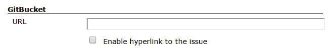
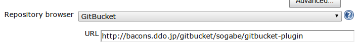
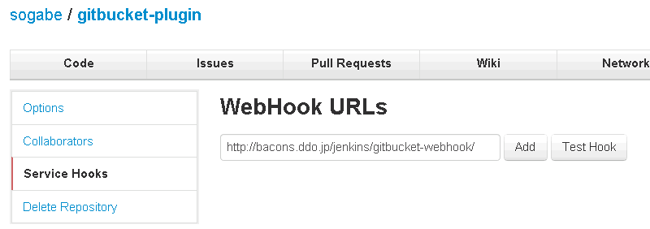
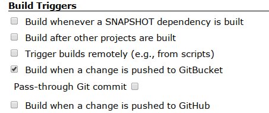
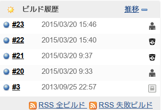

[.conf-macro .output-inline]#This plugin integrates
https://github.com/takezoe/gitbucket[GitBucket] to your Jenkins.# +
GitBucket is the easily installable Github clone written with Scala. It
provides a basic features below:

* Public / Private Git repository (http access only)
* Repository viewer (some advanced features such as online file editing
are not implemented)
* Repository search (Code and Issues)
* Wiki
* Issues
* Fork / Pull request
* Mail notification
* Activity timeline
* User management (for Administrators)
* Group (like Organization in Github)
* LDAP integration
* Gravatar support
* Executable war file

and more

See also http://takezoe.blogspot.jp/[blog].

[[GitBucketPlugin-Feature]]
== Feature

* The keywords in changelogs are hyperlinked to the corresponding Issue
pages, Pull Requests pages and Wiki pages.
* The changeset and diff in changelogs are hyperlinked to GitBucket
repository viewer.
* Trigger a build when a change is pushed to GitBucket using a WebHook.
+
[.aui-icon .aui-icon-small .aui-iconfont-warning .confluence-information-macro-icon]#
#

GitBucket does not fire webHook when merging via GUI, so this plugin
does not tgigger a build.

[[GitBucketPlugin-Setup]]
== Setup

* https://github.com/takezoe/gitbucket[GitBucket] 1.6 or later.
* Git Plugin 1.5.0 or later.

[[GitBucketPlugin-HyperlinkstoGitBucketissue,pullrequestandwikipages.]]
=== Hyperlinks to GitBucket issue, pull request and wiki pages.

[[GitBucketPlugin-Jenkins]]
==== Jenkins

[.confluence-embedded-file-wrapper .image-center-wrapper .confluence-embedded-manual-size]##

* Supports the following notation. +
_123
+
[cols=",",]
|===
|issue |refs #_123_ , refs _123_, issue #_123_, issue _123_, fix/es/ed
#_123_, close/s/d #_456_, resolve/s/d #_789_

|pull request |pull #_1_, pull _1_

|wiki |wiki _word_
|===

[[GitBucketPlugin-Repositoryviewer]]
=== Repository viewer

[[GitBucketPlugin-Jenkins.1]]
==== Jenkins

[.confluence-embedded-file-wrapper .image-center-wrapper .confluence-embedded-manual-size]##

[[GitBucketPlugin-Triggerabuild]]
=== Trigger a build

[[GitBucketPlugin-GitBucket]]
==== GitBucket

* Configure GitBucket to use http://\[your.jenkins.host\]/jenkins/
*gitbucket-webhook* */* as a WebHook.

[.confluence-embedded-file-wrapper .image-center-wrapper .confluence-embedded-manual-size]##

[[GitBucketPlugin-Jenkins.2]]
==== Jenkins

* Check "Build when a change is pushed to GitBucket" as a Build
Triggers.

[.confluence-embedded-file-wrapper .image-center-wrapper .confluence-embedded-manual-size]##

* and configure "Source Code Management"　to use git.

[[GitBucketPlugin-BuildTriggerBadgePluginsupport]]
=== Build Trigger Badge Plugin support

[.confluence-embedded-file-wrapper .image-center-wrapper]##

[[GitBucketPlugin-Changelog]]
== Changelog

[[GitBucketPlugin-Version0.8(Sep10,2015)]]
=== Version 0.8 (Sep 10, 2015)

* updated to Jenkins 1.609
* added several issue notation. see
https://github.com/takezoe/gitbucket/wiki/How-to-Close-Reference-issues-%26-pull-request[How
to Close Reference issues & pull request]
* only push event is accepted.

[[GitBucketPlugin-Version0.7(Mar31,2015)GitBucket3.1isavailable.]]
=== Version 0.7 (Mar 31, 2015) GitBucket 3.1 is available.

* use repository.clone_url instead of repository.url
(http://jenkins-ci.org/pull/11[pull request 11])
* make Build Trigger Badge Plugn optional
(http://jenkins-ci.org/pull/12[pull request 12])
* refactoring.

[[GitBucketPlugin-Version0.6(Mar21,2015)]]
=== Version 0.6 (Mar 21, 2015)

* Build Trigger Badge Plugn support.

[[GitBucketPlugin-Version0.5.1(Apr28,2014)]]
=== Version 0.5.1 (Apr 28, 2014)

* Supported Git Plugin 2.2.1 or later.

[[GitBucketPlugin-Version0.4(Nov30,2013)]]
=== Version 0.4 (Nov 30, 2013)

* Support Crumbs exclusion.
* Show who pushed this build.
* Add "Pass through Git commit".
* Honor QuietPeriod when scheduling a job.

[[GitBucketPlugin-Version0.3(Oct22,2013)]]
=== Version 0.3 (Oct 22, 2013)

* Updating to Jenkins 1.536 caused NPE.

[[GitBucketPlugin-Version0.2(Oct3,2013)]]
=== Version 0.2 (Oct 3, 2013)

* Fixed wrong GitBucket link
(https://issues.jenkins-ci.org/browse/JENKINS-19865[JENKINS-19865])

[[GitBucketPlugin-Version0.1(Sep30,2013)]]
=== Version 0.1 (Sep 30, 2013)

* First release.

Questions, Comments, Bugs and Feature Requests

[.aui-icon .aui-icon-small .aui-iconfont-info .confluence-information-macro-icon]#
#

To report a bug or request an enhancement to this plugin please
http://issues.jenkins-ci.org/browse/JENKINS/component/18124[create a
ticket in JIRA].
