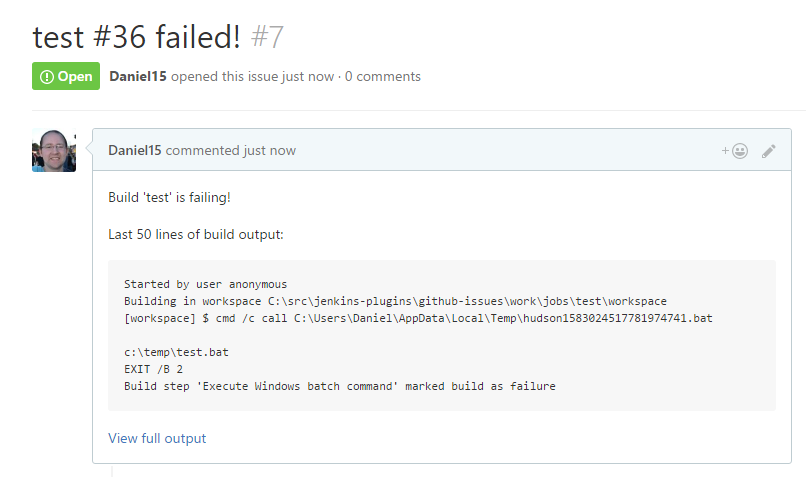
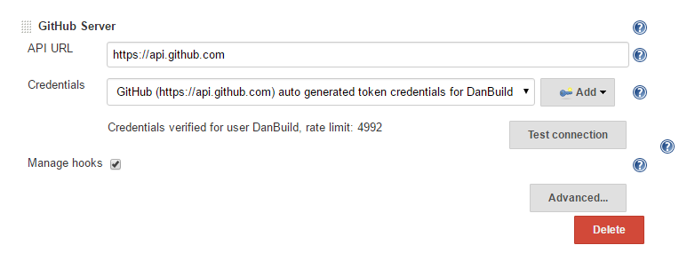
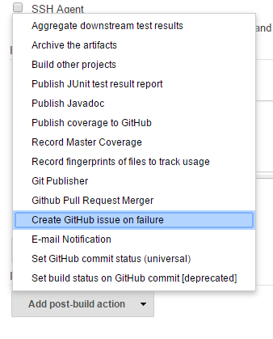
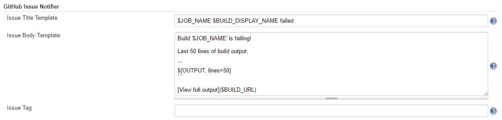

[[GitHubIssuesPlugin-GitHubIssuesPlugin]]
== GitHub Issues Plugin

This plugin allows you to create a GitHub issue whenever your build
fails. Once the build starts passing again, the issue will automatically
be
closed.[.confluence-embedded-file-wrapper]##

Report bugs here: http://dl.vc/jenkins-github-issues-bug (you will need
to first create a Jenkins account at https://accounts.jenkins.io/)

[[GitHubIssuesPlugin-GettingStarted]]
=== Getting Started

In Manage Jenkins → Configure System → GitHub → GitHub Servers, ensure
at least one GitHub server is configured and the "Test connection"
button works. +
[.confluence-embedded-file-wrapper]## +
Once this has been configured, add "Create GitHub issue on failure" as a
post-build action: +
[.confluence-embedded-file-wrapper]## +
When your build fails, a GitHub issue will be opened.

[[GitHubIssuesPlugin-Customization]]
=== Customization

The default template used for the issue title and body can be changed in
the GitHub Issue Notifier section in the Jenkins settings: +
[.confluence-embedded-file-wrapper]##

This template can also be modified per job. The "Content Token
Reference" section at the bottom of the settings pane can be used to get
information about all the available tokens.

[[GitHubIssuesPlugin-AdvancedUsage]]
=== Advanced Usage

[[GitHubIssuesPlugin-Usagewithjob-dsl]]
==== Usage with job-dsl

When using the great
https://github.com/jenkinsci/job-dsl-plugin/wiki[job-dsl plugin], you
can configure a publisher step as follows:

[source,syntaxhighlighter-pre]
----
job(String name) {
  publishers {
    gitHubIssueNotifier {
    }
  }
}
----

All the advanced settings are available as optional configuration
properties. To see all the available properties, go to the Job DSL API
viewer at `+JENKINS_URL/plugin/job-dsl/api-viewer/index.html+` and
search for `+gitHubIssueNotifier+`.

[[GitHubIssuesPlugin-Automatingglobalconfiguration]]
==== Automating global configuration

You can modify the global config using a system groovy script, i.e. add
a `+init.groovy+` to the `+JENKINS_HOME+` dir.

[source,syntaxhighlighter-pre]
----
import org.jenkinsci.plugins.githubissues.GitHubIssueNotifier
def descriptor = Jenkins.instance.getDescriptorByType(GitHubIssueNotifier.DescriptorImpl)
descriptor.issueTitle = 'ISSUE TITLE TEMPLATE`
descriptor.issueBody = 'ISSUE BODY TEMPLATE`
descriptor.issueLabel = 'LABELA LABELB`
descriptor.save()
----

In the templates you can use all available tokens using `+${TOKEN+`}
notation. To see all available tokens, click the help button on the
right of the `Content Token Reference` label in the GitHub Issues
section of the global configuration UI.

To configure the global GitHub config and the credential config, see the
https://github.com/jenkinsci/github-issues-plugin/blob/master/src/dev/assets/work/init.groovy[init.groovy]
example in the repo.

[[GitHubIssuesPlugin-UsageinaJenkinsfile]]
==== Usage in a Jenkinsfile

Configure a publisher step in a Jenkinsfile as follows:

[source,syntaxhighlighter-pre]
----
script {
    properties([[$class: 'GithubProjectProperty',
                projectUrlStr: '<GitHub repo URL>']])
}

...

step([$class: 'GitHubIssueNotifier',
      issueAppend: true,
      issueLabel: '',
      issueTitle: '$JOB_NAME $BUILD_DISPLAY_NAME failed'])
----

[[GitHubIssuesPlugin-Changelog]]
=== Changelog

[[GitHubIssuesPlugin-1.2.4-4thNovember2017]]
==== 1.2.4 - 4th November 2017

* Upgrade to GitHub API 1.90 to fix JENKINS-47601

[[GitHubIssuesPlugin-1.2.3-22ndJuly2017]]
==== 1.2.3 - 22nd July 2017

* Fixed https://issues.jenkins-ci.org/browse/JENKINS-42629[JENKINS-42629]:
Plugin now works with Jenkins pipelines.Thanks to
https://github.com/BenjaminGill-Metaswitch[Benjamin Gill].

[[GitHubIssuesPlugin-1.2.2-4thMarch2017]]
==== 1.2.2 - 4th March 2017

* Fixed
https://issues.jenkins-ci.org/browse/JENKINS-40385[JENKINS-40385]: Now
works with Maven builds
* Fixed
https://issues.jenkins-ci.org/browse/JENKINS-42482[JENKINS-42482]: Made
all advanced config options optional in Job DSL

[[GitHubIssuesPlugin-1.2.1-26thFebruary2017]]
==== 1.2.1 - 26th February 2017

* Fixed
https://issues.jenkins-ci.org/browse/JENKINS-42329[JENKINS-42329]:
Support for multi-config projects was broken in v1.2
* Renamed "Customize issue template" to "Advanced settings"

[[GitHubIssuesPlugin-1.2-26thNovember2016]]
==== 1.2 - 26th November 2016

* Added https://github.com/jenkinsci/github-issues-plugin/pull/3[some
optional new features]. Thanks to https://github.com/fsimmend[Felix
Simmendinger] and https://github.com/dzabel[Daniel Zabel] for the pull
request.
** Appending a comment on recurring failures (disabled by default)
** Reopening issue if build starts failing again (instead of creating a
new issue)
** Allow custom GitHub repo to be used for issues

[[GitHubIssuesPlugin-1.1-12thNovember2016]]
==== 1.1 - 12th November 2016

* Fixed
https://issues.jenkins-ci.org/browse/JENKINS-39662[JENKINS-39662]:
NullPointerException for multi-config projects
* Fixed
https://issues.jenkins-ci.org/browse/JENKINS-39687[JENKINS-39687]:
Configuration section didn't appear correctly
* Implemented
https://issues.jenkins-ci.org/browse/JENKINS-39663[JENKINS-39663] -
Allow issue template to be customised per-job instead of just having one
server-wide template
* Added help for merge tokens
* Include changes since last successful build in default body content

[[GitHubIssuesPlugin-1.0-5thNovember2016]]
==== 1.0 - 5th November 2016

* Initial release
