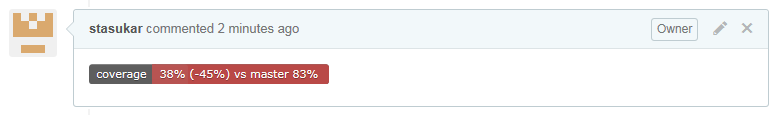

Code coverage icon for GitHub pull requests

[[GitHubPRCoverageStatusPlugin-Summary]]
== Summary

[.confluence-embedded-file-wrapper]##

[[GitHubPRCoverageStatusPlugin-Documentation]]
== Documentation

https://github.com/jenkinsci/github-pr-coverage-status-plugin[Please
find documentation on GitHub README]
