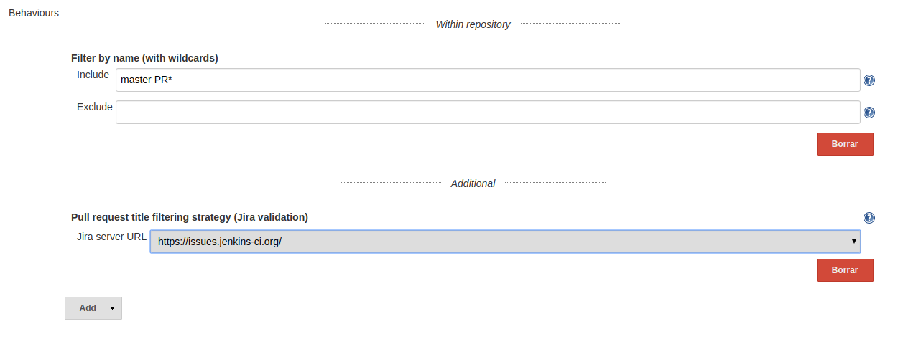

[[GitHubJiraValidatorSCMFilterPlugin-Summary]]
== Summary

[[GitHubJiraValidatorSCMFilterPlugin-Description]]
=== Description

This plugin extends the filtering abilities of the
github-branch-source-plugin one.

These filters will ignore pull requests if its title doesnt contain a
sinvle valid and open JIRA ticket.

[[GitHubJiraValidatorSCMFilterPlugin-Usage]]
=== [.anchor]#Usage#

When defining a new Github Organization job, include an additional
behaviour (placed under the additional separator). 

[.confluence-embedded-file-wrapper]##image:docs/images/Screenshot_from_2017-09-26_10.24.20.png[image]##[.confluence-embedded-file-wrapper]##image:docs/images/Screenshot_from_2017-09-26_10.24.20.png[image]##

This behaviour is configurable, being mandatory to select a previously
(globaly) configured JIRA Server:

[.confluence-embedded-file-wrapper .confluence-embedded-manual-size]##

In case of not selecting a JIRA server, the form won't validate:

[.confluence-embedded-file-wrapper]#image:docs/images/Screenshot_from_2017-09-26_11.13.26.png[image]#

[.confluence-embedded-file-wrapper .confluence-embedded-manual-size]##

In case of not selecting a JIRA server, the form won't validate:

[.confluence-embedded-file-wrapper]#image:docs/images/Screenshot_from_2017-09-26_11.13.26.png[image]#
