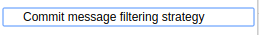
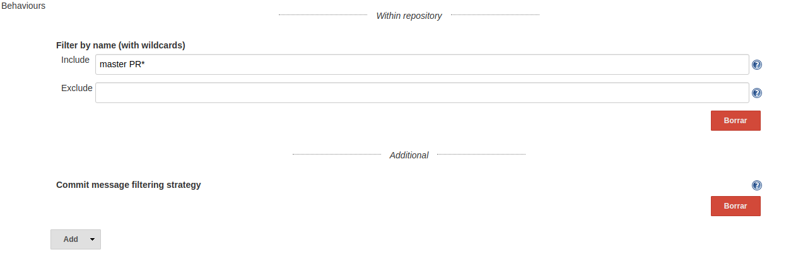

[[GitHubCommitSkipSCMBehaviourPlugin-Summary]]
== Summary

[[GitHubCommitSkipSCMBehaviourPlugin-Description]]
=== Description

This plugin extends the filtering abilities of the
https://wiki.jenkins-ci.org/display/JENKINS/GitHub+Branch+Source+Plugin[GitHub
Branch Source Plugin].

This filter will ignore events that the source branch last commit
contains the tags [skip ci] or [ci skip]. It provides a similar
functionality as https://circleci.com/docs/1.0/skip-a-build/[Circle CI
does].

The filtering is only performed for change request events, so push
events to non-pull requests will be always run.

[[GitHubCommitSkipSCMBehaviourPlugin-Warning!]]
=== [.anchor]#Warning!#

[.anchor]#The current implementation works over "tagging" the relevant
pull request job as excluded. This way, the job will be disabled (won't
be executable via the UI) and might get erased if an Orphaned Child
policy kicks in, losing the whole PR run history.#

[[GitHubCommitSkipSCMBehaviourPlugin-Usage]]
=== [.anchor]#Usage#

When defining a new Github Organization, include an additional behaviour
(placed under the "Additional" separator). 

[.confluence-embedded-file-wrapper .image-left-wrapper]##

 +

 +

This behaviour is not configurable. It will just show a simple inline
help icon:

[.confluence-embedded-file-wrapper .confluence-embedded-manual-size]##
