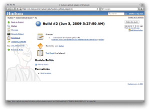
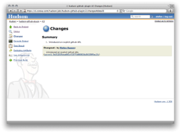
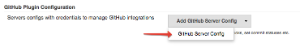
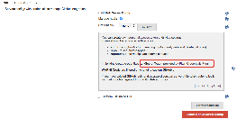

[.conf-macro .output-inline]##

[cols="",options="header",]
|===
|Plugin Information
|View GitHub https://plugins.jenkins.io/github[on the plugin site] for
more information.
|===

[.aui-icon .aui-icon-small .aui-iconfont-info .confluence-information-macro-icon]##

Older versions of this plugin may not be safe to use. Please review the
following warnings before using an older version:

* https://jenkins.io/security/advisory/2018-06-04/#SECURITY-799[Server-side
request forgery]
* https://jenkins.io/security/advisory/2018-06-04/#SECURITY-804[CSRF
vulnerability and lack of permission checks allows capturing
credentials]
* https://jenkins.io/security/advisory/2018-06-25/#SECURITY-915[CSRF
vulnerability and insufficient permission checks allow capturing
credentials]

[[GitHubPlugin-GithubPlugin]]
== Github Plugin

[.conf-macro .output-inline]##This plugin integrates Jenkins with
http://github.com/[Github] projects.##The plugin currently has three
major functionalities:

* Create hyperlinks between your Jenkins projects and GitHub
* Trigger a job when you push to the repository by groking HTTP POSTs
from post-receive hook and optionally auto-managing the hook setup.
* Report build status result back to github as
https://github.com/blog/1227-commit-status-api[Commit Status]
(http://stackoverflow.com/questions/14274293/show-current-state-of-jenkins-build-on-github-repo/26910986#26910986[documented
on SO])
* Base features for other plugins

[[GitHubPlugin-Hyperlinksbetweenchanges]]
== Hyperlinks between changes

The Github plugin decorates Jenkins "Changes" pages to create links to
your Github commit and issue pages. It adds a sidebar link that links
back to the Github project page.

[.confluence-embedded-file-wrapper]##
[.confluence-embedded-file-wrapper]##

When creating a job, specify that is connects to git. Under "Github
project", put in: git@github.com:_Person_/_Project_.git Under "Source
Code Management" select Git, and put in
git@github.com:_Person_/_Project_.git

[[GitHubPlugin-GitHubhooktriggerforGITScmpolling]]
== GitHub hook trigger for GITScm polling

This feature enables builds after
http://help.github.com/post-receive-hooks/[post-receive hooks in your
GitHub repositories]. This trigger only kicks git-plugin internal
polling algo for every incoming event against matched repo.

Old name

[.aui-icon .aui-icon-small .aui-iconfont-warning .confluence-information-macro-icon]#
#

Previously named as "Build when a change is pushed to GitHub"

To be able to use this feature:

[[GitHubPlugin-ManualMode]]
=== Manual Mode

In this mode, you'll be responsible for registering the hook URLs to
GitHub. Click the
image:docs/images/help_16.svg[(question)]
icon (under Manage Jenkins > Configure System > GitHub) to see the URL
in Jenkins that receives the post-commit POSTs — but in general the URL
is of the form `+$JENKINS_BASE_URL/github-webhook/+` — for example:
`+https://ci.example.com/jenkins/github-webhook/+`.

Once you have the URL, and have added it as a webhook to the relevant
GitHub repositories, continue to *Step 3*.

[[GitHubPlugin-AutomaticMode(Jenkinsmanageshooksforjobsbyitself)]]
=== Automatic Mode (Jenkins manages hooks for jobs by itself)

In this mode, Jenkins will automatically add/remove hook URLs to GitHub
based on the project configuration in the background. You'll specify
GitHub OAuth token so that Jenkins can login as you to do this.

*Step 1.* Go to the global configuration and add GitHub Server Config.

[.confluence-embedded-file-wrapper]##

*Step 2.1.* Create your personal access token in GitHub.

Plugin can help you to do it with all required scopes. Go to *Advanced*
-> *Manage Additional GitHub Actions* -> *Convert Login and Password to
token*

[.confluence-embedded-file-wrapper]##

Two-Factor Authentication

[.aui-icon .aui-icon-small .aui-iconfont-error .confluence-information-macro-icon]#
#

Auto-creating token doesn't work with
https://help.github.com/articles/about-two-factor-authentication/[GitHub
2FA]

You can create *"Secret text"* credentials with token in corresponding
domain with login and password directly, or from username and password
credentials.

*Step 2.2.* Select previously created "Secret Text" credentials with
GitHub OAuth token.

Required scopes for token

[.aui-icon .aui-icon-small .aui-iconfont-warning .confluence-information-macro-icon]#
#

To be able manage hooks your token should have *admin:org_hook* scope.

GitHub Enterprise

[.aui-icon .aui-icon-small .aui-iconfont-info .confluence-information-macro-icon]#
#

You can also redefine GitHub url by clicking on *Custom GitHub API URL*
checkbox. +
Note that credentials are filtered by entered GH url with help of domain
requirements. So you can create credentials in different domains and see
only credentials that matched by predefined domains.

[.confluence-embedded-file-wrapper]##

*Step 3.* Once that configuration is done, go to the project config of
each job you want triggered automatically and simply check "Build when a
change is pushed to GitHub" under "Build Triggers". With this, every new
push to the repository automatically triggers a new build.

Note that there's only one URL and it receives all post-receive POSTs
for all your repositories. The server side of this URL is smart enough
to figure out which projects need to be triggered, based on the
submission.

[[GitHubPlugin-SecurityImplications]]
==== Security Implications

This plugin requires that you have an HTTP URL reachable from GitHub,
which means it's reachable from the whole internet. So it is implemented
carefully with the possible malicious fake post-receive POSTS in mind.
To cope with this, upon receiving a POST, Jenkins will talk to GitHub to
ensure the push was actually made.

[[GitHubPlugin-Jenkinsinsideafirewall]]
==== Jenkins inside a firewall

In case your Jenkins run inside the firewall and not directly reachable
from the internet, this plugin lets you specify an arbitrary endpoint
URL as an override in the automatic mode. The plugin will assume that
you've set up reverse proxy or some other means so that the POST from
GitHub will be routed to the Jenkins.

[[GitHubPlugin-Trouble-shootinghooks]]
==== Trouble-shooting hooks

If you set this up but build aren't triggered, check the following
things:

* Click the "admin" button on the GitHub repository in question and make
sure post-receive hooks are there.
** If it's not there, make sure you have proper credential set in the
Jenkins system config page.
* Also, https://wiki.jenkins-ci.org/display/JENKINS/Logging[enable
logging] for the class names
** `+com.cloudbees.jenkins.GitHubPushTrigger+`
** `+org.jenkinsci.plugins.github.webhook.WebhookManager+`
** `+com.cloudbees.jenkins.GitHubWebHook+` +
and you'll see the log of Jenkins trying to install a post-receive hook.
* Click "Test hook" button from the GitHub UI and see if Jenkins receive
a payload.

[[GitHubPlugin-UsingcachetoGitHubrequests]]
==== Using cache to GitHub requests

Each *GitHub Server Config* creates own GitHub client to interact with
api. By default it uses cache (with *20MB* limit) to speedup process of
fetching data and reduce rate-limit consuming. You can change cache
limit value in "Advanced" section of this config item. If you set 0,
then this feature will be disabled for this (and only this) config.

[.aui-icon .aui-icon-small .aui-iconfont-warning .confluence-information-macro-icon]#
#

Additional info:

* This plugin now serves only hooks from github as main feature. Then it
starts using git-plugin to fetch sources.
* It works both public and Enterprise GitHub
* Plugin have some
http://stackoverflow.com/questions/16323749/jenkins-github-plugin-inverse-branches[limitations]

[[GitHubPlugin-PossibleIssuesbetweenJenkinsandGitHub]]
== Possible Issues between Jenkins and GitHub

[[GitHubPlugin-Windows:]]
=== Windows:

* In windows, Jenkins will use the the SSH key of the user it is running
as, which is located in the %USERPROFILE%\.ssh folder ( on XP, that
would be C:\Documents and Settings\USERNAME\.ssh, and on 7 it would be
C:\Users\USERNAME\.ssh). Therefore, you need to force Jenkins to run as
the user that has the SSH key configured. To do that, right click on My
Computer, and hit "Manage". Click on "Services". Go to Jenkins, right
click, and select  "Properties". Under the "Log On" tab, choose the user
Jenkins will run as, and put in the username and password (it requires
one). Then restart the Jenkins service by right clicking on Jenkins (in
the services window), and hit "Restart".
* Jenkins does not support passphrases for SSH keys. Therefore, if you
set one while running the initial Github configuration, rerun it and
don't set one.

[[GitHubPlugin-Pipelineexamples]]
=== Pipeline examples

[[GitHubPlugin-Settingcommitstatus]]
==== Setting commit status

This code will set commit status for custom repo with configured context
and message (you can also define same way backref)

[source,syntaxhighlighter-pre]
----
void setBuildStatus(String message, String state) {
  step([
      $class: "GitHubCommitStatusSetter",
      reposSource: [$class: "ManuallyEnteredRepositorySource", url: "https://github.com/my-org/my-repo"],
      contextSource: [$class: "ManuallyEnteredCommitContextSource", context: "ci/jenkins/build-status"],
      errorHandlers: [[$class: "ChangingBuildStatusErrorHandler", result: "UNSTABLE"]],
      statusResultSource: [ $class: "ConditionalStatusResultSource", results: [[$class: "AnyBuildResult", message: message, state: state]] ]
  ]);
}

setBuildStatus("Build complete", "SUCCESS");
----

More complex examle (can be used with multiply scm sources in pipeline)

[source,syntaxhighlighter-pre]
----
def getRepoURL() {
  sh "git config --get remote.origin.url > .git/remote-url"
  return readFile(".git/remote-url").trim()
}

def getCommitSha() {
  sh "git rev-parse HEAD > .git/current-commit"
  return readFile(".git/current-commit").trim()
}

def updateGithubCommitStatus(build) {
  // workaround https://issues.jenkins-ci.org/browse/JENKINS-38674
  repoUrl = getRepoURL()
  commitSha = getCommitSha()

  step([
    $class: 'GitHubCommitStatusSetter',
    reposSource: [$class: "ManuallyEnteredRepositorySource", url: repoUrl],
    commitShaSource: [$class: "ManuallyEnteredShaSource", sha: commitSha],
    errorHandlers: [[$class: 'ShallowAnyErrorHandler']],
    statusResultSource: [
      $class: 'ConditionalStatusResultSource',
      results: [
        [$class: 'BetterThanOrEqualBuildResult', result: 'SUCCESS', state: 'SUCCESS', message: build.description],
        [$class: 'BetterThanOrEqualBuildResult', result: 'FAILURE', state: 'FAILURE', message: build.description],
        [$class: 'AnyBuildResult', state: 'FAILURE', message: 'Loophole']
      ]
    ]
  ])
}
----

[[GitHubPlugin-ChangeLog]]
=== Change Log

https://github.com/jenkinsci/github-plugin/releases[GitHub Releases]

[[GitHubPlugin-OpenIssues]]
==== Open Issues

[[refresh-module-1610661383]]
[[refresh-1610661383]][[jira-issues-1610661383]]
T

Key

Summary

Status

Updated

Created

[.refresh-action-group]# #

[[refresh-issues-loading-1610661383]]
[.aui-icon .aui-icon-wait]#Loading...#

[#refresh-issues-button-1610661383]##
[#refresh-issues-link-1610661383]#Refresh#
[#error-message-1610661383 .error-message .hidden]# #
