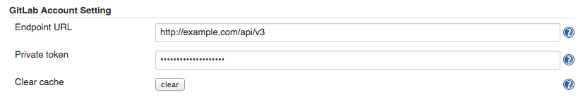
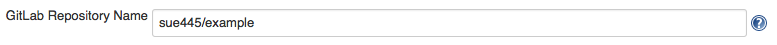

[[GitLabLogoPlugin-Summary]]
== Summary

Display GitLab Repository Icon on
dashboard[.conf-macro .output-inline]####

[cols="",options="header",]
|===
|Plugin Information
|View GitLab Logo https://plugins.jenkins.io/gitlab-logo[on the plugin
site] for more information.
|===

[.aui-icon .aui-icon-small .aui-iconfont-info .confluence-information-macro-icon]##

Older versions of this plugin may not be safe to use. Please review the
following warnings before using an older version:

* https://jenkins.io/security/advisory/2019-09-25/#SECURITY-1575[Credentials
stored in plain text]

https://wiki.jenkins-ci.org/display/JENKINS/GitLab+Logo+Plugin[[.confluence-embedded-file-wrapper]#image:http://sebastian-badge.info/plugins/gitlab-logo.svg[image]#]
https://jenkins.ci.cloudbees.com/job/plugins/job/gitlab-logo-plugin/[[.confluence-embedded-file-wrapper]#image:https://jenkins.ci.cloudbees.com/buildStatus/icon?job=plugins/gitlab-logo-plugin[image]#]

[[GitLabLogoPlugin-Tableofcontent]]
=== Table of content

[[GitLabLogoPlugin-Example]]
== Example

[.confluence-embedded-file-wrapper]##

[[GitLabLogoPlugin-Requirements]]
== Requirements

* GitLab v7.9.0+ (recommended)
** If less than v7.9.0, show only default project icon

[[GitLabLogoPlugin-Usage]]
== Usage

[[GitLabLogoPlugin-GlobalConfiguration]]
=== Global Configuration

[.confluence-embedded-file-wrapper]##

[[GitLabLogoPlugin-JobConfiguration]]
=== Job Configuration

[.confluence-embedded-file-wrapper]##

[[GitLabLogoPlugin-Changelog]]
== Changelog

https://github.com/jenkinsci/gitlab-logo-plugin/blob/master/CHANGELOG.md

[[GitLabLogoPlugin-Version1.0.4(Sep18,2019)]]
=== Version 1.0.4 (Sep 18, 2019)

* *[SECURITY-1575]* Save privateToken to Secret field instead of String
field.
** Plain privateToken is automatically encrypted and stored when Global
Configuration saving

[[GitLabLogoPlugin-Version1.0.3(Nov10,2016)]]
=== Version 1.0.3 (Nov 10, 2016)

* Do not enable gitlab logo column by default.

[[GitLabLogoPlugin-Version1.0.1(Aug6,2015)]]
=== Version 1.0.1 (Aug 6, 2015)

* Old icon -> new icon

[[GitLabLogoPlugin-Version1.0.0(Apr9,2015)]]
=== Version 1.0.0 (Apr 9, 2015)

* First release
