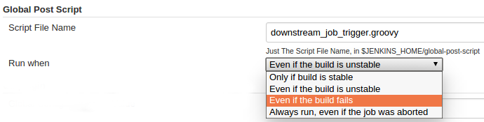

[.conf-macro .output-inline]#Execute a global configured groovy script
after each build of each job managed by the Jenkins. +
This is typical for cases when you need to do something based on a
shared set of parameters, such as triggering downstream jobs managed by
the same Jenkins or remote ones based on the parameters been passed to
the parameterized jobs.#

*Notice: jython script support removed since 1.1.0*

[.conf-macro .output-inline]# #

[.aui-icon .aui-icon-small .aui-iconfont-error .confluence-information-macro-icon]##

The current version of this plugin may not be safe to use. Please review
the following warnings before use:

* https://jenkins.io/security/advisory/2019-10-23/#SECURITY-1073[Missing
permission check allowed obtaining configuration data]

[[GlobalPostScriptPlugin-GlobalConfigure]]
== Global Configure

[.confluence-embedded-file-wrapper]## +
_Default_: the script will be executed when the build result is _better
or equal to `+UNSTABLE+`_

[[GlobalPostScriptPlugin-Variablesthatcouldbeusedinthescriptfile]]
== Variables that could be used in the script file

[[GlobalPostScriptPlugin-JenkinsBuilt-inVariables]]
=== Jenkins Built-in Variables

[cols=",,",options="header",]
|===
|Variable |Description |Sample Data
|BUILD_ID |Build timestamp as ID |2014-06-26_07-16-51

|BUILD_NUMBER |Build No# |16

|BUILD_RESULT |Build result |SUCCESS / UNSTABLE / FAILURE ...

|BUILD_TAG |Job Name + Build No# |jenkins-test-job-16

|BUILD_URL |The URL of this build
|http://localhost:8080/job/test-job/16/

|JENKINS_HOME |The path of the root folder of Jenkins
|~/workspace-idea/global-post-script-plugin/./work

|JENKINS_URL |The root URL of Jenkins |http://localhost:8080/

|JOB_NAME |Name of the job |test-job

|JOB_URL |URL of the job |http://localhost:8080/job/test-job/

|MAVEN_CMD_LINE_ARGS |Maven command args |clean install

|NODE_LABELS |Lables of the nodes where the build could be executed
|master

|NODE_NAME |Name of the node where the build executed |master

|SVN_REVISION |SVN revision |185214

|SVN_URL |SVN URL | 

|WORKSPACE |The path of the workspace
|~/workspace-idea/global-post-script-plugin/work/workspace/LOGANALYZE

|GIT_BRANCH |Git branch |origin/master

|GIT_COMMIT |Git commit ID |ddaf9c4576e375b42b6bc7c73daa12cb28a92031

|GIT_URL |Git repo URL
|https://github.com/jenkinsci/global-post-script-plugin.git
|===

[[GlobalPostScriptPlugin-Extravariables]]
=== Extra variables

Parameters of `+parameterized build+` or parameters been passed in by
`+-Dparameter_name=parameter_value+` are also available

[[GlobalPostScriptPlugin-themanagerobject]]
=== the `+manager+` object

An extra object is available as groovy variables: `+manager+`, provided
4 methods:

[cols=",",options="header",]
|===
|Method |Description
|`+isVar(String name)+` |Check if a variable is defined and usable in
the script

|`+isNotBlankVar(String name)+` |Check if a variable is defined and
usable in the script, and with a non-blank value

|`+addBadge(String icon, String text)+` |Add a badge to the build

|`+addShortText(String text)+` |Add a text label to the build

|`+triggerJob(String jobName)+` |Trigger a job managed by the same
Jenkins

|`+triggerRemoteJob(String url)+` |Trigger a job by URL
|===

[[GlobalPostScriptPlugin-3rd-partylibrariesforgroovyscript]]
=== 3rd-party libraries for groovy script

If your groovy script have dependencies that not shipped with Jenkins,
you can put them into `+$JENKINS_HOME/global-post-script/lib+`.

[[GlobalPostScriptPlugin-SupportedScripts]]
== Supported Scripts

[[GlobalPostScriptPlugin-Groovy]]
=== Groovy

*Groovy Sample*

[source,syntaxhighlighter-pre]
----
out.println("dropdeploy to: $dropdeploy_targets")
----

*Groovy Sample*

[source,syntaxhighlighter-pre]
----
out.println("dropdeploy to: " + dropdeploy_targets)
----

*Groovy Sample*

[source,syntaxhighlighter-pre]
----
if (manager.isVar("variable_name")) {
    ...
}
----

*Groovy Sample*

[source,syntaxhighlighter-pre]
----
job = hudson.model.Hudson.instance.getItem("demo2")
build = job.getLastBuild()
println build
def action = build.getAction(hudson.plugins.claim.ClaimBuildAction.class)
print action.getReason()
----

*Groovy Sample*

[source,syntaxhighlighter-pre]
----
def triggers = [
        wwwsqs8: {
            def params = [
                PARENT_BUILD_NUMBER: '$BUILD_NUMBER',
                PARENT_JOB_NAME: '$JOB_NAME',
                any_param_name: '$deploy_targets'
            ]
            manager.triggerJob("WWW_JBEHAVE_TEST", params)
            manager.triggerJob("WWW_MOBILE_API_TEST")
            manager.triggerRemoteJob("http://localhost/job/Dev_Launch_WWW_SQS_REGRESSION/build?token=88e4b5fd1d28949710a9c4924775ce40&delay=1800sec")
        },
        wwwsqm8: {
            manager.triggerRemoteJob("http://localhost/job/Dev_Launch_WWW_SQM_REGRESSION/build?token=88e4b5fd1d28949710a9c4924775ce40&delay=1800sec")
        },
        bsdsqs8: {
            manager.triggerJob("BSD_JBEHAVE_TEST")
            manager.triggerJob("BSD_MOBILE_API_TEST")
            manager.triggerRemoteJob("http://localhost/job/Dev_Launch_BSD_SQS_REGRESSION/build?token=88e4b5fd1d28949710a9c4924775ce40&delay=1800sec")
        },
        bsdsqm8: {
            manager.triggerRemoteJob("http://localhost/job/Dev_Launch_BSD_SQM_REGRESSION/build?token=88e4b5fd1d28949710a9c4924775ce40&delay=1800sec")
        },
        gmlsqs8: {
            manager.triggerJob("GMIL_JBEHAVE_TEST")
            manager.triggerRemoteJob("http://localhost/job/Dev_Launch_GMIL_SQS_REGRESSION/build?token=88e4b5fd1d28949710a9c4924775ce40&delay=1800sec")
        },
        gmlsqm8: {
            manager.triggerRemoteJob("http://localhost/job/Dev_Launch_GMIL_SQM_REGRESSION/build?token=88e4b5fd1d28949710a9c4924775ce40&delay=1800sec")
        },
        basepom: {
            manager.triggerJob("basepom")
        }
]

if (manager.isVar("deploy") && manager.isNotBlankVar("deploy_targets") && "true" == deploy) {
    dropped = false
    deploy_targets.split(',').each {
        trigger = triggers[it]
        if (trigger) {
            trigger()
            dropped = true
        }
    }
    if (dropped) {
        manager.addBadge("server.png", "[SQ: " + deploy_targets + "]")
    }
}
----

[[GlobalPostScriptPlugin-bat/sh]]
=== bat/sh

*NO* variables will passed into the script

[[GlobalPostScriptPlugin-OpenIssues]]
== Open Issues

[[refresh-module-1264101230]]
[[refresh-1264101230]][[jira-issues-1264101230]]
T

Key

Summary

Assignee

Reporter

P

Status

Resolution

Created

Updated

Due

[.refresh-action-group]# #

[[refresh-issues-loading-1264101230]]
[.aui-icon .aui-icon-wait]#Loading...#

[#refresh-issues-button-1264101230]##
[#refresh-issues-link-1264101230]#Refresh#
[#error-message-1264101230 .error-message .hidden]# #

[[GlobalPostScriptPlugin-Changes]]
== Changes

[[GlobalPostScriptPlugin-1.1.4]]
=== 1.1.4

* Added support for
`pipeline`https://issues.jenkins-ci.org/browse/JENKINS-44647[JENKINS-44647]

[[GlobalPostScriptPlugin-1.1.3]]
=== 1.1.3

* Fixed
https://issues.jenkins-ci.org/browse/JENKINS-37796[JENKINS-37796]
Loading jars in `+global-post-script/lib+` (if exist) as classpath
entries when running groovy script.

[[GlobalPostScriptPlugin-1.1.2]]
=== 1.1.2

* Not the cache the parsed GroovyShell

[[GlobalPostScriptPlugin-1.1.1.1]]
=== 1.1.1.1

* **Do NOT use this version**
* Fixed
https://issues.jenkins-ci.org/browse/JENKINS-34056[JENKINS-34056]

[[GlobalPostScriptPlugin-1.1.1]]
=== 1.1.1

* **Do NOT use this version**
* Parsing and caching the groovy script, to make a smaller footprint.
https://issues.jenkins-ci.org/browse/JENKINS-33358[JENKINS-33358]

[[GlobalPostScriptPlugin-1.1.0]]
=== 1.1.0

* Added `aborted` condition, to allow triggering the script even the
build is aborted.
* Removed support for jython scripts. (jython dependency is too big, and
Groovy is much better supported by Jenkins.)

[[GlobalPostScriptPlugin-1.0.12]]
=== 1.0.12

* Fixed issue about script been executed for each sub-module of Maven
multi-module projects.

[[GlobalPostScriptPlugin-1.0.11]]
=== 1.0.11

* Fixed issue about groovy script works in _`+script console+`_ but
fails as _`+global post script+`_

[[GlobalPostScriptPlugin-1.0.10]]
=== 1.0.10

* Allow to run also for failed builds (Global configure).
* Added BUILD_RESULT to script.

[[GlobalPostScriptPlugin-1.0.9]]
=== 1.0.9

* Supports parameters when triggering local jobs (parameterized
downstream jobs)
