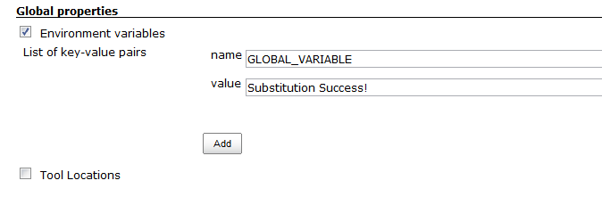
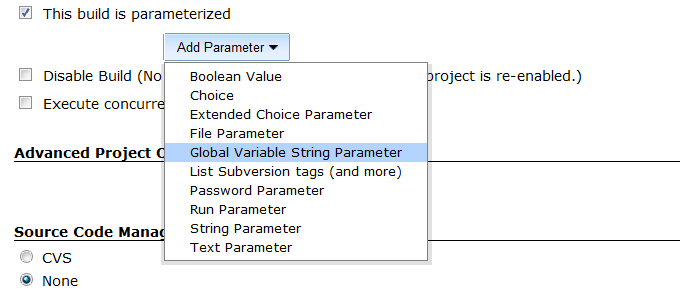
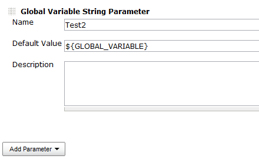
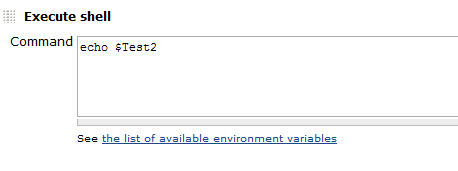
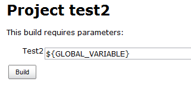
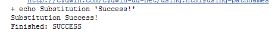
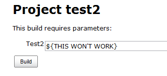
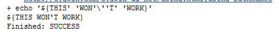

[[GlobalVariableStringParameterPlugin-GlobalVariableStringParameterPlugin]]
== Global Variable String Parameter Plugin

Provides a parameter with support for global node properties via
$VARIABLE or $\{VARIABLE}

[[GlobalVariableStringParameterPlugin-Utilization]]
== Utilization

After installing, in your job choose Add Parameter and select Global
Variable String Parameter. Use $VARIABLE or $\{VARIABLE} in either the
default value or on the build now page to substitute global node
parameters.

[[GlobalVariableStringParameterPlugin-VersionHistory]]
== Version History

Version 1.2 (Sept 17 2013)

* Fix race condition where concurrent builds could cause variables not
to substitute

Version 1.1 (Nov 02 2012)

* Initial Release

[[GlobalVariableStringParameterPlugin-Example]]
== Example

. Create a global variable +
[.confluence-embedded-file-wrapper]##
. Create a global variable string parameter in a job +
[.confluence-embedded-file-wrapper]##
. Reference the global variable in the default value +
[.confluence-embedded-file-wrapper]##
. Add a simple echo statement to demonstrate the substitution +
[.confluence-embedded-file-wrapper]##
. The variable remains unsubstituted on the Build Now page +
[.confluence-embedded-file-wrapper]##
. But is correctly substituted in the console output +
[.confluence-embedded-file-wrapper]##
. The variable can also be changed from the build now screen to be
incorrect +
[.confluence-embedded-file-wrapper]##
. And no longer substitutes +
[.confluence-embedded-file-wrapper]##
