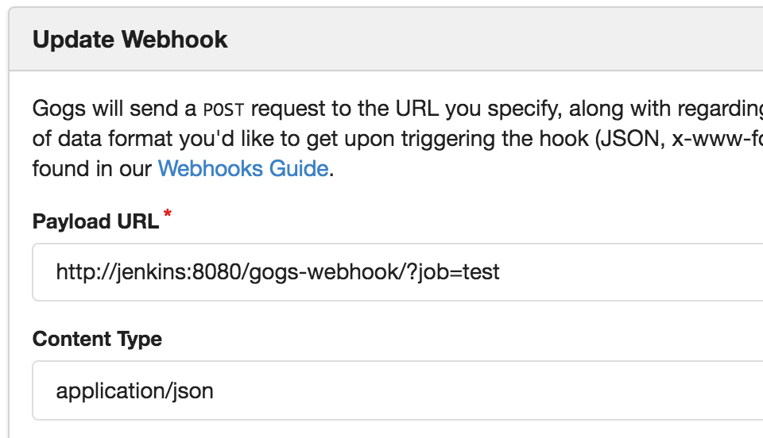

[.conf-macro .output-inline]# #

[.aui-icon .aui-icon-small .aui-iconfont-info .confluence-information-macro-icon]##

Older versions of this plugin may not be safe to use. Please review the
following warnings before using an older version:

* https://jenkins.io/security/advisory/2019-07-11/#SECURITY-1438[Credentials
stored in plain text]

[.conf-macro .output-inline]#Allows users to use the
https://gogs.io/[Gogs] Webhook#

[[GogsWebhookPlugin-Gogs-WebhookPlugin]]
== Gogs-Webhook Plugin

This plugin integrates https://gogs.io/[Gogs] to Jenkins.

In Gogs configure your webhook like this:

[source,syntaxhighlighter-pre]
----
http(s)://<< jenkins-server >>/gogs-webhook/?job=<< jobname >>
----

Example how your the webhook in Gogs should look like: +
[.confluence-embedded-file-wrapper]##

[[GogsWebhookPlugin-ChangeLog]]
=== Change Log

[[GogsWebhookPlugin-Version1.0.14(Apr4,2018)]]
==== Version 1.0.14 (Apr 4, 2018)

* Fixes `job not found` if slashes are used in
branch [https://github.com/jenkinsci/gogs-webhook-plugin/issues/36[GH_ISSUE#36]/https://github.com/jenkinsci/gogs-webhook-plugin/pull/40[PR#40]].

[[GogsWebhookPlugin-Version1.0.13(Mar16,2018)]]
==== Version 1.0.13 (Mar 16, 2018)

* Fixes `job not found` if folders are
used [https://github.com/jenkinsci/gogs-webhook-plugin/issues/36[GH_ISSUE#36]/https://github.com/jenkinsci/gogs-webhook-plugin/pull/37[PR#37]].

[[GogsWebhookPlugin-Version1.0.12(Mar8,2018)]]
==== Version 1.0.12 (Mar 8, 2018)

* Expose REF and BEFORE payload to environment variables (GOGS_REF and
GOGS_BEFORE) 

[[GogsWebhookPlugin-Version1.0.11(Feb26,2018)]]
==== Version 1.0.11 (Feb 26, 2018)

* Use `[IGNORE]` at start of commit subject to ignore the push
* Multibranch pipeline support (untested)

[[GogsWebhookPlugin-Version1.0.10(Apr10,2017)]]
==== Version 1.0.10 (Apr 10, 2017)

* Allow empty
password [https://github.com/jenkinsci/gogs-webhook-plugin/pull/19[PR#19]]

[[GogsWebhookPlugin-Version1.0.9(Mar8,2017)]]
==== Version 1.0.9 (Mar 8, 2017)

* Added new Gogs authentication but keeps it compatible with old
version [https://github.com/jenkinsci/gogs-webhook-plugin/pull/16[PR#16]]
* Added folder
support [https://github.com/jenkinsci/gogs-webhook-plugin/pull/12[PR#12]]

[[GogsWebhookPlugin-Version1.0.8(Dec20,2016)]]
==== Version 1.0.8 (Dec 20, 2016)

* Fixes impersonation problem of v1.0.7

[[GogsWebhookPlugin-Version1.0.7(Dec6,2016)]]
==== Version 1.0.7 (Dec 6, 2016)

* Added Gogs secret per
job [https://github.com/jenkinsci/gogs-webhook-plugin/pull/3[PR#3]]

[[GogsWebhookPlugin-Version1.0.6(Sep5,2016)]]
==== Version 1.0.6 (Sep 5, 2016)

* Added pipeline support.

[[GogsWebhookPlugin-Version1.0.4(Jul4,2016)]]
==== Version 1.0.4 (Jul 4, 2016)

* Added CSRF
protection https://issues.jenkins-ci.org/browse/JENKINS-37149[[JENKINS-37149]]

[[GogsWebhookPlugin-Version1.0(Jul21,2016)]]
==== Version 1.0 (Jul 21, 2016)

* First release
