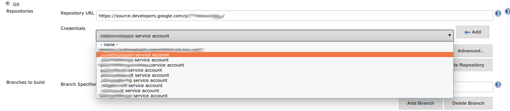

[[GoogleSourcePlugin-GoogleSourcePlugin]]
== *Google Source Plugin*

This plugin provides the credential provider to use Google Cloud
Platform OAuth Credentials (provided by the
https://wiki.jenkins.io/display/JENKINS/Google+OAuth+Plugin[Google OAuth
Credentials plugin]) to access source code from
https://source.developer.google.com/[https://source.developer.google.com]
as well as https://*.googlesource.com. It supports both kinds of
credentials provided by
https://wiki.jenkins.io/display/JENKINS/Google+OAuth+Plugin[Google OAuth
Credentials plugin] : *Google Service Account from metadata* as well as
*Google Service Account from private key.*

. In order to use a Git repository hosted on
https://source.developer.google.com/[https://source.developer.google.com],
your credential will need the scope
https://www.googleapis.com/auth/projecthosting. Your service account
will need to have access to the repository’s Google Cloud Platform
project.
. In order to use https://*.googlesource.com, your credential will need
the scope https://www.googleapis.com/auth/gerritcodereview. Your service
account will need to be whitelisted by the maintainers of that
repository.

[[GoogleSourcePlugin-Usage]]
== Usage

First, configure your OAuth credentials per instructions from Google
OAuth Plugin.

Then, when configuring the Git repository for your Jenkins job, if you
enter a https://*.googlesource.com address in the “Repository URL” text
area, your Credentials drop box will automatically be populated with
credentials having the https://www.googleapis.com/auth/gerritcodereview
scope

Similarly, if you enter a
https://source.developer.google.com/[https://source.developer.google.com]
Git repository, your Credentials box will be populated with credentials
having the https://www.googleapis.com/auth/projecthosting scope. 

[.confluence-embedded-file-wrapper]##

Select the required credential, then your job is ready to go!

*Version History*

[[GoogleSourcePlugin-Version0.1(December8,2014)]]
=== *Version 0.1 (December 8, 2014)*

* *Initial release*
