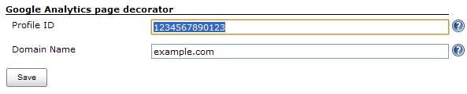

This plugin decorates all web pages with the Google Analytics tracking
script

Use this plugin to add the google analytics tracking script to all web
pages that are served by the Jenkins installation.

[[GoogleAnalyticsPlugin-Configuring]]
== Configuring

To configure it, you just need to specify the profile id. The profile id
can be found within the google analytics web site. If you already have
the tracking script, look at the tracking code and copy the value within
the `+_getTracker()+` as shown in this example:
`+_gat.getTracker("AA-123456-2");+` __(the profile id is AA-123456-2)_.

If you want to track subdomains in one profile, you can specify the
domain name in the configuration. For more details about tracking
subdomains in one profile
http://www.google.com/support/googleanalytics/bin/answer.py?hl=en&answer=55524[go
here].

[.confluence-embedded-file-wrapper .image-center-wrapper]##

[[GoogleAnalyticsPlugin-Changelog]]
== Change log

[[GoogleAnalyticsPlugin-1.2-(23november2011)]]
=== 1.2 - (_23 november 2011_)

* Updated Google analytics script so it used to the asynchronous method.
_(https://issues.jenkins-ci.org/browse/JENKINS-11686[JENKINS-11686])_

[[GoogleAnalyticsPlugin-1.2-(24august2009)]]
=== 1.2 - (_24 august 2009_)

* Added support for tracking subdomains in one profile.
_http://www.nabble.com/Re:-Google-Analytics-Plugin-for-Hudson-td25114229.html[Patch
from Davide Mendolia]_

[[GoogleAnalyticsPlugin-1.1-(19september2008)]]
=== 1.1 - (_19 september 2008_)

[[GoogleAnalyticsPlugin-1.0-(5september2008)]]
=== 1.0 - (_5 september 2008_)

* Initial revision
