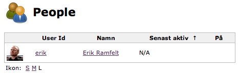

This plugins shows http://gravatar.com/[Gravatar] avatars instead of the
generic user image.

[.confluence-embedded-file-wrapper]##

[[Gravatarplugin-Usage]]
== Usage

Install the plugin on a Jenkins instance running at least 1.434, and it
will automatically show Gravatars for the users that has an email and a
Gravatar. No configuration except installing the plugin.

[[Gravatarplugin-Caveats]]
== Caveats

The plugin will re-check every 30 minutes to see if any user has
configured a gravatar. So if you have configured a gravatar and it does
not show up, please wait at least 30 minutes before thinking its a bug.

[[Gravatarplugin-Changelog]]
=== Changelog

[[Gravatarplugin-Version2.1(2014-05-05)]]
==== Version 2.1 (2014-05-05)

* Upgrade for making the plugin work in recent jenkins installations
having mailer-plugin (no longer in core)

[[Gravatarplugin-Version2.0(2014-05-03)]]
==== Version 2.0 (2014-05-03)

* Complete rewrite for better handling of large user bases (caching and
lazy resolving)

[[Gravatarplugin-Version1.1(2011-11-18)]]
==== Version 1.1 (2011-11-18)

* Initial version
