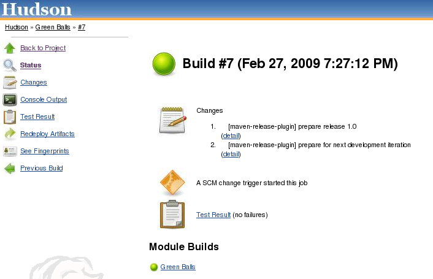

Changes Hudson to use green balls instead of blue for successful builds.

https://jenkins.ci.cloudbees.com/job/plugins/job/greenballs-plugin/[Jenkins
job for Green Balls]

[.confluence-embedded-file-wrapper]##

[[GreenBalls-Changelog]]
== Change log

* 1.15 - Do not evaluate filters until all plugins have been augmented
https://issues.jenkins-ci.org/browse/JENKINS-28422[JENKINS-28422].
* 1.14 - Prevent stack overflow when a colourblind user encounters a
failed/unstable build and Jenkins is running in a vietnam4j based
servlet container.
* 1.13 – Fix transparency
https://issues.jenkins-ci.org/browse/JENKINS-13941[JENKINS-13941] and
add chinese translation.
* 1.12 – Fix NPE with Jenkins>=1.463 and security-enabled Jenkins.
* 1.11 (2011-09-10) – Colorblind support.
* 1.10 – Reverted ball color to pre 1.9 version. Thanks for all your
feedback and interest!
image:docs/images/smile.svg[(smile)]
* 1.9 – Fixed images for Hudson 1.392
http://issues.jenkins-ci.org/browse/JENKINS-8400[JENKINS-8400] and
errors when running under Tomcat
http://issues.jenkins-ci.org/browse/JENKINS-8364[JENKINS-8364].
* 1.8 – Fixed images not working in web containers with a non-root
context. http://issues.jenkins-ci.org/browse/JENKINS-7846[JENKINS-7846]
* 1.7 – Makes build time trend green for successful builds. Reported in
http://issues.jenkins-ci.org/browse/JENKINS-6838[Issue 6838]. Thanks to
Kohsuke for the implementation tip, which was spot on.
* 1.6 – Added Cache-Control and Expires to all responses. Green balls
should load as fast as other colors now.
* 1.5 – Adds a Cache-Control header to hint to the browser that the
green balls can be cached. Reported in
https://hudson.dev.java.net/issues/show_bug.cgi?id=4888[Issue 4888].
* 1.4 – Added servlet context to redirect url, to make it work if Hudson
is not on the root context. Thanks to Peter Janes for the patch.
