[.conf-macro .output-inline]# #

[.aui-icon .aui-icon-small .aui-iconfont-info .confluence-information-macro-icon]##

Older versions of this plugin may not be safe to use. Please review the
following warnings before using an older version:

* https://jenkins.io/security/advisory/2018-05-09/#SECURITY-821[Persisted
cross-site scripting vulnerability in build badges]
* https://jenkins.io/security/advisory/2017-04-10/[Arbitrary code
execution vulnerability]

This plugin executes a groovy script in the Jenkins JVM. Typically, the
script checks some conditions and changes accordingly the build result,
puts badges next to the build in the build history and/or displays
information on the build summary page.

[[GroovyPostbuildPlugin-Migrationfrom1.X]]
== Migration from 1.X

From version 2.0, Groovy Postbuild plugin introduces
https://wiki.jenkins.io/display/JENKINS/Script+Security+Plugin[Script
Security Plugin]. +
Administrators can prevent users without proper privileges from running
harmful scripts. +
For details, see
https://wiki.jenkins.io/display/JENKINS/Script+Security+Plugin[Script
Security Plugin]. +
This doesn't affect
https://wiki.jenkins.io/display/JENKINS/Securing+Jenkins[Jenkins without
security enabled] and users with administrative privilege (to be exact,
with RUN_SCRIPTS permission).

When you upgrade the Groovy Postbuild plugin from 1.X to 2.X, you and
your Jenkins users +
also requires update configurations of Groovy Postbuild, or they will
fail with outputs like this:

....
ERROR: Failed to evaluate groovy script.
org.jenkinsci.plugins.scriptsecurity.scripts.UnapprovedUsageException: script not yet approved for use
    at org.jenkinsci.plugins.scriptsecurity.scripts.ScriptApproval.using(ScriptApproval.java:398)
    at org.jenkinsci.plugins.scriptsecurity.sandbox.groovy.SecureGroovyScript.evaluate(SecureGroovyScript.java:165)
    at org.jvnet.hudson.plugins.groovypostbuild.GroovyPostbuildRecorder.perform(GroovyPostbuildRecorder.java:343)
    at hudson.tasks.BuildStepMonitor$1.perform(BuildStepMonitor.java:20)
    at hudson.model.AbstractBuild$AbstractBuildExecution.perform(AbstractBuild.java:785)
    at hudson.model.AbstractBuild$AbstractBuildExecution.performAllBuildSteps(AbstractBuild.java:757)
    at hudson.model.Build$BuildExecution.post2(Build.java:183)
    at hudson.model.AbstractBuild$AbstractBuildExecution.post(AbstractBuild.java:706)
    at hudson.model.Run.execute(Run.java:1690)
    at hudson.model.FreeStyleBuild.run(FreeStyleBuild.java:46)
    at hudson.model.ResourceController.execute(ResourceController.java:88)
    at hudson.model.Executor.run(Executor.java:246)
....

[[GroovyPostbuildPlugin-Scriptsusingonlywhitelistedmethodsofmanager]]
=== Scripts using only whitelisted methods of manager

Scripts using only
https://wiki.jenkins.io/display/JENKINS/Groovy+Postbuild+Plugin#GroovyPostbuildPlugin-Whitelistedmethods[whitelisted
methods of manager] can run with using Groovy sandbox. +
They can be validated only by checking "Use Groovy Sandbox".

[.confluence-embedded-file-wrapper .image-center-wrapper]#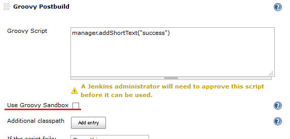#

[[GroovyPostbuildPlugin-Scriptsusingnon-whitelistedmethods]]
=== Scripts using non-whitelisted methods

Scripts using
https://wiki.jenkins.io/display/JENKINS/Groovy+Postbuild+Plugin#GroovyPostbuildPlugin-Non-whitelistedmethods[non-whitelisted
methods of manager] or methods not of manager requires +
approval of administrators.

Administrators should check and approve those scripts in Manage Jenkins
> In-process Script Approval.

[.confluence-embedded-file-wrapper .image-center-wrapper]#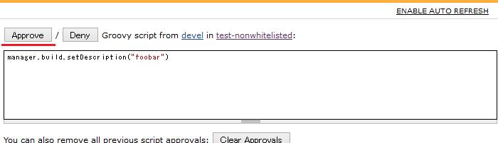#

[[GroovyPostbuildPlugin-Scriptsusingexternaljarfiles]]
=== Scripts using external jar files

If you refer external jar files from your scripts, you need to have
those jar files approved by administartors.

Administrators should check and approve those jar files in Manage
Jenkins > In-process Script Approval.

[.confluence-embedded-file-wrapper .image-center-wrapper]#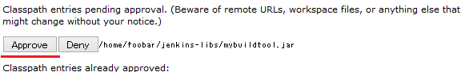#

[[GroovyPostbuildPlugin-Scriptsusingexternalclassdirectories]]
=== Scripts using external class directories

https://wiki.jenkins.io/display/JENKINS/Script+Security+Plugin[Script
Security Plugin] doesn't support class directories.

If you refer external class directories from your scripts, you should
archive them into jar files. +
It can be performed by running a following command:

....
jar -cf mylib.jar -C /path/to/classes .
....

You can use /path/to/mylib.jar as an additonal classpath for scripts.

[[GroovyPostbuildPlugin-Usage]]
== Usage

The groovy script can use the variable _manager_, which provides various
methods to decorate your builds. +
Those methods can be classified into _whitelisted methods_ and
_non-whitelisted methods_. +
You can always use _Whitelisted methods_, but you can use
_Non-whitelisted methods_ only when "Enable groovy postbuild security"
is not enabled (version 1.X) or in scripts approved by administrators
(since version 2.x)

[[GroovyPostbuildPlugin-Whitelistedmethods]]
=== Whitelisted methods

* getEnvVariable(key) - get a variable value. (since 1.10)
* getResult() - get a build result string (like SUCCESS, FAILURE) (since
2.2)

* logContains(regexp) - returns true if the build log file contains a
line matching _regexp_.
* getLogMatcher(regexp) - returns a
http://docs.oracle.com/javase/7/docs/api/java/util/regex/Matcher.html[java.util.regex.Matcher]
for the first occurrence of _regexp_ in the build log file.

* addShortText(text) - puts a badge with a short text, using the default
format.
* addShortText(text, color, background, border, borderColor) - puts a
badge with a short text, using the specified format.  For Colors
supported, Google "html color names".
* addBadge(icon, text) - puts a badge with the given icon and text. In
addition to the
https://github.com/jenkinsci/jenkins/tree/master/war/src/main/webapp/images/16x16[16x16
icons] offered by Jenkins, groovy-postbuild provides the following icons
(watch out for duplicates, see Example 5):
+
____
[.confluence-embedded-file-wrapper]#image:docs/images/completed.gif[image]#
- completed.gif +
[.confluence-embedded-file-wrapper]##
- db_in.gif +
[.confluence-embedded-file-wrapper]##
- db_out.gif +
[.confluence-embedded-file-wrapper]#image:docs/images/delete.gif[image]#
- delete.gif +
[.confluence-embedded-file-wrapper]#image:docs/images/error.gif[image]#
- error.gif +
[.confluence-embedded-file-wrapper]##
- folder.gif +
[.confluence-embedded-file-wrapper]##
- green.gif +
[.confluence-embedded-file-wrapper]#image:docs/images/info.gif[image]#
- info.gif +
[.confluence-embedded-file-wrapper]##
- red.gif +
[.confluence-embedded-file-wrapper]#image:docs/images/save.gif[image]#
- save.gif +
[.confluence-embedded-file-wrapper]#image:docs/images/success.gif[image]#
- success.gif +
[.confluence-embedded-file-wrapper]##
- text.gif +
[.confluence-embedded-file-wrapper]#image:docs/images/warning.gif[image]#
- warning.gif +
[.confluence-embedded-file-wrapper]#image:docs/images/yellow.gif[image]#
- yellow.gif
____

* addBadge(icon, text, link) - like addBadge(icon, text), but the Badge
icon then actually links to the given link (since 1.8)
* addInfoBadge(text) - puts a badge with
[.confluence-embedded-file-wrapper]#image:docs/images/info.gif[image]#
info icon and the given text.
* addWarningBadge(text) - puts a badge with
[.confluence-embedded-file-wrapper]#image:docs/images/warning.gif[image]#
warning icon and the given text.
* addErrorBadge(text) - puts a badge with
[.confluence-embedded-file-wrapper]#image:docs/images/error.gif[image]#
error icon and the given text.
* addHtmlBadge(html) - puts a badge with html source (since 2.5). Unsafe
html codes will be removed.
* removeBadges() - removes all badges from the current build. It is
often used with `+setBuildNumber+`.
* removeBadge(index) - removes the badge with the given index. It is
often used with `+setBuildNumber+`.

* buildUnstable() - sets the build result to _UNSTABLE_.
* buildFailure() - sets the build result to _FAILURE_.
* buildSuccess() - sets the build result to _SUCCESS_.

* buildIsA(klass) - test the build is a specified class (since 2.0)

[[GroovyPostbuildPlugin-Non-whitelistedmethods]]
=== Non-whitelisted methods

Methods returning non-primitive objects aren't whitelisted as
groovy-postbuild doesn't ensure every methods of those objects are safe.

* hudson - the current Hudson instance (see
http://javadoc.jenkins-ci.org/index.html?hudson/model/Hudson.html[hudson.model.Hudson]).
* build - the current build (see
http://javadoc.jenkins-ci.org/index.html?hudson/model/AbstractBuild.html[hudson.model.AbstractBuild]).
* listener - the build listener (see
http://javadoc.jenkins-ci.org/index.html?hudson/model/BuildListener.html[hudson.model.BuildListener]).

* envVars - the build variables map. You can get a variable value with
+
[source,syntaxhighlighter-pre]
----
manager.envVars['varname']
----
+
You shouldn't update values. This isn't whitelisted, and it is
recommended to use `+getEnvVariable(key)+` instead. (since 1.10)

* contains(file, regexp) - returns true if the given file contains a
line matching _regexp_. Not whitelisted as it allows users access any
files (for example, a file containing passwords).
* getMatcher(file, regexp) - returns a
http://docs.oracle.com/javase/7/docs/api/java/util/regex/Matcher.html[java.util.regex.Matcher]
for the first occurrence of _regexp_ in the given file.

* setBuildNumber(number) - sets the build with the given number as
current build. The current build is the target of all methods that add
or remove badges and summaries or change the build result.

* createSummary(icon) - creates an entry in the build summary page and
returns a _summary_ object corresponding to this entry. The icon must be
one of the
https://github.com/jenkinsci/jenkins/tree/master/war/src/main/webapp/images/48x48[48x48
icons] offered by Jenkins. You can append text to the _summary_ object
by calling its _appendText_ methods. Be careful appending HTML-unescaped
texts as they can be harmful.
** appendText(text, escapeHtml)
** appendText(text, escapeHtml, bold, italic, color)
* removeSummaries() - removes all summaries from the current build.
* removeSummary(index) - removes the summary with the given index.

[[GroovyPostbuildPlugin-Restinterfaces]]
=== Rest interfaces

It is also possible to delete badges and summaries by using the
following links:

* remove all badges:
** `+http+``+://+``+your-jenkins+``+/job/+``+your-job+``+/+``+build-number+``+/parent/parent/plugin/groovy-postbuild/removeBadges+`

* remove all summaries:
** `+http+``+://+``+your-jenkins+``+/job/+``+your-job+``+/+``+build-number+``+/parent/parent/plugin/groovy-postbuild/removeSummaries+`

* remove the badge with the given index:
** `+http+``+://+``+your-jenkins+``+/job/+``+your-job+``+/+``+build-number+``+/parent/parent/plugin/groovy-postbuild/removeBadge?index=+``+idx+`

* remove the summary with the given index:
** `+http+``+://+``+your-jenkins+``+/job/+``+your-job+``+/+``+build-number+``+/parent/parent/plugin/groovy-postbuild/removeSummary?index=+``+idx+`

[[GroovyPostbuildPlugin-Exampleusages]]
=== Example usages

[[GroovyPostbuildPlugin-Example1]]
==== Example 1

The script below puts a warning badge and mark the build as unstable if
it detects that deprecated methods were used.

[source,syntaxhighlighter-pre]
----
if(manager.logContains(".*uses or overrides a deprecated API.*")) {
    manager.addWarningBadge("Thou shalt not use deprecated methods.")
    manager.createSummary("warning.gif").appendText("<h1>You have been warned!</h1>", false, false, false, "red")
    manager.buildUnstable()
}
----

[cols=",",options="header",]
|===
a|
[.confluence-embedded-file-wrapper]#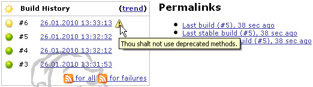#

a|
[.confluence-embedded-file-wrapper]#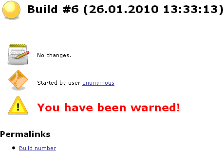#

|===

[[GroovyPostbuildPlugin-Example2]]
==== Example 2

Suppose we have a parameterized build, which uses the boolean parameter
_storeToDB_ in order to instruct the build to store some artifacts into
the database. The script below puts a badge next to the builds for which
this parameter is set.

[source,syntaxhighlighter-pre]
----
if("true".equals(manager.build.buildVariables.get("storeToDB"))) {
    manager.addBadge("db_in.gif", "Stored to DB")
}
----

[.confluence-embedded-file-wrapper]#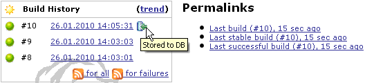#

[[GroovyPostbuildPlugin-Example3]]
==== Example 3

Suppose we have a parameterized build, which uses the string parameter
_version_. The script below puts a short text indicating the value of
this parameter next to successful and unstable builds.

[source,syntaxhighlighter-pre]
----
if(manager.build.result.isBetterOrEqualTo(hudson.model.Result.UNSTABLE)) {
    manager.addShortText("v${manager.build.buildVariables.get('version')}")
}
----

[.confluence-embedded-file-wrapper]#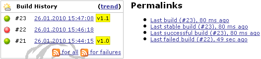#

[[GroovyPostbuildPlugin-Example4]]
==== Example 4

The script below determines how long it took to build the project and
displays the corresponding value as a short text next to each build.

[source,syntaxhighlighter-pre]
----
def matcher = manager.getLogMatcher(".*Total time: (.*)\$")
if(matcher?.matches()) {
    manager.addShortText(matcher.group(1), "grey", "white", "0px", "white")
}
----

[.confluence-embedded-file-wrapper]#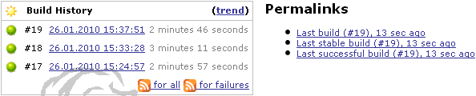#

[[GroovyPostbuildPlugin-Example5]]
==== Example 5

For badges, you can choose from the
https://github.com/jenkinsci/jenkins/tree/master/war/src/main/webapp/images/16x16[16x16
icons] provided by Jenkins or from the icons provided by this plugin.
Some of the names of groovy-postbuild icons conflict with the names of
Jenkins icons (e.g. yellow.gif). For these icons, you have to provide
the complete path (e.g. /images/16x16/yellow.gif), in case you want a
badge with the Jenkins icon. You can also use icons provided by other
plugins (e.g.
http://wiki.jenkins-ci.org/display/JENKINS/Green+Balls[Green Balls]), by
specifying the complete path to the icon.

[source,syntaxhighlighter-pre]
----
manager.addBadge("star-gold.gif", "icon from Jenkins")
manager.addBadge("yellow.gif", "icon from groovy-postbuild plugin")
manager.addBadge("/images/16x16/yellow.gif", "icon from Jenkins")
manager.addBadge("/plugin/greenballs/16x16/green.gif", "icon from greenballs plugin")
----

[.confluence-embedded-file-wrapper]#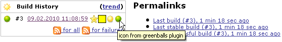#

[[GroovyPostbuildPlugin-Example6]]
==== Example 6

The script below displays on the build summary page all classes that use
Sun proprietary API.

[source,syntaxhighlighter-pre]
----
pattern = ~/.*src\/main\/java\/(.*)\.java:[^ ]* (.*) is Sun proprietary API and may be removed in a future release.*/
def map = [:]
manager.build.logFile.eachLine { line ->
    matcher = pattern.matcher(line)
    if(matcher.matches()) {
        ownClass = matcher.group(1).replaceAll("/", ".")
        sunClass = matcher.group(2)
        map[ownClass] = sunClass
    }
}
if(map.size() > 0) {
    def summary = manager.createSummary("warning.gif")
    summary.appendText("Classes using Sun proprietary API:<ul>", false)
    map.each {
        summary.appendText("<li><b>$it.key</b> - uses $it.value</li>", false)
    }
    summary.appendText("</ul>", false)
}
----

[.confluence-embedded-file-wrapper]#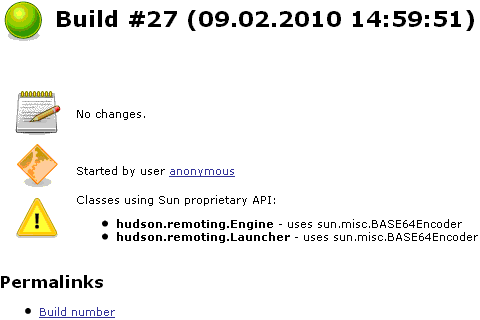#

[[GroovyPostbuildPlugin-Example7]]
==== Example 7

The script below removes all badges and summaries from previous builds.

[source,syntaxhighlighter-pre]
----
currentBuildNumber = manager.build.number
for(i=1; i<currentBuildNumber; i++) {
    if(manager.setBuildNumber(i)) {
        manager.removeBadges()
        manager.removeSummaries()
    }
}
----

[[GroovyPostbuildPlugin-Example8]]
==== Example 8

The script below marks the running build as deployed and the previous
build as undeployed.

[source,syntaxhighlighter-pre]
----
manager.addShortText("deployed")
manager.createSummary("gear2.gif").appendText("<h2>Successfully deployed</h2>", false)

currentBuildNumber = manager.build.number
if(manager.setBuildNumber(currentBuildNumber - 1)) {
   actions = manager.build.actions
    actions.each { action ->
        if (action.metaClass.hasProperty(action, "text") && action.text.contains("deployed")) {
            actions.remove(action)
        }
    }
    currDate = new Date().dateTimeString
    manager.addShortText("undeployed: $currDate", "grey", "white", "0px", "white")
    manager.createSummary("gear2.gif").appendText("<h2>Undeployed: $currDate</h2>", false, false, false, "grey")
}
----

[.confluence-embedded-file-wrapper]#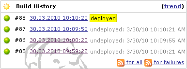#

[[GroovyPostbuildPlugin-Example9(thankstoKenBertelson)]]
==== Example 9 (thanks to Ken Bertelson)

The script below changes the description of the first failed test.

[source,syntaxhighlighter-pre]
----
def tr = manager.build.testResultAction.result
def cr = tr.failedTests.get(0)
cr.description = "My CaseResult desc"
----

[[GroovyPostbuildPlugin-Example10(thankstoFrankMerrow)]]
==== Example 10 (thanks to Frank Merrow)

Trivial, but hard to find the first time: Write a line to the job's
Console Output:

[source,syntaxhighlighter-pre]
----
manager.listener.logger.println("I want to see this line in my job's output");
----

[[GroovyPostbuildPlugin-Issues]]
== Issues

To report a bug or request an enhancement to this plugin please create a
ticket in JIRA (you need to login or to sign up for an account). Also
have a look on
https://wiki.jenkins.io/display/JENKINS/How+to+report+an+issue[How to
report an issue]

* https://issues.jenkins-ci.org/issues/?jql=project%20%3D%20JENKINS%20AND%20status%20in%20(Open%2C%20%22In%20Progress%22%2C%20Reopened%2C%20%22In%20Review%22%2C%20Verified)%20AND%20component%20%3D%20%27groovy-postbuild-plugin%27%20[Open
Issues]
* https://issues.jenkins-ci.org/secure/CreateIssueDetails!init.jspa?pid=10172&issuetype=1&components=15685&priority=4&assignee=ikedam[Bug
report]
* https://issues.jenkins-ci.org/secure/CreateIssueDetails!init.jspa?pid=10172&issuetype=4&components=15685&priority=4[Request
or propose an improvement of existing feature]
* https://issues.jenkins-ci.org/secure/CreateIssueDetails!init.jspa?pid=10172&issuetype=2&components=15685&priority=4[Request
or propose a new feature]

 +

[[GroovyPostbuildPlugin-Changelog]]
== Changelog

[[GroovyPostbuildPlugin-Version2.5(Jun24,2019)]]
=== Version 2.5 (Jun 24, 2019)

* Requires Jenkins-[.blob-code-inner]#2.[.x .x-first .x-last]#121.1##
and later.
* New feature: `+addHtmlBadge+`  is available
[.jira-issue .conf-macro .output-block]#
https://issues.jenkins-ci.org/browse/JENKINS-57917[[.aui-icon .aui-icon-wait .issue-placeholder]##
##JENKINS-57917] - [.summary]#Getting issue details...#
[.aui-lozenge .aui-lozenge-subtle .aui-lozenge-default .issue-placeholder]#STATUS#
#
+
[source,syntaxhighlighter-pre]
----
manager.addHtmlBadge('<i>Italic text</i>');
----
* groovy-postbuild no longer requires Overall/Administer permission:
[.jira-issue .conf-macro .output-block]#
https://issues.jenkins-ci.org/browse/JENKINS-54262[[.aui-icon .aui-icon-wait .issue-placeholder]##
##JENKINS-54262] - [.summary]#Getting issue details...#
[.aui-lozenge .aui-lozenge-subtle .aui-lozenge-default .issue-placeholder]#STATUS#
#
** It caused problems when used with
https://wiki.jenkins.io/display/JENKINS/Authorize+Project+plugin[Authorize
Project plugin]
* Suppress "WARNING: Avoid calling getLogFile on ..." when used in
pipeline jobs.
** It gets warned since
https://wiki.jenkins.io/display/JENKINS/Pipeline+Job+Plugin[Pipeline Job
Plugin] 2.26.

[[GroovyPostbuildPlugin-Version2.4.3(Nov18,2018)]]
=== Version 2.4.3 (Nov 18, 2018)

* FIX: removeSummary / removeSummaries doesn't work (throw
UnsupportedOperationException) (http://54184@issue/[JENKINS-54184])

[[GroovyPostbuildPlugin-Version2.4.2(Aug8,2018)]]
=== Version 2.4.2 (Aug 8, 2018)

* FIX: removeBadge / removeBadges doesn't work (throw
UnsupportedOperationException)
(https://issues.jenkins-ci.org/browse/JENKINS-52043[JENKINS-52043])

[[GroovyPostbuildPlugin-Version2.4.1(May4,2018)]]
=== Version 2.4.1 (May 4, 2018)

* Have
https://wiki.jenkins.io/display/JENKINS/Build+Monitor+Plugin[Build
Monitor Plugin] not to cause errors.
(https://issues.jenkins-ci.org/browse/JENKINS-50420[JENKINS-50420])
** Introduced fake `+GroovyPostbuildAction+`.
** The feature of build-monitor to cooperate with groovy-postbuild
doesn't work yet. It requires the upcoming version of build-monitor
plugin to have it work again.

[[GroovyPostbuildPlugin-Version2.4(Mar25,2018)]]
=== Version 2.4 (Mar 25, 2018)

* *Now built for Jenkins-2.60.3 and later*
* Extract badge and summary features to
https://plugins.jenkins.io/badge[[.confluence-link]#Badge plugin#]
(https://issues.jenkins-ci.org/browse/JENKINS-43992[JENKINS-43992]). +
** You can use badge and summary features in pipeline only with
badge-plugin.
See https://wiki.jenkins.io/display/JENKINS/Badge+Plugin[Badge Plugin]
for more details.
* Sanitize HTML in the badges.
** You no longer be able to use HTML expressions in badge contents.
* *Don't upgrade to this version if you use
https://wiki.jenkins.io/display/JENKINS/Build+Monitor+Plugin[Build
Monitor Plugin].*
** Groovy-postbuild-2.4 breaks build-moitor-1.12 or earlier. Sorry.
** Please postpone upgrading groovy-postbuild till fixing this issue:
https://issues.jenkins-ci.org/browse/JENKINS-50420[JENKINS-50420]
** No new features in groovy-postbuild-2.4, and you can use
groovy-postbuild-2.3.1.
*** You can downgrade your groovy-postbuild in the Jenkins Plugin
Management page.
*** You can download earlier versions of groovy-postbuild from
"Archives" link in https://plugins.jenkins.io/groovy-postbuild
* Some classes are migrated to badge-plugin. Please change classes in
your codes if you access those classes:
+
[cols=",",options="header",]
|===
|Old Class |New Class
|org.jvnet.hudson.plugins.groovypostbuild.GroovyPostbuildAction
|com.jenkinsci.plugins.badge.action.BadgeAction

|org.jvnet.hudson.plugins.groovypostbuild.GroovyPostbuildSummaryAction
|com.jenkinsci.plugins.badge.action.BadgeSummaryAction
|===

[[GroovyPostbuildPlugin-Version2.3.1(Feb7,2016)]]
=== Version 2.3.1 (Feb 7, 2016)

* Dependency to pipeline (aka. workflow) is optional
(https://issues.jenkins-ci.org/browse/JENKINS-32589[JENKINS-32589]).

[[GroovyPostbuildPlugin-Version2.3(Dec27,2015)]]
=== Version 2.3 (Dec 27, 2015)

* *Now built for Jenkins-1.609 and later*
* Supports workflow
(https://issues.jenkins-ci.org/browse/JENKINS-26918[JENKINS-26918])
** You can use `+manager+` in workflow scripts.

[[GroovyPostbuildPlugin-Version2.2.2(Oct17,2015)]]
=== Version 2.2.2 (Oct 17, 2015)

* Added MIT License
(https://issues.jenkins-ci.org/browse/JENKINS-21270[JENKINS-21270])

[[GroovyPostbuildPlugin-Version2.2.1(Aug18,2015)]]
=== Version 2.2.1 (Aug 18, 2015)

* Improved the behavior with
https://wiki.jenkins.io/display/JENKINS/Template+Project+Plugin[Template
Project Plugin]
(https://issues.jenkins-ci.org/browse/JENKINS-21276[JENKINS-21276])
** Prior versions disturbed the execution of
https://wiki.jenkins.io/display/JENKINS/Template+Project+Plugin[Template
Project Plugin] when the build was failed (even if the groovy script
succeeded).

[[GroovyPostbuildPlugin-Version2.2(Dec19,2014)]]
=== Version 2.2 (Dec 19, 2014)

* added getResult() as a whitelisted method
(https://issues.jenkins-ci.org/browse/JENKINS-25738[JENKINS-25738])

[[GroovyPostbuildPlugin-Version2.1(Oct25,2014)]]
=== Version 2.1 (Oct 25, 2014)

* You can access other plugins in groovy scripts
(https://issues.jenkins-ci.org/browse/JENKINS-14154[JENKINS-14154])

[[GroovyPostbuildPlugin-Version2.0(Sep21,2014)]]
=== Version 2.0 (Sep 21, 2014)

* Changed target Jenkins core from 1.466 to 1.509.4.
* Introduced
https://wiki.jenkins.io/display/JENKINS/Script+Security+Plugin[Script
Security Plugin].
(https://issues.jenkins-ci.org/browse/JENKINS-15212[JENKINS-15212])
** You need reconfigure your projects or approve scripts. Have a look at
https://wiki.jenkins.io/display/JENKINS/Groovy+Postbuild+Plugin#GroovyPostbuildPlugin-Migrationfrom1.X[#Migration
from 1.X]
* Added `+manager.buildIsA(klcass)+`.
(https://issues.jenkins-ci.org/browse/JENKINS-24694[JENKINS-24694])

[[GroovyPostbuildPlugin-Version1.10(July26,2014)]]
=== Version 1.10 (July 26, 2014)

* added `+envVars+` and `+getEnvVariable(key)+`

[[GroovyPostbuildPlugin-Version1.9(April29,2014)]]
=== Version 1.9 (April 29, 2014)

* https://issues.jenkins-ci.org/browse/JENKINS-21924[JENKINS-21924]
Support run for matrix parent
* change log level for each search from info to fine

[[GroovyPostbuildPlugin-Version1.8(August22,2012)]]
=== Version 1.8 (August 22, 2012)

* https://issues.jenkins-ci.org/browse/JENKINS-13024[JENKINS-13024]
Error in log indicating a missing descriptor
* added clickable badge
* Changed required Jenkins version to 1.466

[[GroovyPostbuildPlugin-Version1.7(May2,2012)]]
=== Version 1.7 (May 2, 2012)

* https://issues.jenkins-ci.org/browse/JENKINS-13024[JENKINS-13024]
Error in log indicating a missing descriptor

[[GroovyPostbuildPlugin-Version1.6]]
=== Version 1.6

* https://issues.jenkins-ci.org/browse/JENKINS-9383[JENKINS-9383]
security - restrict access to internal objects

Can use now additional classpath for groovy postbuild scripts to have
them in a central location. Scriptler Plugin?

[[GroovyPostbuildPlugin-Version1.5(November5,2011)]]
=== Version 1.5 (November 5, 2011)

* Remove a html tag from the config page which causes an error on IE 7
(https://issues.jenkins-ci.org/browse/JENKINS-10079[JENKINS-10079])

 +
