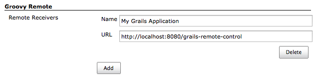
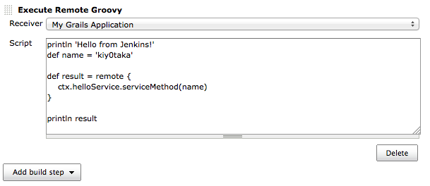

[.conf-macro .output-inline]#This plugin provides
http://groovy.codehaus.org/modules/remote/[Groovy Remote Control]'s
receiver, and allows to control external application from Jenkins.#

[[GroovyRemoteControlPlugin-ControlJenkinsfromGroovy]]
== Control Jenkins from Groovy

[source,syntaxhighlighter-pre]
----
import groovyx.remote.client.RemoteControl
import groovyx.remote.transport.http.HttpTransport

def transport = new HttpTransport("http://your-jenkins/plugin/groovy-remote/")
def remote = new RemoteControl(transport)

// This code runs on local.
def name = 'kiy0taka'
println name

def result = remote {
    // This clousre runs on Jenkins server.
    def version = jenkins.version.value
    println "Hi, ${name}!"

    // Return Jenkins version.
    return version
}

// This code runs on local.
println "Jenkins version was ${result}."
----

[[GroovyRemoteControlPlugin-ControlyourGrailsapplicationfromJenkins]]
== Control your Grails application from Jenkins

. Install http://grails.org/plugin/remote-control[Grails Remote Control
plugin] into your Grails application.
. Register Remote Receiver to Jenkins. +
[.confluence-embedded-file-wrapper]##
. Create Control Job, and add build step. +
[.confluence-embedded-file-wrapper]##

[[GroovyRemoteControlPlugin-ReleaseHistory]]
== Release History

[[GroovyRemoteControlPlugin-Version0.2(Sep12,2012)]]
=== Version 0.2 (Sep 12, 2012)

* Support proxy.
* Added HTTP header settings.
* Fixed NoClassDefFoundError in RemoteBuilder.

[[GroovyRemoteControlPlugin-Version0.1(Aug9,2012)]]
=== Version 0.1 (Aug 9, 2012)

* Initial release
