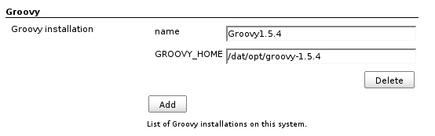
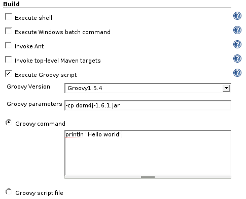
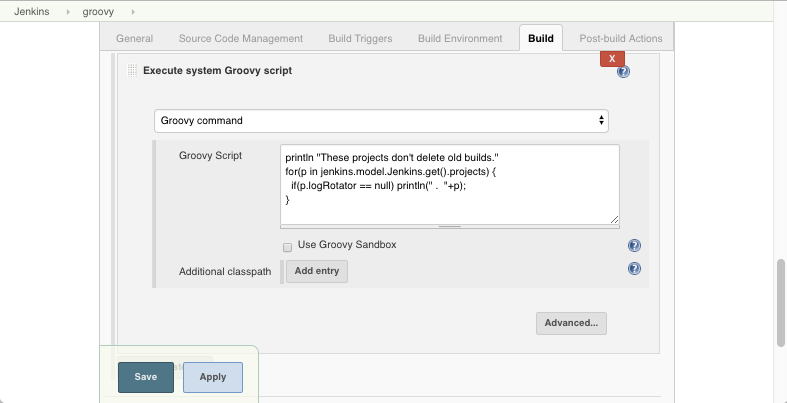
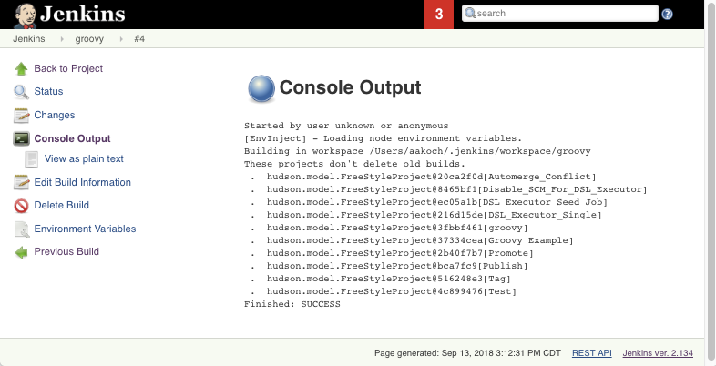

[.conf-macro .output-inline]# #

[.aui-icon .aui-icon-small .aui-iconfont-info .confluence-information-macro-icon]##

Older versions of this plugin may not be safe to use. Please review the
following warnings before using an older version:

* https://jenkins.io/security/advisory/2017-04-10/[Arbitrary code
execution vulnerability]
* https://jenkins.io/security/advisory/2019-01-28/#SECURITY-1293[Script
Security sandbox bypass]
* https://jenkins.io/security/advisory/2019-03-06/#SECURITY-1338[Script
security sandbox bypass]

This plugin adds the ability to directly execute Groovy code.

[[Groovyplugin-Configuration]]
== Configuration

To configure available Groovy installation on your system, go to Jenkins
configuration page, find section 'Groovy' and fill the form as shown
bellow.

 +
[.confluence-embedded-file-wrapper]##

If you don't configure any Groovy installation and select `+(Default)+`
option in a job, the plugin will fallback into calling just
the `+groovy+` command, assuming you have `+groovy+` binary on the
default path on given machine.

[[Groovyplugin-Usage]]
== Usage

To create Groovy-based project, add new free-style project and select
"Execute Groovy script" in the Build section, select previously
configured Groovy installation and then type your command, or specify
your script file name. In the second case path taken is relatively from
the project workspace directory.

Jenkins 1.x:

[.confluence-embedded-file-wrapper]##

 +

Jenkins 2.x:

[.confluence-embedded-file-wrapper .confluence-embedded-manual-size]#image:docs/images/image2018-9-13_11-52-26.png[Jenkins
2.x,title="Jenkins 2.x",height=250]#

The plugin also adds the functionality of the
https://wiki.jenkins-ci.org/display/JENKINS/Jenkins+Script+Console[Script
Console] to the project configuration page.

You can schedule your system management script...

 +
[.confluence-embedded-file-wrapper .confluence-embedded-manual-size]##

...and then observe progress in the build log.

 +
[.confluence-embedded-file-wrapper .confluence-embedded-manual-size]##

[[Groovyplugin-GroovyScriptvsSystemGroovyScript]]
=== Groovy Script vs System Groovy Script

The plain "Groovy Script" is run in a forked JVM, on the slave where the
build is run. It's the basically the same as running the "groovy"
command and pass in the script.

The system Groovy script on the other hand runs inside the Jenkins
master's JVM. Thus it will have access to all the internal objects of
Jenkins, so you can use this to alter the state of Jenkins. It is
similar to the
https://wiki.jenkins-ci.org/display/JENKINS/Jenkins+Script+Console[Jenkins
Script Console] functionality.

[[Groovyplugin-Security]]
=== Security

System groovy jobs has access to whole Jenkins, therefore only users
with admin rights can add system Groovy build step and configure the
system Groovy script. Permissions are not checked when the build is
triggered (i.e. also uses without admin rights can also run the script).
The idea is to allow users run some well defined (defined by admin)
system tasks when they need it (e.g. put slave offline/online, when user
wants to start some debugging on slave). To have Jenkins instance
secure, the support for Token macro plugin has to be switched off, see
section below.

[[Groovyplugin-Tokenmacropluginsupport]]
=== Token macro plugin support

Groovy plugin provides support for
 https://wiki.jenkins-ci.org/display/JENKINS/Token+Macro+Plugin[Token
Macro Plugin]. Expression is _GROOVY_ with parameter _script_:

....
${GROOVY,script = "return hudson.model.Hudson.instance.pluginManager.plugins"}
....

By default, the support for token macro pressing is switched off and has
to be switch on in global config page.

[.aui-icon .aui-icon-small .aui-iconfont-error .confluence-information-macro-icon]#
#

If token macro processing via Token Macro Plugin is allowed, the
evaluation of macro is done in System Groovy, therefore any user can run
arbitrary system script, regardless he has administer permission!

[[Groovyplugin-Examples]]
=== Examples

[[Groovyplugin-Retrievingparametersandtriggeringanotherbuild]]
==== Retrieving parameters and triggering another build

Execute a system Groovy script like:

[source,syntaxhighlighter-pre]
----
import hudson.model.*
import hudson.AbortException
import hudson.console.HyperlinkNote
import java.util.concurrent.CancellationException

// Retrieve parameters of the current build
def foo = build.buildVariableResolver.resolve("FOO")
println "FOO=$foo"

// Start another job
def job = Hudson.instance.getJob('MyJobName')
def anotherBuild
try {
    def params = [
      new StringParameterValue('FOO', foo),
    ]
    def future = job.scheduleBuild2(0, new Cause.UpstreamCause(build), new ParametersAction(params))
    println "Waiting for the completion of " + HyperlinkNote.encodeTo('/' + job.url, job.fullDisplayName)
    anotherBuild = future.get()
} catch (CancellationException x) {
    throw new AbortException("${job.fullDisplayName} aborted.")
}
println HyperlinkNote.encodeTo('/' + anotherBuild.url, anotherBuild.fullDisplayName) + " completed. Result was " + anotherBuild.result

// Check that it succeeded
build.result = anotherBuild.result
if (anotherBuild.result != Result.SUCCESS && anotherBuild.result != Result.UNSTABLE) {
    // We abort this build right here and now.
    throw new AbortException("${anotherBuild.fullDisplayName} failed.")
}

// Do something with the output.
// On the contrary to Parameterized Trigger Plugin, you may now do something from that other build instance.
// Like the parsing the build log (see http://javadoc.jenkins-ci.org/hudson/model/FreeStyleBuild.html )
// You probably may also wish to update the current job's environment.
build.addAction(new ParametersAction(new StringParameterValue('BAR', '3')))
----

[[Groovyplugin-Retrieveproperties]]
==== Retrieve properties

To retrieve properties defined in the Properties field use:

[source,syntaxhighlighter-pre]
----
System.getProperty('FOO')
----

[[Groovyplugin-Usagewithpipeline]]
=== Usage with pipeline

Currently the plugin does not support pipeline syntax. One workaround
from https://wiki.jenkins-ci.org/display/~alexander_samoylov[Unknown
User (alexander_samoylov)] was mentioned here:
https://stackoverflow.com/a/58381147/4807875.

[[Groovyplugin-Changelog]]
==  +
Changelog

[[Groovyplugin-Release2.2(2019-03-06)]]
=== Release 2.2 (2019-03-06)

* https://jenkins.io/security/advisory/2019-03-06/#SECURITY-1339[Fix
security issue]

[[Groovyplugin-Release2.1(2019-01-28)]]
=== Release 2.1 (2019-01-28)

* https://jenkins.io/security/advisory/2019-01-28/[Fix security issue]

[[Groovyplugin-Release2.0(2017-04-10)]]
=== Release 2.0 (2017-04-10)

* Arbitrary code execution by unprivileged user
(https://jenkins.io/security/advisory/2017-04-10/#groovy-plugin[SECURITY-292])
* continue with code cleanup - fixed Findbugs issues

[[Groovyplugin-Release1.30(2016-11-18)]]
=== Release 1.30 (2016-11-18)

* XSS protection
* code cleanup

[[Groovyplugin-Release1.28,1.29(2016-01-05)]]
=== Release 1.28, 1.29 (2016-01-05)

* code cleanup

[[Groovyplugin-Release1.27(2015-08-05)]]
=== Release 1.27 (2015-08-05)

* `+Callable+` roles are properly checked

[[Groovyplugin-Release1.26(2015-07-27)]]
=== Release 1.26 (2015-07-27)

* Ensured correct position of class path option
(https://issues.jenkins-ci.org/browse/JENKINS-29577[JENKINS-29577])
* Improved help (https://github.com/jenkinsci/groovy-plugin/pull/18[pr
#18])

[[Groovyplugin-Release1.25(2015-05-11)]]
=== Release 1.25 (2015-05-11)

* Made default choice also for System Groovy script to avoid zero height
of textarea
(https://issues.jenkins-ci.org/browse/JENKINS-25455[JENKINS-25455])
* Add help file for Groovy version
(https://issues.jenkins-ci.org/browse/JENKINS-12988[JENKINS-12988])
* Made setting Groovy installations thread-safe
(https://issues.jenkins-ci.org/browse/JENKINS-28287[JENKINS-28287])

[[Groovyplugin-Release1.24(2014-11-09)]]
=== Release 1.24 (2014-11-09)

* Ensure non-zero height of Groovy command text box, making it default
choice when adding new build step
(https://issues.jenkins-ci.org/browse/JENKINS-25455[JENKINS-25455])

[[Groovyplugin-Release1.23(2014-10-27)]]
=== Release 1.23 (2014-10-27)

* Set up correct GROOVY_HOME environment variable
(https://issues.jenkins-ci.org/browse/JENKINS-25275[JENKINS-25275])

[[Groovyplugin-Release1.22(2014-09-30)]]
=== Release 1.22 (2014-09-30)

* Fixed slashes conversion in script parameters
(https://issues.jenkins-ci.org/browse/JENKINS-24870[JENKINS-24870])

[[Groovyplugin-Release1.21(2014-09-18)]]
=== Release 1.21 (2014-09-18)

* Allow spaces in script parameters
(https://issues.jenkins-ci.org/browse/JENKINS-24757[JENKINS-24757])

[[Groovyplugin-Release1.20(2014-07-30)]]
=== Release 1.20 (2014-07-30)

* Unable to specify multiple jars on class path for a system groovy
script
(https://issues.jenkins-ci.org/browse/JENKINS-23997[JENKINS-23997])

[[Groovyplugin-Release1.19(2014-07-07)]]
=== Release 1.19 (2014-07-07)

* Better parsing of parameters passed to Groovy binary,
http://commons.apache.org/proper/commons-exec/[Apache commons-exec] used
for parsing
(https://issues.jenkins-ci.org/browse/JENKINS-23617[JENKINS-23617])

[[Groovyplugin-Release1.18(2014-05-13)]]
=== Release 1.18 (2014-05-13)

* NPE fixes
(https://issues.jenkins-ci.org/browse/JENKINS-17171[JENKINS-17171])

[[Groovyplugin-Release1.17(2014-05-09)]]
=== Release 1.17 (2014-05-09)

* Allow whitespaces in properties (passed via -D switch)
(https://github.com/jenkinsci/groovy-plugin/pull/13[pull13])

[[Groovyplugin-Release1.16(2014-04-07)]]
=== Release 1.16 (2014-04-07)

* Upgrade to @DataBoundConstructor
(https://issues.jenkins-ci.org/browse/JENKINS-6797[JENKINS-6797])
* Fixed typo in warrning message
(https://github.com/jenkinsci/groovy-plugin/pull/12[pull12])

[[Groovyplugin-Release1.15(2014-01-31)]]
=== Release 1.15 (2014-01-31)

* Syntax highlighting
* Syntax validation button
* Prepare for Jenkins core upgrade to Groovy 2.x
(https://github.com/jenkinsci/groovy-plugin/pull/9[pull9])

[[Groovyplugin-Release1.14(2013-07-02)]]
=== Release 1.14 (2013-07-02)

* Right to run the System Groovy script changed from ADMINISTER to
RUN_SCRIPTS (https://github.com/jenkinsci/groovy-plugin/pull/7[pull7])

[[Groovyplugin-Release1.13(2013-03-01)]]
=== Release 1.13 (2013-03-01)

* Added build context (build, launcher, listener) into system groovy
build step (https://github.com/jenkinsci/groovy-plugin/pull/6[pull6])

[[Groovyplugin-Release1.12(2012-03-08)]]
=== Release 1.12 (2012-03-08)

* Fixed configuration of Token macro
(https://github.com/jenkinsci/groovy-plugin/pull/5[pull5])

[[Groovyplugin-Release1.11(2012-02-26)]]
=== Release 1.11 (2012-02-26)

* Enabled env. variables expansion class path, groovy and script
parameters

[[Groovyplugin-Release1.10(2012-02-09)]]
=== Release 1.10 (2012-02-09)

* Fixed possible job configuration corruption when user isn't admin
(https://issues.jenkins-ci.org/browse/JENKINS-12080[JENKINS-12080])
* Avoid NPE, add fallback if groovy executable is misoncifured
(https://issues.jenkins-ci.org/browse/JENKINS-11652[JENKINS-11652])

[[Groovyplugin-Release1.9(2011-09-14)]]
=== Release 1.9 (2011-09-14)

* Auto installer
(https://issues.jenkins-ci.org/browse/JENKINS-7113[JENKINS-7113] and
https://issues.jenkins-ci.org/browse/JENKINS-10920[JENKINS-10920])
* Fixed error message on global config page
(https://issues.jenkins-ci.org/browse/JENKINS-10768[JENKINS-10768])
* Expansion of job parameters
(https://issues.jenkins-ci.org/browse/JENKINS-10525[JENKINS-10525])
* Full access to JAVA_OPTS (i.e. parameters like -Xmx can be set up)
* Editable class path

[[Groovyplugin-Release1.8(2011-05-13)]]
=== Release 1.8 (2011-05-13)

* Fixed a configuration persistence problem that can create huge
config.xml

[[Groovyplugin-Release1.7(2011-03-09)]]
=== Release 1.7 (2011-03-09)

* Added support for
https://wiki.jenkins-ci.org/display/JENKINS/Token+Macro+Plugin[Token
Macro Plugin]

[[Groovyplugin-Release1.6(2011-02-08)]]
=== Release 1.6 (2011-02-08)

* Fixed security issue

[[Groovyplugin-Release1.5(2010-11-10)]]
=== Release 1.5 (2010-11-10)

* Classloader for actual System Groovy
(https://issues.jenkins-ci.org/browse/JENKINS-6068[JENKINS-6068])
* Allowed groovy.bat in addition to groovy.exe
(https://issues.jenkins-ci.org/browse/JENKINS-6839[JENKINS-6839])
* Temp files are removed
(https://issues.jenkins-ci.org/browse/JENKINS-3269[JENKINS-3269])
* Hudson global properties are expanded in groovy script file path
(https://issues.jenkins-ci.org/browse/JENKINS-8048[JENKINS-8048])
* Upgraded to 1.358
(https://issues.jenkins-ci.org/browse/JENKINS-6081[JENKINS-6081])

[[Groovyplugin-Release1.4(2009-12-29)]]
=== Release 1.4 (2009-12-29)

* Improve error message for missing groovy executable
* Update uses of deprecated APIs

[[Groovyplugin-Release1.2]]
=== Release 1.2

* Added possibility to specify properties and script parameters.
* Added script source choice (file/command) for system groovy scripts.
* Used .exe instead of .bat on Windows (as suggested by Scott Armit).
* Added configuration option for classpath and initial variable bindings
for +
https://wiki.jenkins-ci.org/display/JENKINS/Jenkins+Script+Console[system
groovy] scripts.

[[Groovyplugin-Knownbugs]]
== Known bugs

* Configuring more builders at once actually doesn't absolutely work. If
you need more groovy builders in your project, you have to configure
them one by one and always save project configuration before you add new
one.
