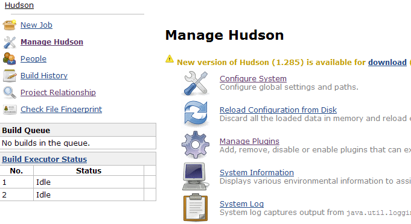
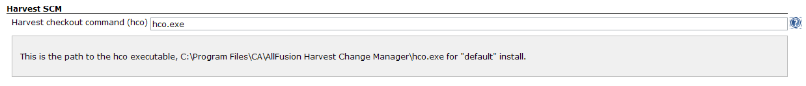
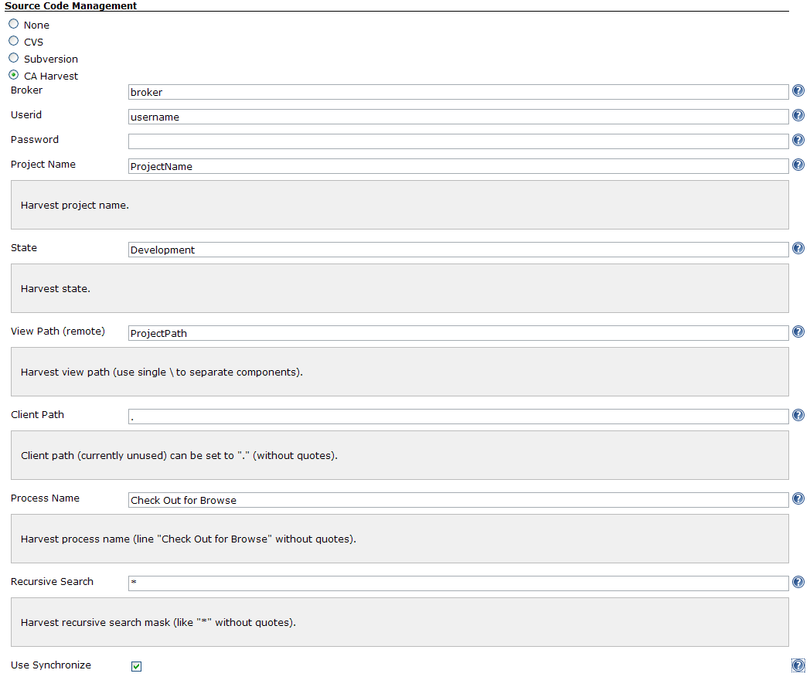

[.conf-macro .output-inline]##

[cols="",options="header",]
|===
|Plugin Information
|View Harvest SCM https://plugins.jenkins.io/harvest[on the plugin site]
for more information.
|===

[.aui-icon .aui-icon-small .aui-iconfont-warning .confluence-information-macro-icon]##

*This plugin is up for adoption.* Want to help improve this plugin?
https://wiki.jenkins-ci.org/display/JENKINS/Adopt+a+Plugin[Click here to
learn more]!

[.conf-macro .output-inline]#This plugin allows you to use
http://www.ca.com/us/products/product.aspx?id=255[CA Harvest] as a SCM.#

[[HarvestPlugin-ConfiguringtheHarvestPlugin]]
== Configuring the Harvest Plugin

First things first - install the plugin, either through the Jenkins
plugin administration, or manually.

[[HarvestPlugin-ConfiguringtheHarvestSettings]]
=== Configuring the Harvest Settings

Select _Manage Jenkins_ from the main menu, then select _Configure
System_ from the options presented:

 +
[.confluence-embedded-file-wrapper]## +
 +
 If the plugin was installed properly, you should find a section on this
page for Harvest which looks like this: +
[.confluence-embedded-file-wrapper]## +
 

[[HarvestPlugin-ConfiguringaBuildtoUseHarvest]]
=== Configuring a Build to Use Harvest

Once the server settings are configured, new builds can choose it for
pulling down code. Create a new build, give it a job name, and select
the type of build (free-style, maven2, etc) and click _OK_. On the
subsequent screen, you'll see a section called _Source Code Management_
where you can select Harvest. Select Harvest, and the following options
will appear: +
[.confluence-embedded-file-wrapper]##

[[HarvestPlugin-ChangeLog]]
== Change Log

[[HarvestPlugin-Version0.3(Mar3,2010)]]
=== Version 0.3 (Mar 3, 2010)

* Update code for more recent Hudson

[[HarvestPlugin-Version0.2.7(Sep5,2009)]]
=== Version 0.2.7 (Sep 5, 2009)
