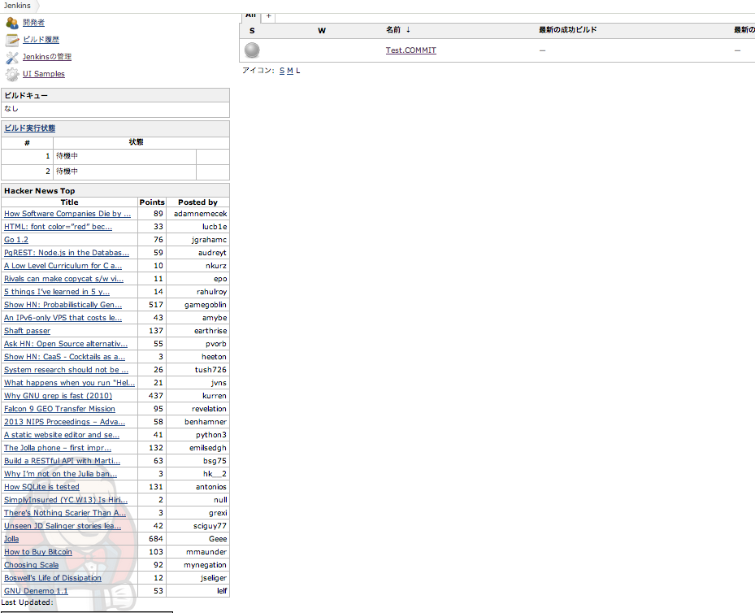

 +
 +
[.conf-macro .output-inline]# #

This plugin displays Hacker news top timeline.

You can confirm important tech news for great hacker while your Jenkins
is building.

[.confluence-embedded-file-wrapper]##

[[HckrnewsPlugin-Howtouseit]]
== How to use it

All you have to do is install hckrnews-plugin.

[[HckrnewsPlugin-ChangeLog]]
== Change Log

[[HckrnewsPlugin-Version1.1]]
=== Version 1.1

* Add wiki url to pom.xml

[[HckrnewsPlugin-Version1.0]]
=== Version 1.0

* Initial release
