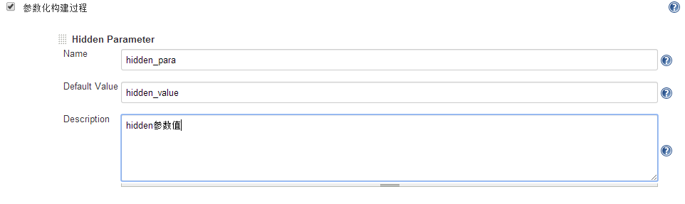
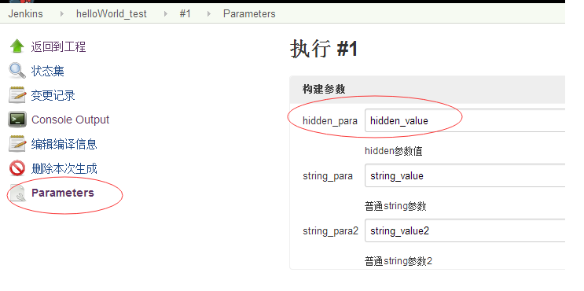

[[HiddenParameterPlugin-HiddenParameterPlugin]]
== Hidden Parameter Plugin

This plugin adds support for Parameter. After the plugin is installed,in
job configuration's page,you can see Hidden Parameter.

[[HiddenParameterPlugin-Characteristics]]
=== Characteristics 

{empty}1. Parameters once more, it looks bad user experience.this plugin
can resolve the problem. +
2. Some key parameters, once modified, can lead to the risk.these
parameters,only administrator can modify,to reduce the risk. +
3. Hidden parameter,only hide in the build execution, in job
configuration's page can modify. +
4. After the build, parameter list can display hidden parameters.

[[HiddenParameterPlugin-Install]]
=== Install  [.confluence-embedded-file-wrapper]##

[[HiddenParameterPlugin-UseCase]]
=== Use Case

After the plugin is installed,in job configuration's page,you can see
Hidden Parameter: +
[.confluence-embedded-file-wrapper .image-left-wrapper]#image:docs/images/JobConfiguration1.png[image]# +
for example,you add a hidden parameter,is called hidden_para. +
[.confluence-embedded-file-wrapper]## +
click 'Build With Parameters' link ,the parameter hidden_para of the set
before, is hide,don't display in this page.  +
[.confluence-embedded-file-wrapper]## +
After the build , click 'Parameters' link, parameter list can display
hidden parameters hidden_para. +
[.confluence-embedded-file-wrapper]##

[[HiddenParameterPlugin-Contribute]]
=== Contribute

Fork me on Github
at https://github.com/jenkinsci/hidden-parameter-plugin.
