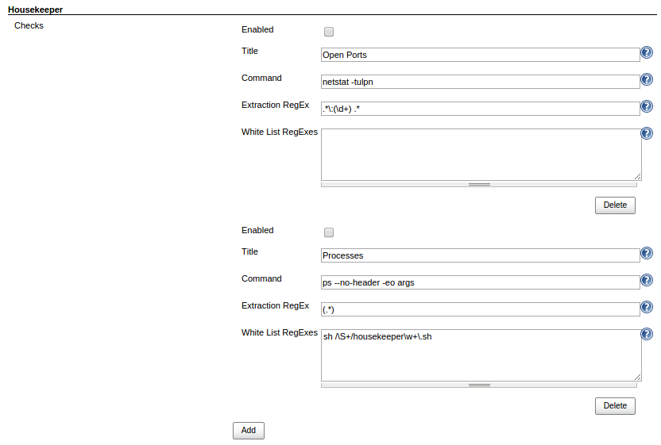
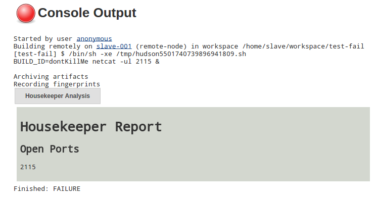

This plugin performs checks before and after every build to ensure that
resources (e.g. open ports) are not leaked.

[.aui-icon .aui-icon-small .aui-iconfont-info .confluence-information-macro-icon]#
#

https://github.com/jenkinsci/housekeeper-plugin/blob/master/README.md[For
more information about this plugin, see the project's readme on GitHub.]

[[HousekeeperPlugin-Configuration]]
== Configuration

[.confluence-embedded-file-wrapper]##

[[HousekeeperPlugin-ExampleOutput]]
== Example Output

[.confluence-embedded-file-wrapper]##
