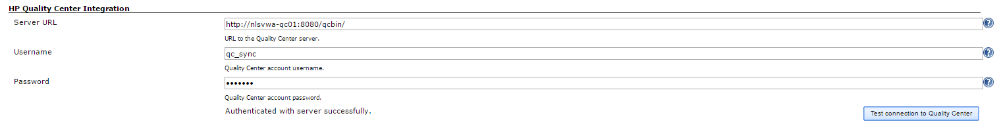
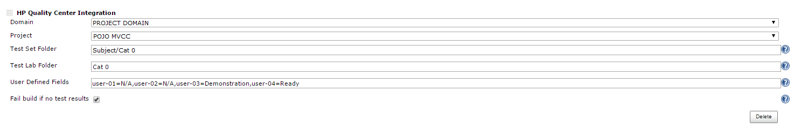
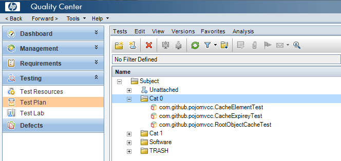
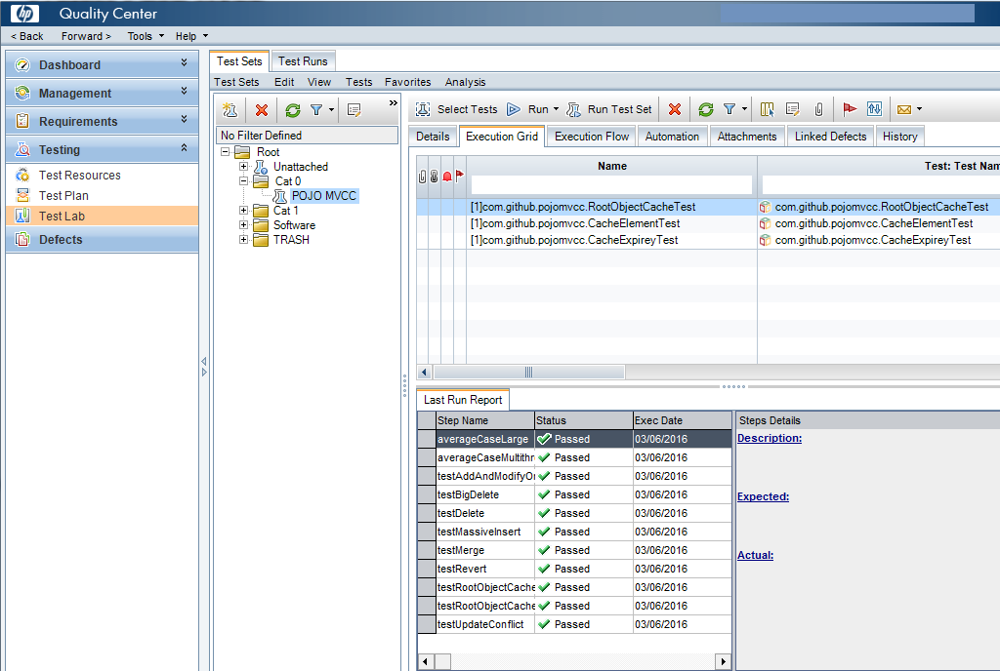

Allows users to synchronize test results from Jenkins with HP ALM
Quality Center.

[[HPALMQualityCenterPlugin-Configuration]]
== Configuration 

[[HPALMQualityCenterPlugin-QualityCenterConnection]]
=== Quality Center Connection

[.confluence-embedded-file-wrapper]##

[[HPALMQualityCenterPlugin-JobConfiguration]]
=== Job Configuration

[[HPALMQualityCenterPlugin-UserInterfaceMethod]]
==== User Interface Method

[.confluence-embedded-file-wrapper]##

[[HPALMQualityCenterPlugin-PipelineSyntaxMethod]]
==== Pipeline Syntax Method

As of *V1.4* this plugin support Jenkins pipeline syntax for job
configuration using the 'qc' symbol. For example:

 

____
qc domain: 'DOMAIN', project: 'PROJECT', planFolder:
'Subject/Software/Cat 0/Unit Tests', labFolder: 'Software/Cat 0',
userDefinedFields: 'user-01=Demonstration', failOnNoTestResults: false
____

 +

Note that __userDefinedFields __and _failOnNoTestResults_ are optional
parameters that do not need to be specified unless required.

Synchronized Unit Tests

[[HPALMQualityCenterPlugin-TestPlan]]
=== Test Plan

[.confluence-embedded-file-wrapper]##

[[HPALMQualityCenterPlugin-TestLab]]
=== Test Lab

[.confluence-embedded-file-wrapper]##
