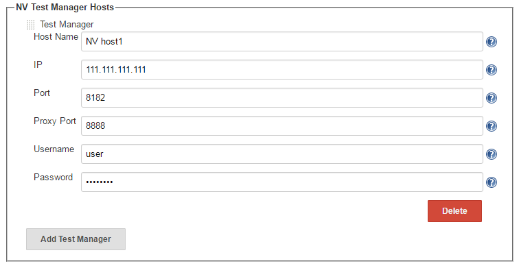
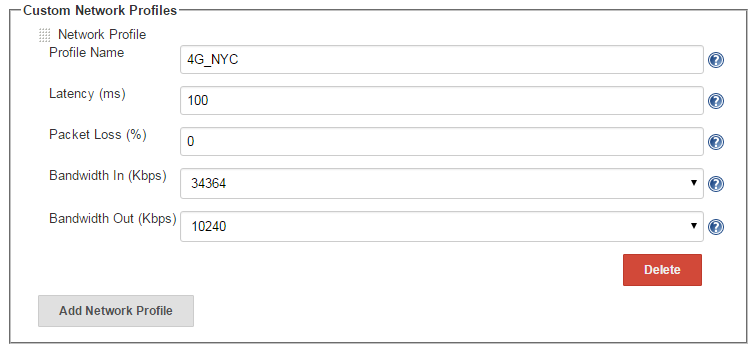
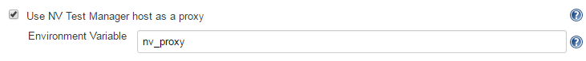
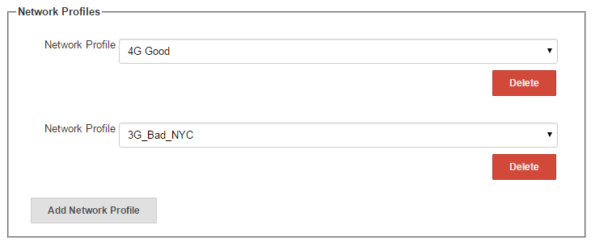
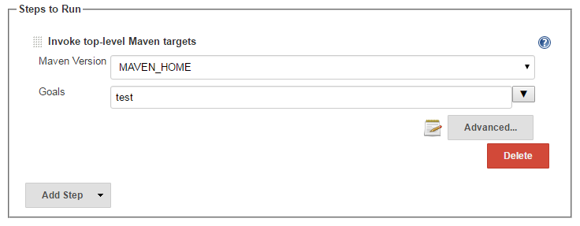
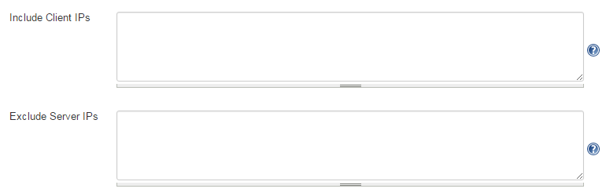

This plugin allows HPE Network Virtualization to run tests under various
network conditions.

[[HPENetworkVirtualizationPlugin-Summary]]
== Summary

HPE Network Virtualization (NV) helps you to understand how networks
affect your application's performance, and what you can do to optimize
client and server performance in your application. +
Do your customers complain that your application works slowly? Are there
timeout exceptions? Has your application ever failed when moved to
production, even though the application worked perfectly when tested
under lab conditions? Does your application suffer from non-reproducible
issues?

HPE Network Virtualization plugin enables you to impose network
impairments and constraints on your testing environment, to improve the
accuracy of your application testing. You can:

* Emulate real-world network conditions, including bandwidth, latency,
and packet loss.
* Run tests under multiple network conditions.
* Configure SLA's for your tests. The plugin can fail the tests that
break these SLA's. By integrating a specific job into the plugin, and
then running a selected set of tests with your CI/CD process, you can
make sure that your main flow’s response time remains acceptable under
various network conditions.

Note that currently this plugin supports tests in JUnit format only. +
For further information about HPE Network Virtualization, click
http://nvhelp.saas.hpe.com/en/Latest/help/Content/Resources/_TopNav/_TopNav_Home.htm[here].

[[HPENetworkVirtualizationPlugin-Requirements]]
== Requirements

. An installation of HPE Network Virtualization version 9.10 or newer.
. Jenkins version 1.625.3 or newer.
. JUnit plugin version 1.10 or newer.

[[HPENetworkVirtualizationPlugin-Configuration]]
== Configuration

[[HPENetworkVirtualizationPlugin-GlobalSettings]]
=== Global Settings

In the Configure System page, this plugin provides the following
configuration options:

[#HPENetworkVirtualizationPlugin-nv_hosts .confluence-anchor-link .conf-macro .output-inline]#
#

[[HPENetworkVirtualizationPlugin-NVTestManagerHosts]]
==== NV Test Manager Hosts

Lets you specify one or more NV Test Manager hosts that the plugin can
use. You must specify at least one NV Test Manager host. These hosts
will be available for selection when you configure a job. For each NV
Test Manager host, you must provide:

* A logical name for the host.
* The host’s connection details.
* Sign-in credentials for the host.

In addition, you can configure a proxy port. This is required only if NV
Test Manager is configured to serve as a proxy server. You can read more
about
http://nvhelp.saas.hpe.com/en/Latest/help/Content/NVMobile/Controller/Settings.htm#proxy_settings_global[proxy
settings] in the HPE Network Virtualization documentation.

[.confluence-embedded-file-wrapper]##

[#HPENetworkVirtualizationPlugin-custom_profiles .confluence-anchor-link .conf-macro .output-inline]#
#

[[HPENetworkVirtualizationPlugin-CustomNetworkProfiles]]
==== Custom Network Profiles

In order to emulate specific network conditions, you must provide HPE
Network Virtualization with a network profile. A network profile is a
set of parameters that define network impairments and conditions. When
your tests run, these network condition are applied. You can read more
about
http://nvhelp.saas.hpe.com/en/Latest/help/Content/NVMobile/Controller/Network_Profile_Overview.htm[network
profiles] in the HPE Network Virtualization documentation. The HPE
Network Virtualization plugin is installed with several predefined
network profiles. In addition, you can configure your own “custom”
network profiles. For each custom network profile, you must provide the
network profile name and the parameters that define the network
conditions. These custom network profiles, along with the predefined
network profiles, will be available for selection when you configure a
job.

[.confluence-embedded-file-wrapper]##

[[HPENetworkVirtualizationPlugin-Jobs]]
=== Jobs

[[HPENetworkVirtualizationPlugin-General]]
==== General

Create any job where the plugin can be added as a build step.

The HPE Network Virtualization plugin allows you to run your tests under
one or more sets of network conditions, by selecting one or more network
profiles. At the beginning of the job execution, the plugin creates a
new test in the selected NV Test Manager. For each network profile, the
plugin creates a separate transaction, and adds it to the test.
Therefore, each test you configure will run the same number of times as
the number of network profiles you selected for the test. This enables
you to test several application flows under various network conditions
in a single job execution.

You can specify a “thresholds file” for any test. A thresholds file is a
simple text file. It contains SLA's (duration, in seconds) for each test
you run. These SLA’s determine the status of each test run, according to
the test’s network performance. At the end of each network profile
cycle, the plugin checks the JUnit test’s results XML file. For each
test that ended successfully, the plugin checks the test’s duration. If
the duration is greater than the SLA defined in the thresholds file for
that test, the plugin marks the test as failed and adds a message to the
results XML file. You can bypass this functionality by either not
specifying a thresholds file, or by specifying a file with a large
value.

Note that the duration you specify as the threshold should be relative
to the durations that are recorded in the JUnit results XML file – these
values typically include a system overhead.

[[HPENetworkVirtualizationPlugin-Setup]]
==== Setup

[[HPENetworkVirtualizationPlugin-NVTestManager]]
===== NV Test Manager

Select one of the NV Test Managers configured in the global settings.
This host will apply the network conditions you specify, and collect the
relevant network data. +
[.confluence-embedded-file-wrapper]##

[#HPENetworkVirtualizationPlugin-proxy_config .confluence-anchor-link .conf-macro .output-inline]#
#

[[HPENetworkVirtualizationPlugin-ProxyConfiguration]]
===== Proxy Configuration

Select this option if NV Test Manager should be connected as a proxy.
There are two scenarios that require NV Test Manager to be connected as
a proxy:

. NV Test Manager is not installed on the same host where the tests are
run.
. The traffic is secured.

If neither of these conditions exist, leave this option unselected. +
After you select to use the NV Test Manager host as a proxy, you must
specify the Environment Variable property. The plugin will set an
environment variable using the name you provide, together with the proxy
details, host IP:port. For example, in our case, 111.111.111.111:8888.
You must read this environment variable into your tests and configure
the proxy accordingly. This will enable the network traffic to go
through NV Test Manager, and enable NV Test Manager to apply the
required network conditions. +
[.confluence-embedded-file-wrapper]##

[#HPENetworkVirtualizationPlugin-test_results .confluence-anchor-link .conf-macro .output-inline]#
#

[[HPENetworkVirtualizationPlugin-TestResultsManipulation]]
===== Test Results Manipulation

Specify the location of the results XML file, and the name and location
of the thresholds file. This enables the plugin to manipulate the
results XML files. +
[.confluence-embedded-file-wrapper]##

[[HPENetworkVirtualizationPlugin-NetworkProfiles]]
===== Network Profiles

Select one or more network profiles from the lists. The lists contain
both the predefined network profiles and the custom profiles defined in
https://wiki.jenkins-ci.org/display/JENKINS/HPE+Network+Virtualization+Plugin#HPENetworkVirtualizationPlugin-custom_profiles[Global
Settings > Custom Network Profiles]. If no network profile is selected,
the tests will run with HPE Network Virtualization imposing no network
conditions. +
[.confluence-embedded-file-wrapper]##

[#HPENetworkVirtualizationPlugin-steps_to_run .confluence-anchor-link .conf-macro .output-inline]#
#

[[HPENetworkVirtualizationPlugin-StepstoRun]]
===== Steps to Run

Define how to run the selected tests. You can run one or more steps. The
only requirement is that the test results be in JUnit format. Other than
that, you can select any steps that you want. In the example below,
Maven step is used to run the selected tests by running a specific test
suite. +
[.confluence-embedded-file-wrapper]##

[[HPENetworkVirtualizationPlugin-AdvancedSettings]]
===== Advanced Settings

Configure Include Client IPs and Exclude Server IPs. The flow's network
impairments and constraints are applied to network traffic between the
specified client and server IP addresses. Both the client IPs and the
server IPs must be "included" in order for the network impairments and
constraints to be applied. Currently, only IPv4 IP addresses are
supported. You can read more about
http://nvhelp.saas.hpe.com/en/Latest/help/Content/NVMobile/Controller/Setting_Client_and_Server_IP_Ranges.htm[Setting
Client and Server IP Ranges] in the HPE Network Virtualization
documentation. +
By default, the server “Include IPs” list contains the entire IPv4
address range, thereby including all traffic. You must manually exclude
all the servers for which you do not want traffic to be affected. In
addition, all the IPv4 of the host machine where the tests run are
included in the client IPs list and excluded in the server IPs list. +
Each list can include single IP addresses and/or IP ranges. Separate
multiple IPs using a semi-colon ';'. Define an IP range using the minus
sign '-', for example, 192.198.0.1-192.198.0.5. +
[.confluence-embedded-file-wrapper]##

[[HPENetworkVirtualizationPlugin-HowitWorks]]
== How it Works

The core of the plugin is the network profiles you select and the tests
you configure to run. If no network profiles are selected, HPE Network
Virtualization will not intervene in the tests invocation and will not
change the network conditions.

The main flow is as follows:

. In case a proxy was set, set an environment variable where the name is
the name configured in
https://wiki.jenkins-ci.org/display/JENKINS/HPE+Network+Virtualization+Plugin#HPENetworkVirtualizationPlugin-proxy_config[Proxy
Configuration] and the value is <IP:proxy port> taken from the selected
NV Test Manager configured in the
https://wiki.jenkins-ci.org/display/JENKINS/HPE+Network+Virtualization+Plugin#HPENetworkVirtualizationPlugin-nv_hosts[Global
Settings > NV Test Manager Hosts].
. Create and start a new test. The name of the test should be in the
form <job name>_<build number>_test*.
. Update the test with the first selected network profile.
. Create a new transaction and add it to the test.
. Do the following until all the network profiles are run:
.. Run all the steps defined in
https://wiki.jenkins-ci.org/display/JENKINS/HPE+Network+Virtualization+Plugin#HPENetworkVirtualizationPlugin-steps_to_run[Steps
to Run].
.. Process the test results based on
https://wiki.jenkins-ci.org/display/JENKINS/HPE+Network+Virtualization+Plugin#HPENetworkVirtualizationPlugin-test_results[Test
Results Manipulation]. For each successful test, change its name by
adding the profile name as a suffix. If the duration of the test is
greater than the threshold defined in the
https://wiki.jenkins-ci.org/display/JENKINS/HPE+Network+Virtualization+Plugin#HPENetworkVirtualizationPlugin-test_results[Thresholds
file], the plugin fails the test and adds an appropriate message. The
plugin updates the results XML file with the new results.
.. Use the next network profile to change the network conditions.
. When all the network profiles have been used, the plugin will stop the
network emulation.
