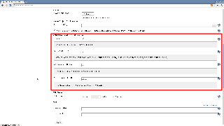
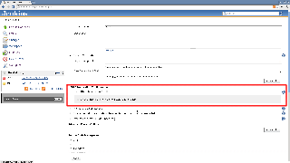

[[HTML5NotifierPlugin-HTML5NotifierPlugin]]
== HTML5 Notifier Plugin

 +

[.conf-macro .output-inline]#Provides
http://dev.w3.org/2006/webapi/WebNotifications/publish/Notifications.html[W3C
Web Notifications] support for builds.#

[[HTML5NotifierPlugin-Browsercompatibility]]
=== Browser compatibility

This plugin is compatible with Google Chrome, Safari, and Firefox

Other browsers do not support HTML5 notifications right now. You can
check this website for details : http://caniuse.com/#feat=notifications

[[HTML5NotifierPlugin-Screenshots]]
=== Screenshots

[cols=",",]
|===
|Safari Notification
|[.confluence-embedded-file-wrapper]##

|System Configuration
|[.confluence-embedded-file-wrapper]##

|Job Configuration
|[.confluence-embedded-file-wrapper]##
|===

 +

'''''

 +

[[HTML5NotifierPlugin-Changelog]]
=== Changelog

[[HTML5NotifierPlugin-1.5(released2015-03-06)]]
==== 1.5 (released 2015-03-06)

* https://issues.jenkins-ci.org/browse/JENKINS-27222[JENKINS-27222] -
Fixes global configuration not saving/loading.

[[HTML5NotifierPlugin-1.3(released2014-08-01)]]
==== 1.3 (released 2014-08-01)

* https://issues.jenkins-ci.org/browse/JENKINS-16236[JENKINS-16236] -
upgrade to use current html5 notification spec. Removes html in the
notifications but now works again.

[[HTML5NotifierPlugin-1.2(released2012-04-06)]]
==== 1.2 (released 2012-04-06)

* updated minimum required core to v1.455 to pick up prototype.js:1.7
* https://issues.jenkins-ci.org/browse/JENKINS-13138[JENKINS-13138] -
Verify action doesn't work with CSRF option
* https://issues.jenkins-ci.org/browse/JENKINS-13322[JENKINS-13322] -
Configure tab freezes when using both the HTML5 notifier plugin and the
Android Emulator Plugin
* https://issues.jenkins-ci.org/browse/JENKINS-12538[JENKINS-12538] -
java.lang.String cannot be cast to net.sf.json.JSONArray
* https://issues.jenkins-ci.org/browse/JENKINS-13038[JENKINS-13038] -
HTML5 notifier plugin breaks Jenkins with CSRF protection

[[HTML5NotifierPlugin-1.1(released2012-02-02)]]
==== 1.1 (released 2012-02-02)

* JENKINS-11618 - prototype.js
* added per-job job property to skip notifications
* added ability to only notify on different build result than previous
* cleaned up the notification area html

[[HTML5NotifierPlugin-1.0(released2011-10-19)]]
==== 1.0 (released 2011-10-19)

* initial implementation
* fully I18N compliant
