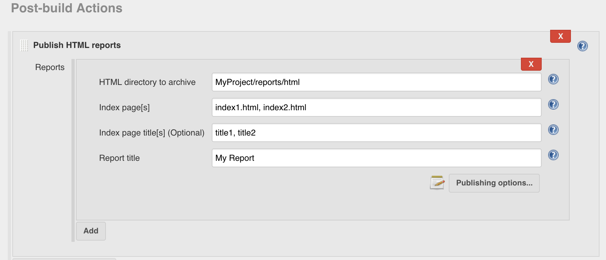

[.conf-macro .output-inline]# #

[.aui-icon .aui-icon-small .aui-iconfont-info .confluence-information-macro-icon]##

Older versions of this plugin may not be safe to use. Please review the
following warnings before using an older version:

* https://jenkins.io/security/advisory/2018-04-16/#SECURITY-784[Path
traversal vulnerability allows arbitrary file writing]
* https://jenkins.io/security/advisory/2019-10-01/#SECURITY-1590[Stored
XSS vulnerability]

 +

This plugin publishes HTML reports.

[.aui-icon .aui-icon-small .aui-iconfont-warning .confluence-information-macro-icon]#
#

Starting in versions 1.625.3 and 1.641, Jenkins restricted what kind of
content could be displayed when serving static files. This can impact
how HTML files archived using this plugin are displayed. See
https://wiki.jenkins-ci.org/display/JENKINS/Configuring+Content+Security+Policy[Configuring
Content Security Policy] for more information.

[[HTMLPublisherPlugin-InstallationSteps:]]
== Installation Steps:

{empty}1. Go to Jenkins Dashboard +
2. Click on the link that says "Manage Jenkins" +
3. On the Plugin Manager page, go to the "Available" tab next to Updates
tab +
4. Look for the html publisher plugin, select the checkbox and click
install. Wait for it come back with status "Success". +
5. Restart Jenkins by clicking the provided link on the success page, or
if using tomcat, executing <tomcat-Jenkins>/bin/shutdown.sh and
<tomcat-Jenkins>/bin/startup.sh

[[HTMLPublisherPlugin-HowtouseHTMLPublisherPlugin:]]
== How to use HTML Publisher Plugin:

HtmlPublisher plugin is useful to publish the html reports that your
build generates to the job and build pages. Below are the steps to
publish and archive the HTML report files

{empty}1. Click on the Configure option for your Jenkins job.

{empty}2. In the post build portion, look for the Publish HTML Reports
option and select the checkbox. See the screen shot below

Fill the path to the directory containing the html reports in the "HTML
directory to archive" field. Specify the pages to display (default
index.html); you can specify multiple comma-separated pages and each
will be a tab on the report page. You can also specify titles for the
report page that appears on the tab, by default, file name will be taken
as title.  Finally, give a name in the Report Title field, which will be
used to provide a link to the report. By default, only the most recent
HTML report will be saved, but if you'd like to be able to view HTML
reports for each past build, select "Keep past HTML reports."

[.confluence-embedded-file-wrapper .confluence-embedded-manual-size]##

Some time at HTML directory, you don't have to specify project name, but
have to start one level below. For e.g. if your project name is "ABC"
and if HTML files are at "ABC/report-output/html" then you have to
specify just *\test-output\html\.*

{empty}3. After saving the configuration, run build once. The published
HTML reports are available to view from within Jenkins with convenient
links in the dashboard.

[[HTMLPublisherPlugin-VersionHistory]]
== Version History

[[HTMLPublisherPlugin-Version1.21(October1st,2019)]]
=== Version 1.21 (October 1st, 2019)

* https://jenkins.io/security/advisory/2019-10-01/#SECURITY-1590[Fix XSS
vulnerability]

[[HTMLPublisherPlugin-Version1.18(January17th,2019)]]
=== Version 1.18 (January 17th, 2019)

* Small fix to prevent overlapping of tabs when there are too many for
one line
(https://github.com/jenkinsci/htmlpublisher-plugin/pull/39[PR-39])
* Change to the code to allow reportTitle to truly be optional
(https://github.com/jenkinsci/htmlpublisher-plugin/pull/40[PR-40])

[[HTMLPublisherPlugin-Version1.17(October3rd,2018)]]
=== Version 1.17 (October 3rd, 2018)

* With the security fix, underscores in the Report Title were escaped in
the URL and directory name as part of the process. The default behaviour
is still to do this but a new option "Escape Underscores" can now be set
to "False" to not do this
(https://github.com/jenkinsci/htmlpublisher-plugin/pull/36[PR-36])
* The "Back To" link at the top left of the HTML reports viewer will now
take you back to the project or build depending if it was selected from
the project or build respectively
(https://github.com/jenkinsci/htmlpublisher-plugin/pull/38[PR-38])

[[HTMLPublisherPlugin-Version1.16(April16th,2018)]]
=== Version 1.16 (April 16th, 2018)

* https://jenkins.io/security/advisory/2018-04-16/[Fix]
https://jenkins.io/security/advisory/2018-04-16/[security
vulnerability]https://jenkins.io/security/advisory/2018-04-16/[ +
*Note:* As a side effect of this change, the URLs and directory names of
archived reports will change. If you have external links pointing to
reports in Jenkins, they may need to be adapted.]

[[HTMLPublisherPlugin-Version1.15(March28th,2018)]]
=== Version 1.15 (March 28th, 2018)

* White space in report name, directory, files, and titles configuration
settings is now all trimmed.
(https://issues.jenkins-ci.org/browse/JENKINS-47034[JENKINS-47034])
* Index page titles can now be passed in as a parameter for Freestyle
builds (Part of
https://issues.jenkins-ci.org/browse/JENKINS-44786[JENKINS-44786])
* *Note*: Currently the HTML Publisher plugin will resolve parameters
passed in with pipeline builds. This is not considered best practice and
therefore should be considered deprecated - resolving the parameter
should be done via Groovy. The current behaviour will be removed in a
future release but will only create a warning in this release. 

[[HTMLPublisherPlugin-Version1.14(July7th,2017)]]
=== Version 1.14 (July 7th, 2017)

* Allow user to set file includes pattern
(https://github.com/jenkinsci/htmlpublisher-plugin/pull/25[PR-25])

[[HTMLPublisherPlugin-Version1.13(April18th,2017)]]
=== Version 1.13 (April 18th, 2017)

* Allow specifying tab titles for report files
(https://github.com/jenkinsci/htmlpublisher-plugin/pull/27[PR-27])

[[HTMLPublisherPlugin-Version1.12(January6th,2017)]]
=== Version 1.12 (January 6th, 2017)

* Fix "PublishHTMLStepExecution.run can block CPS thread"
(https://issues.jenkins-ci.org/browse/JENKINS-40447[JENKINS-40447])

[[HTMLPublisherPlugin-Version1.11(February4th,2016)]]
==== Version 1.11 (February 4th, 2016)

* Fix HTML report shows "Checksum mismatch"
(https://issues.jenkins-ci.org/browse/JENKINS-32281[JENKINS-32281])

[[HTMLPublisherPlugin-Version1.10(December13th,2015)]]
==== Version 1.10 (December 13th, 2015)

* https://wiki.jenkins-ci.org/display/SECURITY/Jenkins+Security+Advisory+2015-12-09[Content-Security-Policy
(Jenkins Security Advisory 2015-12-09) compatibility].
* Fixed "Back link doesn't work after job renaming"
(https://issues.jenkins-ci.org/browse/JENKINS-29679[JENKINS-29679])

[[HTMLPublisherPlugin-Version1.9(November4th,2015)]]
==== Version 1.9 (November 4th, 2015)

* added wrapperName field to maintain serialization compatibility.
(https://issues.jenkins-ci.org/browse/JENKINS-31366[JENKINS-31366])

[[HTMLPublisherPlugin-Version1.8(October18th,2015)]]
==== Version 1.8 (October 18th, 2015)

* revert "Support FileSet includes" due to
https://issues.jenkins-ci.org/browse/JENKINS-31018[JENKINS-31018]

[[HTMLPublisherPlugin-Version1.7(October16th,2015)]]
==== Version 1.7 (October 16th, 2015)

* Support FileSet includes (ant patterns) for report files
(https://issues.jenkins-ci.org/browse/JENKINS-7139[JENKINS-7139])
(reverted in 1.8)

[[HTMLPublisherPlugin-Version1.6(August23rd,2015)]]
==== Version 1.6 (August 23rd, 2015)

* Workflow plugin integration
(https://issues.jenkins-ci.org/browse/JENKINS-26343[JENKINS-26343])

[[HTMLPublisherPlugin-Version1.5(July26th,2015)]]
==== Version 1.5 (July 26th, 2015)

* Clean up / improve the configuration UI
* Restore removed constructor in 1.4 to fix binary compatibility
(https://issues.jenkins-ci.org/browse/JENKINS-29626[JENKINS-29626])

[[HTMLPublisherPlugin-Version1.4(May24th,2015)]]
==== Version 1.4 (May 24th, 2015)

* Add an option to publish HTML reports even if the build fails.
(JENKINS-11689, JENKINS-24057)

[[HTMLPublisherPlugin-Version1.3(Nov13th,2013)]]
==== Version 1.3 (Nov 13th, 2013)

* Add an option to allow a build not to fail if a report is not present
* fix "html publisher plugin overrides report encoding with iso-8859-1"
JENKINS-19268

[[HTMLPublisherPlugin-Version1.2(Dec10th,2012)]]
==== Version 1.2 (Dec 10th, 2012)

* revert "support Ant patterns in archive directory" to fix
JENKINS-16083

[[HTMLPublisherPlugin-Version1.1(Dec7th,2012)]]
==== Version 1.1 (Dec 7th, 2012)

* support Ant patterns in archive directory (reverted in 1.2)
* fix viewing HTML report for specific builds (12967@issue)
* fix NPE (14491@issue)

[[HTMLPublisherPlugin-Version1.0(May10th,2012)]]
==== Version 1.0 (May 10th, 2012)

* Support environment variables when configuring the report directory
and index pages
(https://issues.jenkins-ci.org/browse/JENKINS-10273[10273@issue])

[[HTMLPublisherPlugin-Version0.8(Apr26th,2012)]]
==== Version 0.8 (Apr 26th, 2012)

* Add empty descriptor to HtmlPublisherTarget
(https://issues.jenkins-ci.org/browse/JENKINS-12258[JENKINS-12258])
* Scrollbar in HTML publisher due to 100% height on div/iframe
(https://issues.jenkins-ci.org/browse/JENKINS-13070[JENKINS-13070])
* HTML Publisher does not work for multi-configuration projects
(https://issues.jenkins-ci.org/browse/JENKINS-8832[JENKINS-8832])

[[HTMLPublisherPlugin-Version0.7(Aug2nd,2011)]]
==== Version 0.7 (Aug 2nd, 2011)

* Update to work with Jenkins 1.418+

[[HTMLPublisherPlugin-Version0.6(Jan20th,2011)]]
==== Version 0.6 (Jan 20th, 2011)

* Added Zip option to HTML Report View - this will provide a Zip file of
the contents of the particular report
(https://issues.jenkins-ci.org/browse/JENKINS-8163[JENKINS-8163])

[[HTMLPublisherPlugin-Version0.5(Jan20th,2011)]]
==== Version 0.5 (Jan 20th, 2011)

* This version unintentionally left blank
image:docs/images/smile.svg[(smile)]

[[HTMLPublisherPlugin-Version0.4(May24th,2010)]]
==== Version 0.4 (May 24th, 2010)

* The "Back to Jenkins" link is now "Back to JOBNAME" and goes back to
the job instead of the Jenkins root
(https://issues.jenkins-ci.org/browse/JENKINS-6521[JENKINS-6521])

[[HTMLPublisherPlugin-Version0.3(May10th,2010)]]
==== Version 0.3 (May 10th, 2010)

* display per-build report links after a restart (only works for builds
after the upgrade, alas)
(https://issues.jenkins-ci.org/browse/JENKINS-5775[JENKINS-5775])
* don't display report links if there aren't reports yet
(https://issues.jenkins-ci.org/browse/JENKINS-5683[JENKINS-5683])
* "Back to Jenkins" link triggers a back action in the browser if the
user hasn't configured the Jenkins URL
(https://issues.jenkins-ci.org/browse/JENKINS-6434[JENKINS-6434])

[[HTMLPublisherPlugin-Version0.2.2(Feb17th,2010)]]
==== Version 0.2.2 (Feb 17th, 2010)

* Show all project-level reports on the project page, not just the first
(https://issues.jenkins-ci.org/browse/JENKINS-5069[JENKINS-5069])

[[HTMLPublisherPlugin-Version0.1.0]]
==== Version 0.1.0

* Initial release from abstraction of NCover plugin, allowing for
archiving and displaying of HTML report directories
