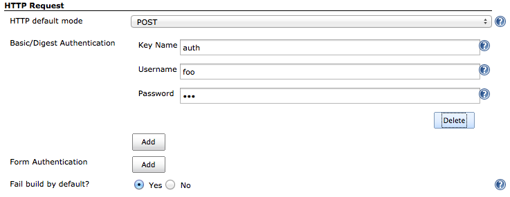
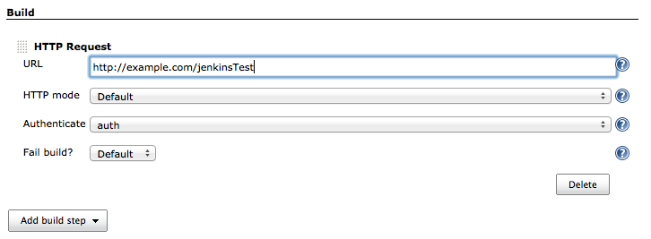
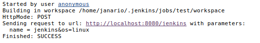

This plugin sends an HTTP request to a URL with some parameters

This plugin was made to dispatch an action calling a URL. It could be
useful to integrate (call-out to) some kind of systems or process.

Basically it executes a request to a URL with the build parameters.

The request is made as a job execution in Jenkins and depending of the
HTTP response the job could be marked as failed (configurable). For
example, responses such as 404 and 500 could make the job fail. When a
job fails it will log the response to help identify the problem.

The request may be as an HTTP GET or POST mode, by choosing the HTTP
mode. If it was not informed, it will use the default from global
settings whose default is POST.  

[[HTTPRequestPlugin-ConfigureGlobalSettings]]
== Configure Global Settings

[.confluence-embedded-file-wrapper]##

[[HTTPRequestPlugin-ConfigureBuildStepinyourJenkinsjob]]
== Configure Build Step in your Jenkins job

[.confluence-embedded-file-wrapper]##

[[HTTPRequestPlugin-HTTPRequestParameters]]
== HTTP Request Parameters

Parameters are escaped which means if you try to pass another value
inside a value, it will not happen.

In the example below, the key "name" will be passed with a value of
"jenkins&os=linux". Note that "os" is not a parameter - it is part of
the value). At the HTTP server-side no parameter named "os" will exist. 

Every execution will log all parameters. Be careful to not pass private
information such as passwords or personal information.  
[.confluence-embedded-file-wrapper]##

[[HTTPRequestPlugin-ChangeLog]]
== Change Log

https://github.com/jenkinsci/http-request-plugin/releases
