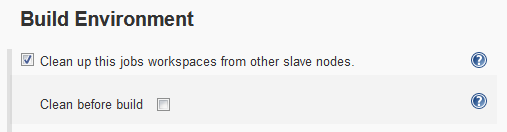
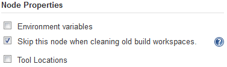
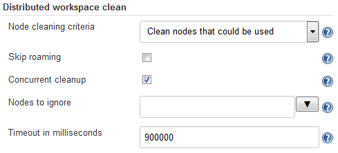

This plugin allows you to cleanup workspaces on slaves "this" build has
previously used.

[[DistributedWorkspaceCleanplugin-DistributedWorkspaceCleanplugin]]
== Distributed Workspace Clean plugin

[[DistributedWorkspaceCleanplugin-Intentionofthisplugin]]
=== Intention of this plugin

This plugin is made to cleanup the build's workspace in all slave nodes
except the one(s) currently running.

If you have many jobs and many slaves that can build them, you will
eventually end up with every slave having built every build at least
once, meaning that every slave has a copy of the build workspace for
every build, and this combination results in a lot of disk space being
used.  The "Workspace" link for a job only ever points to the most
recently used slave node, so that means that all slave nodes except one
could safely delete their unused workspaces ... but Jenkins does not do
that by default.

For this reason this plugin provides the possibility to delete the
workspaces after a build (or before the build if preferred).

 +

[[DistributedWorkspaceCleanplugin-Howtouseit]]
=== How to use it

This functionality can be enabled by ticking the box in the "Build
Environment" section of a job's configuration, and optionally expanding
the "Advanced" box and ticking the "clean before" checkbox if you'd
prefer the clean to happen at the start of the build instead of at the
end (the default).

[.confluence-embedded-file-wrapper .confluence-embedded-manual-size]##

[[DistributedWorkspaceCleanplugin-Howtoavoidit]]
=== How to avoid it

If you have slave nodes that should never have their workspaces cleaned
(by this plugin) then you can add a Node Property specifying (in the
node's configuration page) that this plugin should always skip them:

[.confluence-embedded-file-wrapper .confluence-embedded-manual-size]##

For example, slave nodes that are dynamically created (and deleted) by a
cloud plugin are unlikely to require cleaning (as they'll be destroyed
before they have a chance to build up much mess), so it's useful to add
this Node Property to the template(s) from which such slave nodes are
created.

Note: If you can't add a node property due to limitations on the type of
slave node (e.g. not all cloud plugins support node properties), you can
achieve the same effect using the "Nodes to ignore" field in the global
configuration.

[[DistributedWorkspaceCleanplugin-Howtocontrolit]]
=== How to control it

Further options to control which slave nodes are selected for cleanup
can be found in the global configuration page (Manage Jenkins →
Configure System):

[.confluence-embedded-file-wrapper .confluence-embedded-manual-size]##

The default setting is to "clean nodes that could be used" (for the
build), which preserves the behavior of plugin version 1.0.5 and earlier
(where the plugin looks at what other slave nodes could have been used
to run the build, and cleans the workspace that would've been used on
each of those).  As of version 1.0.6 onwards, you can choose to clean
only where previous completed builds had run, or both.

For further details, see the help text associated with each
configuration option.

[[DistributedWorkspaceCleanplugin-ChangeLog]]
=== Change Log

[[DistributedWorkspaceCleanplugin-Version1.0.7(Sept24,2019)]]
==== Version 1.0.7 (Sept 24, 2019)

* Functionality unchanged from 1.0.6.
* Meta-data for plugin now lists license and developers (past and
present).

[[DistributedWorkspaceCleanplugin-Version1.0.6(Aug28,2019)]]
==== Version 1.0.6 (Aug 28, 2019)

* image:docs/images/error.svg[(error)]
Don't clean concurrently-running builds
(https://issues.jenkins-ci.org/browse/JENKINS-43269[JENKINS-43269])
* image:docs/images/information.svg[(info)]
Implement timeouts so dud slave nodes don't block all builds
* image:docs/images/information.svg[(info)]
Implement "parallel cleanup" to improve performance
* image:docs/images/information.svg[(info)]
Implement "skip node" node property and skip-by-name functionality
* image:docs/images/information.svg[(info)]
Make "Skip roaming" configurable

[[DistributedWorkspaceCleanplugin-Version1.0.5(Aug6,2015)]]
==== Version 1.0.5 (Aug 6, 2015)

* image:docs/images/error.svg[(error)]
Fix Compatibility with Folder plugin
(https://issues.jenkins-ci.org/browse/JENKINS-29682[JENKINS-29682])
* image:docs/images/error.svg[(error)]
Fix deletion on master
* image:docs/images/error.svg[(error)]
Don't wait for slave to become online/don't try to reconnect slave, if
slave is offline
* image:docs/images/information.svg[(info)]
Various cleanup/refactoring
* image:docs/images/information.svg[(info)]
First release from GitHub

[[DistributedWorkspaceCleanplugin-Version1.0.4(Jan7,2010)]]
==== Version 1.0.4 (Jan 7, 2010)

* Fix http://n4.nabble.com/Hudson-bug-with-Ehcache-td787618.html[NPE]
while running PrePostClean on a project that can roam
* Update code for more recent Hudson

[[DistributedWorkspaceCleanplugin-Version1.0.3(Oct12,2009)]]
==== Version 1.0.3 (Oct 12, 2009)

* Fix broken classinformation due to change of from interface to
abstract class
* Fix https://issues.jenkins-ci.org/browse/JENKINS-4630[JENKINS-4630],
NPE while running PrePostClean without any slaves

[[DistributedWorkspaceCleanplugin-Version1.0.2]]
==== Version 1.0.2

* Fix for release

[[DistributedWorkspaceCleanplugin-Version1.0.1]]
==== Version 1.0.1

* Initial checkin
