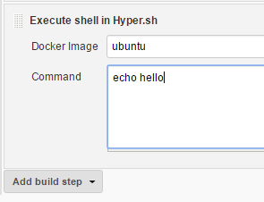

Run some tasks of Jenkins job in https://hyper.sh/[Hyper.sh] container.
This plugin allows to add "Execute shell in Hyper.sh" build step into
your job.

 +
[.confluence-embedded-file-wrapper]##

[[Hyper.shBuildStepPlugin-Readmoreonhttps://github.com/jenkinsci/hyper-build-step-plugin]]
== Read more on https://github.com/jenkinsci/hyper-build-step-plugin
