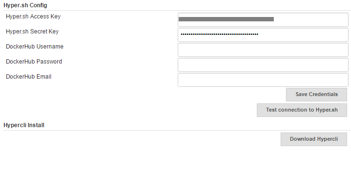

[.conf-macro .output-inline]# #

[.aui-icon .aui-icon-small .aui-iconfont-error .confluence-information-macro-icon]##

The current version of this plugin may not be safe to use. Please review
the following warnings before use:

* https://jenkins.io/security/advisory/2019-04-03/#SECURITY-964[Hyper.sh
Commons Plugin stores credentials in plain text]

This plugin provides common functions for other hyper plugins.

[[Hyper.shCommonsPlugin-1.Features]]
== 1. Features

Plugin currently support following features:

* Install hyper cli
* Set Hyper.sh Credentials
* Test connection to your account.

[[Hyper.shCommonsPlugin-2.Configplugin]]
== 2. Config plugin

login https://console.hyper.sh/[https://console.hyper.sh] to get a
Hyper.sh Credentials.

Manage Jenkins -> Configure System -> Hyper.sh Config

[.confluence-embedded-file-wrapper]##

[[Hyper.shCommonsPlugin-3.Installhypercli]]
== 3. Install hypercli

Manage Jenkins -> Configure System ->Hypercli Install: Download Hypercli
