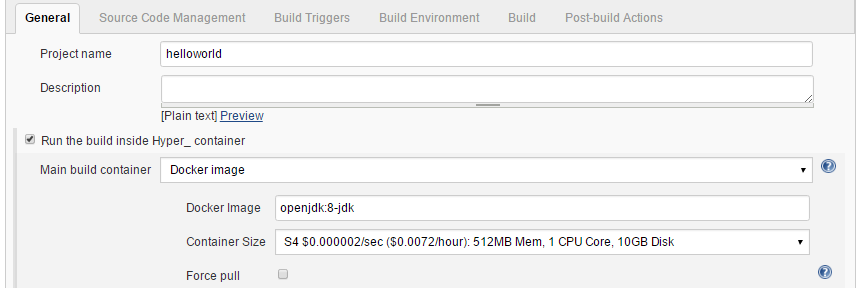

This plugin allows to execute a jenkins job inside
https://hyper.sh/[Hyper.sh] container(s). +
[.confluence-embedded-file-wrapper]##

[[Hyper.shSlavesPlugin-Readmoreonhttps://github.com/jenkinsci/hyper-slaves-plugin]]
== Read more on https://github.com/jenkinsci/hyper-slaves-plugin
