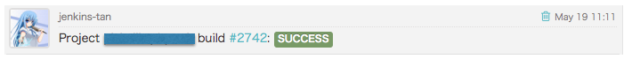
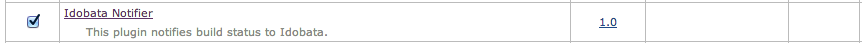
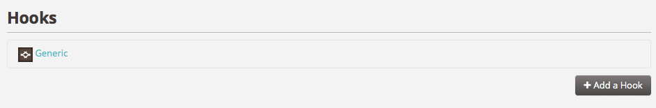
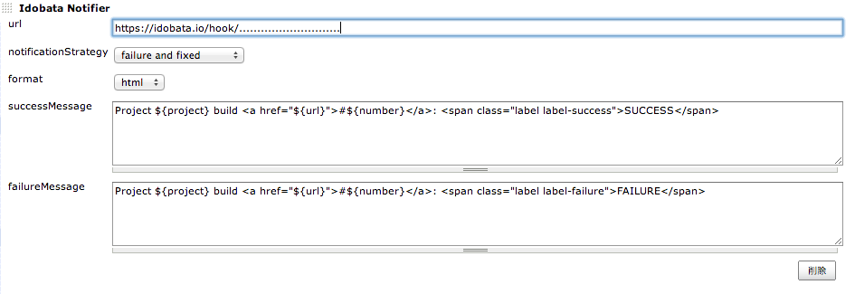

[[IdobataNotifier-IdobataNotifierPlugin]]
== Idobata Notifier Plugin

[.confluence-embedded-file-wrapper]##

[[IdobataNotifier-Install]]
== Install

[.confluence-embedded-file-wrapper]##

[[IdobataNotifier-Configuration]]
== Configuration

This Plugin uses *Generic hook* (not Jenkins hook).

[.confluence-embedded-file-wrapper]##

[.confluence-embedded-file-wrapper]##
