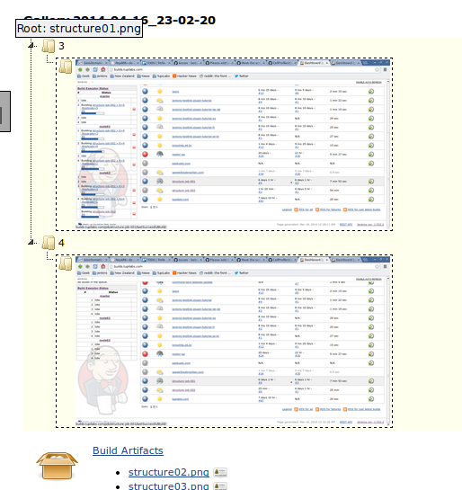
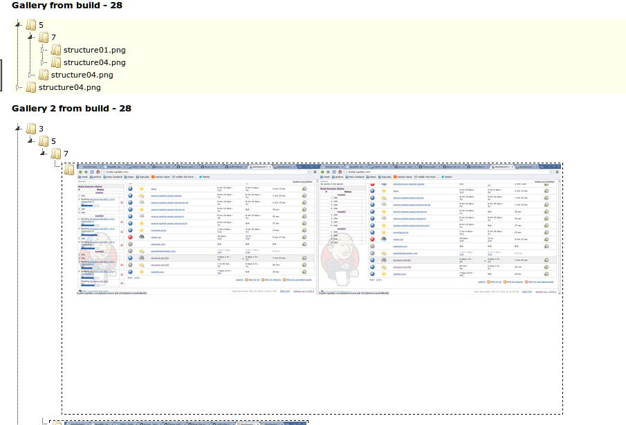
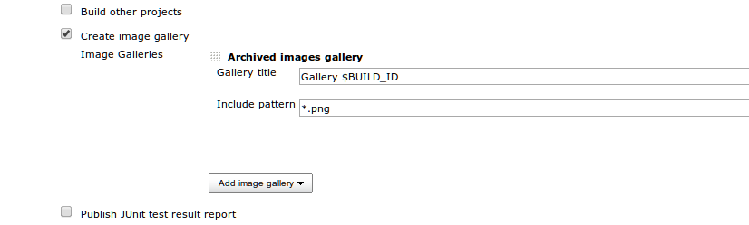
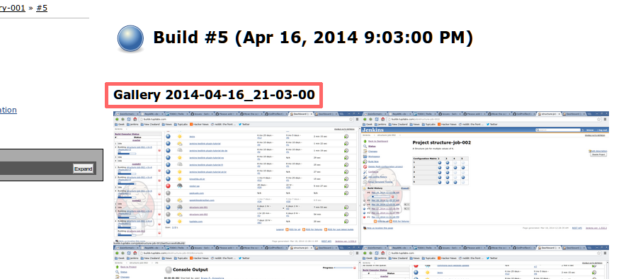
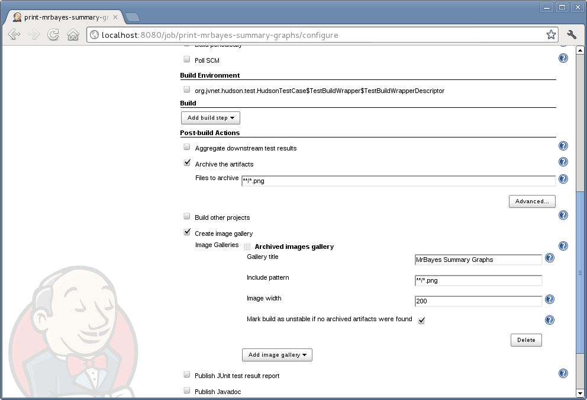
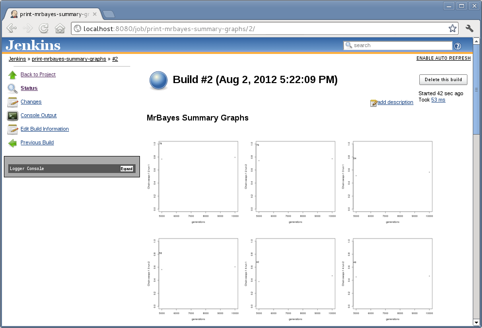
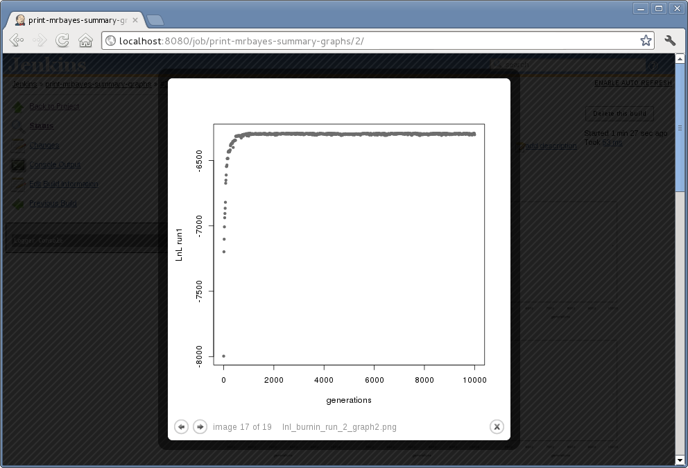

[.conf-macro .output-inline]# #

[.aui-icon .aui-icon-small .aui-iconfont-info .confluence-information-macro-icon]##

Older versions of this plugin may not be safe to use. Please review the
following warnings before using an older version:

* https://jenkins.io/security/advisory/2016-06-20/[Path traversal
vulnerability]

This plug-in reads a job workspace and collects images to produce an
image gallery using http://www.jacklmoore.com/colorbox[colorbox]
lightbox Javascript library.

[[ImageGalleryPlugin-Description]]
== Description

This plug-in reads a job workspace and collects images to produce an
image gallery using http://www.jacklmoore.com/colorbox[colorbox]
lightbox Javascript library.

This plug-in was created to mimic the behaviour of
http://www.bioportal.uio.no/[Bioportal] (now
https://lifeportal.uio.no/[Lifeportal]) jobs that display images of
submitted jobs. The development started
in http://www.biouno.org/[BioUno], a project that uses Jenkins for
running bioinformatics tools and managing clusters.

[[ImageGalleryPlugin-GalleryTypes]]
== Gallery Types

[[ImageGalleryPlugin-Archivedimagesgallery]]
=== Archived images gallery

This gallery is created from archived images. It means that you have to
use the post build step to archive artifacts and give the gallery a
pattern that will match these files.

The images in the Screenshot section were taken from a gallery of this
type.

[[ImageGalleryPlugin-Infoldercomparativearchivedimagesgallery]]
=== In folder comparative archived images gallery

This gallery is created from archived images. It means that you have to
use the post build step to archive artifacts and give the gallery a
pattern that will match these files.

This gallery is useful when your build generates images in multiple
folder, but with a common base root dir. It receives a base root dir as
parameter, and it must be relative to the workspace. Then it will create
a navigation tree with the images per folder. The screen shot below
should help to clarify the explanation. In the example below the
directories 3 and 4 both had images, and a common ancestor directory,
used as base root dir.

[.confluence-embedded-file-wrapper]##

[[ImageGalleryPlugin-Multiplefoldercomparativearchivedimagesgallery]]
=== Multiple folder comparative archived images gallery

This gallery is created from archived images. It means that you have to
use the post build step to archive artifacts and give the gallery a
pattern that will match these files.

It is similar to the previous gallery type, but each image will be an
entry in the navigation tree. It means that if your directory has three
pictures, each one will become an entry in the navigation tree. If you
were using the in folder gallery, then you would have a gallery with
three pictures. The screen shot below shows the difference between the
multiple folder (top) and the in folder (bottom) galleries.

Note that by clicking structure01.png folder in the upper gallery, you
would see the picture thumbnail. While, on the other hand, the other
gallery displays the two pictures in a single category.

[.confluence-embedded-file-wrapper .confluence-embedded-manual-size]##

[[ImageGalleryPlugin-Usingenvironmentvariablesinyourgallerytitle]]
== Using environment variables in your gallery title

Since 1.1 you can use
https://wiki.jenkins-ci.org/display/JENKINS/Building+a+software+project#Buildingasoftwareproject-JenkinsSetEnvironmentVariables[Jenkins
set environment variables] and other variables in your build in your
gallery title. 

[.confluence-embedded-file-wrapper]##

[.confluence-embedded-file-wrapper]##

[[ImageGalleryPlugin-Screenshots]]
== Screenshots

[.confluence-embedded-file-wrapper .confluence-embedded-manual-size]##

[.confluence-embedded-file-wrapper .confluence-embedded-manual-size]##

[.confluence-embedded-file-wrapper .confluence-embedded-manual-size]##

[.confluence-embedded-file-wrapper .confluence-embedded-manual-size]##

[.aui-icon .aui-icon-small .aui-iconfont-approve .confluence-information-macro-icon]#
#

You can use the arrow keys of your keyboard to navigate in your gallery.

[[ImageGalleryPlugin-Issues]]
== Issues

[#jiraissues]##

[.aui-icon .aui-icon-small .aui-iconfont-warning .confluence-information-macro-icon]#
#

[[ImageGalleryPlugin-Sponsors]]
== Sponsors

http://www.biouno.org/[[.confluence-embedded-file-wrapper .confluence-embedded-manual-size]##]

http://www.tupilabs.com/[[.confluence-embedded-file-wrapper .confluence-embedded-manual-size]#image:docs/images/logo1.png[image,width=300]#]

For commercial support, please get contact us
via https://twitter.com/tupilabs[@tupilabs]

[[ImageGalleryPlugin-ChangeLog]]
== Change Log

[[ImageGalleryPlugin-Release1.4(21/Jun/2016)]]
=== Release 1.4 (21/Jun/2016)

* https://issues.jenkins-ci.org/browse/SECURITY-278[SECURITY-278:
image-gallery: Information disclosure]

[[ImageGalleryPlugin-Release1.3(19/Mar/2016)]]
=== Release 1.3 (19/Mar/2016)

* JENKINS-32447: BUILD_NUMBER in include pattern
* JENKINS-31364: Image width is set to "0" in previous builds

[[ImageGalleryPlugin-Release1.2(16/Sep/2015)]]
=== Release 1.2 (16/Sep/2015)

* JENKINS-23772: Percent for image width attribute
* JENKINS-22888: Colorbox viewer does not appear to work
* JENKINS-22887: Initial graph horizontal layout does not fit browser
width
* JENKINS-22625: Allow customization of gallery title with Build/Project
Parameters

[[ImageGalleryPlugin-Release1.1(17/Apr/2014)]]
=== Release 1.1 (17/Apr/2014)

* JENKINS-22625: Allow customization of gallery title with Build/Project
Parameters

[[ImageGalleryPlugin-Release1.0(21/Sep/2012)]]
=== Release 1.0 (21/Sep/2012)

* Two more types of galleries contributed by Richard Lavoie (darkrift)

[[ImageGalleryPlugin-Release0.1(07/Aug/2012)]]
=== Release 0.1 (07/Aug/2012)

* Initial release, with only one image-gallery type supported (Archived
Images Gallery).

[[ImageGalleryPlugin-Roadmap]]
== Roadmap

* Add more gallery types
* Add support to different mime-types
* Add ability to display non-flat galleries. i.e. if a image directory
has sub directories, each directory becomes a gallery, displayed
accordingly by the plug-in.
* a gallery where you can have multiple images with the same name but
from different folders, useful to compare images with selenium coming
from different browsers, where images would have the same name, but
coming from a different folder, recursively of course (darkrift)
