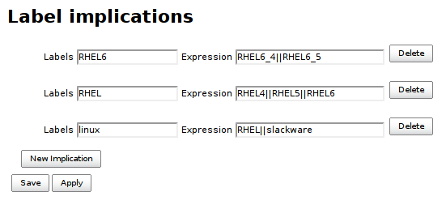

[[ImpliedLabelsPlugin-ImpliedLabelsPlugin]]
== Implied Labels Plugin

Infer dynamic node labels using configured implications.

[.confluence-embedded-file-wrapper .image-right-wrapper]##

Lets have a node with `+linux+`, `+rhel+`, `+rhel6+` and `+rhel6_4+`
labels. Most of this information is redundant and can be inferred from
`+rhel6_4+` label. Here is an excerpt of Implied Labels Plugin
configuration to do just that.

This plugin gathers the implication rules to one place (_Manage Jenkins
> Label implications_) so explicit node labels can be defined in more
concise form (without redundancy). Implications are readable for every
user with `+Jenkins.READ+` but only `+Jenkins.ADMINISTER+` is authorized
to configure. Plugin also detects explicitly configured node labels that
can be inferred using existing implication rules.

[[ImpliedLabelsPlugin-Details]]
=== Details

Jenkins administrator can declare any number of implication rules for
label inference. An implication consists of _label expression_ and _atom
list_. A node that matches _label expression_ will have assigned new
labels from _atom list_. Labels contributed from Implied Labels Plugin
are dynamic labels and thus not saved in configuration. Implications are
evaluated in topological order so implication expressions can refer to
labels contributed by other implications.
