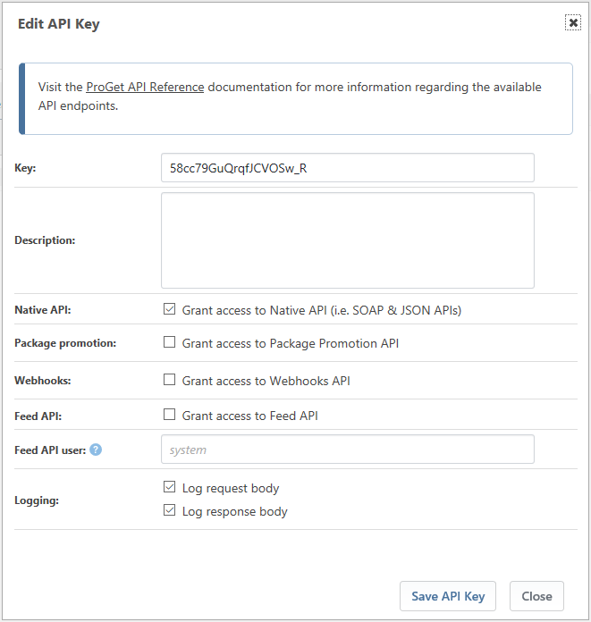
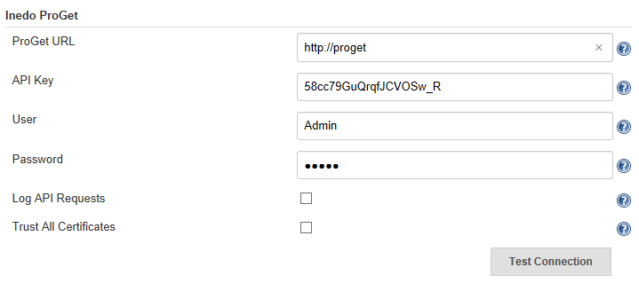
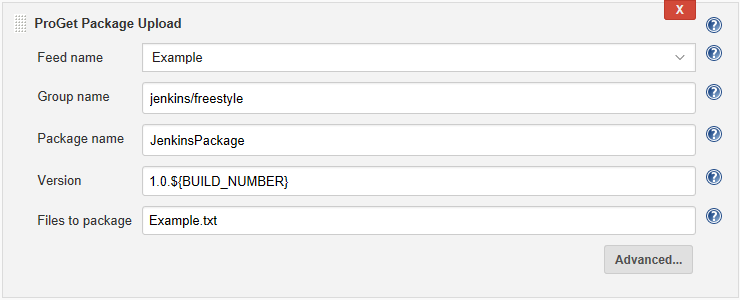
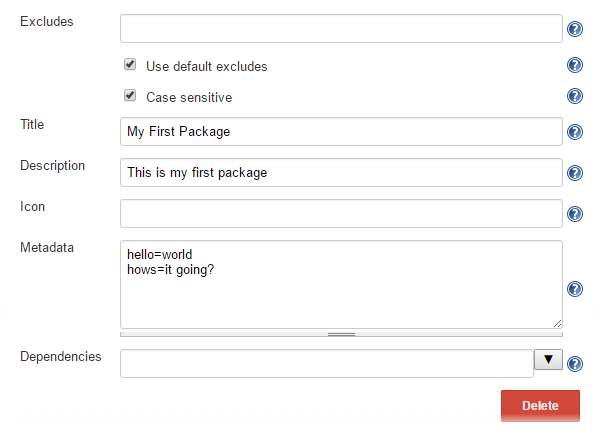
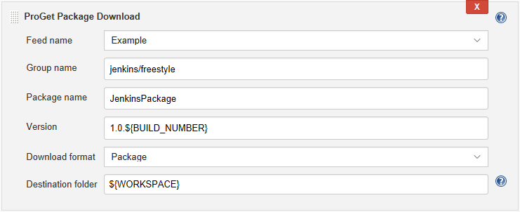

[.conf-macro .output-inline]##

[cols="",options="header",]
|===
|Plugin Information
|View Inedo ProGet Plugin https://plugins.jenkins.io/inedo-proget[on the
plugin site] for more information.
|===

[.aui-icon .aui-icon-small .aui-iconfont-info .confluence-information-macro-icon]##

Older versions of this plugin may not be safe to use. Please review the
following warnings before using an older version:

* https://jenkins.io/security/advisory/2018-07-30/#SECURITY-933[Plugin
globally and unconditionally disables SSL/TLS certificate validation]
* https://jenkins.io/security/advisory/2019-09-25/#SECURITY-1514[Plain
text password shown in configuration form]

https://jenkins.ci.cloudbees.com/job/plugins/job/inedo-proget-plugin/[[.confluence-embedded-file-wrapper]#image:https://jenkins.ci.cloudbees.com/buildStatus/icon?job=plugins/inedo-proget-plugin[image]#]This
plugin integrates Inedo ProGet with Jenkins allowing Jenkins jobs to
create and upload, or download and extract, universal packages.It
requires ProGet version 4.0.12 or higher to work correctly.

[[InedoProGetPlugin-Usage]]
== Usage

*First*, you need to ensure that an api key as been configured in ProGet
at ProGet > Administration > API Keys & Access Logs 

Without this the plugin will still work to a certain point but will have
reduced functionality in the job configuration - i.e. you will need to
fill in certain details rather than select values from a drop down list,
of feeds, groups and packages.

[.confluence-embedded-file-wrapper .confluence-embedded-manual-size]##

*Next*, you need to go to Jenkins' system config screen to tell Jenkins
where's your ProGet installation resides and the username and password
of a user with permission to upload files to ProGet.

[.confluence-embedded-file-wrapper .confluence-embedded-manual-size]##

*Finally*, you need to add either an "ProGet Upload Package" or "ProGet
Download Package" build step to your Jenkins job.

[[InedoProGetPlugin-UploadPackage]]
=== Upload Package

In it basic form, this simply require specifying the files in your work
space that you'd like to package, supplying some metadata that that
describes the package and the job is done.

Please consult the help text in the plugin configuration screen for more
information on each setting.

[.confluence-embedded-file-wrapper .confluence-embedded-manual-size]##

There are some more advanced options that allow you to tweak the files
that will be included in the package and the supply additional metadata.

 +
[.confluence-embedded-file-wrapper]##

[[InedoProGetPlugin-DownloadPackage]]
=== Download Package

Downloads a universal ProGet package in the requested format (package,
zip, or tgz) to specified folder and will optionally unpack it for you.

The environment variable PROGET_FILE will be populated with the name of
the downloaded file

Please consult the help text in the plugin configuration screen for more
information on each setting.

[.confluence-embedded-file-wrapper .confluence-embedded-manual-size]##

[[InedoProGetPlugin-PipelineScript]]
=== Pipeline Script

Script can be generated using the pipeline syntax snippet generator.

*Scripted Pipeline Example*

[source,syntaxhighlighter-pre]
----
node {
    bat '''DEL *.TXT /Q
        DEL *.upack /Q
        ECHO Build Tag: %BUILD_TAG% > Example.txt'''
    uploadProgetPackage artifacts: 'Example.txt', feedName: 'Example', groupName: 'jenkins/pipleline', packageName: 'JenkinsPackage', version: "1.0.${BUILD_NUMBER}"
    downloadProgetPackage downloadFolder: "${WORKSPACE}", downloadFormat: 'pkg', feedName: 'Example', groupName: 'jenkins/pipleline', packageName: 'JenkinsPackage', version: "1.0.${BUILD_NUMBER}"
}
----

*Declarative Pipeline Example*

[source,syntaxhighlighter-pre]
----
pipeline {
  agent any

  stages {
    stage('Main') {
      steps {
        bat '''DEL *.TXT /Q
            DEL *.upack /Q
            ECHO Build Tag: %BUILD_TAG% > Example.txt'''
        uploadProgetPackage artifacts: 'Example.txt', feedName: 'Example', groupName: 'jenkins/pipleline', packageName: 'JenkinsPackage', version: "1.0.${BUILD_NUMBER}"
        downloadProgetPackage downloadFolder: "${WORKSPACE}", downloadFormat: 'pkg', feedName: 'Example', groupName: 'jenkins/pipleline', packageName: 'JenkinsPackage', version: "1.0.${BUILD_NUMBER}"
      }
    }
  }
}
----

[[InedoProGetPlugin-History]]
== *History*

[[InedoProGetPlugin-Version1.0(28July,2018)]]
=== Version 1.0 (28 July, 2018)

* Fix https://issues.jenkins-ci.org/browse/SECURITY-1514[SECURITY-1514]
secret viewable as plaintext in configuration form 

[[InedoProGetPlugin-Version1.2(11Nov,2018)]]
=== Version 1.2 (11 Nov, 2018)

* Improved messaging for ProGet connection issues
* Do not check length of fields in UI as these are changing from 50
character limit in ProGet, rely on ProGet to return errors

[[InedoProGetPlugin-Version1.1(11Nov,2018)]]
=== Version 1.1 (11 Nov, 2018)

* Support Sematic Versioning 2.0

[[InedoProGetPlugin-Version1.0(28July,2018).1]]
=== Version 1.0 (28 July, 2018)

* https://jenkins.io/security/advisory/2018-07-30/#SECURITY-933[Fix
security issue] 
* Various minor UI enhacements

[[InedoProGetPlugin-Version0.8(Mar12,2018)]]
=== Version 0.8 (Mar 12, 2018)

* Add authorization for download package

[[InedoProGetPlugin-Version0.7(Jan15,2017)]]
=== Version 0.7 (Jan 15, 2017)

* Pipeline script support

[[InedoProGetPlugin-Version0.6(Nov14,2016)]]
=== Version 0.6 (Nov 14, 2016)

* Support running on Jenkins slaves/nodes
* Prevent caching of requests

[[InedoProGetPlugin-Version0.4(Oct17,2016)]]
=== Version 0.4 (Oct 17, 2016)

* Download to node

[[InedoProGetPlugin-Version0.3(May17,2016)]]
=== Version 0.3 (May 17, 2016)

* Expand 'Files to package' upload variable correctly
* Validate format version number

[[InedoProGetPlugin-Version0.2(May17,2016)]]
=== Version 0.2 (May 17, 2016)

* Initial Release
