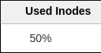
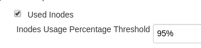
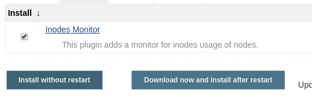

This plugin offers a way to monitor inodes consumption for Jenkins
nodes. Like other node monitors, it can be used to automatically, and
temporarily, take a node offline when there is not enough inodes left.

[[InodesMonitorPlugin-Screenshots]]
== Screenshots

Under the `+/computer+` url, you will see a new column added after you
install the plugin:

[.confluence-embedded-file-wrapper .confluence-embedded-manual-size]##

if you open the /computer/configure page, you can set the percentage
above which a problematic node should be taken offline until you resolve
the issue (defaulting to 95%):

[.confluence-embedded-file-wrapper .confluence-embedded-manual-size]##

[[InodesMonitorPlugin-Installingit]]
== Installing it

[.confluence-embedded-file-wrapper .confluence-embedded-manual-size]##

[[InodesMonitorPlugin-Releases]]
== Releases

[[InodesMonitorPlugin-0.5.1]]
=== 0.5.1

First public release.
