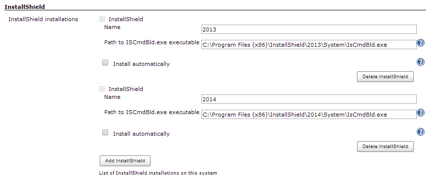
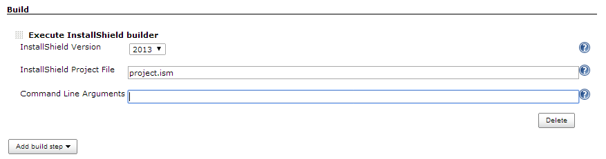

 +

This plugin builds InstallShield projects.

 +

[.confluence-embedded-file-wrapper]##

[.confluence-embedded-file-wrapper]## +
 

[[InstallShieldPlugin-Changelog]]
== Changelog

[[InstallShieldPlugin-Version1.0.3(May23,2014)]]
=== Version 1.0.3 (May 23, 2014)

* Bugfix release. Repairs "'C:\Program' is not recognized as an internal
or external command" failures.

[[InstallShieldPlugin-Version1.0.2(March31,2014)]]
=== Version 1.0.2 (March 31, 2014)

* Initial release
