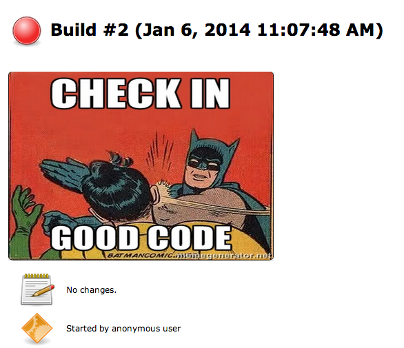
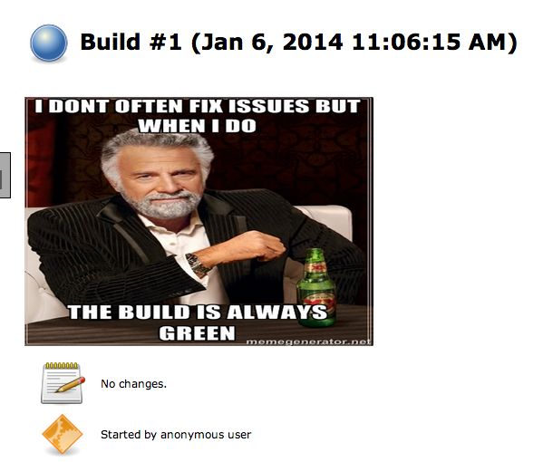

 +

Displays a random "internet meme" with a build related message on each
build page. 

Inspired by the Chuck Norris plugin.

[[InternetMemePlugin-Download&Installation]]
== *Download & Installation*

You can download it directly from the Plugins Update Center.

[[InternetMemePlugin-Usage]]
== Usage

. Go to the job configuration page and check the "Activate Internet
Meme" checkbox in the "Post Build Actions" dropdown
. Post build run, a random meme image is displayed on the build page.

[[InternetMemePlugin-Screenshots]]
== Screenshots

[width="100%",cols="50%,50%",]
|===
|[.confluence-embedded-file-wrapper .image-center-wrapper]##
|[.confluence-embedded-file-wrapper .image-center-wrapper]## +
|===

[[InternetMemePlugin-Credits]]
== *Credits*

https://wiki.jenkins-ci.org/display/JENKINS/ChuckNorris+Plugin[Chuck
Norris Plugin]
