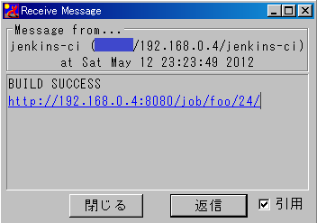

 +

 +
This plugin send notification by IPMessenger protocol.

[.confluence-embedded-file-wrapper]##

IPMessenger is a simple IM software using UDP.

* http://ipmsg.org/ (Japanese)
* http://ipmsg.org/index.html.en (English)

With this plugin, jenkins-ci sends message after build job via
IPMessenger protocol. +
Enjoy!

* author's twitter: https://twitter.com/nabedge
* author's blog:
https://nabedge.blogspot.com/[https://nabedge.blogspot.com]
* http://mixer2.org/[Mixer2 - Java/HTML Template Engine]
