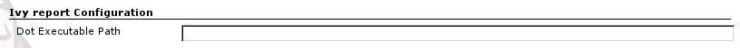
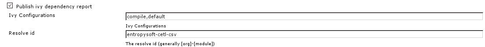
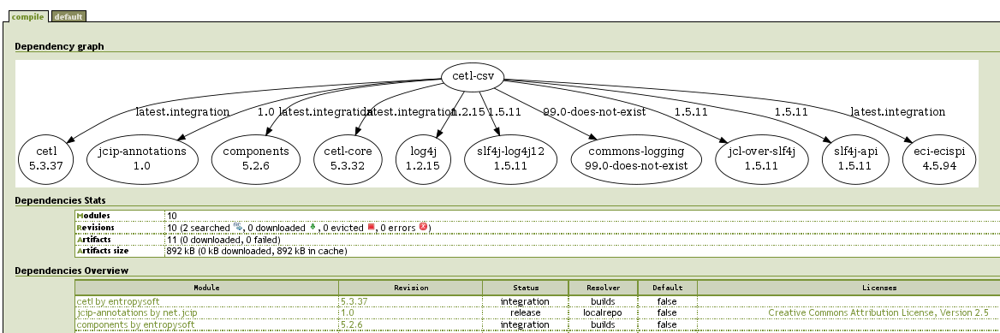

This plugin publishes http://ant.apache.org/ivy[Apache Ivy] reports for
each build.

 +
This plugin depends on
the https://wiki.jenkins-ci.org/display/JENKINS/Ivy+Plugin[Ivy Plugin]
and requires a graphviz installation on the server.

[[IvyReportPlugin-Usingtheplugin]]
== Using the plugin

. Install graphviz on the server. +
Configure the dot executable path in "Configure System" +
[.confluence-embedded-file-wrapper]##
. Create (using
the https://wiki.jenkins-ci.org/display/JENKINS/Ivy+Plugin[Ivy Plugin]
https://wiki.jenkins-ci.org/display/JENKINS/Ivy+Report+Plugin[|\]) or
edit an ivy project  +
Check "Publish ivy dependency report", give the ivy configurations for
which to generate the report and the resolve id (generally
[org]-[module] +
[.confluence-embedded-file-wrapper]##
. The report will be generated after the build : +
[.confluence-embedded-file-wrapper]##

[[IvyReportPlugin-Changelog]]
== Changelog

[[IvyReportPlugin-Version1.2(Feb17,2012)]]
=== Version 1.2 (Feb 17, 2012)

* Svg elements are now clickable

[[IvyReportPlugin-Version1.1(Feb16,2012)]]
=== Version 1.1 (Feb 16, 2012)

* Icon for action was missing
* Use helvetica 11 in generated svg files
* Add a version label to the link between two artifacts only if it is
not the selected version for the target artifact

[[IvyReportPlugin-Version1.0(Feb14,2012)]]
=== Version 1.0 (Feb 14, 2012)

* First release : an html ivy report containing a dependency graph (in
svg format) can be generated for each ivy project build
