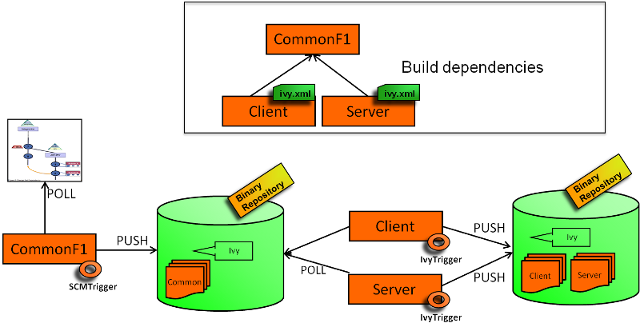

[.conf-macro .output-inline]# #

[.aui-icon .aui-icon-small .aui-iconfont-warning .confluence-information-macro-icon]##

*This plugin is up for adoption.* Want to help improve this plugin?
https://wiki.jenkins-ci.org/display/JENKINS/Adopt+a+Plugin[Click here to
learn more]!

IvyTrigger provides polling mechanisms to poll an Ivy file and triggers
a build if an Ivy dependency version has changed. +

[.confluence-embedded-file-wrapper]##

[[IvyTriggerPlugin-Features]]
== Features

The plugin makes it possible to monitor the dependencies of an Ivy
descriptor. +
For example, if a dependency has the following revision 'latest.release'
or '2.+' and a new artifact has been deployed in the repository manager
(managed by Ivy), a new build is scheduled.

Note: The plugin uses only persistence in memory. There is no impact on
the Jenkins infrastructure (no new files created). +
This plugin provides a polling typology among the
https://wiki.jenkins-ci.org/display/JENKINS/XTrigger+Plugin[XTrigger
Plugin].

[[IvyTriggerPlugin-Changelog]]
== Changelog

[[IvyTriggerPlugin-Release0.34]]
=== Release 0.34

* Added option to control whether or not artifacts are downloaded +
* Fix https://issues.jenkins-ci.org/browse/JENKINS-28044[JENKINS-28044]
- IvyTrigger plugin description indicates that it "has no impact on the
Jenkins infrastructure", but it does download all dependencies to the
local file system

[[IvyTriggerPlugin-Release0.33]]
=== Release 0.33

* Added ability to download Ivy settings through URL

[[IvyTriggerPlugin-Release0.32]]
=== Release 0.32

* Fix https://issues.jenkins-ci.org/browse/JENKINS-19796[JENKINS-19796]
- IvyTrigger fails on Jenkins 1.532

[[IvyTriggerPlugin-Release0.31]]
=== Release 0.31

* Fix https://issues.jenkins-ci.org/browse/JENKINS-19459[JENKINS-19459]
- IvyTrigger reports
https://wiki.jenkins-ci.org/display/JENKINS/IvyTrigger+Plugin#[ERROR] -
Polling error...

[[IvyTriggerPlugin-Release0.30]]
=== Release 0.30

* Update to xtrigger-lib 0.30 (Change locking object)

[[IvyTriggerPlugin-Release0.29]]
=== Release 0.29

* Fix NullPointerException when saving job config

[[IvyTriggerPlugin-Release0.27&0.28]]
=== Release 0.27 & 0.28

* Fix https://issues.jenkins-ci.org/browse/JENKINS-17831[JENKINS-17831]
- Update to latest xTrigger

[[IvyTriggerPlugin-Release0.26]]
=== Release 0.26

* Fix https://issues.jenkins-ci.org/browse/JENKINS-17641[JENKINS-17641]
- Unknown field 'logEnabled' in org.jenkinsci.lib.xtrigger.XTriggerCause

[[IvyTriggerPlugin-Release0.25]]
=== Release 0.25

* Fix https://issues.jenkins-ci.org/browse/JENKINS-17831[JENKINS-17831]
- Update to latest xTrigger

[[IvyTriggerPlugin-Release0.24]]
=== Release 0.24

* Add support for multiple properties files

[[IvyTriggerPlugin-Release0.23]]
=== Release 0.23

* set debug field in IvyTriggerEvaluator

[[IvyTriggerPlugin-Release0.22]]
=== Release 0.22

* Upgrade to xtrigger-lib 0.14 (more log)

[[IvyTriggerPlugin-Release0.21]]
=== Release 0.21

* Add extension capabilities (thanks to Stephen Slocum)

[[IvyTriggerPlugin-Release0.20]]
=== Release 0.20

* Fix temporary file deletion

[[IvyTriggerPlugin-Release0.19]]
=== Release 0.19

* Add a debug mode on demand for the resolution artifacts log

[[IvyTriggerPlugin-Release0.18]]
=== Release 0.18

* Fix check when there is no revision in the Ivy pattern (check on
timestamp only)

[[IvyTriggerPlugin-Release0.17]]
=== Release 0.17

* Inject propoerties to ivysettings file for variable resolution

[[IvyTriggerPlugin-Release0.16]]
=== Release 0.16

* Fix settings resolutions variable

[[IvyTriggerPlugin-Release0.15]]
=== Release 0.15

* Update to xtrigger-lib 0.9 +
* Fix https://issues.jenkins-ci.org/browse/JENKINS-12992[JENKINS-12992]
- Error - Job Copy & Saving Configuration when using Ivy Trigger Plugin
(v0.14) +
* Introduce a cache system at job level +
* Enable to detect changes when no revision is used for a filesystem
resolver

[[IvyTriggerPlugin-Release0.14]]
=== Release 0.14

* Update to xtrigger-lib 0.8 (Fix
https://issues.jenkins-ci.org/browse/JENKINS-12888[JENKINS-12888])

[[IvyTriggerPlugin-Release0.13]]
=== Release 0.13

* Add error messages

[[IvyTriggerPlugin-Release0.12]]
=== Release 0.12

* Add a ivy properties content

[[IvyTriggerPlugin-Release0.11]]
=== Release 0.11

* Fix double startup

[[IvyTriggerPlugin-Release0.10]]
=== Release 0.10

* Update to xtrigger-lib 0.7 +
* Can add variables to Ivy through a properties file

[[IvyTriggerPlugin-Release0.9]]
=== Release 0.9

* Update to xtrigger-lib 0.5 +
* Update to envinject-lib 1.2

[[IvyTriggerPlugin-Release0.8]]
=== Release 0.8

* Update to xtrigger-lib 0.3 +
* Update to envinject-lib 1.0

[[IvyTriggerPlugin-Release0.7]]
=== Release 0.7

* A job is not triggered when Jenkins is quieting down and is buildable

[[IvyTriggerPlugin-Release0.6]]
=== Release 0.6

* Migrate to xtrigger-lib

[[IvyTriggerPlugin-Release0.5]]
=== Release 0.5

* Environment variables are managed

[[IvyTriggerPlugin-Release0.4]]
=== Release 0.4

* Fix node running detection

[[IvyTriggerPlugin-Release0.3]]
=== Release 0.3

* Fix bug for a slave usage

[[IvyTriggerPlugin-Release0.2]]
=== Release 0.2

* Fix help messages

[[IvyTriggerPlugin-Release0.1]]
=== Release 0.1

* Initial release
