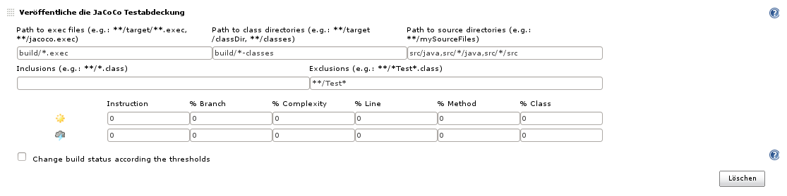
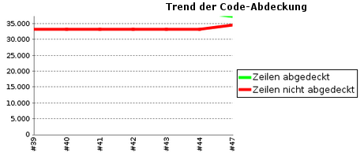
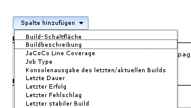
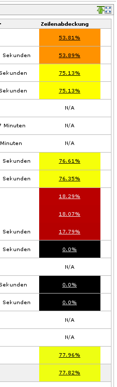

[[JaCoCoPlugin-Basicinformation]]
== Basic information

* Repository address: https://github.com/jenkinsci/jacoco-plugin/
* Mailing list:
http://groups.google.com/group/jenkins-jacoco-plugin-mailing-list
* Issue
tracking: https://issues.jenkins-ci.org/secure/IssueNavigator.jspa?reset=true&jqlQuery=project+%3D+JENKINS+AND+status+in+%28Open%2C+%22In+Progress%22%2C+Reopened%29+AND+%28component+%3D+jacoco-plugin%29&tempMax=1000[https://issues.jenkins-ci.org/browse/JENKINS/]
* Build and test
results: https://jenkins.ci.cloudbees.com/job/plugins/job/jacoco-plugin/

[.conf-macro .output-inline]#This plugin allows you to capture code
coverage report from JaCoCo. Jenkins will generate the trend report of
coverage and some other statistics.#

It also includes functionality to include columns in Dashboards which
displays the latest overall coverage numbers and links to the coverage
report.

[[JaCoCoPlugin-GettingStarted]]
== Getting Started

The plugin provides two things, a build-publisher to record and display
coverage data as part of builds as well as a new +
column-type for dashboard views which can display coverage data in
Dashboards.

[[JaCoCoPlugin-Recordingcoverageforbuilds]]
=== Recording coverage for builds

[[JaCoCoPlugin-Getcoveragedataaspartofyourbuild]]
==== Get coverage data as part of your build

First you need to get coverage calculated as part of your build/tests,
see the http://www.eclemma.org/jacoco/trunk/doc/[JaCoCo documentation] +
for details. You need at least one or more *.exec file available after
tests are executed. Usually this means adjusting +
your Maven pom.xml or Ant build.xml file..

[[JaCoCoPlugin-Setupcoverageretrievalandpublishing]]
==== Set up coverage retrieval and publishing

In order to get the coverage data published to Jenkins, you need to add
a JaCoCo publisher and configure it so it will +
find all the necessary information. Use the help provided via the
question-mark links for more information. Basically +
you specify where the *.exec files are, where compiled code can be found
and where the corresponding source code is +
located after the build is finished to let the plugin gather all
necessary pieces of information..

[.confluence-embedded-file-wrapper]##

[[JaCoCoPlugin-Runthejob]]
==== Run the job

After the job executed, the build-output will show that the
JaCoCo-publisher is executed and collects the data. This +
output can also give hints if something goes wrong at this stage:

[source,syntaxhighlighter-pre]
----
Zeichne Testergebnisse auf.
[JaCoCo plugin] Collecting JaCoCo coverage data...
[JaCoCo plugin] build/*.exec;build/*-classes;src/java,src/*/java,src/*/src; locations are configured
[JaCoCo plugin] Number of found exec files: 5
[JaCoCo plugin] Saving matched execfiles:  .../build/jacoco-excelant.exec .../build/jacoco-main.exec .../build/jacoco-ooxml-lite.exec
[JaCoCo plugin] Saving matched class directories:  .../build/examples-classes .../build/excelant-classes .../build/excelant-test-classes
[JaCoCo plugin] Saving matched source directories:  .../src/contrib/src .../src/examples/src .../src/excelant/java .../src/java
[JaCoCo plugin] Loading inclusions files..
[JaCoCo plugin] inclusions: []
[JaCoCo plugin] exclusions: [**/Test*]
[JaCoCo plugin] Thresholds: JacocoHealthReportThresholds [minClass=0, maxClass=0, minMethod=0, maxMethod=0, minLine=0, maxLine=0,
minBranch=0, maxBranch=0, minInstruction=0, maxInstruction=0, minComplexity=0, maxComplexity=0]
[JaCoCo plugin] Publishing the results..
[JaCoCo plugin] Loading packages..
[JaCoCo plugin] Done.
----

[[JaCoCoPlugin-Lookatresults]]
==== Look at results

If data gathering is successful, the build will include a link to the
coverage results similar to the HTML report of +
JaCoCo itself. The job page will be enhanced with a chart with the trend
of code coverage over the last builds.

[.confluence-embedded-file-wrapper]##

[[JaCoCoPlugin-Coveragecolumn]]
=== Coverage column

This part of the JaCoCo plugin allows you to add a new type of column to
a project-table in the Dashboard view which +
will show the coverage number of the last build for ajob together with
some color coding which allows to quickly see +
projects with low coverage.

[.confluence-embedded-file-wrapper]##

[.confluence-embedded-file-wrapper]##

The fill-color in use by the column is a continuous color-range with the
following points:

* PERFECT = 100.0
* EXCELLENT at 97.0
* GOOD at 92.0
* SUFFICIENT at 85.0
* FAIR at 75.0
* POOR at 50.0
* TRAGIC at 25.0
* ABYSSMAL at 0.0
* NA = No coverage configured

[[JaCoCoPlugin-OpenTickets(bugsandfeaturerequests)]]
== Open Tickets (bugs and feature requests)

See
https://issues.jenkins-ci.org/browse/JENKINS-42420?jql=project%20%3D%20JENKINS%20AND%20status%20in%20(Open%2C%20%22In%20Progress%22%2C%20Reopened%2C%20%22In%20Review%22)%20AND%20component%20%3D%20jacoco-plugin

[[JaCoCoPlugin-BuildStatus]]
== Build Status

https://jenkins.ci.cloudbees.com/job/plugins/job/jacoco-plugin/[[.confluence-embedded-file-wrapper]#image:https://jenkins.ci.cloudbees.com/buildStatus/icon?job=plugins/jacoco-plugin[image]#] +
https://travis-ci.org/jenkinsci/jacoco-plugin[[.confluence-embedded-file-wrapper]#image:https://travis-ci.org/jenkinsci/jacoco-plugin.svg?branch=master[image]#]

[[JaCoCoPlugin-Troubleshooting]]
== Troubleshooting

* Unfortunately JaCoCo 0.7.5 breaks compatibility to previous binary
formats of the jacoco.exec files. The JaCoCo plugin up to version 1.0.19
is based on JaCoCo 0.7.4, thus you cannot use this version with projects
which already use JaCoCo 0.7.5 or newer. JaCoCo plugin starting with
version 2.0.0 uses JaCoCo 0.7.5 and thus requires also this version to
be used in your projects. Please stick to JaCoCo plugin 1.0.19 or lower
if you still use JaCoCo 0.7.4 or lower

[[JaCoCoPlugin-ChangeLog]]
== Change Log

[[JaCoCoPlugin-Version3.1-SNAPSHOT(unreleased)]]
=== Version 3.1-SNAPSHOT (unreleased)

* N/A

[[JaCoCoPlugin-Version3.0.4(November4,2018)]]
=== Version 3.0.4 (November 4, 2018)

* PR https://github.com/jenkinsci/jacoco-plugin/pull/100[#100]/PR
https://github.com/jenkinsci/jacoco-plugin/pull/102[#102]/https://issues.jenkins-ci.org/browse/JENKINS-49823[JENKINS-49823]
- Ignore non existing class directory
* PR https://github.com/jenkinsci/jacoco-plugin/pull/101[#101] - Add
Branch Coverage Column

[[JaCoCoPlugin-Version3.0.3(August31,2018)]]
=== Version 3.0.3 (August 31, 2018)

* `+Update JaCoCo to 0.8.2 to support Java 10 (+``+#99)+`
* `+Update some other plugins+`
* {blank}
+
`+       JENKINS-43310 add source file inclusions and exclusions (#85 /+`
https://issues.jenkins-ci.org/browse/JENKINS-43310[JENKINS-43310])

[[JaCoCoPlugin-Version3.0.2(February18,2018)]]
=== Version 3.0.2 (February 18, 2018)

* `+       No change upload due to problems with the release-workflow+`

[[JaCoCoPlugin-Version3.0.1(February18,2018)]]
=== Version 3.0.1 (February 18, 2018)

* {blank}
+
`+       No change upload due to problems with the release-workflow+`

[[JaCoCoPlugin-Version3.0(February18,2018)]]
=== Version 3.0 (February 18, 2018)

* {blank}
+
`+Use the formatted date instead of the Calendar as the key to get the +``+correct coverage trend per day +`(https://github.com/jenkinsci/jacoco-plugin/pull/88[#88])
* {blank}
+
`+       Handle build abort (by not catching InterruptedException) (#86)     +`
* {blank}
+
`+       Improve exception handling (#89)     +`
* {blank}
+
`+       Update min Java version to Java 8, update Maven dependencies and plugins (#92)     +`
* {blank}
+
`+       Fix Javadoc warnings (#93)     +`

[[JaCoCoPlugin-Version2.2.1(May5,2017)]]
=== Version 2.2.1 (May 5, 2017)

 +

* https://issues.jenkins-ci.org/browse/JENKINS-43103[JENKINS-43103]
Removed dependency on Joda
Time[.commit-author .tooltipped .tooltipped-s .user-mention]## ##
* [.commit-author .tooltipped .tooltipped-s .user-mention]#https://github.com/jenkinsci/jacoco-plugin/pull/83[#83]
Added symbol name for better pipeline integration#
* https://issues.jenkins-ci.org/browse/JENKINS-41515[JENKINS-41515][.message]## ##
[.hidden-text-expander .inline]## ##Update Jenkins parent to 1.625.3 to
be able to test with current pipeline-plugin
* [.message]#https://issues.jenkins-ci.org/browse/JENKINS-41515[JENKINS-41515]# Adjust
dependencies and add some exclusions to remove a number of unnecessary
jars from the resulting hpi file

[[JaCoCoPlugin-Version2.2.0(Mar22,2017)]]
=== Version 2.2.0 (Mar 22, 2017)

* Configuration: Put checkboxes on top of threshold values in the
configuration UI
* https://github.com/jenkinsci/jacoco-plugin/pull/81[#81] New flag to
enable/disable display of source files with line coverage highlights
* https://github.com/jenkinsci/jacoco-plugin/pull/80[#80] Allow to fail
the build if coverage degrades to much compared to previous build
* https://github.com/jenkinsci/jacoco-plugin/pull/79[#79]/https://issues.jenkins-ci.org/browse/JENKINS-25076[JENKINS-25076]/https://issues.jenkins-ci.org/browse/JENKINS-29117[JENKINS-29117]
Report 100% for empty Coverage objects
* https://github.com/jenkinsci/jacoco-plugin/pull/78[#78]/https://issues.jenkins-ci.org/browse/JENKINS-26254[JENKINS-26254]
Use BufferedInputStream to read .exec files
* https://github.com/jenkinsci/jacoco-plugin/pull/76[#76] Allow usage of
environment variables in threshold fields.
* https://issues.jenkins-ci.org/browse/JENKINS-38604[JENKINS-38604]:
Limit copying of files to types *.java and *.class
* https://issues.jenkins-ci.org/browse/JENKINS-36571[JENKINS-36571]:
Update to Java 1.7
* https://issues.jenkins-ci.org/browse/JENKINS-36536[JENKINS-36536]: Put
a trend graph on the pipeline project page
* https://issues.jenkins-ci.org/browse/JENKINS-32847[JENKINS-32847]: Add
warning for sub directory filter
* https://issues.jenkins-ci.org/browse/JENKINS-16787[JENKINS-16787]: Add
shape and center plot for single-build-graphs

[[JaCoCoPlugin-Version2.1.0(Sep29,2016)]]
=== Version 2.1.0 (Sep 29, 2016)

* https://issues.jenkins-ci.org/browse/JENKINS-16580[JENKINS-16580]
Display more than only line coverage in graph,
https://github.com/jenkinsci/jacoco-plugin/pull/50[#50]
* https://issues.jenkins-ci.org/browse/JENKINS-27120[JENKINS-27120]
Adding Workflow support for JaCoCo publisher, make JacocoPublisher a
SimpleBuildStep,
https://github.com/jenkinsci/jacoco-plugin/pull/63[#63],
https://github.com/jenkinsci/jacoco-plugin/pull/66[#66],
https://github.com/jenkinsci/jacoco-plugin/pull/70[#70],
https://github.com/jenkinsci/jacoco-plugin/pull/72[#72],
https://github.com/jenkinsci/jacoco-plugin/pull/73[#73]
* Handle Jenkins publisher case when classes directory is empty,
https://github.com/jenkinsci/jacoco-plugin/pull/67[#67]
* https://issues.jenkins-ci.org/browse/JENKINS-32717[JENKINS-32717]
Multiple class directories and source directories not parsed if there is
a space after comma delimiter,
https://github.com/jenkinsci/jacoco-plugin/pull/68[#68]
* Use full precision when comparing coverage to thresholds,
https://github.com/jenkinsci/jacoco-plugin/pull/71[#71]
* Expand the inclusion and exclusion inputs,
https://github.com/jenkinsci/jacoco-plugin/pull/74[#74]

[[JaCoCoPlugin-Version2.0.1(Jan15,2016)]]
=== Version 2.0.1 (Jan 15, 2016)

* Fix the m2e lifecycle-mapping,
https://github.com/jenkinsci/jacoco-plugin/pull/64[#64]
* Integrate automated builds via travis-ci and show the build-state on
the github page
* Fix for
https://issues.jenkins-ci.org/browse/JENKINS-31751[JENKINS-31751] JaCoCo
2.0.0 plugin shows html instead of coverage report chart

[[JaCoCoPlugin-Version2.0.0(Nov23,2015)]]
=== Version 2.0.0 (Nov 23, 2015)

* Major version change because the jacoco.exec file from the newer
JaCoCo is binary incompatible with previous builds
* Update to JaCoCo 0.7.5, this causes binary incompatibility! See
https://github.com/jenkinsci/jacoco-plugin/pull/55[#55]
* Add coverage summary on build status/result page. Thanks to Felipe
Brandão for the patch, see
https://github.com/jenkinsci/jacoco-plugin/pull/61[#61]

 +

[[expander-1044862915]]
[[expander-control-1044862915]]
[.expand-icon .aui-icon .aui-icon-small .aui-iconfont-chevron-right]## ##[.expand-control-text]##Older
changelog##

[[expander-content-1044862915]]
[[JaCoCoPlugin-Version1.0.19(Apr7,2015)]]
===== Version 1.0.19 (Apr 7, 2015)

* Update used version of JaCoCo to 0.7.4

[[JaCoCoPlugin-Version1.0.18(Dec7,2014)]]
===== Version 1.0.18 (Dec 7, 2014)

* Fix https://issues.jenkins-ci.org/browse/JENKINS-23708[JENKINS-23708]
NullPointerException if older JaCoCo reports are opened

[[JaCoCoPlugin-Version1.0.17(Nov25,2014)]]
===== Version 1.0.17 (Nov 25, 2014)

* Fix https://issues.jenkins-ci.org/browse/JENKINS-24450[[JENKINS-24450]
JacocoPublisher serializes concurrent builds waiting for checkpoint] -
https://github.com/jenkinsci/jacoco-plugin/pull/45[#45 - JacocoPublisher
serializes concurrent builds waiting for checkpoint]
* Fix https://issues.jenkins-ci.org/browse/JENKINS-21529[[JENKINS-21529]
add raw number metrics to the API] -
https://github.com/jenkinsci/jacoco-plugin/pull/42[#42 - add raw number
metrics to the API]
* Fix https://github.com/jenkinsci/jacoco-plugin/pull/35[#35 - Fix minor
glitches in coverage table]
* Fix https://issues.jenkins-ci.org/browse/JENKINS-23623[[JENKINS-23623]
Fix URL in JaCoCo Coverage Column in non-default views]
* Set License to MIT License

[[JaCoCoPlugin-Version1.0.16(Jun24,2014)]]
===== Version 1.0.16 (Jun 24, 2014)

* Fix https://issues.jenkins-ci.org/browse/JENKINS-23426[[JENKINS-23426]
- Crash publishing jacoco report across all projects] -
https://github.com/jenkinsci/jacoco-plugin/pull/44[#44 - set dependency
of asm to 5.0.1]

[[JaCoCoPlugin-Version1.0.15(Jun11,2014)]]
===== Version 1.0.15 (Jun 11, 2014)

* Fix https://issues.jenkins-ci.org/browse/JENKINS-20440[[JENKINS-20440]
Inspector problem]
* Fix https://issues.jenkins-ci.org/browse/JENKINS-22716[[JENKINS-22716]
- Update to JaCoCo 0.7.x to support Java 8]
* Fix https://github.com/jenkinsci/jacoco-plugin/issues/40[#40 - Project
Dashboard chart having data cut off]

[[JaCoCoPlugin-Version1.0.14(Nov9,2013)]]
===== Version 1.0.14 (Nov 9, 2013)

Core JaCoCo plugin

* Fix https://issues.jenkins-ci.org/browse/JENKINS-19526[[JENKINS-19526]
Display Branch Coverage Information]
* Fix https://issues.jenkins-ci.org/browse/JENKINS-19539[[JENKINS-19539]
Do not (try to) generate coverage information if build was aborted]
* Fix https://issues.jenkins-ci.org/browse/JENKINS-17027[[JENKINS-17027]
Red/green ratio is wrong]
* Fix https://issues.jenkins-ci.org/browse/JENKINS-19661[[JENKINS-19661]
Inconsistent complexity score on the dashboard portlet]
* Fix https://issues.jenkins-ci.org/browse/JENKINS-19662[[JENKINS-19662]
Removed (always-empty) block coverage column from the dashboard portlet]
* Fix https://issues.jenkins-ci.org/browse/JENKINS-19789[[JENKINS-19789]
Method parameters in the class summary table]

[[JaCoCoPlugin-Version1.0.13(Aug22,2013)]]
===== Version 1.0.13 (Aug 22, 2013)

Core JaCoCo plugin

* Fix
https://wiki.jenkins.io/display/JENKINS/JaCoCo+Plugin[JENKINS-16948:
Support for changing build status if expected coverage is not reached]
* Fix
https://wiki.jenkins.io/display/JENKINS/JaCoCo+Plugin[JENKINS-15539:
/jacoco.exec now serves the (possibly combined) jacoco.exec file]
* Fix
https://wiki.jenkins.io/display/JENKINS/JaCoCo+Plugin[JENKINS-15571:
plugin crashes if jacoco didn't run]
* Stream output to avoid holding large amounts of data in memory

Coverage column:

* Fix
https://wiki.jenkins.io/display/JENKINS/JaCoCo+Plugin[JENKINS-18894: Do
not include coverage column in new Dashboards by default]
* Fix
https://wiki.jenkins.io/display/JENKINS/JaCoCo+Plugin[JENKINS-16790:
Link from Dashboard to coverage report]
* Fix
https://wiki.jenkins.io/display/JENKINS/JaCoCo+Plugin[JENKINS-16786:
make coverage column show N/A as white, not black]
* Fix
https://wiki.jenkins.io/display/JENKINS/JaCoCo+Plugin[JENKINS-16788:
Update German translation]
* Add some help-items for configuration items

[[JaCoCoPlugin-Version1.0.12(Feb22,2013)]]
===== Version 1.0.12 (Feb 22, 2013)

* Fix
https://wiki.jenkins.io/display/JENKINS/JaCoCo+Plugin[JENKINS-16935: The
default no-name package breaks the rendering]
* Fix
https://wiki.jenkins.io/display/JENKINS/JaCoCo+Plugin[JENKINS-15538:
Show source highlighting on the whole class]

[[JaCoCoPlugin-Version1.0.11(Feb21,2013)]]
===== Version 1.0.11 (Feb 21, 2013)

* Fix https://issues.jenkins-ci.org/browse/JENKINS-16777[JENKINS-16777:
ArrayIndexOutOfBoundsException when trying to publish the Jacoco report]
* Fix
https://issues.jenkins-ci.org/browse/JENKINS-16837[JENKINS-16837]https://issues.jenkins-ci.org/browse/JENKINS-16837[:
Don't change build status]

[[JaCoCoPlugin-Version1.0.10(Feb05,2013)]]
===== Version 1.0.10 (Feb 05, 2013)

* Fix https://issues.jenkins-ci.org/browse/JENKINS-16096[JENKINS-16096:
Support for inclusions, exclusions]
* Fix https://issues.jenkins-ci.org/browse/JENKINS-15011[JENKINS-15011:
Jacoco Plugin 1.0.3 - no threshold config and displays broken graphic
link ]
* Fix https://issues.jenkins-ci.org/browse/JENKINS-15366[JENKINS-15366:
Problem displaying Jacoco coverage data in Jenkins for very large number
of classes and methods].
* Fix https://issues.jenkins-ci.org/browse/JENKINS-15570[JENKINS-15570:
Coverage report includes classes that have been excluded from Jacoco
analysis]
* Fix https://issues.jenkins-ci.org/browse/JENKINS-15180[JENKINS-15180:
should be able to configure "coverage targets"]
* Fix https://issues.jenkins-ci.org/browse/JENKINS-16310[JENKINS-16310:
Source code loses spacing/indenting due to html white space
collapsing. ]

[[JaCoCoPlugin-Version1.0.9(Nov18,2012)]]
===== Version 1.0.9 (Nov 18, 2012) 

* Fix https://issues.jenkins-ci.org/browse/JENKINS-15217[JENKINS-15217:
Wrong vertical scale in coverage report graph]
* Fix https://issues.jenkins-ci.org/browse/JENKINS-15831[JENKINS-15831:
Switch line colors in graph]
* Fix https://issues.jenkins-ci.org/browse/JENKINS-15366[JENKINS-15366:
Problem displaying Jacoco coverage data in Jenkins for very large number
of classes and methods.]
* Fix https://issues.jenkins-ci.org/browse/JENKINS-15177[JENKINS-15177:
main project coverage trend graph has wrong y axis ]

[[JaCoCoPlugin-Version1.0.8(Okt15,2012)]]
===== Version 1.0.8 (Okt 15, 2012) 

* Fix https://issues.jenkins-ci.org/browse/JENKINS-15463[JENKINS-15463:
JaCoCo Jenkins plugin does not work on a linux slave]
* Fix https://issues.jenkins-ci.org/browse/JENKINS-15479[JENKINS-15479:
Base dir not found]
* Fix
https://issues.jenkins-ci.org/browse/JENKINS-15182[JENKINS-15182:improve
formatting of coverage reports]
* Fix https://issues.jenkins-ci.org/browse/JENKINS-14928[JENKINS-14928:
Sourcefile highlighting loses the indentation]

[[JaCoCoPlugin-Version1.0.7(Okt8,2012)]]
===== Version 1.0.7 (Okt 8, 2012) 

* Fix https://issues.jenkins-ci.org/browse/JENKINS-15242[JENKINS-15242:
org.objectweb.asm.ClassReader.accept error]

[[JaCoCoPlugin-Version1.0.6(Okt2,2012)]]
===== Version 1.0.6 (Okt 2, 2012) 

* Refactoring: There are no separate modules anymore.
* Fix
https://issues.jenkins-ci.org/browse/JENKINS-14939[JENKINS-14939]:https://issues.jenkins-ci.org/browse/JENKINS-14939[Support
single jacoco.exec + multiple modules for sources and classes (based on
patterns)]
* Fix
https://issues.jenkins-ci.org/browse/JENKINS-15366[JENKINS-15366:]https://issues.jenkins-ci.org/browse/JENKINS-15366[Problem
displaying Jacoco coverage data in Jenkins for very large number of
classes and methods.]

[[JaCoCoPlugin-Version1.0.5(Sep09,2012)]]
===== Version 1.0.5 (Sep 09, 2012) 

* Fixed JENKINS-15088: When the missed count is bigger than the covered,
the redbar becomes too long

[[JaCoCoPlugin-Version1.0.4(Sep03,2012)]]
===== Version 1.0.4 (Sep 03, 2012) 

* Fixed JENKINS-14896: http://java.io/[java.io].FileNotFoundException
when saving module data

[[JaCoCoPlugin-Version1.0.3(Aug20,2012)]]
===== Version 1.0.3 (Aug 20, 2012) 

* *New concept implemented* JENKINS-14927: Use the EXEC files instead
the XMLs
* Fixed JENKINS-14279: Report "missed items" rather that coverage
percentage
* Fixed JENKINS-14159: 404 when trying to see coverage on java code
(implementation of sourcefile highlighting)
* New feature JENKINS-14274: Multi module reporting

[[JaCoCoPlugin-Version1.0.2(Jul01,2012)]]
===== Version 1.0.2 (Jul 01, 2012) 

* Fixed JENKINS-14270: The report does not show the covered/all, it
shows something different

[[JaCoCoPlugin-Version1.0.1(Jun25,2012)]]
===== Version 1.0.1 (Jun 25, 2012) 

* Fixed testcases to have all the tests passed for a release
* Fixed JENKINS-14203: The total summary is double counted

[[JaCoCoPlugin-Version1.0.0(Jun14,2012)]]
===== Version 1.0.0 (Jun 14, 2012) 

* Fixed 3 testcases to have all the tests passed for a release
* Fixed POM: making it releasabl
