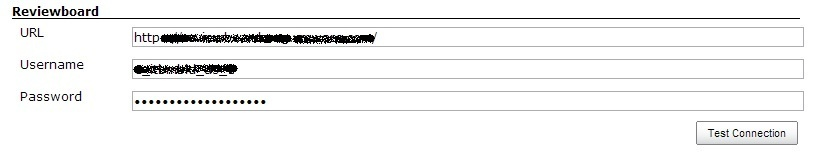
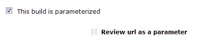
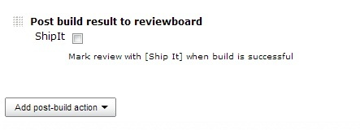
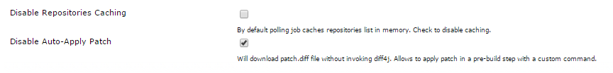
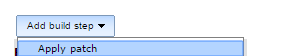
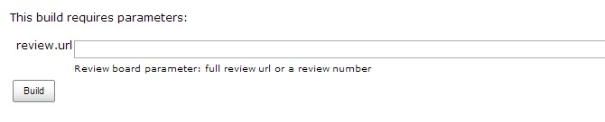
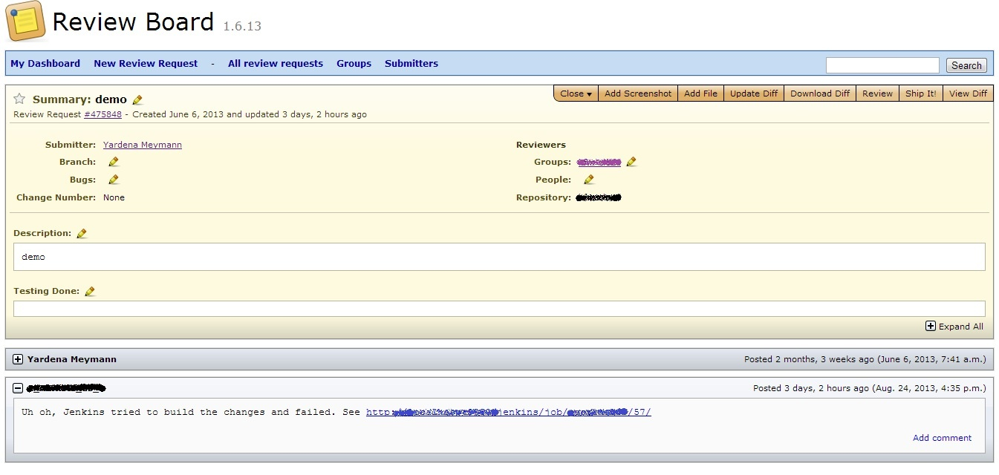
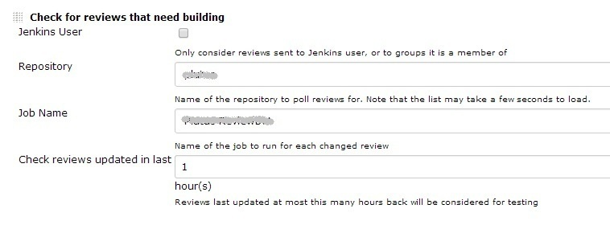

[.conf-macro .output-inline]##

[cols="",options="header",]
|===
|Plugin Information
|View jenkins-reviewbot https://plugins.jenkins.io/jenkins-reviewbot[on
the plugin site] for more information.
|===

[.aui-icon .aui-icon-small .aui-iconfont-error .confluence-information-macro-icon]##

The current version of this plugin may not be safe to use. Please review
the following warnings before use:

* https://jenkins.io/security/advisory/2019-04-03/#SECURITY-1091[CSRF
vulnerability and missing permission check allow SSRF]

[.aui-icon .aui-icon-small .aui-iconfont-warning .confluence-information-macro-icon]##

*This plugin is up for adoption.* Want to help improve this plugin?
https://wiki.jenkins-ci.org/display/JENKINS/Adopt+a+Plugin[Click here to
learn more]!

This plugin pulls a diff from reviewboard request, applies the patch,
builds it and reports the build status as a review comment

[[Jenkins-Reviewbot-SourceCode]]
== Source Code

https://github.com/vmware/jenkins-reviewbot

[[Jenkins-Reviewbot-Motivation]]
== Motivation

The project integrates Jenkins with Reviewboard code review tool
(http://www.reviewboard.org/). Jenkins will pick a diff submitted to
Reviewboard, run a build, and report build results on the review
request: either blessing the request or warning that it will break
mainline if committed. This essentially allows to validate commits
before they reach mainline, a feature available in GitHub pull requests
(CloudBees), TeamCity and Gerrit. Unlike these tools, this project
supports any source control system that Reviewboard supports (Git, SVN,
Perforce), any hosting, and will require only Jenkins server
configuration.

See
http://www.cloudbees.com/jenkins/juc2013/juc2013-israel-abstracts.cb#YardenaMeymann[the
presentation] at JUG Israel 2013.

[[Jenkins-Reviewbot-Howtousethisplugin]]
== How to use this plugin

[[Jenkins-Reviewbot-Prerequisites]]
=== Prerequisites

Install https://wiki.jenkins-ci.org/display/JENKINS/Patch+Parameter+Plugin[Patch
Parameter Plugin]

[[Jenkins-Reviewbot-Configuration]]
=== Configuration

{empty}1. In Jenkins configuration set URL of the reviewboard (just the
name of the site, no /dashboard or any other suffixes, e.g.
http://reviewboard.mycompany.com/), username and password. You can test
the connection before saving.
[.confluence-embedded-file-wrapper]##

{empty}2. Create or clone a job that you wish to run for each review
request.

{empty}3. Check "This build is parameterized" and add review parameter

[.confluence-embedded-file-wrapper]##

{empty}4. Also add a post-build action of posting build result to
reviewboard

[.confluence-embedded-file-wrapper]##

Save the configuration.

[[Jenkins-Reviewbot-Custompatchapplicationcommand]]
=== Custom patch application command

Since version 2.2 it is possible to use a different method to apply the
patch (instead of the default diff4j). In the *Reviewboard* section of
Jenkins global settings page, check "Disable Auto-Apply Patch"

[.confluence-embedded-file-wrapper]##

Now the plugin will download the diff from Reviewboard and save it in
the workspace file called patch.diff (as it did before). But unlike
earlier versions, now the plugin *will not apply* the patch, *unless*
you also add Apply Patch build step

[.confluence-embedded-file-wrapper]##

This allows you to apply the patch differently, for example with a
*command line specific to your source control*. This also allows you to
perform actions between patch download and apply.

[[Jenkins-Reviewbot-ConfigurationwithPerforce]]
=== Configuration with Perforce

* Because reviewboard includes the full Perforce path (i.e.
//depot/project/branch/...) the Jenkins project checkout must include
the full path in the workspace.
+
[source,syntaxhighlighter-pre]
----
//depot/project/branch/... //${JOB_NAME}-workspace/depot/project/branch/...
----

* To allow the files to be patched, change the Perforce Option default
of "noallwrite" to "allwrite".

[[Jenkins-Reviewbot-Usingtheplugin]]
=== Using the plugin

Now when you run the job, you will need to provide the URL for review
request or review number, e.g. http://reviewboard.mycompany.com/r/12345/
or just 12345.

[.confluence-embedded-file-wrapper]##

After the job completes, the result of the run will be posted to review
request like this:

[.confluence-embedded-file-wrapper]##

[[Jenkins-Reviewbot-Triggeringthejob]]
=== Triggering the job

[[Jenkins-Reviewbot-Curl]]
==== Curl

[source,syntaxhighlighter-pre]
----
JENKINS=... e.g. http://jenkins.mycompany.com
JOBNAME=... e.g. Reviewbot
USER=...
PASSWORD=...
REVIEW=... e.g. http://reviewboard.mycompany.com/r/12345/

curl -G -u $USER:$PASSWORD -d delay=0sec --data-urlencode review.url=$REVIEW $JENKINS/job/$JOBNAME/buildWithParameters
----

[[Jenkins-Reviewbot-Webhooks]]
==== Webhooks

With Reviewboard 1.7 you should be able to
use http://www.youtube.com/watch?v=yE3CcLs0HQo[webhooks extension], but
I didn't test it.

[[Jenkins-Reviewbot-PollingwithJenkins]]
==== Polling with Jenkins

Create another job (free-style) and add a build step "Check for
reviews..." to poll reviewboard

[[Jenkins-Reviewbot-Afterversion2.0]]
===== After version 2.0

The job will check for reviews in the specified repositories and/or
targeted to Jenkins user. The invoked job must take review url
parameter.

[.confluence-embedded-file-wrapper]##

[[Jenkins-Reviewbot-Priortoversion2.0]]
===== Prior to version 2.0

The job will check for reviews that are targeted to jenkins user
directly or to groups to which the jenkins user belongs and have been
updated in the X hours since the most recently updated review (relative
time is used to work around the timezone problem of pre-1.7
Reviewboard). The reviews in which the diff has been changed, but the
Jenkins user did not comment on since the last diff, will be tested with
the job name provided here.

[[Jenkins-Reviewbot-Backwardscompatbility]]
===== Backwards compatbility

To achieve the same behavior post 2.0, turn on  "Jenkins User" and leave
repository selection at "any" option.

[[Jenkins-Reviewbot-Configuringdownstreamjobs]]
=== Configuring downstream jobs

When using review url parameter in a job, you can refer to its value by
*$REVIEW_URL*, and use it with
https://wiki.jenkins-ci.org/display/JENKINS/Parameterized+Trigger+Plugin[Parameterized
Trigger Plugin].

[[Jenkins-Reviewbot-PatchinUnifiedFormatandmultiplefilessupport]]
=== Patch in Unified Format and multiple files support

If the diffs downloaded from Reviewboard are in the
http://www.gnu.org/software/diffutils/manual/html_node/Example-Unified.html[Unified
Format] (as is probably the case for Perforce using RBtools) the default
patch option will fail  for reviews with multiple files. This is
currently a limitation in https://github.com/cloudbees/diff4j[diff4j].
To solve that, use a Custom patch application (see above) such as the
shell command "patch -p1 -u -i patch.diff"

[[Jenkins-Reviewbot-patch(1)shellcommandsometimesreturn"...hunkFAILED"]]
=== patch(1) shell command sometimes return "...hunk FAILED"

There are legitimate reasons for this, for example if the file in the
review was already changed on trunk, but Review Board also has a
limitation where the CR/CRLF characters in the patch file are converted
into LF. This makes patching fail in files with non Linux newline
characters.

This Review Board bug is tracked
in https://hellosplat.com/s/beanbag/tickets/2916/[Issue 2916]. Until
it's fixed, one work around can be to convert the code with something
like http://stackoverflow.com/a/7533652[this] before running the patch.

[[Jenkins-Reviewbot-Workingwithbranches]]
=== Working with branches

You can refer to *$REVIEW_BRANCH* to find out what branch was specified
in the review. If none was specified, the value will be _master_.

[[Jenkins-Reviewbot-Workingwithrepositories]]
=== Working with repositories

You can refer to *$REVIEW_REPOSITORY* to find out what repository the
review was filed in. If none was specified, the value will be _unknown_.

[[Jenkins-Reviewbot-Knownlimitations]]
== Known limitations

* It is recommended to run the polling job on master (didn't test on
slave, suspect it might not work)
* The internal custom patch application does not support patched in
Unified Format with multiple files (it's a limitation in diff4j), see
workaround above.* The internal custom patch application does not
support patched in Unified Format with multiple files (it's a limitation
in diff4j), see workaround above.

[[Jenkins-Reviewbot-Changes]]
== Changes

[[Jenkins-Reviewbot-Version2.2.x]]
=== Version 2.2.x

Several enhancements were added:

* support
https://www.reviewboard.org/docs/manual/2.0/users/markdown/[markdown] in
Reviewboard messages, instead of URL it will post Jenkins job name and
number with a link - configurable per job;
* repositories list cache in poller job can be disabled (useful if you
add repositories after starting Jenkins) - configurable globally;
* biggest improvement is probably the separation of diff download and
patch application (has to be enabled with a global setting). What you
can do now is apply the patch with an alternative command that you can
define yourself as a build step. You can also combine other actions with
the default https://github.com/cloudbees/diff4j[diff4j] patch
application which is now available as a standard build action, so you
can perform other steps before it.

[[Jenkins-Reviewbot-Version2.1]]
=== Version 2.1

Ahead of build notification message is now optional, and can be disabled
per job. The job now holds in memory which reviews has been already
processed (builds spawned) in order to avoid build duplication.

[[Jenkins-Reviewbot-Version2.0]]
=== Version 2.0

Option to poll for reviews in a specific repositories and more issues
closed. Special thanks to https://github.com/dnozay[Damien Nozay] for
his contributions!

[[Jenkins-Reviewbot-Version1.4.1&1.4.2]]
=== Version 1.4.1 & 1.4.2

Authentication tweaks, fixed a bug with port number in preemptive
authentication

[[Jenkins-Reviewbot-Version1.4]]
=== Version 1.4

Fixed polling task to support Reviewboard 1.7 date format

[[Jenkins-Reviewbot-Version1.3]]
=== Version 1.3

Support for concurrent builds, ahead of build notification message to
reviewboard (from poller job) eliminates duplicate builds of same
review 

[[Jenkins-Reviewbot-Version1.2]]
=== Version 1.2

Support built-in polling

[[Jenkins-Reviewbot-Version1.1]]
=== Version 1.1

Fixed several bugs (misplaced temp file caused permissions problem on
Linux, improved API use and authentication, injected review url and
branch parameters)

[[Jenkins-Reviewbot-Version1.0]]
=== Version 1.0

Initial

[[Jenkins-Reviewbot-Miscellaneous]]
== Miscellaneous

The plugin was tested against Reviewboard version 1.6.13 and 1.7.6
