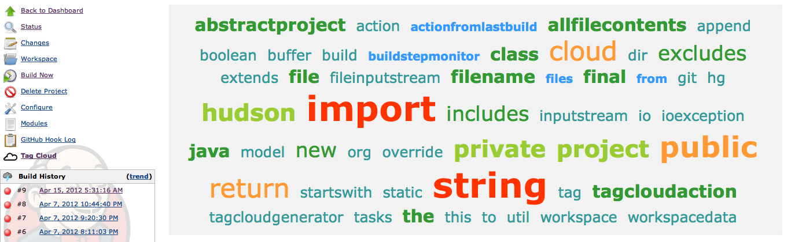

Plugin which generates a tag cloud from source code.

[[TagCloudPlugin-Description]]
== Description

A plugin which scans a project's source and generates a tag cloud of
commonly used words. Taken from an idea demonstrated by Kevlin Henney at
a recent Bash.ie event in Belfast, NI. 

[[TagCloudPlugin-Screenshot]]
== Screenshot

[.confluence-embedded-file-wrapper .confluence-embedded-manual-size]##

[[TagCloudPlugin-Versionhistory]]
== Version history

[[TagCloudPlugin-Version1.6(03/07/2012)]]
=== Version 1.6 (03/07/2012)

* Making number of tags configurable.

[[TagCloudPlugin-Version1.5(15/04/2012)]]
=== Version 1.5 (15/04/2012)

* Minor POM updates.

[[TagCloudPlugin-Version1.4(10/04/2012)]]
=== Version 1.4 (10/04/2012)

* Moving under jenkinsci organization in github.

[[TagCloudPlugin-Version1.3(08/04/2012)]]
=== Version 1.3 (08/04/2012)

* Initial release.
