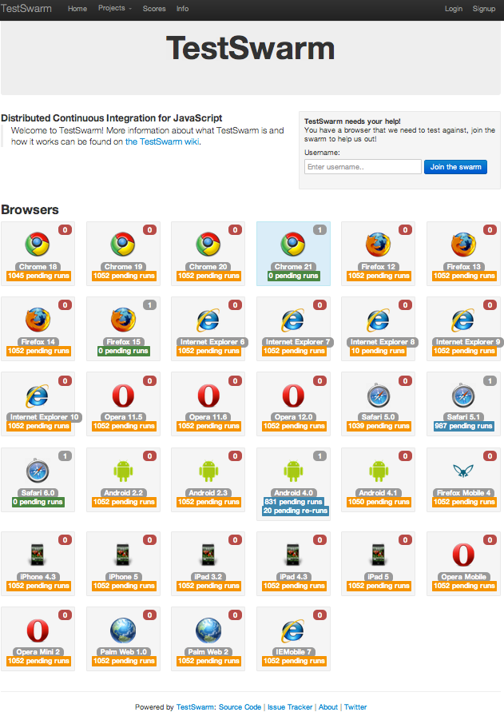
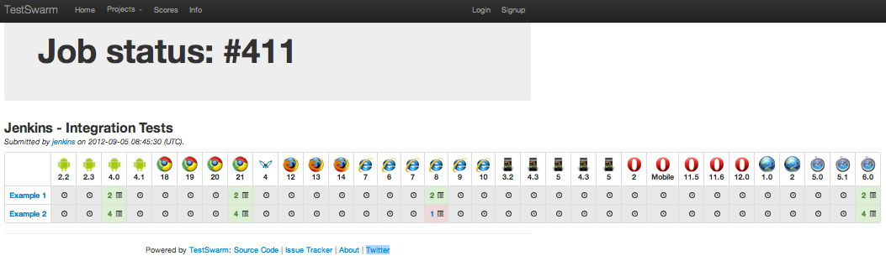
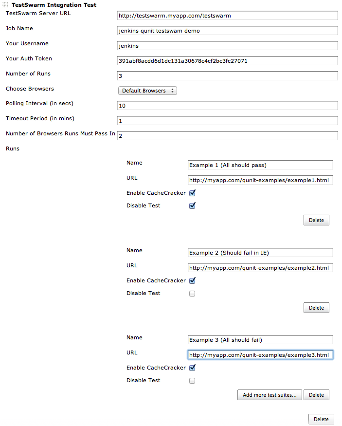
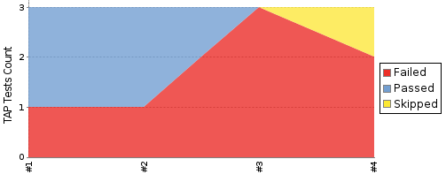
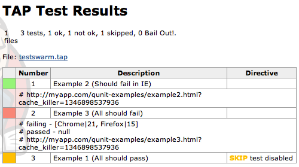

Welcome to the jenkins-testswarm-plugin wiki! +
Testswarm is used to run javascript tests in all browser. This plugin
allows you to run testswarm tests and see results from jenkins.

*TestSwarm Landing Page* +
[.confluence-embedded-file-wrapper]##

*TestSwarm Job that was Launched from Jenkins* +
[.confluence-embedded-file-wrapper]##

*Sample Jenkins Configuration* +
[.confluence-embedded-file-wrapper]##

*Results in TestSwarm Results shown in Jenkins* +
[.confluence-embedded-file-wrapper]##

*Details of TestSwarm Results in Jenkins* +
[.confluence-embedded-file-wrapper]##
