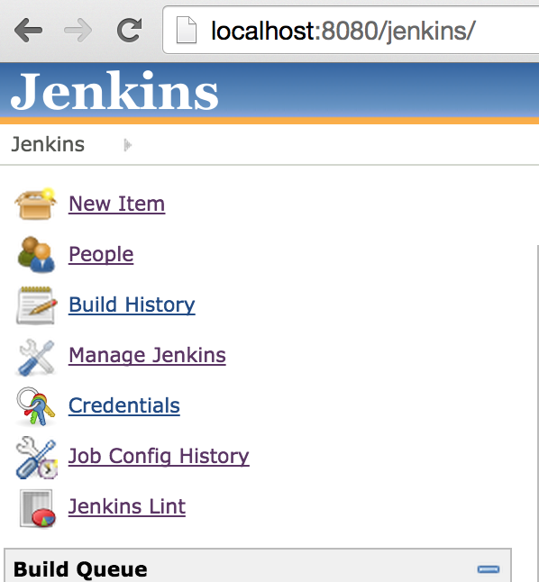
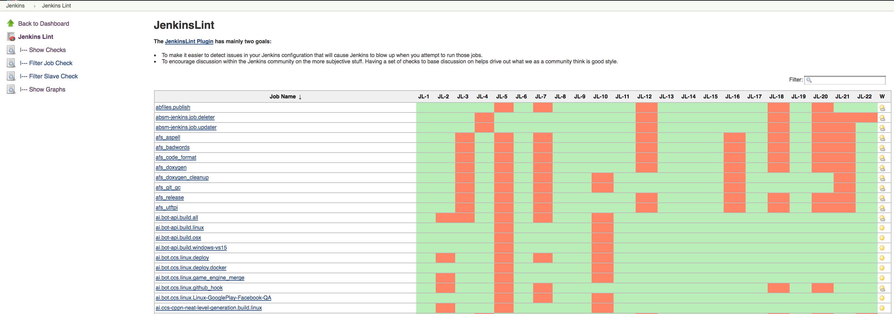
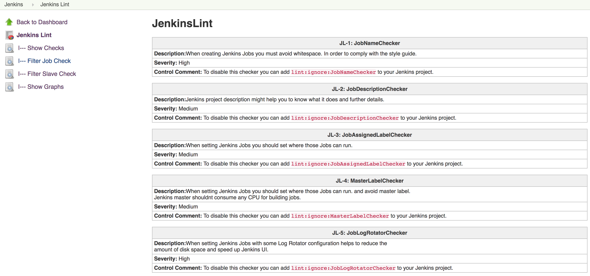
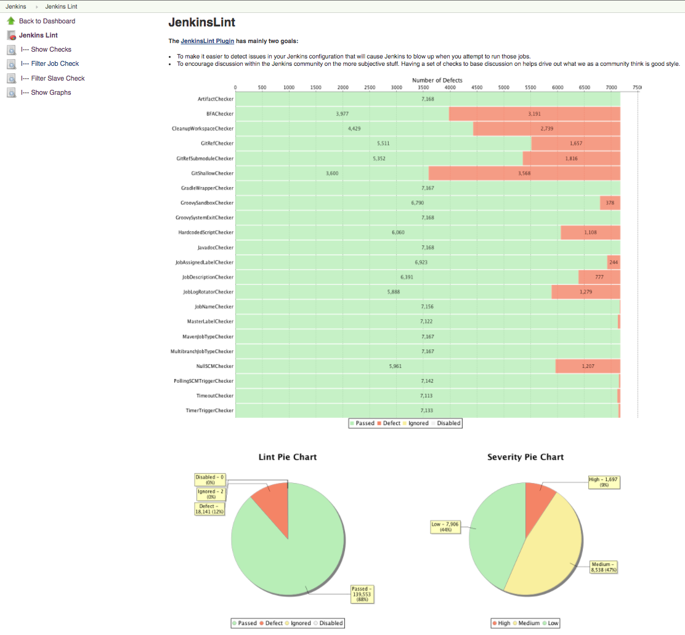
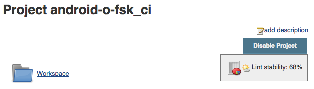
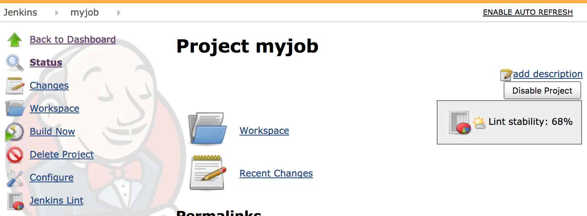
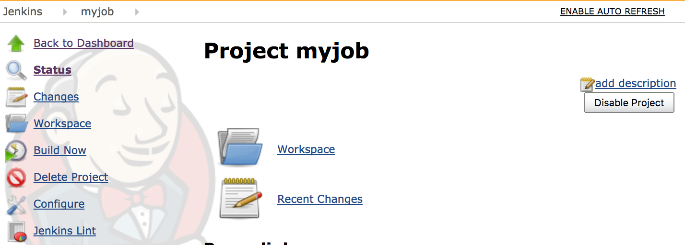

[.conf-macro .output-inline]##

Detects whether your Jenkins configuration follows those best practices 

This plugin has mainly two goals:

* To make it easier to detect issues in your Jenkins configuration that
will cause Jenkins to blow up when you attempt to run those jobs.
* To encourage discussion within the Jenkins community on the more
subjective stuff. Having a set of checks to base discussion on helps
drive out what we as a community think is good style.

   

[[JenkinsLintPlugin-Summary]]
== *Summary*

Jenkins is an awesome Automation System, and there are a bunch of people
using it in different ways, for example: developers, testers,
automation, build engineers, release engineers, scrum master, product
owner and so on. Unfortunately, as the number of jobs grows, maintaining
them becomes tedious, and the paradigm of using a predefined set of best
practices falls apart.

The Jenkins Lint plugin attempts to solve this problem by allowing jobs
to be evaluated with some predefined best practices. The goal is for
your team to be able to define those best practices to be related to
their project.

Manually reviewing those jobs wouldn't be too hard, but doing the same
thing all over again for every new job or for a hundred other projects
is where it gets difficult and tedious. This provides a much more
powerful way of analyzing them.

[[JenkinsLintPlugin-Usage]]
== Usage

You can find it under *_`+<jenkins_url>/jenkinslint+`_* or reach it via
links in the sidepanel of the main page. You don't need to do anything
else, just click on the Jenkins Lint link and those Lint checkers will
be shown.

 +
[.confluence-embedded-file-wrapper .confluence-embedded-manual-size]##

[.confluence-embedded-file-wrapper .confluence-embedded-manual-size]##

 +
[.confluence-embedded-file-wrapper .confluence-embedded-manual-size]##

 

[.confluence-embedded-file-wrapper .confluence-embedded-manual-size]##

[.confluence-embedded-file-wrapper .confluence-embedded-manual-size]##

[[JenkinsLintPlugin-Features]]
== Features

List of available Job checks:

* Artifact Publisher check
* BFA check
* Built Timeout check
* CleanUp Workspace check
* Git Ref repo check
* Git Ref Submodule repo check
* Git Shallow clone check
* Gradle Wrapper check
* Groovy system exit check
* Hard-coded Script check
* Javadoc Publisher check
* Job Assigned Label check
* Master Assigned Label check
* Job Description check
* Job Log Rotator check
* Job Name check
* Maven Job Type check
* Multibranch Job Type check
* Null SCM check
* Polling SCM Trigger check
* TimerTrigger Hash check

List of available Slave checks:

* Slave description check
* Slave label check
* Slave version check
* Windows slave launch check

[[JenkinsLintPlugin-Plannedupcomingfeatures]]
=== Planned upcoming features

* Configure Checks (change severity)
* Load checks dynamically via Jenkins.
* Load checks dynamically via Reflection. 
* Define some kind of programmatically scripts.
* Check: Cyclomatic complexity check
* Support Declarative pipeline and shared Libraries

*Controlling checks:*

You can ignore a particular check  in a specific job, by adding a
trailing *_lint:ignore:<check name>_* comment to the job description.

You can ignore a check globally, by deselecting it in the system
configuration: "*_Manage Jenkins_*" / "*_Configure System_*" in the
"*_Advanced_*" section below "_Jenkins Lint_".

*Disabling the healthy floating box in the Job Summary Page*

You can disable the healthy floating box in the Job Summary Page, by
unchecking "Enable JobAction" in the system configuration 

[[JenkinsLintPlugin-Featurescontrolledbysystemproperties]]
=== Features controlled by system properties

Based on
the https://wiki.jenkins-ci.org/display/JENKINS/Features+controlled+by+system+properties[Features
controlled by system properties], you can disable the healthy floating
box in the Job Summary Page

[width="100%",cols="56%,7%,7%,30%",options="header",]
|===
a|
Property

a|
Default

a|
Version

a|
Notes

a|
....
org.jenkins.ci.plugins.jenkinslint.JobLintAction.disabled
....

|false |0.9.0 |*Deprecated since 0.10.0.* *Removed since 0.12.0.*
|===

 +
By default you will see the below view:

[.confluence-embedded-file-wrapper .confluence-embedded-manual-size]##

 

If you disabled then:

[.confluence-embedded-file-wrapper .confluence-embedded-manual-size]##

[[JenkinsLintPlugin-Globalsettings]]
== Global settings

You can easily disable/enable Checkers and customise them from the
Global Settings *_<jenkins_url>/configure_* section "*_Jenkins Lint_*"  

 

[.confluence-embedded-file-wrapper .confluence-embedded-manual-size]#image:https://lh6.googleusercontent.com/nUwaDHtRY7Y0IBtzrMIvYYV4RRxj0Txo50gdj-SJ4Y4ykxKANBtcdLm3j6YniCFrNZArCtxyFb5euZRsYPD_zP94ikTN9FX1WG-pyulBql7o7J0fdac4sfDmivYNkJm-4-Mm2kgc9yk[image,height=250]#

[[JenkinsLintPlugin-Enable/DisablewithGroovyscript]]
=== Enable/Disable with Groovy script

You can also configure your lint checkers using the Script console, from
version 0.10.0 onwards!

[source,syntaxhighlighter-pre]
----
import org.jenkins.ci.plugins.jenkinslint.JenkinsLintGlobalConfiguration
import jenkins.model.GlobalConfiguration

// Disable Globally
JenkinsLintGlobalConfiguration.all().get(JenkinsLintGlobalConfiguration.class).setGlobalEnabled(false)

// Disable JobAction
JenkinsLintGlobalConfiguration.all().get(JenkinsLintGlobalConfiguration.class).setJobActionEnabled(false)

// Disable Lint
JenkinsLintGlobalConfiguration.all().get(JenkinsLintGlobalConfiguration.class).setCleanupWorkspaceCheckerEnabled(false)
 
// More properties in the JenkinsLintGlobalConfiguration class: https://github.com/jenkinsci/jenkinslint-plugin/blob/a97f3e17b14d7410164bb4bea50ba5968a3a97b8/src/main/java/org/jenkins/ci/plugins/jenkinslint/JenkinsLintGlobalConfiguration.java#L18-L45
----

[[JenkinsLintPlugin-API]]
== API

You can retrieve jenkins lint defects by requesting the following URLs :

* <jenkins/hudson_url>/*jenkinslint/api/json?depth=2&pretty=true +
*
* <jenkins/hudson_url>**/jenkinslint/api/xml?depth=2**

* +
*

And also you can retrieve lint defects per job/agents:

* <jenkins/hudson_url>/job/<your_job>/*jenkinslint/api/json?depth=2&pretty=true +
*
* <jenkins/hudson_url>/job/<your_job>/*jenkinslint/api/xml?depth=2*
* <jenkins/hudson_url>/computer/<agent>/*jenkinslint//*api/json?depth=2&pretty=true**
* <jenkins/hudson_url>/computer/<agent>/*jenkinslint//api/xml?depth=2*

[[JenkinsLintPlugin-Workaround]]
== Workaround

 

[.aui-icon .aui-icon-small .aui-iconfont-error .confluence-information-macro-icon]#
#

There is already a
https://issues.jenkins-ci.org/browse/JENKINS-29418[known issue] in the
*initial version 0.1.0*
, https://wiki.jenkins-ci.org/display/JENKINS/Workspace+Cleanup+Plugin[Workspace
Cleanup Plugin] is a required dependency otherwise JenkinsLint will fail
when analyzing those Jobs

*Console Output*

[source,syntaxhighlighter-pre]
----
Jul 13, 2015 10:21:06 PM hudson.ExpressionFactory2$JexlExpression evaluate
WARNING: Caught exception evaluating: it.data in /jenkinslint/. Reason: java.lang.reflect.InvocationTargetException
java.lang.reflect.InvocationTargetException
        at sun.reflect.NativeMethodAccessorImpl.invoke0(Native Method)
        at sun.reflect.NativeMethodAccessorImpl.invoke(NativeMethodAccessorImpl.java:62)
        at sun.reflect.DelegatingMethodAccessorImpl.invoke(DelegatingMethodAccessorImpl.java:43)
        at java.lang.reflect.Method.invoke(Method.java:483)

.... Giant Stacktrack ....

        at winstone.BoundedExecutorService$1.run(BoundedExecutorService.java:77)
        at java.util.concurrent.ThreadPoolExecutor.runWorker(ThreadPoolExecutor.java:1142)
        at java.util.concurrent.ThreadPoolExecutor$Worker.run(ThreadPoolExecutor.java:617)
        at java.lang.Thread.run(Thread.java:745)
Caused by: java.lang.NoClassDefFoundError: hudson/plugins/ws_cleanup/WsCleanup$DescriptorImpl
        at org.jenkins.ci.plugins.jenkinslint.check.CleanupWorkspaceChecker.executeCheck(CleanupWorkspaceChecker.java:22
)
        at org.jenkins.ci.plugins.jenkinslint.JenkinsLintAction.getData(JenkinsLintAction.java:60)
        ... 112 more
----

There are two workarounds:

. Installing  https://wiki.jenkins-ci.org/display/JENKINS/Workspace+Cleanup+Plugin[Workspace
Cleanup Plugin] 
. Upgrading the JenkinsLint version

[[JenkinsLintPlugin-Requirements]]
=== Requirements

[[JenkinsLintPlugin-Jenkins]]
==== Jenkins

Jenkins version:

* 1.[.x .x-first .x-last]##607 or newer if Jenkins pipelines are
installed##
* 1.580 or newer is required if jenkins pipelines are not installed

[.aui-icon .aui-icon-small .aui-iconfont-info .confluence-information-macro-icon]#
#

It might work with previous versions.

NOTE: Jenkins version is required when testing those checkers using the
mvn test command. This plugin uses java reflection to get rid of those
plugins/jenkins version dependencies although it's required in the test
phase when developing it to verify/test those checkers.

[[JenkinsLintPlugin-OpenIssues]]
== Open Issues

[#jiraissues]##

[.aui-icon .aui-icon-small .aui-iconfont-warning .confluence-information-macro-icon]#
#

[[JenkinsLintPlugin-Versionhistory]]
== Version history

[[JenkinsLintPlugin-Planning]]
=== Planning 

image:docs/images/add.svg[(plus)] Check:
Cyclomatic complexity
check (https://issues.jenkins-ci.org/browse/JENKINS-42269[issue #42269])

[[JenkinsLintPlugin-Version0.14.0(August29,2017)]]
=== Version 0.14.0 (August 29, 2017)

* image:docs/images/add.svg[(plus)] 
Enable/Disable whether to analyse disabled jobs from Global
Settings (https://issues.jenkins-ci.org/browse/JENKINS-46395[issue
#46395])

[[JenkinsLintPlugin-Version0.13.0(August24,2017)]]
=== Version 0.13.0 (August 24, 2017)

* image:docs/images/add.svg[(plus)] Show
graphs. (https://issues.jenkins-ci.org/browse/JENKINS-46350[issue
#46350])
* image:docs/images/warning.svg[(warning)] Fixed
NPE when using
MultijobProjects (https://issues.jenkins-ci.org/browse/JENKINS-46424[issue
#46424]) 
* image:docs/images/warning.svg[(warning)] Fixed
ClassCastException when using a misconfigured restrict where to run
field (https://issues.jenkins-ci.org/browse/JENKINS-46383[issue #46383])

[[JenkinsLintPlugin-Version0.12.0(August15,2017)]]
=== Version 0.12.0 (August 15, 2017) 

* image:docs/images/add.svg[(plus)] Check:
Detect ignored groovy sandbox in
Projects. (https://issues.jenkins-ci.org/browse/JENKINS-46177[issue
#46177] )
* image:docs/images/add.svg[(plus)] Check:
Detect ignored groovy sandbox in
Pipelines. (https://issues.jenkins-ci.org/browse/JENKINS-46162[issue
#46162])
* image:docs/images/add.svg[(plus)] Customise
HardcodedScript lint to enable/disable comments as
lines. (https://issues.jenkins-ci.org/browse/JENKINS-46146[issue
#46146])
* image:docs/images/add.svg[(plus)] Fully
support of Pipeline
linting. (https://issues.jenkins-ci.org/browse/JENKINS-46162[issue
#46162])
* image:docs/images/add.svg[(plus)] Search
box. (https://issues.jenkins-ci.org/browse/JENKINS-42359[issue #42359])
* image:docs/images/information.svg[(info)] Bumped
minimal Jenkins Core version
to 1.[.x .x-first .x-last]##607## (https://issues.jenkins-ci.org/browse/JENKINS-46162[issue
#46162])
* image:docs/images/information.svg[(info)] Remove:
Deprecated System Property (Features controlled by system
properties) . (https://issues.jenkins-ci.org/browse/JENKINS-46164[issue
#46164])
* image:docs/images/information.svg[(info)] Fixed
Column Ordering based on Check Status and Job/Slave Name
(https://issues.jenkins-ci.org/browse/JENKINS-46033[issue #46033])
* image:docs/images/warning.svg[(warning)] Fixed
Linting with multi-configuration
projects. (https://issues.jenkins-ci.org/browse/JENKINS-46176[issue
#46176])

[[JenkinsLintPlugin-Version0.11.0(August10,2017)]]
=== Version 0.11.0 (August 10, 2017)

* image:docs/images/add.svg[(plus)] Check:
Groovy system exit check in Input Parameters
 (https://issues.jenkins-ci.org/browse/JENKINS-45961[issue #45961])
* image:docs/images/add.svg[(plus)] Check:
Groovy system exit check in Publishers
 (https://issues.jenkins-ci.org/browse/JENKINS-45960[issue #45960])
* image:docs/images/add.svg[(plus)] Check:
Run Timeout Check in Build Steps
(https://issues.jenkins-ci.org/browse/JENKINS-45938[issue #45938])
* image:docs/images/information.svg[(info)] Fixed
Hardcoded Script check with empty
lines (https://issues.jenkins-ci.org/browse/JENKINS-46035[issue #46035])
* image:docs/images/information.svg[(info)] Fixed
Column Ordering based on Check Status and Job Name
(https://issues.jenkins-ci.org/browse/JENKINS-46033[issue #46033])

[[JenkinsLintPlugin-Version0.10.1(August1,2017)]]
=== Version 0.10.1  (August 1, 2017)

* image:docs/images/warning.svg[(warning)]  Fixed
false positive with Timer Trigger Checker
(https://issues.jenkins-ci.org/browse/JENKINS-45879[issue #45879])

* image:docs/images/warning.svg[(warning)]  Fixed
sortable columns
(https://issues.jenkins-ci.org/browse/JENKINS-45880[issue #45880])

[[JenkinsLintPlugin-Version0.10.0(August1,2017)]]
=== Version 0.10.0  (August 1, 2017)

* *image:docs/images/add.svg[(plus)]*  Check: BFA
Check  (https://issues.jenkins-ci.org/browse/JENKINS-42268[issue
#42268])

* image:docs/images/add.svg[(plus)] 
Check: Git Ref Submodule Check
 (https://issues.jenkins-ci.org/browse/JENKINS-41528[issue #41528])
* image:docs/images/add.svg[(plus)] 
Enable/Disable Checks globally/individually from Global Settings
(https://issues.jenkins-ci.org/browse/JENKINS-45882[issue #45882])
* image:docs/images/add.svg[(plus)] 
Hardcoded Script Threshold value is now part of the Global Settings
(https://issues.jenkins-ci.org/browse/JENKINS-45882[issue #45882])

[[JenkinsLintPlugin-Version0.9.0(July27,2017)]]
=== Version 0.9.0 (July 27, 2017)

* image:docs/images/add.svg[(plus)] JobAction
View (Controlled by System
Property) (*PR* https://github.com/jenkinsci/jenkinslint-plugin/pull/17[#17])
* image:docs/images/add.svg[(plus)] AgentAction
View (PR https://github.com/jenkinsci/jenkinslint-plugin/pull/17[#17])
* image:docs/images/add.svg[(plus)] RestAPI
for the JobAction and AgentAction
* image:docs/images/information.svg[(info)] Jenkinsfile
integration
with http://ci.jenkins.io/[ci.jenkins.io] (*PR* https://github.com/jenkinsci/jenkinslint-plugin/pull/18[#18])
* image:docs/images/information.svg[(info)] Fixed https://wiki.jenkins-ci.org/display/JENKINS/Jelly+and+XSS+prevention[Jelly
and XSS prevention]
* image:docs/images/information.svg[(info)] Bumped
minimal Jenkins Core version to 1.580

[[JenkinsLintPlugin-Version0.8.0(Mar7,2017)]]
=== Version 0.8.0 (Mar 7, 2017)

* image:docs/images/add.svg[(plus)]  RestAPI.  (https://issues.jenkins-ci.org/browse/JENKINS-41449[issue
#41449])  
* image:docs/images/information.svg[(info)]  TimerTrigger
'Hash' check supporting @
 (https://issues.jenkins-ci.org/browse/JENKINS-42337[issue #42337])
* image:docs/images/information.svg[(info)]  Removed
dependent plugins.
 (https://issues.jenkins-ci.org/browse/JENKINS-42383[issue #42383])

[[JenkinsLintPlugin-Version0.7.0(Feb26,2017)]]
=== Version 0.7.0 (Feb 26, 2017)

* image:docs/images/warning.svg[(warning)]  Maven
and Matrix projects weren't supported when linting some defects
 (https://issues.jenkins-ci.org/browse/JENKINS-42310[issue #42310])

* image:docs/images/add.svg[(plus)] 
Check: TimerTrigger 'Hash'
check  (https://issues.jenkins-ci.org/browse/JENKINS-42267[issue
#42267])

* image:docs/images/information.svg[(info)]  i18
support

[[JenkinsLintPlugin-Version0.6.0(Feb12,2017)]]
=== Version 0.6.0 (Feb 12, 2017)

* image:docs/images/add.svg[(plus)] Check: Git
local ref cache repos check
 (https://issues.jenkins-ci.org/browse/JENKINS-41528[issue #41528])

* image:docs/images/add.svg[(plus)] Check: Groovy
system exit check
 (https://issues.jenkins-ci.org/browse/JENKINS-38617[issue #38617])

* image:docs/images/information.svg[(info)] Updated
pom file  (https://issues.jenkins-ci.org/browse/INFRA-588[infra #588])

[[JenkinsLintPlugin-Version0.5.0(Oct1,2015)]]
=== Version 0.5.0 (Oct 1, 2015)

* image:docs/images/add.svg[(plus)] Check: Build
Timeout check  (https://issues.jenkins-ci.org/browse/JENKINS-30725[issue
#30725])

[[JenkinsLintPlugin-Version0.4.0(Aug27,2015)]]
=== Version 0.4.0 (Aug 27, 2015)

* image:docs/images/information.svg[(info)] Support
Jenkins lint check for Jenkins Slaves
(https://issues.jenkins-ci.org/browse/JENKINS-30161[issue #30161])

[[JenkinsLintPlugin-Version0.3.0(Jul29,2015)]]
=== Version 0.3.0 (Jul 29, 2015)

* image:docs/images/add.svg[(plus)] Check: Gradle
Wrapper check  (https://issues.jenkins-ci.org/browse/JENKINS-29486[issue
#29486])

[[JenkinsLintPlugin-Version0.2.0(Jul21,2015)]]
=== Version 0.2.0 (Jul 21, 2015)

* image:docs/images/information.svg[(info)] Health
Icons plus
percentage (https://issues.jenkins-ci.org/browse/JENKINS-29466[issue
#29466])
* image:docs/images/information.svg[(info)] Refactor:
remove optional dependencies
(https://issues.jenkins-ci.org/browse/JENKINS-29545[issue
#29545]) (https://issues.jenkins-ci.org/browse/JENKINS-29544[issue
#29544]) (https://issues.jenkins-ci.org/browse/JENKINS-29546[issue
#29546])

[[JenkinsLintPlugin-Version0.1.2(Jul15,2015)]]
=== Version 0.1.2 (Jul 15, 2015)

* image:docs/images/error.svg[(error)]  Some
builders cannot be cast to hudson.tasks.CommandInterpreter
(https://issues.jenkins-ci.org/browse/JENKINS-29427[issue #29427])
* image:docs/images/information.svg[(info)]  HardcodedScript
Check supports
MatrixProjects (https://issues.jenkins-ci.org/browse/JENKINS-29444[issue
#29444])
* image:docs/images/information.svg[(info)]  Create
unit test suite for UI

[[JenkinsLintPlugin-Version0.1.1(Jul14,2015)]]
=== Version 0.1.1 (Jul 14, 2015)

* image:docs/images/error.svg[(error)] Project
dependency with ws-cleanup
plugin https://issues.jenkins-ci.org/browse/JENKINS-29418[(issue
#29418)]
* image:docs/images/add.svg[(plus)] Check: Hardcoded
Script check

[[JenkinsLintPlugin-Version0.1.0(Jul12,2015)]]
=== Version 0.1.0 (Jul 12, 2015)

* image:docs/images/information.svg[(info)]   Initial
release

 +
